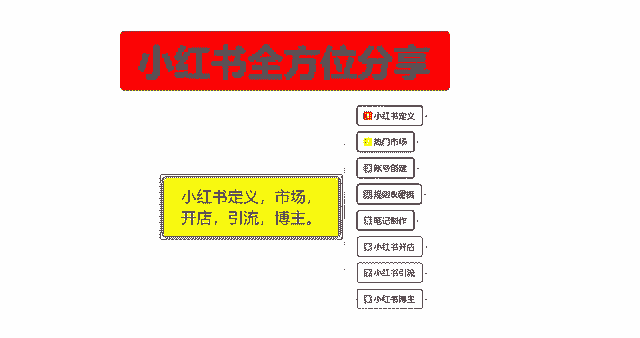
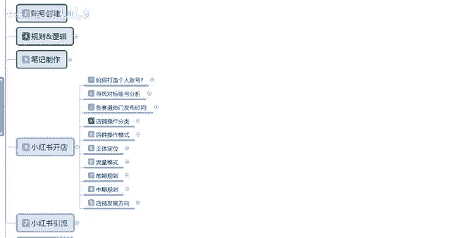
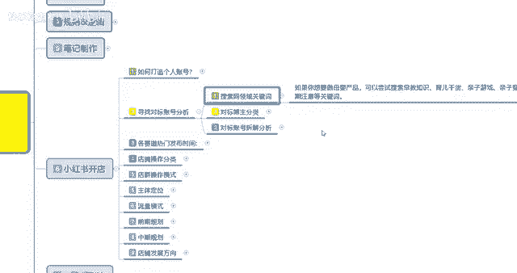
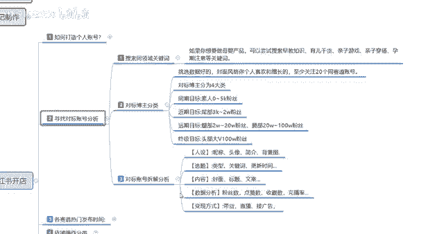
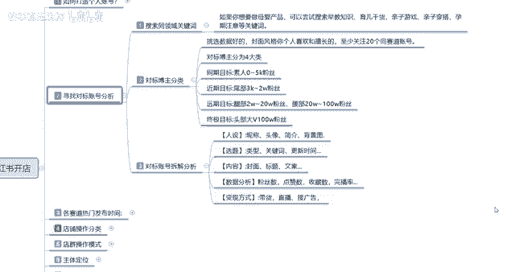

# 【2024版小红书体运营教程】全B站最良心的小红书开店运营教程！小红书体开店 起号真的快，赶快点赞收藏起来 - P22：20.小红书爆款店铺打造步骤（2） - 快乐稳定发挥 - BV1AbtoebEjX

大家好，今天给大家分享的是小红书，全方位分享的第六大课程。

小红书开店的第二个内容啊，这节课的话主要是给大家分享一下。

我们小红书寻找对标账号分析的，这个呢是做自己的一个呃账号定位也可以用。

做内部定位也可以用啊，去到对标账号分析的话是分为三个点，第一个呢就是说搜索同领域的一个关键词，然后呢对标模组分类，第三个呢是账号拆解分析，就说你不光要完善自己的用户，完善自己的账号对吧。

你还要去分析别人是怎么做的，因为这样你去分析别人账号的时候，其实也是在变相的给自己在社区里面定位啊，把自己的定位做的更好，就是自己账号的一个定位权重啊，首先呢是搜索同领域的一个关键词。

其实这几个点的话还是比较好理解的，只是说看我们自己怎么去啊，规划搜索同领域的关键词，如果说你打个比方，就说你要做母婴类的一个产品的话，可以尝试搜索早教知识，育儿干货，亲子游戏，亲子穿搭。

孕期等注意的关键词，这些词汇都是可以用的，知道吧，只要是你的产品词往母婴这方面靠的话，都可以去做，你比方说你做服装的话，那你就是服装搭配对吧，呃夏季穿什么服装，冬季穿什么服装，连衣裙裙连衣裙什么风格。

对不对等等，这些都是可以的，你就用关键词去搜，然后的话系统就会给你判定，喜爱这一个类型的一个用户，他就会把你分享到这个用户的一个社区里面，就是系统自己给你判断的，然后的话根据你个人的一个喜爱。

把你确定到哪一个呃社区范围，你自己卖什么产品，往哪个社区选就行了，这个的话其实还是比较简单的，只是你们自己呃操作的时候，很多人他不明白小红书他有这一个点啊，第二个呢就是对标博主分类，对标博主分类的话。

可以把它分为四个大类啊，同期的一个目标啊，近期的目标，远期的目标和中期目标，就是你自己想做到是做到什么样，小红书的话，你觉得自己能做到什么样，根据你的自己的产品的话，自己去给自己定位，挑选数据，好的啊。

封面的话就是说呃你个人喜欢和擅长的，至少关注个20个同赛道的一个账号，什么意思呢，就是说你要关注20个跟自己一样的，自己卖什么产品呢，你比方说你卖呃母婴类产品的，那你就要关注20个母婴类的一个账号。

然后的话去看他们的一个账号信息，也就是第三点对标账号的一个分析，这个里面的话还有一个同期目标，近期目标，远期目标和终极目标四个点，正常的话我们都是同期目标选5~10个，远期目标选七个左右。

远期目标选个一个终极目标，你暂时不要不要去定，因为他对你没有好处啊，就是说你只能选前面三个同期目标的话，你选个十个左右，就是0~5000粉丝的啊，相同内幕的一个账号去看他们的一个账号设计，这种账号的话。

你也不用过多的观察，瞅一瞅，看一看就行了，大概有个十个左右就行，然后近期目标的话就是3000到2000粉丝的一个，小红书账号，这类账号的话就是我们主要针对的目标，因为你小我们创作小红书的话。

你要么就是新人刚开始对吧，那你选择目标的话，五零到两五千粉丝的话，是给我们同期目标给自己增加权重的，近期目标3000到2万是我们要模仿他的，你要做的超过他发的内容比他好，那你看他的数据的时候。

也可以从他这边往你这边引流的，远期目标的话，说实话你2万到20万，20万到100万粉丝，这种目标，你选一个偶尔去看一下人家发布的最新，最热门的一个内容就行了，为什么呢，找热门话题去发布笔记啊。

就是拿他当目标啊，他最近更新了什么内容，我要不要往这方面去靠啊，蹭点流量之类的，如果说你个人的一个粉丝数量，突破到3000到2万的话，那你的终极目标，你就是看这种大V往他们这边去靠。

这个就是对标博主的一个分类，你自己分类好了以后自己去选啊，同期目标什么意思呢，就是说你如果说你的粉丝已经超过5000了对吧，那你近期目标就是你的同期目标啊，你相当于升了一级，你0~5000粉丝那种账号。

你就不用去管他了对吧，那你如果说你的粉丝到达2万，那你的近期目标的话，就是就是同期目标的话，就是2万到20万的一个粉丝啊，你要往这个方面去想，这方面去靠，基本上对标博主分类的话，额还是比较好操作的。

只需要你自己拿小红书去呃，花个两三天时间去做一下那个搜索，然后看看别人是怎么做的就行，然后对标账号的一个拆解分析是什么意思呢。

你要分析你自己选择的同期目标，和近期目标者账号进行拆分，拆解额同期目标的话，说实话这种的话你也可以不用去考虑，你要考虑的话是近期的一个目标，就是你要超过他的一个目标。

分析他们的一个人设选题内容和数据分析，就是这几个点，我们做好以后的话，后续数据你才好做，不然的话你的一个后续数据的话不好做，人设里面的话就是称泥头像简介，加我们的一个背景图，选题里面的话就是类型。

包括他的一个关键词和他自己的个小红书笔记，更新时间，你们自己做一个那个excel啊，文档列表，把它那个更新时间列出来，基本上七个账号的话，你每天花个两个小时，基本上就全部都能弄出来了，很简单的一个步骤。

你如果说熟悉以后的话，可能10分钟20分钟就能把目标列出来，基本上分析3~5天或者七天左右，你知道他的一个粉丝增长量和比例发放时间，然后对比自己的是有优势还是劣势，然后进行修改就行。

然后呢就是看他的一个封面标题和文案，这个的话就模仿嘛对吧，自己觉得自己做的不好，就去模仿，自己做的比他好，你就没有必要模仿了啊，你不是什么东西都要去模仿的，然后数据分析变现方式的话。

就是刚刚跟大家说的那个做个excel表啊，自己去分析一下这种东西的话，其实都还是比较好做的，就说看你自己对对标账号啊，你想做到哪个层次，自己的话去把这些分析数据做好以后的话。

然后根据自己的实际情况再去更改就可以了，好吧，那这一节对寻找目标对标账号的一个分析呢，就给大家分享到这，下一节课课时的话，给大家分享一下各赛道的一个热门发布时间，也就是你自己商品也好，笔记也好。

什么时间段发放啊，是最好的一个效果。

