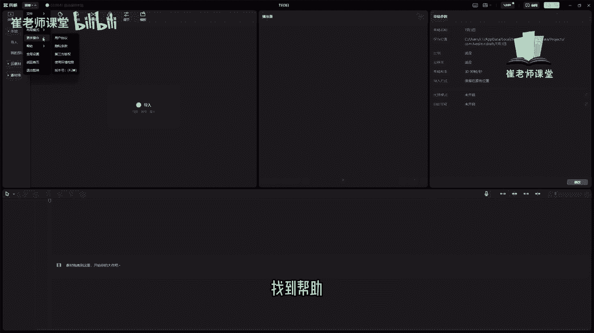
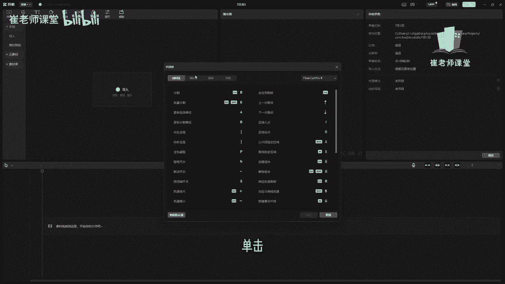
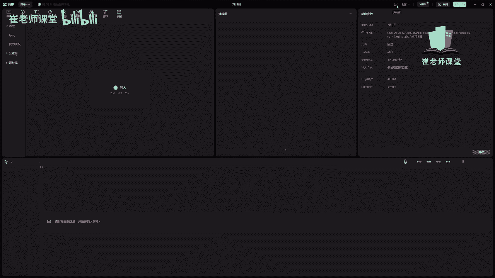
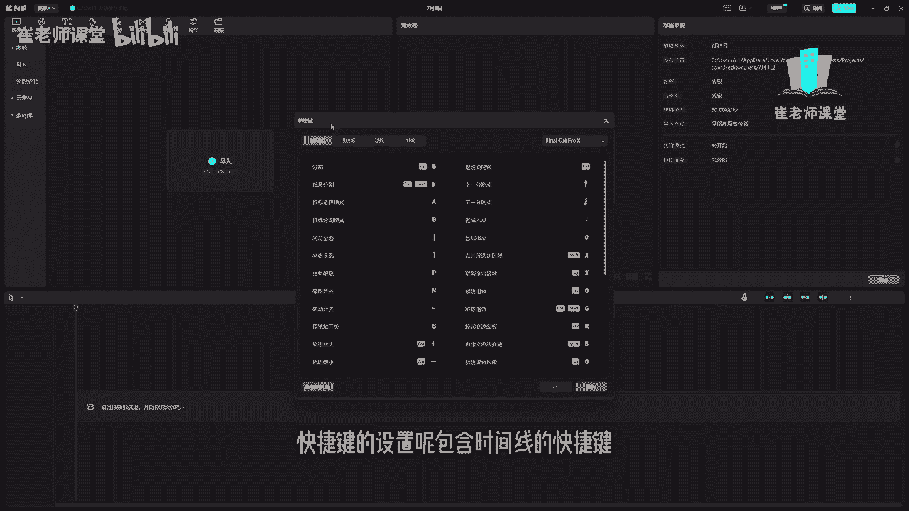
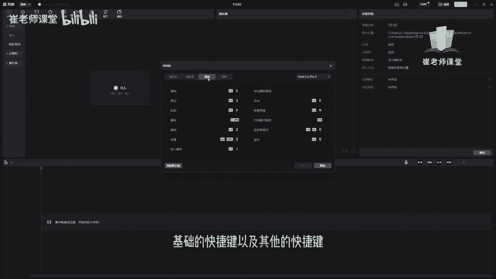
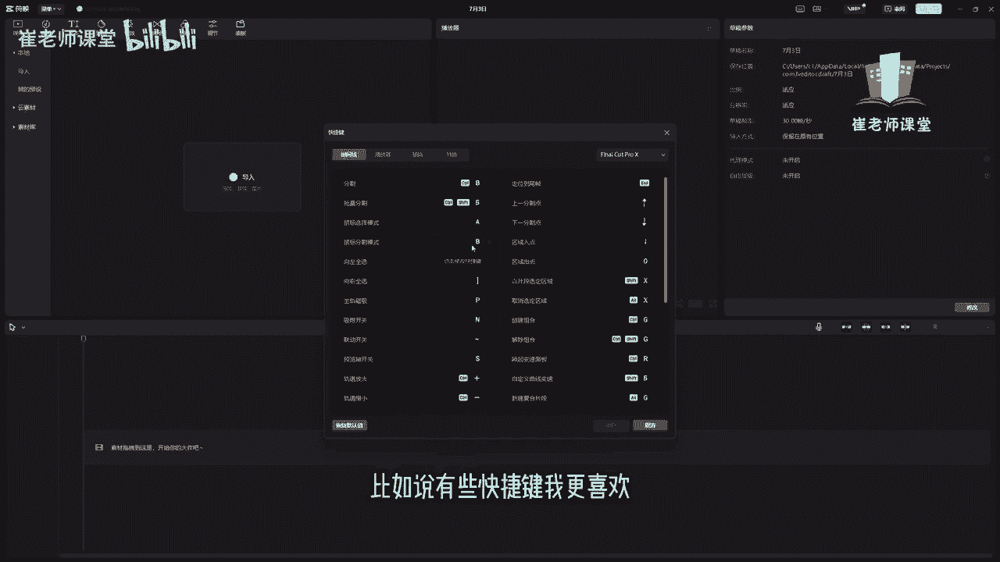
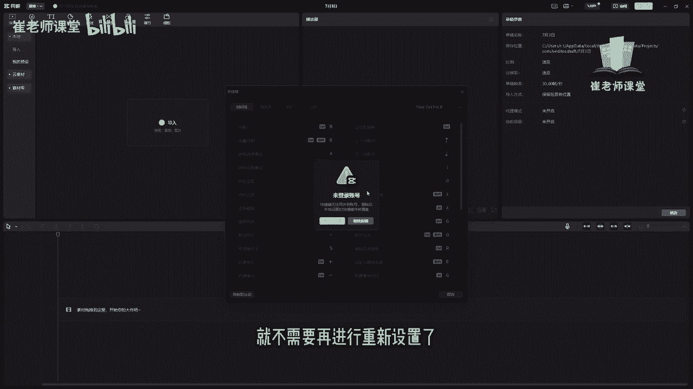
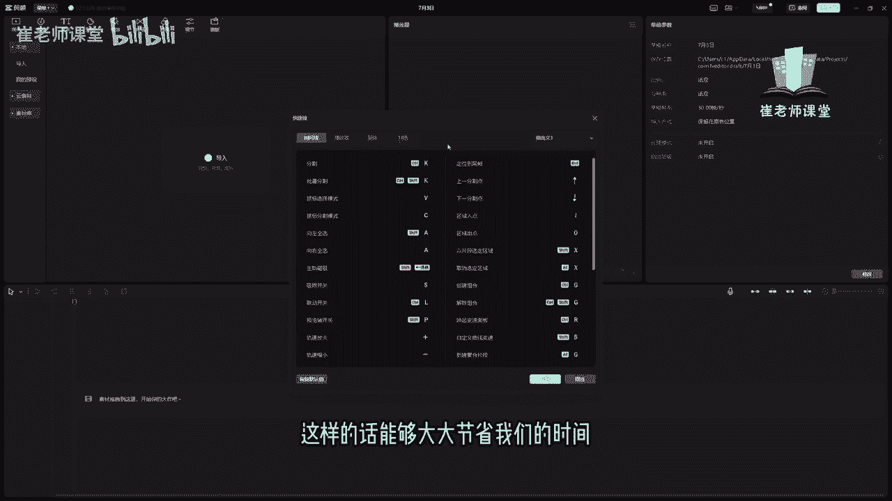

# 【2024版小红书体运营教程】全B站最良心的小红书开店运营教程！小红书体开店 起号真的快，赶快点赞收藏起来 - P23：21.快捷键的使用 - Sathenay - BV1uqHreLEER

给大家讲一下快捷键的使用，首先可以在菜单里面找到帮助。

然后呢在帮助里面能够找到快捷键，单击就打开了快捷键的设置。

当然呢也可以在右上角这个位置，大家能够看到一个小键盘的按钮。

单击之后呢，同样也是快捷键的设置，快捷键的设置呢包含时间线的快捷键。

以及播放器的快捷键，基础的快捷键以及其他的快捷键。

在我们之前讲解一些工具的时候呢，有一些快捷键都和大家介绍过了，需要大家熟解快捷键的，最主要的目的呢是能够方便我们的工作啊，大大提高我们的工作的效率，有的时候我们在使用鼠标的过程当中，需要去单击一些按钮。

或者是单击一些功能，但是如果使用快捷键呢，能够大大的提高我们的工作效率，首先呢这些快捷键呢随着我们在工作当中啊，需要去深刻的去记忆，毕竟去提高工作效率，对于这些会计呢，我们可以进行单击修改快捷键。

比如说有些快捷键我更喜欢那种按键的设置。

那么就可以直接单击它，如果需要同步的话，可以登录自己的抖音账号，这样的话我们再去换台电脑，或者是使用其他设备的时候，就不需要再进行重新设置了。

在这里可以直接输入自己想要的快捷键，就会进行更换，如果你当前的快捷键有冲突的话，它会提示有冲突啊，我们需要进行起重新进行修改，然后如果修改成功呢，可以单击这里啊进行保存，如果你想恢复默认的快捷键的话。

可以单击在这里啊，恢复默认值，它就恢复到了最初默认的快捷键的样式，然后呢，大家可以在这里根据习惯来设置，不同软件的快捷键的使用方式，你看有Premiere Pro它的快捷键，然后呢大家也可以根据选择啊。

可以自定义来设置自己的工作习惯的，这种快捷键的模板来进行保存，O这些呢大概是快捷键的设置方式，我希望大家对于常见的一些快捷键呢，需要进行熟记，这样的话能够大大节省我们的时间。

