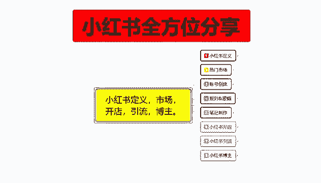
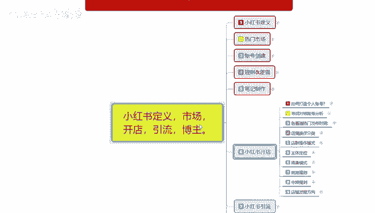
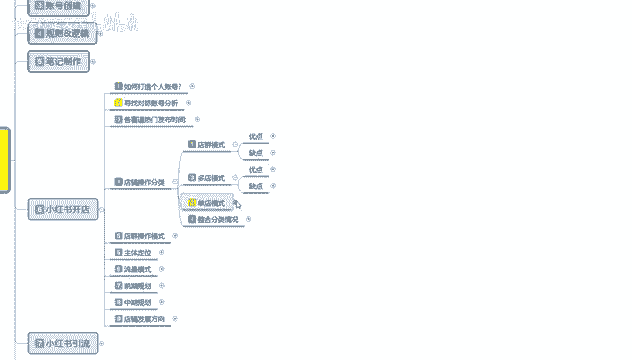
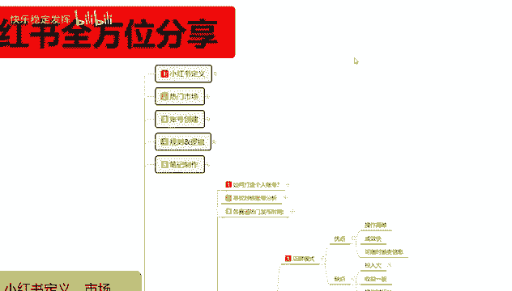
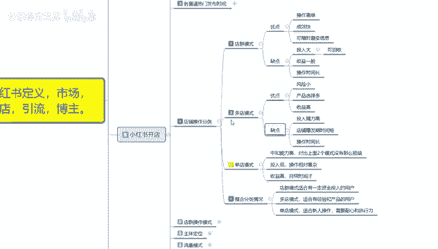
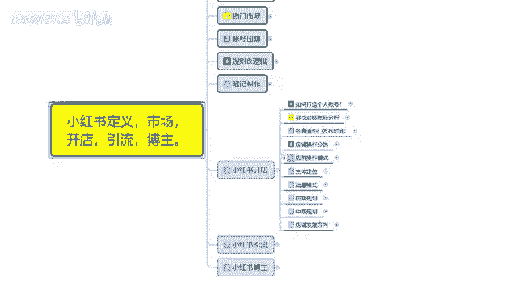
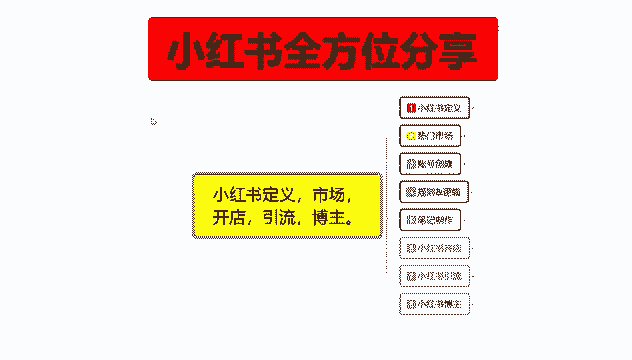

# 【2024版小红书体运营教程】全B站最良心的小红书开店运营教程！小红书体开店 起号真的快，赶快点赞收藏起来 - P24：22.小红书爆款店铺打造步骤（4） - 快乐稳定发挥 - BV1AbtoebEjX

大家好，今天给大家分享的是小红书全方位分享的，第六大课时。

小红书开店的一个内容，这节课的话主要给大家分享一下，我们那个小红书店铺操作分类。

什么是小红书店铺操作分类呢，就是说小红书上面他操作店铺的话，其实有好几个模式呃，首先是电驱模式，然后是多电模式，单电模式和整合分类的一个情况，就是比较适合我们个人的，你到底适合去操作哪一种。

当然这种操作方式的话，还是根据我们个人的一个需求量去定的啊，首先了解一下电驱模式啊，电驱模式。

整体的优缺点的话，他其实是比较明显的啊。

优点操作简单，成效快，可以随时更变我们自己的一个店铺信息，就是说你如果说开店群的话，你操作完成以后的话，这些店铺你可以随时分辨信息，什么意思呢，就是说你电讯做的感觉效果不怎么样，然后你把信息更变以后呢。

你就可以直接去做沉淀，什么意思呢，就是说你往多电模式转也可以，往单电模式转也可以啊，就是随时可以更变信息，缺点就是投入比较大啊，然后呢收益一般操作时间呢就比较长，什么意思呢，就是说因为你做店群的。

你的店铺越多，那你的收益也就越高，同样的你的店铺数据不不够啊，就是说你只有几个店，十来个店，那都不叫电局啊，那你的一个投入也比较大，而且收益比较低，因为店群的话他就是靠店铺，然后靠铺货来获得的一个收益。

但是他的一个缺点里面投入大，他可以回收什么意思呢，一个店铺的话，我们正常额一个身份证的话开3~4个店对吧，开三四个店以后的话，你每个店里面要交付1000的保证金，就是4000块钱。

然后你需要办一个营业执照，600块钱，四个店铺的话，你就相当于是要花4600块钱，4600块钱里面有4000可以回收啊，就是退保证金，4000块钱可以回收，但是你的固定成本投入成本的话就会比较大。

你电群模式最少要十家店以上啊，店铺越多越好，当然了，你个人的一个操作经历的话，可能就是控制在十五二十啊，最多一个人也就控制20个左右的店铺，那你包括人工成本或者说其他的一些成本，算进去的话，20个点。

你前期固定投入的话可能就是2万12万2，其他的投入是没什么的，但是你光这些固定投入的话就是接近2万2，然后你20个店的一个收益的话，说实在的啊不是太高，也就几千块钱，所以说他的收益比较一般。

而且每天工作的一个操作时长啊比较多，因为他是重复操作的，第二个是多电模式，多电模式的话怎么说呢，优点就是风险小，产品选择的一个品种多一点，然后收益高，缺点是什么，投入精力比较高，因为你多电模式的话。

说实话你这个店效果怎么样，内下个电效果怎么样，要靠自己去规划的啊，还有第二个缺点就是店铺爆发时间比较短，什么意思呢，就是说你多店操作的话，多电模式一个店铺里面只有一个主产品。

这个主产品的话可能只能卖两到三个月过后，如果说你想更换产品，因为你的前期操作思路不一样，你要更换产品的话难度就比较大啊，可以店铺可以继续操作，但是你更换产品以后的话，你的数据会下降。

它就会呈持续下滑状态，就说这个电的话，它会呈持续下滑状态，能坚持多久呢，最多也就4~5个月，也就是第二件产品上传以后，除非你能把第二件产品也做爆，但是这种概率的话就没有那么大了。

所以说店铺爆发时间比较短，基本上一个店铺的话运营下来也存活，时间的话也就三个月，然后前期准备时间的话大概就一个月，也就是说一个店铺操作四个月左右啊，操作时间也比较长啊，投入精力比较大。

但是它的好处就是收益比较高啊，在这个时间段你能赚不少，就看自己怎么去弄，然后产品选择比较多是什么意思呢，就是说你一个店是一个产品，因为有时候的话你单店操作，你可以跨内幕啊，跨行业去卖别的东西。

选择类型就比较多，你比方说你这边是百货商城对吧，你在宝百货商城里面拿货，什么都可以卖，那你就比较适合这种多电模式，而且风险比较小，基本上前期投入的话，几千块钱就可以，资源充足的情况下。

几千块钱就能开一个店，你第二个点第三个点都是一样的啊，就是风险小啊，收益高，但是投入的精力的话就比较啊需求量比较高了，单店模式综合能力比较高，对于上对比上面两个的话，就是说呃没有那么极端。

你比方说店群的话，说实话收益小，投入大，但是他没什么风险，基本上属于零风险，因为他的所有的资源都可以回收，你无非就是亏个开店，然后的话办证的一个钱，但是他收益比较低，你比方说多电模式的话。

就是说你的一个精力投入是非常高的，这个精力投入的话是你单点模式的3~5倍，因为你每开一个电机，就相当于开了一个单电模式，多开一个电机是多开一个单电模式，因为单电模式的话，它整体套路是一样的。

只是它存留的时间比较长，收益没有那个多电模式大而已啊，但是比电池模式要好很多额，单店模式的话，它整体来说的话就是投入低一点，然后操作的话就相当相对来说复杂一点，如果说你前期对于这种网络营销。

或者说是网络运行卖货不了解不熟悉的话，你操作单电模式的话，其实和多电模式是一样的啊，精力投入都比较大，如果说你了解的话，那就比较容易了，因为单店模式整体操作起来就那几个套路。

而且他的整体收益的话是比较高的，持续时间更长，这种店铺你如果说开起来的话，你也正常操作，你最少可以做一到两年，正常操作一到两年啊，你要玩些歪门邪道的东西的话，那就不好说了啊。

就是说整体整合了这三个模式的话啊，就说电竞模式的话，适合额有一定资金在家里面闲着没事做了，然后的话固定资金自己不知道做什么，你可以去做一下电信模式，因为他的一个投入的话呃，基本上没太大投入。

就是比较耗时间，然后的话他的一个资金可以回收，就是你随时可以做，随时可以不做，不做以后把直接把资金撤掉就行了，多电模式的话，就比较适合有经验和有产品的用户，就是说你自己的话额产品多元化样式比较多。

然后像类似于百货这种的话，想去小红书上面做推广，那你就比较适合多电模式，就说一个店操作一个款内的一个产品方式，方法的话，按照一种方式去做，风险也没那么高，第一个方式方法啊，感觉自己不适合你。

可以换其他的方式对吧，然后单电模式的话就比较适合新手去操作了，因为很多时候的话说实话你在做多电之前，你先自己考虑一下，做个单电试一下啊，因为单店的话说实话它适合新手操作，因为投入也不会那么大。

一个店你投入个几千万把块钱进去，如果说店铺做不起来，那你就相当于是打水漂了，它不像那个店群模式一样，电驱模式可以回收你这种单电多电模式，资金你投入进去后，你回收不了的啊，所以说前面如果说你经验不足的话。

做单电模式经验充足的话，做多电模式，这个就是店铺操作的一个分类，小红书目前的话就是这三个方式，看你们自己怎么去选，那这一节呢就给大家分享到这。

下一节的话给大家分享一下，我们的一个店群操作模式怎么去做啊。

就是整个店群它是通过什么方式盈利的啊。

