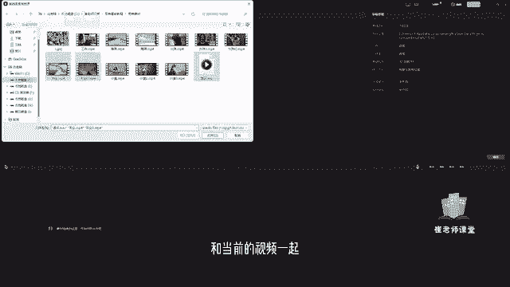
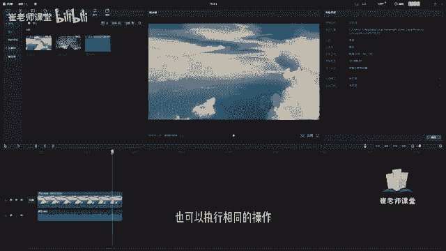
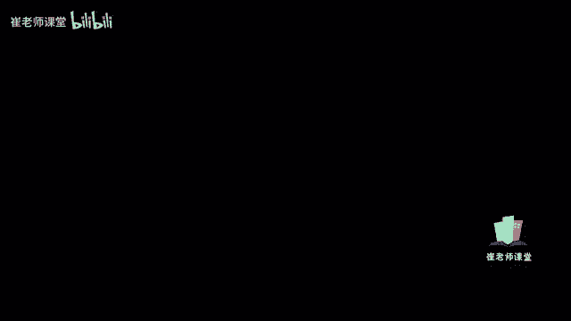
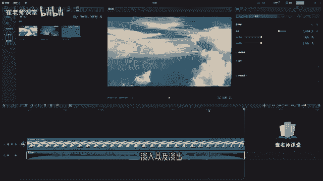

# 【2024版小红书体运营教程】全B站最良心的小红书开店运营教程！小红书体开店 起号真的快，赶快点赞收藏起来 - P24：22.音频素材设置上 - Sathenay - BV1uqHreLEER

一个完整的视频呢，通常由画面和音频这两部分组成，视频中的音频呢既可以是视频原声，后期录制的旁白，也可以呢是特殊的音效或者是背景音乐，对视频来说呢，音频是不可或缺的组成部分，原本普通的视频画面。

只要配上符合的背景音乐，便会更加深入人心，如何进行导入本地的音频素材呢，大家可以在素材库当中选择导入，在这里我们可以找到我们整理好的音频文件，注意啊，之前和大家说过。

我们常见的音频文件的格式有WAV以及mp3，在这里选中，可以选择打开或者直接双击进行导入，也可以呢和当前的视频一起选中。

选择打开，这个时候就将音频以及视频，导入进了素材库当中，那么如何添加至时间轴呢，这个也很容易啊，和之前是一样的，我们可以直接将它进行拖拽，首先将视频进行拖拽到时间轴，音频也是同样的道理。

可以将音频文件直接拖进时间轴，你会发现它会重新建立一个轨道啊，这个轨道呢就是当前的音频轨道，那么如何调整音频素材的时长呢，大家可以看到，如果视频画面播放完毕之后，如果还有音频文件的话。

它会以黑屏的方式啊，就整个画面是黑屏的方式，然后显示我们的音乐，大家可以看一下，因为我们的音频没有完啊，所以视但是视频啊已经结束播放了啊，那么这个时候呢，我们视频的画面是以黑色的方式啊。

但是呢音频还是继续的呈现出我们的音乐，这个时候我们需要进行，对当前音频素材进行调整，它的时长，大家可以选中当前的音频，拖拽它的尾部啊，大家可以拖拽诶，直接拖拽到当前的视频结束的位置。

大家可以看到就可以调整至当前音频素材的，合适的时长，也可以呢，直接选择播放头的位置，选择到合适的位置，选择分割单机之后呢，就将当前的音频进行切割，然后选中我们不想要的这个音频素材，选中之后呢。

按住删除键或者delete键进行删除，也可以执行相同的操作。

当然我们音频的轨道和视频，以及图片的轨道是相似的，也可以对它进行其他的操作，比如说选择分隔，也可以对它进行分隔的操作，这个需要大家注意一下就可以了，OK选择选择工具，然后将它调整至合适的位置。

紧接着如何复制和删除音频素材呢，删除的话大家就很容易理解啊，直接选中当前的音频呢，直接按住删除键，它就进行删除，然后如何进行复制呢，大家可以看到我们选中当前的音频之后呢。

可以按住CTRLCCTRLC就是复制，然后呢选中当前的位置啊，将播放头放置合适的位置，按住CTRLV进行粘贴也可以呢，比如说选中当前音频素材之后，按住CTRLC复制呢。

选择我们当前音频轨道后面的任意区域啊，鼠标单右键大家可以在这里找到粘贴，直接进行粘贴，也可以进行粘贴的操作，大家选中当前的音频，在右上角的参数调节面板当中能够找到音量，选择当前的滑块可以进行调整了。

滑块往左使降低音量，往右是增加音量，大家可以看到在这里啊，如果是降低的话，它显示的是负值，如果增加的话啊，他是以整数的方式进行展现啊，单位是dB啊，然后大家可以移动滑块来调整合适的音量啊。

也可以在这里直接输入数值，比如说十，我们来听一下效果，这个可以根据自己的需求来进行调整音量，也可以选择上下按钮来进行微调，对于一些没有前奏，还有尾声的音乐呢，你直接一个音乐进来，那就比较的尴尬。

比较突兀了，那么如何做淡入以及淡出呢，能够让我们的音频以及画面能够更加的配合，或者是在切换音乐的时候能够更加的自然，在这里呢选择当前的我们导入的音频素材，选择之后呢，在这里能够找到代入时长以及弹出时长。

我们可以移动滑块来调整时长，大家可以看到我们移动之后呢，它是以秒数来来作为单位的，大家可以在这里移动滑块来调整，你会发现我们调整之后呢，随着我们的调整啊，当前啊它会以弧度的方式进行呈现的，可以看到。

比如说我们可以在这里移动滑块，来调整淡入的时长，也可以呢直接输入数值，弹入的时长为三秒，就是我们在音频播放的时候呢，音乐会一点一点的增大，在三秒的位置呢就恢复成正常的音量大小，我们可以听一下效果。

那么弹出时长如何进行调整呢，也可以移动滑块来调整弹出时长，大家可以看到，当前的音频轨道的末端也会变成一个弧形，它会随着时间一点一点的去降低音量，直至整个画面的结束，OK在这里呢。

大家可以听一下我们当前的音频效果。

