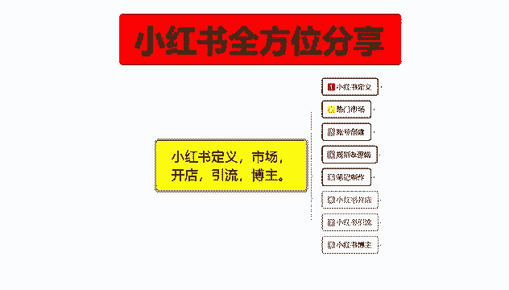
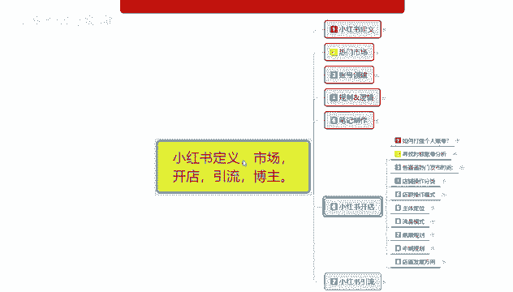
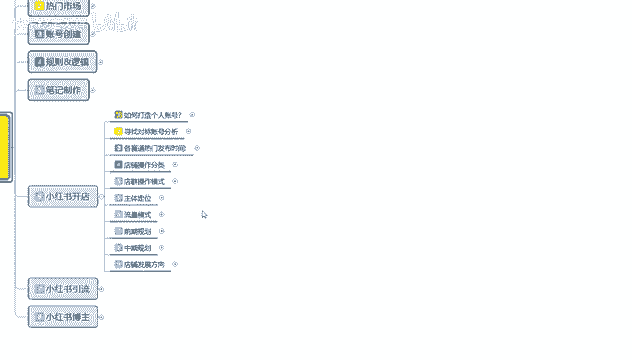
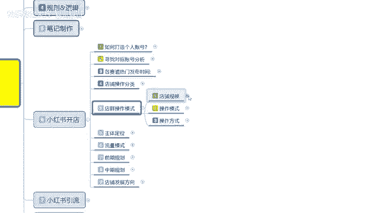

# 【2024版小红书体运营教程】全B站最良心的小红书开店运营教程！小红书体开店 起号真的快，赶快点赞收藏起来 - P25：23.小红书爆款店铺打造步骤（5） - 快乐稳定发挥 - BV1AbtoebEjX

大家好，今天给大家分享的是小红书全方位分享的，第六大课时小红书开店的一个内容啊。

这节课的话主要是给大家分享一下，我们小红书的一个店群操作模式。

就是小红书店铺啊，这个店群怎么去做。

店群操作模式。

说实话他整个店铺的话操作还是非常简单的，店群模式啊，它的规模越大，整体效果也越好，基础的话规模在十个点以上，你才能算电区，十个点以下的话都不算电锯，那就是打打打闹弄着玩。

因为你基本上没什么太大的一个收入，收入来源呢是通过多电无线上传产品，就是无线铺货啊，进行产品展示，吸引新人，对网络不熟悉的人啊，就是怎么说呢，你这种目标的话，你就只能欺负欺负小朋友。

或者欺负欺负那种年纪大的，通过这种店群模式铺货，然后别人看见的某些新奇的东西的话，就为你去呃，通过你的店铺进行购买，然后的话你通过自己的供货方式啊，去进行转化成交，赚取它里面的一个差价而已啊。

所以说你只能吸引那个信任和，对网络不熟悉的人，要么年纪大，要不联系一小，收入计算方式呢也比较那个明显啊，就是通过店铺进行铺货，然后呢进行成交，这个方式成型以后的话。

每天单单店的话大概有1000到2000的一个访客，就是你单个店铺每天大概有1000到2000个访客，你十个店铺的话就是相当于接近2万的访客，如果数据好的话，可以有两到十单，两单到十单左右的一个成交啊。

但是有一点你要弄清楚啊，这两到十单的成交不是你一个店铺的，是你所有店铺的，因为这2000个访客里面成交概率的话，可能是1‰或者是两1‰啊，成交概率非常低，因为你的店铺里面的话是没有什么基础数据的。

你也没办法把那么多产品全部做的有基础数据，所以说你只能欺负欺负新人啊，或者说欺负欺负老年人，店群的盈利方式的话，就是通过大量的一个商品啊，来提升店铺的一个访客进行成交承担。

比如我们用20个店铺来计算一下啊，就是说每个店铺平均每天成交一单，每天就是20单，20单里面的话，你然后再算利润，一单利润你就算十块钱，或者说十五二十块钱一天的话，20个店铺也就20来单，20来单。

400来块钱，一个月下来1万多，这算好的，对不对，那你如果说运气不好，有一天成交个五单十单对吧，一天100块，200块，一个月下来也就四五千块钱，就要看运气，而且看你的店铺规模。

它整体操作模式也是非非常简单的啊，我们可以使用多个店铺进行统一操作，额店铺数量上面是没有上限的，但是我不能低于10~15个，这个就是店群模式的一个基本要求嗯，操作方式的话。

就是用采集软件进行大规模的一个产品上下架，你如果说觉得自己的产品不够的话，其实这个产品是非常好扫的，拼多多淘宝或者说拼多多这种产品你都能扫，只要能找到一件代发的产品，你包括什么母婴平台啊等等。

你只要是你能发现的产品，你都可以把它放到你的店铺里面去，然后每天上架50~100个产品就可以了，产品上传完以后的话，你是不是完了呢，不是你里面每个产品每天还可以发两个笔记的，就是一个账号每天两篇笔记。

20个店铺的话，你就相当于是每天要花40篇笔记，通过这些笔记的话去去吸引你的这个呃，访客数量，如果没有那么多对应的内容的话，就是说可以少发，但是每个店铺每天的话最少两个，一个店铺的话，你像这种情况下。

一个店铺你做店群的话，每天最少是五篇左右的一个笔记，如果说你感觉你发不过来，那就是每个店铺每天两天，因为你所有的一个权重的话，基本上都是零，这个意思大家明白，因为你的账号的话都是新号，新号以后做店群。

然后你直接去开始卖产品，然后通过这种铺货的方式吸引新的一个用户，所以说你对质量要求的话，基本上是没有的，为什么说店群操作的话，基本上没有什么太大的一个投入，它只有固定投入呢。

就是因为你不需要去做那个产品的一个，技术数据啊，你如果说开单店多店的话，都要有产品技术数据的，没有的话卖不出去，但是你这种店群操作的话，就不需要有基础数据了，你本来就是碰运气去的对吧。

就是说你每天上架每个店，每天上架50~100个产品啊，不能高于100，不能低于50，通过这种每天铺货的方式啊，提升底的一个店铺活跃度，然后呢通过笔记吸引更多的一个访客，访客吸引过来以后的话。

他们成不成交，那就看天了啊，然后看你自己的产品，能不能吸引到用户的一个目标，自己店铺里面的一个笔记发的啊，流不流畅，固定时间是否做的好不好啊，这个就是电群操作模式，为什么之前说电群模式耗费时间比较长。

就是因为你每个店都要需要去操作啊，你自己一个人的话也就控制15~20个电，基本上就是极限了，再多的话你也控制不过来，所以说为什么说说电驱模式的话，他不适合额信任去操作，这个你一般的话也要有固定的资金。

就是自己的话是没什么太大的问题，然后的话闲的无聊，在家里面不知道做什么的，可以去做一下电池模式，然后的话资金方面还是比较充裕的啊，然后给自己的话找一些网络知识啊，之类的学习方式啊。

啊你可以做一下这个小红书店群，其他的话你正常的啊，你如果说想接着赚钱，或者是做其他的，你在小红书上面做店群的话，我不建议大家去做啊，能赚是能赚，但是他的节奏太慢，还有前期需要的一个固定投入。

说实话嗯也不少好吧，那这一节呢就给大家分享到这，因为说实话电群模式的话，它是一个方式，但是整体来说的话呃以前也很多人玩，现在的话越来越少。

