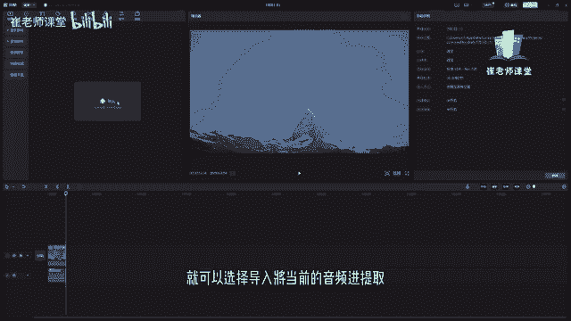

# 【2024版小红书体运营教程】全B站最良心的小红书开店运营教程！小红书体开店 起号真的快，赶快点赞收藏起来 - P25：23.音频素材设置下 - Sathenay - BV1uqHreLEER

我们来讲一下如何对音频素材的其他操作，首先将带有背景音乐的当前音频素材呢，直接拖拽到时间轴当中，你会发现当前的视频素材它是带有背景音乐的，如何进行对当前素材静音呢，之前和大家说过，直接选择左侧的叉号。

直接关闭原声，就可以实现对当前视频静音。

也可以呢对当前的音频轨道啊进行变速的操作。

把当前音乐拖拽到时间轴当中。

调剪切最合适的位置。

然后选择当前的音频轨道，在这里呢有变速的操作，可以调整它的变速的倍数，有两倍五倍等等一些数值，也可以呢进行调整至00。5倍，以及移动滑块可以调整更加精确的数值，也可以呢在这里直接进行输入啊。

在这里呢甚至可以去调整变速的时长，也可以在这里直接输入数值，也可以对当前的音频呢进行基本的操作，这些基础操作和大家说过了，但是有一点和大家说一下，在这里能够找到音频降噪，如果当前你的音频是自己录制的话。

自己用麦克风录制的话，肯定是或多或少有噪音的啊，就是你的声学环境不是太好的话，多多少少会有噪音，那么就可以单机在这里音频降噪，可以让当前剪映啊自动去降低一下噪音，同时呢如果当前的音频是你录制的人声。

你再去解说或者是讲解一些内容的时候，你不想让别人听出来你是这个原本的声音。

那么呢可以在这里选择变声，在这里可以调整当前的声音呃，有环绕音回音啊，甚至比较夸张的啊，萝莉音大叔女声，男声啊，怪兽啊等等一些声音也有很多嗯，预设来给大家进行选择啊，这个是主要是针对人生的。

然后呢可以选择人声增强啊，低音增强，这些呢，他是来给大家提供一个设置好的，这种音频的感觉，然后你可以进行添加，在这里呢可以选择全部，或者可商用网等等一系列的啊变声。

同时呢也可以选中当前的视频来进行操作，比如说之前和大家讲过这些画面，比如说选择当前视频轨道当中，选择音频音量淡入时长，单程时长和讲和大家讲过了啊，在这里也可以进行选择音频降噪啊。

比如说你当前录制的视频就有人声，那么为了降低一些录制的时候，掺杂的一些或多或少的噪音呢，可以在这里把它打开，我建议如果你录，你自己用麦克风录制的人声的话，都可以把音频然后进行降噪处理啊。

这样的话你的音质能够更加的清晰一点，然后也可以对当前视频当中进行音频的处理啊，比如说变声等等啊，和刚刚是一样的，也可以呢进行声道的配置啊，选择之后呢可以对声道进行配置，比如说将左侧声道填充至右侧声道啊。

将右侧至声道填充至左侧声道啊，嗯默认的是无，那这个可以根据自己的需求来进行设置，然后呢在这里可以找到变速啊，这个变速呢和当前的音频是一样的啊，如果你有特殊的需求，可以进行对当前的视频啊进行变快啊。

或者是变慢，大家可以看到当前的时间轴啊，如果变快的话，它的时值就会缩短了，如果变慢的话，它时值就会增长，同时呢当前视频素材里面的不仅是画面啊，进行了变速啊，同时呢音频呢也会进行了变速。

这个是需要大家去知道的，然后可以选择声音变调啊，在这里，在这里呢可以选择对当前视频进行曲线变速，可以选择，它会默认的给大家几个预设来进行选择，首先啊是五，然后呢在这里可以自定义效果啊。

然后拖拽它的变速的时间阶段啊，哪个进行变速啊，变速多少倍数可以在这里调整啊，可以调整快啊，默认的是水平线是一一倍啊，往上调的话是增加倍数，往下调的话是减小倍数啊，以进行选择，然后呢在这里有预设。

大家可以大家看一下预设的效果。

我们把音频关掉，可以看一下，诶，突然就加快了诶在这里慢慢慢的对，这个就是蒙太奇的变速方式。

然后呢还有英雄时刻诶，他的预设的方式是这样的。

当然我可以对他当前的这个预设来进行调整啊，调整自己想要的感觉，来看一下。

当前的变速一点点快，然后慢，然后再快啊，然后这有很多预设啊，有子弹时间跳接啊。

闪进闪出也可以自定义的去设置啊，进行拖拽，调整它的减速的倍数啊，是慢是快，哪个阶段哪个时间段进行快，哪个时间段进行慢啊，也可以在这里选择重置重置默认的的速度，然后进行调整，自己调整嗯。

这个音频的变速啊，还有变声和视频是相差不多的啊。

紧接着和大家重点讲一下，当前的音频有几个比较实用的功能啊，我们选择音频工具，在这里可以找到当前音频工具的分类啊，大家可以看到有音乐素材，这是所有的音乐素材，包括他各种风格，比如说抖音。

最近比较火的一些歌曲，关于旅行类的视频，经常使用的一些素材提供给大家选择，还有额这种VLOG，还有卡点类的视频啊，经常使用的音频素材，还有纯音乐啊，还有一些唱片公司，还有像环保啊，搞怪啊，浪漫等等啊。

几种分类，大家可以根据自己剪辑的视频的需要，来选择合适的音乐啊，他特别贴心的给大家分类啊，大家直接如果实在找不音乐的话，额直接进行选择分类里面进行查找啊，也可以在这里直接搜索歌曲名称或者是歌手啊。

比如说按住回车键啊，在这上面啊，在这搜索对话框当中，直接输入想要的歌名或者歌手的名字，输入之后呢，回车键我们就可以查看当前的嗯歌曲，这些歌曲完全是可以给大家使用的，然后呢可以在这里啊选择全部啊。

然后进行查看啊，默认的是全部也可以呢选择可商用的，可商用的话，就是比如说你的当前视频需要进行商用啊，嗯你需要去选择啊，因为别人是有版权的啊，这个是需要大家注意的，然后需要注意的是呢，在当前的音频。

如果大家找到比较合适的哈，你需要登录自己的抖音账号，然后就可以在这里选择，你有一个小新的按钮，对不对，可以单击之后呢，可以进行收藏啊，前提是必须登录抖音账号，收藏之后呢，在这里在上方的位置。

就会显示出你当前收藏的音乐，大家可以没事的时候可以找一找啊，自己平时喜欢的背景音乐收藏起来啊，到时候在做视频剪辑的时候，能够快速的找到自己喜欢的音乐啊，同时呢，如何将当前的音频文件添加至时间轴当中呢。

大家可以选择这个加号啊，会发现是以播放头的位置，然后进行添加当前音频也可以呢，直接进行拖拽也可以，然后拖拽到时间轴之后呢，我们调整它合适的距离，或者进行剪切，拖拽合适距离。

同时呢调整它的音量以及潜入以及淡入，淡出的时间。

这个是完全根据自己的需求来，那么呢抖音不仅仅提供的是音乐素材，还有一些音效素材，这音效素材呢也非常的实用啊，比如说一些热门的音效素材，嗯啊这个声音大家就比较熟悉了，然后，讲人群欢呼声啊，疑问啊，打字啊。

拍照啊啊，大家都可以根据自己的需求去选择，当然呢在音效素材里面也有分类，笑声综艺啊，机械还有乐器，悬疑手机，大家有时间的话可以自己去找一下，然后找到自己比较喜欢的音乐的话，可以在这里选择收藏啊。

我建议大家就是没没有试的时候，可以在这里啊，把自己喜欢的音乐都先收藏一下，说不定到时候就会用到了，这个能够更加快捷的方便我们工作，除了音效素材呢，在这里可以找到音频提取了，音频提取是干什么作用的呢。

如果有些你的视频文件里面有音乐，但是呢你想不要他的视频文件啊，只要他视频文件里面的音频就可以选择导入，将当前的音频进行提取。

我们选择导入嗯，把这个有音音乐的这个视频。

我们把音频提取出来，选择打开嗯，你会发现就怕当前的音频就给提取出来了。

我们直接拖拽到时间轴当中听一下，OK将他的声音打开，OK你会发现当前的音频提取啊，他是把视频当中的音频进行提取了出来，他是没有视频画面的，只会提取当前视频的音频啊，这个是比较方便的一个功能啊。

同学们在使用的过程当中需要了解一下啊，紧接着呢是抖音收藏啊，在这里可以直接找到，我们抖音收藏的一些音频啊，在这里选择登录就可以了，然后在这里找到链接下载啊，其实呢这个链接下载。

在之前有很多的频率能够使用到，比如说你使用的一些呃音乐网站，你可以把它喜欢的音乐的链接复制过来，直接粘贴，然后在这里选择下载就可以进行使用，但是很多音乐平台呢他因为版权的问题。

有部分的歌曲啊是没有办法进行使用的啊，你就算在这里直接的输入下载，它会显示你没有版权嗯，但是呢有的音频是可以的啊，这个同学们需要自己去尝试一下，另外呢还有对当前音频的卡点操作啊。

我们后几节课呢会详细的给大家讲到，同时呢给大家去提供了几个可以练习的案例。

