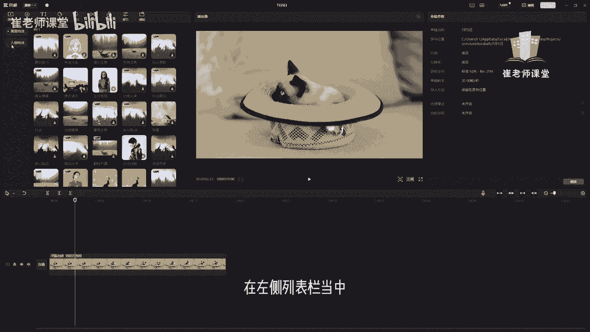
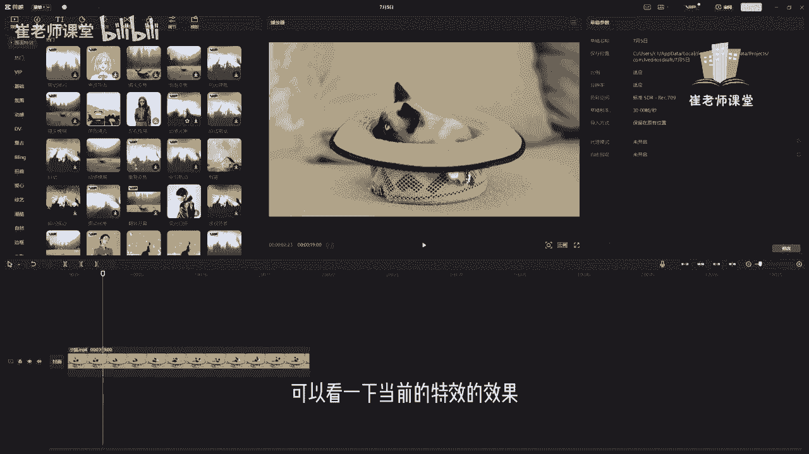
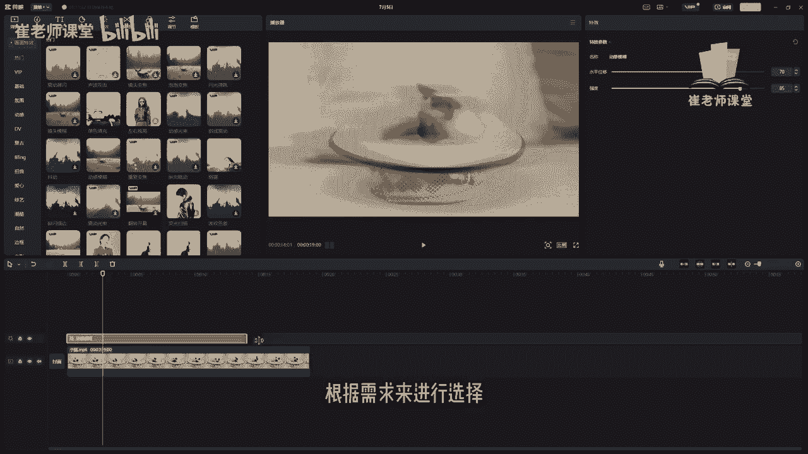

# 【2024版小红书体运营教程】全B站最良心的小红书开店运营教程！小红书体开店 起号真的快，赶快点赞收藏起来 - P26：24.特效 - Sathenay - BV1uqHreLEER

掌握了视频剪辑，音频处理这两项基础操作之后呢，为了让自己的作品更加引人注目，可以尝试在剪辑项目中运用特效或者转场，为作品添加新颖的色彩，首先如何添加特效呢，大家可以在上方工具栏当中选择特效。

单击之后呢，在左侧列表栏当中能够查看当前的特效分类啊。

有画面特效以及人物特效。

单击画面特效可以在这里看到更加细致的分类。

有热门的特效类别以及基础的特效。

以及氛围的特效，动感的特效等等，很多特效的分类来提供给大家选择。

那么如何对当前视频进行添加特效呢，可以选中当前特效。

单击之后呢，可以进行预览一下特效的效果。

可以将鼠标指针放在上面，可以看一下当前的特效的效果。

或者单击，如果是第一次使用特效呢，需要进行下载才能够进行使用。

需要注意的是，大家可以看到右上方啊显示VIP啊。

有些特效呢它是需要添加VIP才能够进行使用，如何对当前视频添加特效呢。

选中当前特效，把它拖进时间轴当中。

你会发现它会建立一个特效的轨道。

可以选择当前特效轨道的时值，根据需求来进行选择。

只有达到特定的时值呢，当前的特效才能够进行生效，给大家看下效果，当前在十秒内它是能够显示特效的效果。

后面的区域呢就变成了正常，可以调整当前特效的时间阶段。

需要注意的是，在这个位置呢，可以对特效的参数进行详细的调整啊。

他的强度以及他的水平位移也可以呢。

对当前特效，比如说嗯添加了这个特效，对不对，也可以选择另一个特效来进行添加。

单击之后呢，可以把它直接移动到当前的轨道当中。

不同的特效呢它的特效参数也是不同的。

可以根据需求来进行调整啊，比如说当前的荧光扫描啊。

有颜色滤镜，还有强度，还有速度啊等一些详细的参数进行调整。

那么其他特效呢给大家看一下。

也会有其他的这种特效的参数啊来进行调整，当然呢特效也可以进行叠加进行使用啊，比如说这个特效和上面的特效呢。

重新添加进一个新的轨道啊，进让两个特效进行叠加在一起，可以看到叠加出来的效果。

当然呢这些所有的特效都可以进行叠加啊。

把他拖进时间轴当中呢，它就类似于建立了一个新的轨道。

我们可以对当前的特效轨道进行单独的设置，以及调整它的时间。

除了画面特效呢，还有人物特效。

这些是针对于人物来进行去添加的特效，如果能够找到比较喜欢的一些特效呢。

可以选择收藏，单击之后呢可以进行收藏。

