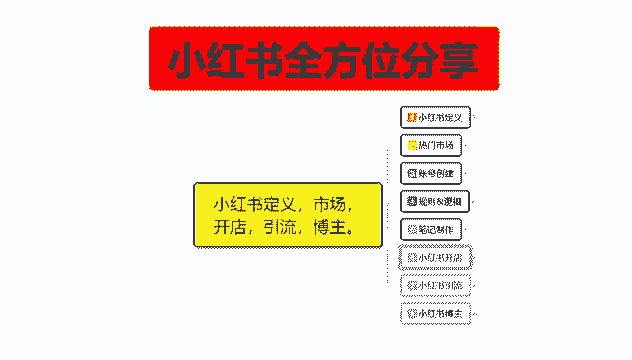
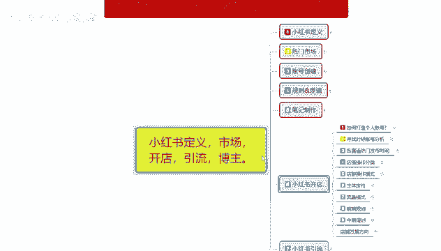
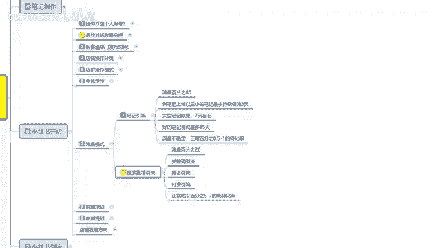

# 【2024版小红书体运营教程】全B站最良心的小红书开店运营教程！小红书体开店 起号真的快，赶快点赞收藏起来 - P27：25.小红书爆款店铺打造步骤（7） - 快乐稳定发挥 - BV1AbtoebEjX

大家好，今天给大家分享的是小红书，全方位分享第六大课时的一个内容。

这节课的话还是给大家分享一下，我们的一个小红书流量模式。

就是小红书你开店以后，你要着重了解的一个内容，小红书的一个流量模式的话，其实我之前呢也给大家做过一个分享，据说呃小红书他的一个流量模式，你做店的话其实可以把它分为两步来去了解啊，第一个是笔记引流。

第二个是搜索推荐引流，它和之前的一个引流模式其实差不多，但是他的选择性本质是不一样的啊，比基引流是什么意思呢，流量的80%的比例都在比基引流里面，搜索推荐引流的话，可能占比的话就是接近20%还不到啊。

我们先了解一下笔记引流啊，笔记引流的话就是笔记上新以后，额小的笔记最多的话持续引流三天，大型笔记七天，好的笔记的话就是15天流量不稳定，正常的一个百分比的转化率的话，是0。5到1%。

但是他的流量渠道非常大，你比方说你技术曝光是2000，那你2000里面有接近怎么说呢，2000里面接近有200到300的一个小眼睛，那么他的一个转化率的话，就是接近0。5%到1%啊，当然了。

这个得要你的店铺里面有数据才可以，你店铺里面没数据的话，那基本上没什么转化率啊，正常这个转化率的话，你要有2000粉丝以后才能达到，你没2000粉丝之前的话，你的转化率的话基本上就是1‰。

然后是搜索推荐，引流流量占比的话是20%，他就是搜索流量啊，就是说用放大镜做搜索的，这个里面的话有65%的一个嗯，引流渠道，35%的一个商品嗯，笔记35%的商品笔记里面的一个引流。

这个里面的话它主要的排名啊，就是靠关键词排名，然后的话靠付费排名，靠你的一个关键词引流，靠你的一个成交排名，靠这几个点来综合你的排名进行分布，当然了，有没有那种新号上去以后没什么数据的，有没有排名有。

但是他的曝光非常少，知道吧，就是你35%，65%的那个自然比例，35%的商品比例，35%的商品比例里面，只有3%左右的啊，就是接近1/4 3%左右的，没有排名的那种新比一。

那你觉得你自己能抢到多少流量和访客对吧，但是他的一个正常成交转化率非常高啊，基本上转化率的话是5%到7%，这是大类目，小类目的话会更高，可能是7%到10%，你冷门类目的话可能是12%到15。

这个小红书开店，他的流量模式，我把这个课放在这给大家讲，是什么意思呢，就是说我们前期你做小红书的话，你不要急着去做商品笔记，你要先做引流笔记啊，你做商品笔记的话，就是在搜索推荐里面的那个3%。

因为你没有权重，你只有那个35%里面的3%，也就是相当于是1%到2%，的一个流量访客，你去抢，基本上抢不到的一天能有个几个就不错了，你因为没有关键词的一个引流，第二个没有排名的一个引流。

第三个没有付费引流，就是这三个的话，你需要去自己去把权重拉起来了以后才有的，那你需要一定的粉丝量，粉丝量怎么去弄呢，就是靠笔记引流，前期做这个80%的流量，靠这些流量去提升我们店铺的一个权重。

权重起来以后大概有2000粉丝左右的话，你再去做商品笔记，那效果就出来了，然后整体意思的话就是说我们小红书上面，你去开店做店啊，也不要急着去把自己的那个商品比一拿，着急着去做推广。

因为那个推广的话效果不大，你要先把你自己的一个引流笔记做好，引流笔记做好以后再慢慢导入商品笔记，再去增强排名才可以，然后这个里面的话他笔记还有一个笔记，刷新以后，小的笔记最多保持三天的一个流量。

比如说你每三天之内前期新增号，每天必须发两篇笔记，那你一篇笔记大概的访客的话是200，第二篇的话可能是100~150，也就是每天大概有350个小眼睛，连续三天，那你的每天这么发，持续一个星期。

那你就相当于是有，350，350乘以三九千一千的访客，大概的话一个星期有2000个小眼睛左右，这么操作半个月以后的话，你的数据量基本上就可以开始报起来了，如果说你的笔记效果不错，系统认定的给你发布七天。

那你每天的话就相当于是350×7，每天大概有2000个小眼睛左右，懂我意思吧，一个持续三天，三天左右的话，就是每天平均吃1000个，现已经一个除持续七天，持续七天的一个鼻音引流效果的话。

每天大概是2100个，相应如果说你不持续去做的话，你三天里面有一天空余了，那你就相当于损失了1/3的一个曝光流量，因为这个的话，小红书系统基本上都是属于固定式的嗯，好的笔记引流做到15天的收获的话。

你们现在做不到，这种的话，你至少要有个什么1万左右的一个粉丝，然后笔记效果还非常好，每次发放出去以后的话，你的一个相应金数量大概在2万左右，你才可能做到这个好的笔记，每天给你拖笔记，就是发出去以后的话。

给你做15天的引流，不然的话基本上做不到的啊，基本上就是三天到七天左右，这个呢就是小红书的一个整体流量模式吧，让大家了解一下就行了，额然后这一节呢就给大家分享到这，下一节呢给大家分享一下。

小红书店铺的一个前期规划，就是实操部分了啊，让你们了解一下你店铺做到什么样，你才能自然开单。

