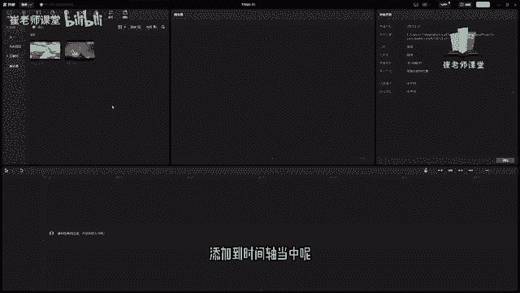
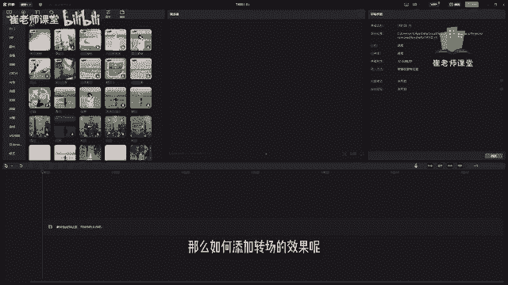
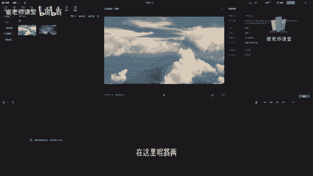
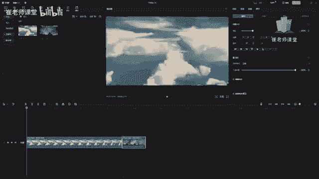
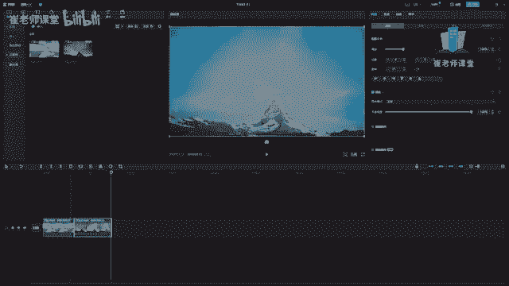

# 【2024版小红书体运营教程】全B站最良心的小红书开店运营教程！小红书体开店 起号真的快，赶快点赞收藏起来 - P27：25.转场 - Sathenay - BV1uqHreLEER

我们可以将两段或者两段以上的视频素材，添加到时间轴当中呢。

可以选择顶部的转场来进行，对当前的视频添加转场的效果，视频转场又称为视频过度或者是视频切换，实用转场效果呢可以使一个场景平缓，而且自然地转换到另一个场景，可以极强的增加影片的艺术感染力。

在进行视频剪辑的时候呢，利用转场效果不仅可以改变视角，推动故事的发展，还可以呢，避免两个镜头在切换时比较突兀的感觉，那么如何添加转场的效果呢。

首先我们选择媒体，在这里呢将两个视频素材呢导入进时间轴当中。

直接进行拖拽。

调整合适的时间值，OK然后在顶部工具栏当中呢找到转场工具选择。

大家可以在这里能够看到转场的效果有很多啊，有热门以及VIP使用的，还有叠化运镜，模糊影片光效等等，在这里我们讲一讲基础的啊，如何进行添加啊，那么每一个转场的效果呢。

我们得需要很多的时间以及经验啊去熟悉啊，很显然杰克都是抢不完的，因为他的转场效果真的太多了，我们可以根据自己的经验以及审美，还有对影片的理解来选择合适的转场效果，那么如何进行添加呢。

首先我们选择当前的一个转场效果，大家可以在这里鼠标指针放在上面呢，可以进行预览，能够看到当前的转场效果是什么样子的，然后呢选择之后呢，将当前的转场效果如果是第一次添加的话，它会进行下载啊。

下载的时间会很快啊，它只有几M就下载好了，然后选择当前的转场效果呢，鼠标指针放在上面会进行预览当前的效果，选择当前的转场效果呢进行拖拽到时间轴当中，你会发现将它直接拖拽之后呢，它不会自己新建一个轨道。

而是将两个影片当中进行分隔的部分，或者是两个视频的过渡的部分，可以在这里添加转场，大家可以看一下这个效果，选择当前的时间轴这个视频轨道之后呢，你会发现它可以在这里直接进行吸附。

松开鼠标就可以对当前视频轨道添加转场效果，来我们播放一下，看一下效果，当然呢我们对当前视频进行裁剪之后呢，进行分割之后，你会看到中间有一个分隔的区域啊，也可以对其进行添加转场效果。

比如说当前的这个效果进行拖拽，将当前视频转场效果呢拖进当前视频轨道当中，松开鼠标，你会发现它就会添加当前的转场效果，需要注意的是，转场效果呢，这些参数啊也可以进行详细的调整啊，不同的转场效果。

他调整的一些参数也是不同的，在这里可以调整它的时长，而另一个转场效果呢可以进行添加其他的参数，剪映呢给大家提供了很多这种转场效果，来进行了很详细的分类。

