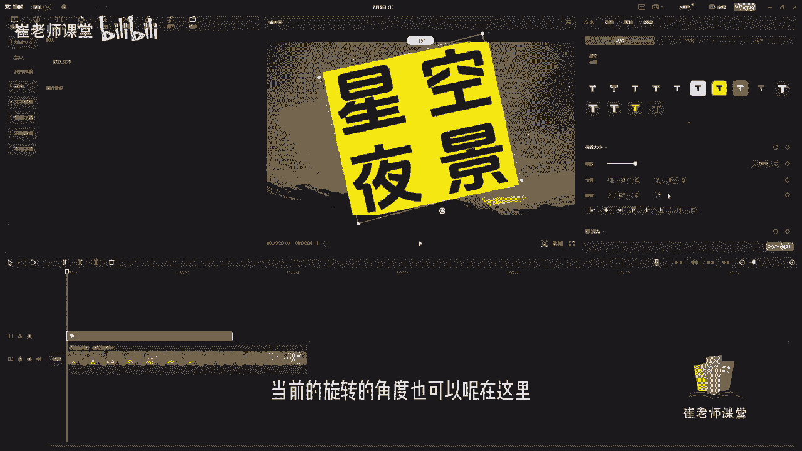
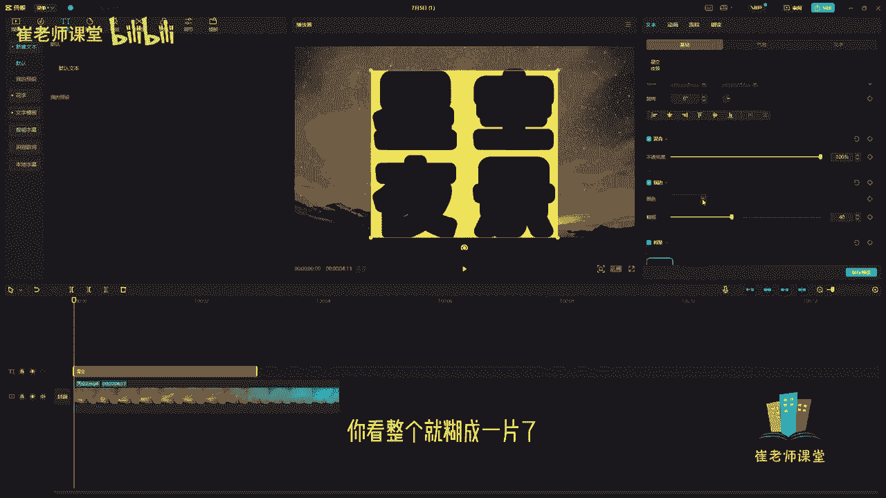
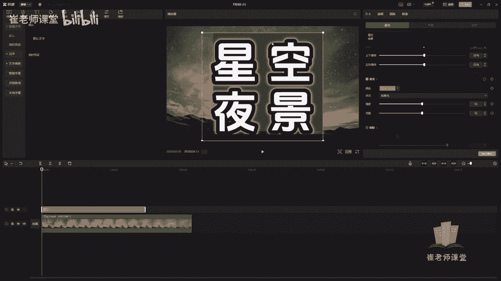
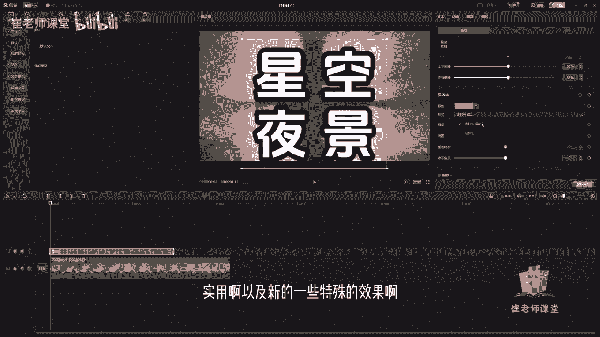
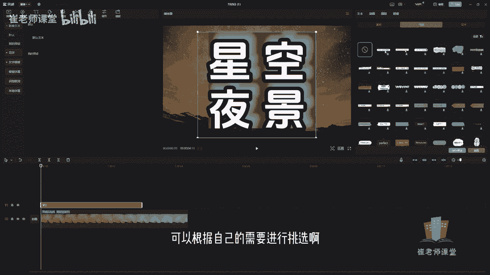

# 【2024版小红书体运营教程】全B站最良心的小红书开店运营教程！小红书体开店 起号真的快，赶快点赞收藏起来 - P28：26.基础字体设置 - Sathenay - BV1uqHreLEER

来给大家讲一下。

在剪映过程当中如何添加文本呢，首先将素材呢拖进时间轴里面。

我们选择顶部工具栏当中，找到文本工具，单击可以在这里看到文本工具的分类啊。

有新建文本，有花字。

文字模板，智能字幕识别歌词，本地字幕等等。

我们来进行详细的讲解啊，首先是新建文本。

可以单击直接拖进时间轴当中，你会发现它会新建一个文本轨道。

松开鼠标之后呢，就创建了一个文本轨道，可以在这里进行对当前文本进行设置，可以直接输入啊，需要修改的文本，在这里修改文本的内容，紧接着可以呢对当前文本进行修改字体啊。

默认的是系统默认的字体，可以单击，然后在这里进行查找自己想要的字体，如果有喜欢的呢，可以单击进行收藏，可以看到这个小新的这个符号，可以单进收藏，留到下次进行使用，还有呢如果是没有实用的。

可以在这里进行下载，然后可以预览一下，单击之后呢，可以看到当前的字体是什么样的形状，大家可以在这里啊看到哦，简介的预设，这些都是当前字体的预设，可以根据需求来进行选择，有很多种字体啊，啊。

剪映给大家提供了很多这种字体的样式，来提供给大家选择，我建议大家啊在平时没有剪辑视频的时候呢，要多挑选几种啊，自己比较喜欢的啊，说不定到时候就能够直接用到了啊，可以在这里进行查询。

紧接着呢可以在这里啊单击可商用啊，这些可商用字体呢都都是可以进行呃商用的。

能够更方便的大家进行使用O挑选好字体呢，可以在这里啊设置当前字体的字号啊，就是字体的大小，拖动滑块呢可以调整字体的大小，也可以在这里直接输入数值，可以调整大小，也可以呢调整上下的按钮来进行微调。

也可以呢在播放面板当中呢，直接拖动当前的字体啊，可以调整它的大小，然后呢可以更改字体的样式，有加粗，有添加下划线，有斜体也可以呢在这里设置字体的颜色，单击之后呢可以挑选颜色，也可以直接输入数值。

也可以在下面直接挑选好合适的颜色，你可以选择当前的模式，颜色模式RGB，然后在这里输入RGB的数值等等，根据自己的需要来进行选择。

也可以呢在这里设置当前字间距啊，默认的是零啊，行间距也是零，可以进行设置字的间距以及行的间距，因为只有一行看的不是很清楚啊，可以在这里呀，比如输入一个，可以设置行间距给大家看一下，包括字间距。

然后呢在这里可以挑选当前字体的预设样式嗯，有很多种预设能够给大家使用。

比如单机选了一个预预设，可以找啊一个自己喜欢的，或者是符合当前视频的一个预设，来进行快速的进行使用。

它提供了很多种预设。

同时呢在这里可以设置它的缩放比例啊，这个缩放比例力呢。

和这个直接拖动它的大小是相似的，差不多，也可以在这直接直接输入数值。

还有当前的位置啊，这个和之前和大家介绍过了啊，直接输入位置，它是以X轴以及Y轴来进行设置，默认的是零，我们可以根据自己的需要啊。

可以进行来设置，OK紧接着呢旋转啊。

可以设置它的度数，也可以呢直接移动当前的按钮来进行拖动啊。

当前的旋转的角度也可以呢。

在这里直接单击按钮来进行拖动。

鼠标来进行调整，它的当前的旋转的度数。

OK紧接着呢在这里可以设置左对齐，水平居中对齐。

右对齐，顶对齐，垂直居中对齐。

底对齐以及水平分布，还有垂直分布等等一些详细的设置啊。

这个是针对于当前的位置，还有呢在这里也可以设置它的不透明度啊，默认的是100%，就是完全不透明，在这里呢可以调整它的详细参数。

比如说50%啊，就是设置了50%的透明度，然后呢可以移动滑块来进行调整。

它当前的透明度啊，也可以进行调整啊，就是比较详细的设置，同时呢也可以进行描边的设置，就是对当前的字体进行描边。

单击勾选之后呢，你会发现默认的是黑色的，你看整个就糊成一片了。

我们可以根据需要进行设置，比如说描边啊，尽量的粗细可以根据自己的需要来进行挑选啊。

可以设置小一点啊，或者是额多一点啊。

完全根据咱们的自己的审美啊，自己的需求。

自己的审美来进行挑选，紧接着还有背景嗯。

这个预设不太好看，我挑选一个合适的预设。

设置背景呢可以设置它的颜色。

比如说，可以挑选当前的背景颜色，也可以呢使用这个吸管啊来单击之后呢，可以吸取当前选中的颜色啊，比如说你觉得这个颜色比较不错，你直接用吸管工具直接吸取嗯。

它就当变成了当前的这个颜色，来提取当前的颜色，来将这个背景的颜色进行更改，这个细软工具啊是在很多软件当中，只要设计颜色都很，都经常使用的一种颜色提取的工具啊，这需要大家注意的。

也可以在这里直接输入数值来进行挑选颜色，在这里呢可以设置它的不透明度，ok 50%，然后20%你可以发现一下他背景的变化，然后默认100%看看变化的背景，就是完全不透明。

紧接着呢可以设置它圆角，你看下区别啊，你看它边角啊，它会变成一个圆形，拖动滑块啊，啊数值越大，它变成呃一个圆形，然后一点一点的往下移的话，它会一点点的去，可以看一下区别啊，默认是0%，就是无圆角，越往。

拖动的数值越大呢，它就好变得更圆，紧接着是亮度啊，可以在这里调整它的亮度，紧接着是高度啊，可以在这里调整它的高度，还有呢宽度啊，可以调整它的宽度，还有上下偏移哎，给大家看一下当前的上下偏移诶。

发生了变化，紧接着的是左右偏移。

左右偏移，还有呢是发光。

单击之后呢就可以设置当前的发光，比如说颜色可以在这里修改。

你看下发光啊，就是对当前字体进行发光啊。

这是很多啊，一些视频剪辑软件或者是图形，图像处理的剪辑软件当中，经常使用的这种特殊效果啊，比如说发光也是颜色。

也可以设置样式，可以看到啊，有轮廓发光啊。

就当前的轮廓发光啊，还有外发光啊，就是这啊就是这样的一个效果啊，但是需要注意的是，外发光是需要VIP的啊，随着检验的更新呢，肯定他这些特殊效果啊，这种样式也会进行更新啊，大家可以根据自己的剪映啊。

无论你下载的什么样的版本，或者是现在是几几年也好啊，这些样式呢它会随着自己的呃，它是会随着检验的更新来不断的去填充，更多实用啊，以及新的一些特殊的效果给大家使用。

然后根据当前的发光呢可以吃它的强度啊，你看看亮光强度以及范围，还有呢垂直角度诶，需要注意一下啊，角度当然呢需要大家注意的是啊，在这里可以添加关键帧啊，这个关键帧是干什么作用的呢，你添加关键帧之后呢。

可以做出一些啊类似于动画的效果，我们后期会讲到啊，这个会讲到的啊，不要着急，比如说你看一下当前的垂直角度啊，你看这样发光，我们可以添加关键帧，可以直接让它进行达到啊，这个光垂直角度进行上下移动的。

这个动画的效果啊，我们后面会后面我们后面会讲到哦，先不要着急啊。

我只和大家说一下啊，嗯然后呢还有水平角度啊可以进行调整啊。

当然也可以进行添加关键帧，然后进行达到当前这个水平角度的这种啊效果，添加关键帧之后呢，可以达到这种水平角度，这种变化的这个光源的动画效果。

除了发光呢，还有阴影啊，还有阴影可以试试当前阴影的不透明度。

你看下当前阴影，我把这个发光先关掉啊，呃能够更加清晰的看到这个阴影来进行挑选，这阴影啊，还有模糊诶，可以可以看到移动滑块或者直接输入数值啊，这个不多介做介绍了，和嗯和之前都是一样的啊，要么移动滑块。

要么是直接输入数值啊，需要打需要添加动画的效果的话，可以直接添加关键帧来进行使用，然后还有距离，你看到这，你们能够看一下这个当前的这个距离，可以进行调整，然后还有角度啊，角度可以进行调整。

也可以直接输入数值，然后呢需需要注意的是啊，在这里啊，如果你挑选一个比较合适的这个预设的话，比如说这个基础的话，你可以直接保存预设，这个时候呢你下次在使用的时候，就直接就把当前当做一个预设啊。

就是当做一个模板啊，你不需要再进行这么复杂的进行修改了，你直接使用刚刚已经修改修改好的比较完美的。

自己喜欢的这种样式，下次能够直接进行使用，紧接着呢除了基础的设置呢啊。

这是所有的基础的设置，还有气泡给大家看一下啊。

气泡呢可以根据自己的需要进行挑选啊。

比如说诶你看一下当前的气泡诶，可以选择进行设置啊，当然你要去根据自己的需求来进行。

详细的调整啊。