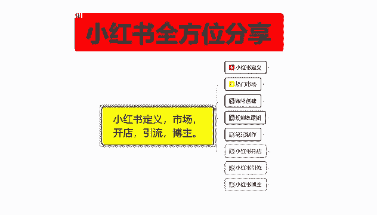
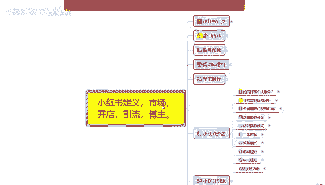
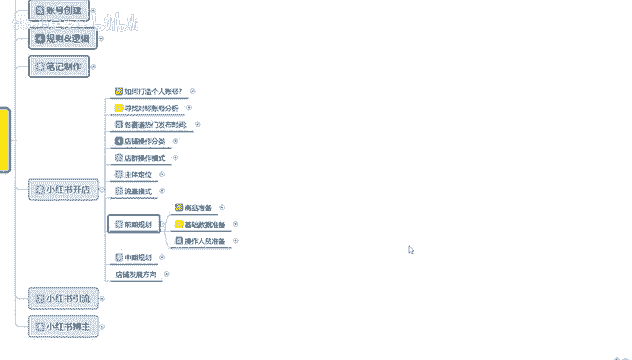
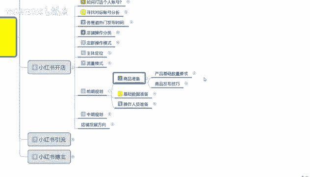
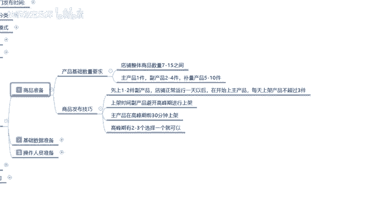

# 【2024版小红书体运营教程】全B站最良心的小红书开店运营教程！小红书体开店 起号真的快，赶快点赞收藏起来 - P28：26.小红书爆款店铺打造步骤（8） - 快乐稳定发挥 - BV1AbtoebEjX

大家好，今天给大家分享的是小红书全方位分享的，第六大课时。

小红书开店的一个内容，这节课的话主要是给大家分享一下，我们小红书前期的一个整体规划啊。

小红书整体前期规划的话。

其实是可以把它分为三步的，第一个呢是商品准备，第二个是基础数据准备，第三个呢是操作人员准备，这三部的话，我们你如果说小红书，你在小红上面去直接卖商品的话，这三步准备的话，你是必须要做的，因为你不做的话。

嗯有些东西你包括定位的话，后续你再想去操作的话就比较困难啊，首先是商品准备，商品准备的话，这里面呢有一个。

产品基础需求，就是说整个店铺的话，就说你小红书开店，你不管是开多店也好，开单店也好，整个店铺的商品数量的话，基本上都是在7~15个之间，如果说你是做单店的话，七件产品就够了，如果说你是做怎么说呢。

就是呃你多电操作，应该说是做七件产品就够了，如果说你是单电操作话，你基本上都要做到四五件左右，为什么说多店的话七件呢，因为一个店铺七件产品不少了，而且这个产品的话他有数量搭配的，数量搭配是什么呢。

就是说主产品一件副产品，两到四件不亮的一个产品呢是5~10件，如果说你是做多店的话，就是多个店铺，那我们以一个店铺做示范的话，就是一件主产品，两件副产品，这是四件产品，然后加四件不亮的。

或者说是一主一副，五件不亮的七件产品，主产品的话销量是最高的，副产品的话有个那么一两单，两三单就行，然后不亮的产品不需要去有单数成交，就说你不需要他有任何的一个数据量，如果说你是单店的话，那就是15件。

他也是按照这个顺序，前面先做七件，然后你放第二件主产品的时候，然后慢慢的增加，也就是说正常搭配的话就是一件主产品，两件副产品到四件左右的一个不良产品，后续的产品的话，你可以把补量产品慢慢减少。

你比方说你是做单店的，你推广第二个产品的时候，那你就从副产品里面往上面推一件主产品出来，或者说是用补量产品里面去下架一款，然后重新再上传第二建筑产品的一个商品，然后呢副产品变动一下。

把不亮的产品稍微更换一下就可以，就说你最少要保证一件主产品，两件副产品，五个不量产品，你后续往里面增加，那你增加的是主产品，那副产品就要相对应的减少一个，正常情况下的话就是两组。

你如果说是第二件爆款的话，就是两件组产品，一件副产品，剩下的是不亮的啊，然后做第三间的时候，就是三件主产品没有副产品，其他全是不亮的，你后续要做第四件，第五件的时候，那就没有什么主产品和副产品之分了。

因为那个时候的话，你店铺账号数据已经全部做起来了，就是你这15件产品都能卖，但是你前面三件的话，基本上都是一组两副或者两组一副啊，这么去操作，先起量三件主产品有宣传，有销量的以后。

你后面的不量产品就基本上可以全部转正了，这个呢就是单店玩法里面，我们所需要的一个产品技术数量，但是你店铺所有的产品就是你玩单店也好，玩，其他店铺也好，不能超过15件，15线的话是上限啊。

因为他的话有一个店铺动效率，控制在15件以内的话，我们好去操作，如果说超过15件以后的话，你整个店铺的一个动效率的话，我们是没办法去更新进行操作的，第二个呢是商品发布技巧，商品发布技巧的话。

就是说先上一到两件的一个副产品，不要上主产品啊，这两件副产品上传上去以后的话，你也不要去发什么笔记，这个的话只是让小红书系统录入你的产品啊，让系统反应过来你的店铺开张了，什么什么意思呢。

就是说让系统先把你的副产品进行录入啊，给你进行一个技术排名，基础排名确定以后，店铺正常运行一天，你再去上传主产品，然后呢每天上架的产品的话不要超过三件，就说你第一天上传一到两件副产品。

然后上传一件那个不量产品，第二天的话上传主产品加两件副产品，第三天的话再上一件副产品，你有七件产品就齐了，就基本上就可以了，这个是你觉得时间比较紧的，这么操作就行，如果说你觉得时间比较宽松的啊。

时间稍微拉长一点，然后节奏慢一点呃，效果会好一点，那你可以一天上传一件到两件，就是第一天的话肯定是不能上主产品的，因为系统录入以后的话，你的主产品是要去做数据的，那你第一天录入直接上来做数据呃。

做规划的话，那你后续的话怎么说呢，其他的东西的话权重他就不高了，先上副产品，再上主产品，数据会高很多，而且系统录入的话，你就有排名了，排名的你就算是最后的排名，第二件产品主产品上传以后的。

你包括你后续啊开始做数据以后，你的排名就会上升，就是已经可以开始做关键词，做搜索啊，做这个数据的一个销量排名，数据起来以后的话，系统就会给你更多的曝光，如果说你是第一件产品直接上去以后，直接开始操作。

那系统在没有录入你店铺状态情况下的话，你直接开始操作，那你前面做的全部是白做，没什么太大作用啊，就浪费了，然后产品发布里面的话，就是说上架副产品的时间的话，你不要在高峰期去高峰期啊去上下架。

高峰期的话是主产品的，然后副产品的话，随便在什么时间段去发放都可以，你后续你上第二个主产品的时候，也是啊下架副产品，然后上传主产品都是在高峰期去操作的，主产品在高峰期下架了的话，就是说前30分钟上讲啊。

让系统录入，录入以后的话，你30分钟或者一个小时以后，再开始做宣传推广就可以了，高峰期有两到三个，选一个就行了啊，基本上的话你的那个产品的高峰期，基本上都在集中在一块，就是说比方说你有两个高峰期。

是晚上的五点到八点，然后是中午的11点到两点，这两个高峰期你只能选一个，你后续的所有主产品，基本上都是在这一个高峰期，也不能说第一个主产品在下午，第二个主产品在早上对吧，这样的话你的那个权重就分散了啊。

没有必要，我们选高峰期只选一个阶段，你其他副产品的话，你用在上午的高峰期也可以，但基本上的话你的一个高峰期，组主产的一个阶段的话，就是全部堆在一个高峰区里面去增强排名，这个效果是最好的。

这个呢就是我们前期的一个商品准备，产品基础数量的一个要求，和你的一个商品发布的一个技巧，掌握这两个点以后呢，就是下下面的一个技术数据准备好吧，那这节课呢就给大家分享到这，下一节课的话给大家分享一下。

