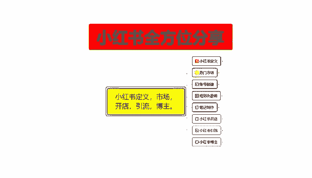
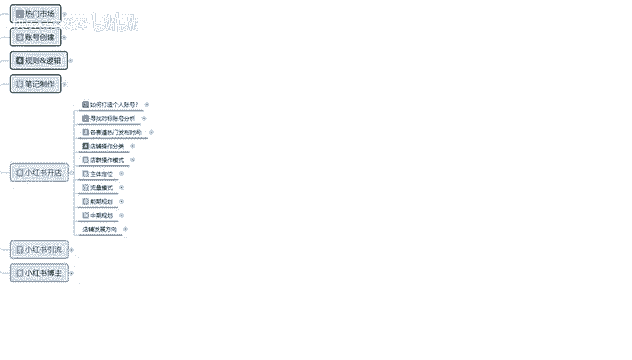
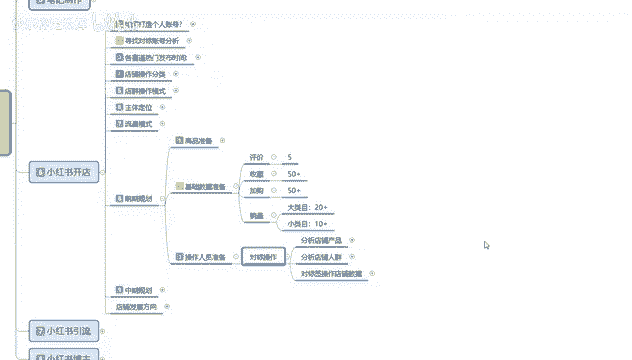
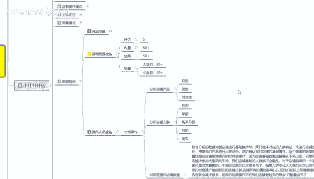
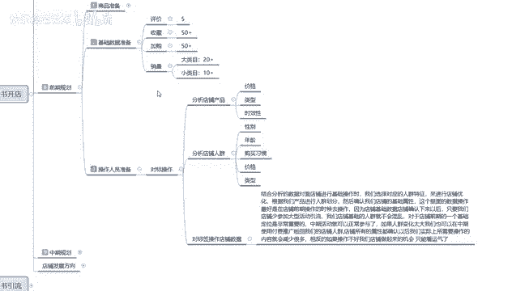
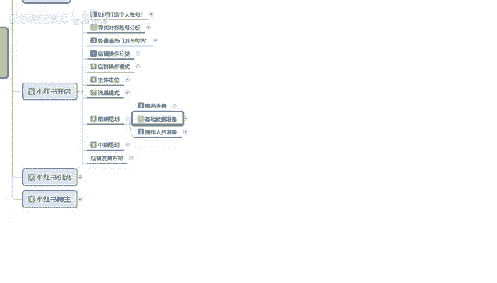

# 【2024版小红书体运营教程】全B站最良心的小红书开店运营教程！小红书体开店 起号真的快，赶快点赞收藏起来 - P29：27.小红书爆款店铺打造步骤（9） - 快乐稳定发挥 - BV1AbtoebEjX

大家好，今天给大家分享的是小红书全方位分享的，第六大课时。

小红书开店的一个内容，这节课的话还是接着上一节课的一个内容。

进行分享呃，前期规划的第二点内容，数据准备啊，这个基础数据准备的话，就是主产品的一个数据准备啊，你副产品和那个不亮的一个产品的话，其实前期不怎么去操作的，半个月的左右，有一个一单到两单基本上就可以了。

你其他的话基本上都是在主产品上面去把，先把基础数据做起来，基础数据做起来以后，你再去做宣传的话，产品才能卖得出去，不然的话你没有基础数据的产品，你直接去做宣传还是卖不出去的啊，概率太小，没必要啊。

那基础数据准备的话，这个里面的话就是说呃你的主产品上架以后，在高峰期上架以后开始操作是什么时间段的，是上架过后半小时到一小时以后，你开始做自我推广，这个时间段，就是你的系统已经把你的产品录入了。

第一天录入的是你的副产品，开始给你定位排名，第二天你产品商家以后的话，大概过半个小时，系统完全录入以后，就是已经有基础排名了，店铺排名有了，现在是商品基础排名，商品基础排名有了以后的话。

大概过一个小时你就可以开始操作了，就是排名已经稳定下来以后，可以开始基础操作，基础操作的话，那你在七一天左右的一个时间段里面，你要把你的这个主产品的一个基础数量做起来，这里面基础数量包括什么呢。

评价收藏加购和销量，评价七天以内，你的产品至少有五个左右的一个评价，收藏架构基本上就是在50个往上走，越多越好啊，这个没有上限，但是不能低于50，这个数据的话，你是找帮朋友帮你去看看。

点点基本上就都有了，然后评价的话你自己额找几个亲戚朋友，你前期的话用你做小红书宣传的，基本上都是这样的，你要不在朋友圈发，要不就在那个额微博啊等等地方自己去做宣传，这种的话其实非常好做的。

七天时间时间也够啊，自己去弄也行，但是的话地域的话不要太集中，有外面的地域，就是和你本地呃，不在你本地的，你去做宣传去购买的话，效果会好一点，在本地的话也没太大关系。

我们前面的话操作它只需要它的一个基础数量，就说评价的话，七天以内有五个的一个数据反馈，评价基本上第一天的一单，第二天，然后三天收到货，第三天基本上就是一个评价，然后第二天两单之类的。

正常的一个节奏做下来的话，这个七天时间，你基本上产品的基础数据有了以后都好做，然后销量的话就是说你如果说是大类目的话，你整体销量最少要卖20单左右，如果说你是小类目的话，就是十单左右。

冷门内幕那个就没办法计算了啊，因为冷门内幕的话，他有的很多都是小件的啊，有时候类似于批发之类的东西，而且那个的话你在小红书上面前期做的话，那个没办法按数量去，就是没办法按销量去进行。

单独的一个额外计算啊，但是你我们正常操作的话，大类目20个，就是你的销量必须要有20个以上，你小类目的就是那种稍微偏冷门的，就基本上也要到十几个啊，不能低于这个基础数量，低于这个基础数量以后的话。

你后续的一个整体操作的话，基本上就不好弄了，这个呢是基础数据的一个准备，七天时间你基本上都能做完，而且是非常容易的，第三个呢是操作人员的一个准备，这个的话就是匹配的啊。

匹配技术数据准备的有也可以，没有也行。

就是说你如果说呃很多时候的话，不了解这个小红书的一个技术数据，你没有操作人员，他没办法去给你操作对标的一个标签，就是没办法先把标签设定好，那你可以不做这个，如果说你有这个资源的话。

那你提前的话就要先准备，差不多操作人员把这个对标标签啊给做出来，对标标签里面的话是什么啊，分析店铺的一个产品，然后分析店铺的人群，就是你自己的产品，自己产品的价格类型，时效性，然后用你的朋友。

或者说是你自己想要操作自己店铺基础数据的，这帮人，先去看同类型的一个，价格类型和时效性的一个产品，然后的话分析你产品的性别年龄和购买习惯，就是你账号创建之初，他那个手机号绑定之类的。

基本上都有你的性别年龄，购买习惯，价格信息规约，就说如果说你是新号的话，额这块你就不需要去管它，那你直接去管价格类型和时效性，如果说你不是新号，就说有有些朋友他也看看小红书啊之类的，这种账号是最好的。

那他里面的性别年龄，购买习惯，价格类型的话，符合你的需求，你直接让他来帮你就行了，对标都啧标签操作店铺的一个整体数据，说实话啊，如何分析数据对店铺进行技术操作的话，就是你前期的一个整体技术定位。

我们选择对应的人群特征，来进行店铺的一个优化，根据我们产品进行人群划分系统，他也是通过这种的话，会给你推进相关的一个人员，就是说你做了这个对标操作的人群，那后续他给你的对标人员就越精准。

也就是购买你产品的概率也就越大啊，你如果说不操作这个的话，你只是有基础术语，然后的话随便找方人去帮你做的话，你只能做这个，做这个以后的话，那你的一个账号基础设定就必须得完善，包括你后续的那个笔记。

还有你账号整体的一个设置，包括你后续的宣传之类的，你就需要去做这个，如果说你前期做了这个，那你后续的话就呃对标账号的一个数据量的话，就可以减少，如果说你没有做的话，对标数据账号量的话就得翻倍啊。

就是两两个选项，你必须得去操作一个，不然的话你整体数据起不来。

这个呢就是小红书店铺的一个前期规划，把前期规划基本上做完以后的话，就是商品准备，你已经布置好了，技术数据准备做完了，操作人员准备好了，七天以后的话，基本上数据全部做完以后的话。

你就可以直接开始开始去制作你的笔记，就看你的笔记怎么去报，去怎么编辑，编辑完成以后的话，你后续的一些操作额算起来的话，基本上就都比较容易了，除非你碰到瓶颈，碰碰到瓶颈以后的话。

基本上就到达了一个中期规划，中期规划就要看你自己的店铺怎么去运营啊，那这节课呢就给大家分享到这，下一节课呢给大家讲解一下中期规划。

