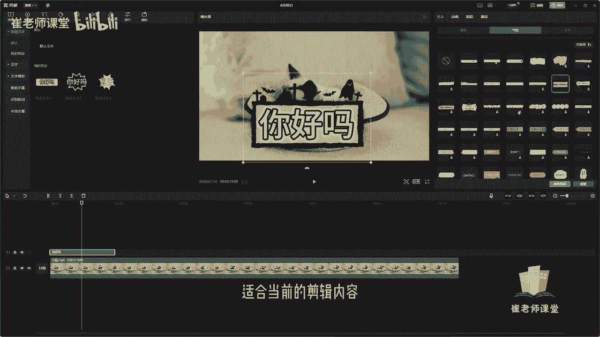

# 【2024版小红书体运营教程】全B站最良心的小红书开店运营教程！小红书体开店 起号真的快，赶快点赞收藏起来 - P29：27.文字模板花字文本效果 - Sathenay - BV1uqHreLEER

上节课我们讲解了剪映基础字体的设置。

这节课呢我们来讲解一下气泡以及花字。

气泡以及花字呢是在基础字体的设置上呢。

是对当前字体的外观来进行设置。

对基础字体输入好内容之后呢，选择好样式之后进行一系列基础操作之后。

可以单击气泡。

来对当前文本内容选择合适的气泡样式。

可以单击进行预览选择，你会发现剪映给大家提供了好多种预设。

在这里呢可以单击全部或者是可商用。

可商用呢是没有版权限制的啊。

可以进行商业化的使用，另外如果有自己比较喜欢的气泡呢。

可以选择保存预设，可以在文本工具栏当中。

这里能够直接进行查看到气泡和花子一样，都是对文本的外观来进行设置。

单击花字呢可以选择自己喜欢的花字的样式。

以及符合当前视频的花字样式。

单击可以进行预览，你会发现花字呢只是对当前字体来进行设置。

而气泡呢它是对字体外面的外观来进行设置。

选择自己想要的样式进行单机来进行使使用啊。

花字以及气泡可以进行搭配。

这个是完全根据自己的审美来进行剪辑的啊，我建议大家呢就是我们在剪辑过程当中，尽量能够简洁一点啊，不要整的花里胡哨的啊，就是很乱啊，可以以简洁简约为主来适合当前的剪辑内容。

需要注意呢，有的个别的预设呢，在上方的区域需要进行VIP来进行使用。

也可以在这里选择可商用的花字。

或者是选择全部来进行挑选使用，也可以对当前花字呢进行保存预设。

来进行下次直接进行使用操作。

另外呢也可以在这里啊选择花字，直接单击之后呢，可以看到花字的分类啊，其实和这个是相似的，只不过是在这里能够看的更加详细一点，他有分类啊，比如说VIP使用的一些花字效果发光，彩色渐变也可以呢。

在这里直接进行搜索花字的颜色以及样式，比如说选择透明来进行挑选。

可以单机或者是直接拖进时间轴当中，可以建立一个新的文本的轨道来进行输入，当前的内容。

另外呢可以在这里找到文字的模板，有很多种文字的模板来提供给大家使用，可以根据分类，根据自己的需求来进行查找。

比如说有当前的VIP，有关于带货的文字的模板，有综艺的情绪的模板啊，还有像旅行3D运动等等啊，可以根据自己的需求，你也可以呢，直接选择自己喜欢的这种文字模板啊，直接选择收藏，单击之后呢。

可以在收藏当中直接就能够方便的快捷找到。

也可以呢对当前的文字模板如果有喜欢的话，可以进行直接拖拽到当前的时间轴当中。

它就会建立一个新的文本轨道。

我们可以对当前的文字模板呢进行编辑，大家可以注意啊，在这个位置呢可以输入当前的字体啊，就是上面的这个第一段的文本选择输入，然后呢可以选择第二段文本啊，就是他第二段文本的一些文字内容。

我们将下面的轨道删除掉，来进行预览一下当前的文字模板的效果。

在播放面板当中呢，单击播放按钮。

也可以呢对当前的文字模板呢进行调整。

详细的参数，比如说缩放可以移动滑块来调整。

也可以直接输入数值，也可以呢直接在播放面板当中，直接调整当前的四个小点，你会发现鼠标指针放在上面之后呢，它会变成两个双向的箭头。

可以直接鼠标单击拖拽来进行调整。

它的大小也可以按单机来进行旋转，这个是根据自己的需求来进行调整。

也可以调整它当前的位置，也可以直接拖拽来调整它的位置。

另外呢也可以对它进行左对齐，水平居中。

右对齐，顶对齐，垂直居中对齐。

底对齐等一些详细的参数也可以呢，对当前的文字模板直接快捷的再去切换模板。

