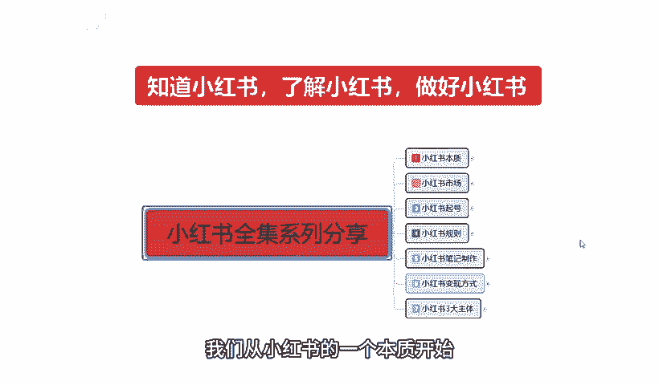

# 【2024版小红书体运营教程】全B站最良心的小红书开店运营教程！小红书体开店 起号真的快，赶快点赞收藏起来 - P2：01、小红书前言 - 若只如-初 - BV1MM4m1274h

🎼，大家好，今天给大家分享一个小红书全集系列的一个整体的一个分享啊。这整个系列呢是我们从小红书，从它的一个本字到小红书整个三大主体啊，全部的一个内容。呃，包括我们整个小红书市场的一个运营起好，呃，创建。

包括我们的一些网络博主啊、引流啊、店铺啊，怎么去操作，就是全集。为什么要讲全集呢？我呢是从小红书最基础一直给大家讲到最后啊进行的一个系列分享。因为这期的课程的话，它是非常多的一个内容。

而且这有一个分享内容的话，我也准备了比较长的一个时间。首先呢我们就需要知道小红书，了解小红书，然后才能去做好小红书啊。我呢会分成好几十节课啊，大致的内容的话，我给大家先看一下啊。从小红书的本质开始。

什么叫小红书的本质呢？就是说我们只有先了解小红书，它到底整体的一个小红书平台，它的主作用是什么啊，我们要了解它整个主作用以后的话。把它进行拆分。拆分的话就是说小红书它这里面包含了6个内容在里面。

我们从这6个内容里面，我们自己结合自身啊，我是想做小红书开店也好，想做网络博主也好，想做小红书引流到其他平台也好啊。在这个里面的话，我们要先了解小红书整个系列的一个分享。就是把小红书把它拆分开来。

我们在这个小红书里面结合我们自身能够在小红书做什么。这个呢就是小红书的本质。第二个呢是小红书的一个市场。它的整体市场的话，怎么说呢？就是说小红书主要定位的话，它都是中高端人群。说实话，低端人群的话也有。

但是没有那么多啊，普遍的话都是女性用户为主啊，高校学生及网红等。其中的话你年轻女性用户占比的话。年龄呢多都集中在15到吧18到35。但是正常来说的话，它里面包括从12岁，一直到45岁左右。

基本上都是这个概括年龄。但是整体集中的话就是说在18到35这个范围以内是最多的啊，而且是女性。所以说小红书它的一个市场。为什么说小红书场市场？小红书市场的话，我们要考虑在小红书里面开店。

它就分为一个热门商品和一个热门话题。热门话题的话就是说我们在小红书上面什么样的话题，比较适合小红书的一个用户啊，对我们的一个发展的话比较熟悉。所以说我们要从这个热门商品和热门话题里面去选。

第三个大课时呢，就是说给大家分享一下小红书起好，为什么？因为小红书的话呃，怎么说呢？账号的权重越高，它整体系统给我们的权重也就越高。我也就是说我们把基础把它做好了以后的话。

我们后面这个账号你想把它做爆才容易。如果说你前期的一个小红书起号定位之类的，你都做不好。那我们这个小红书整体来说的话，你想把它操作起来是非常困难的这就是第三大课时。第四大课是啊，小红书的一个规则。

为什么说要想了解小红书的规则啊？我们前面了解了小红书的一个本质，把它解析以后啊了解它的市场，然后通过市场啊判定我们要做什么账号。我们把小红书的账号做起来以后啊，我们要规避小红书平台的一系列的规则。

这个就是整个全套系列往下面的啊，包括了解规则以规则以后，小红书的它的一个主体就是小红书笔记啊。了解规则以后呢，就是小红书的主体笔记怎么去自作。这是第五课时。第六啊大点就是说小红书变现方式。

什么叫小红书变现方式呢？就是说我们通过小红书怎么来赚钱。小红书。我们前面做的只是基础啊，就是说把前面的东西全部学会以后，我们才去了解小红书变现。但是你要也要先了解变现的方式，你然后再把它整体结合起来啊。

然后从一到5你我们就可以了解到这个小红书到底要怎么做。它通过什么样的一个方式进行变现，变现以后我们怎么把钱弄出来啊，这是一个整体最后一节课呢？也就是第七大课时，也是内容最多的一个课时啊。

小红书的三大主体，什么叫小红书三大主体呢？第一个是小红书开店。第二个是私域引流，就是我从小红书上面我自己创建一个账号，然后把这些啊对我发布的内容感兴趣的人引流到我自己的思域。

最后一个主体就是网络播主网络播主整个来说的话，它还就是网红相对来说的话，稍微简单一点啊，包括网红啊，你我们到后面我们的一个小红书变现呢，包括接广告啊啊。等等都可以在这个上面进行实现。

所以说我整个一个小红书系列的话，我是我在这里呢是给大家把它分为了七大步。内容啊七大部内容里面的话，它这个内容大家要了解一点啊，它不是只有7个课时，它是7个大的组成部分，然后分成无数个。

因为我现在这整体来说的话，我自己都不知道这整套课程下来，我需要给大家分析分享多长的一个时间段。因为它的整个内容的话是非常多的啊，从小红书开头一直到小红书结尾它可以贯穿我们小红书整个前中期的一个操作啊。

中后期操作的话呢，不包含在这个里面为什么？因为中后期的话，它要看我们自己整体规划的一个思路和规划的方向方式不一样。它的操作方式也是不一样，就相当于我们。怎么说呢？就是说以前很多答疑分享啊。

或者说是你在其他地方了解做规划。中后期说实话你不了解你不了解对应属性的一个产品，不了解对应属性的一个利润，还有对应属性的一个。怎么说呢？就是说目的。你让别人呃定个小目标，定个一个亿，对吧？

不知道你的终终极目的在什么地方，你要通过什么方式通过投入多少来判断你中期和后期的一个投入和规划啊，只有了解这些以后，你中后期才好做。所以说我们要把小红书做好，你前中期的话。

一定要把这一套整个全集系列全部都了解一下。你才能去把整个小红书做好。因为这一期的话，我给大家分享的，就是说我们从第一期。第一大节啊到第七节课，整个大节，你如果说真的用心的去听去了解的话。

那我相信大家对小红书会有一个自的。跨越啊，对小红书，也就是说你后续不管怎么去操作，你包括你小红书不好做了，你去做抖音也可以啊。你觉得抖音不好做了，你想做店啊。

你去淘宝去拼多多或者去京东去其他任何地方这一套方式都可以用的下去。因为我这个整体的话，我是拿小红书做主体来给大家进行分享的。但是我们其实所有的一个网上运营平台它基本上都是差不多的。

只是说它有的一个模式多一点复杂一点，有的模式少一点啊，精细化一点。但是小红书对于其他的平台模式来说的话，目前对我们新手来说是最好的一个平台模式。为什么淘宝时间太长了啊，有市场，但是说我们想挤进去。

你没有一定的基础，我们把它做不起来，你一个新手，你不可能说你做了刚了解。你就去跟人家十几年的老店去比，拼不过的，对不对？拼多多更不用说了，那是做批发的啊，全是商家，你怎么去拼抖音？抖音的话它不是卖货啊。

它没有那么直观的商品带货渠道。它的话就是说。网红博主什么都有啊，他带货也是只是说一个小部分，他只是说给市场啊，主要是做网红做广告，给大家一些了解。一些分析。但小红书不同。小红书的话，它因为是出来。

虽然说啊也出来几年了，但是整体来说的话，对于网络营销平台的话，它还是是刚入门的一个小新手啊。那我们一个小新手在小新手里面去找的话，它也有很好适合我们的一个市场。

所以说这整个一个系列的小红书全集系列分享啊，主要是让大家了解小红书，知道小红书，并且呢最后做好小红书，从这个里面获得我们的一个经济来源，或者说是一个精神资助。啊。从下一节开始呢。

我会从第一课到第七课对大家进行嗯给大家进行一个全系列的一个分享。好吧，因为时间的一个原因呢啊这节课呢主要是给大家讲解一下，让大家了解一下我这一个小红小红书全系列分享，给大家分享的是什么内容。

让大家进行一个初步的了解。好吧，那么这一个分享呢就到这里。下节课呢我们从小红书的一个本字开始。最后呢会给大家一个小福利，整理了小红书运营实操资料，可以评论区私信的方式领取。通过之后会第一时间发给大家。

注意领取资料，不收费不收费，不收费，重要的事情说三遍。

