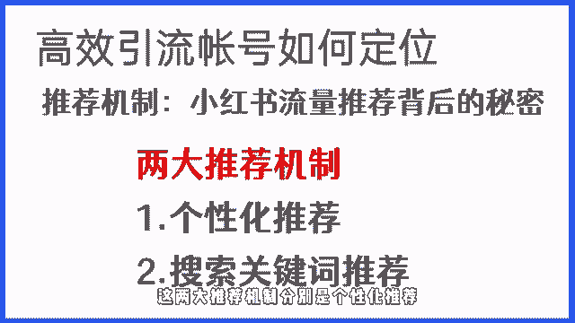

# 【2024版小红书体运营教程】全B站最良心的小红书开店运营教程！小红书体开店 起号真的快，赶快点赞收藏起来 - P2：第1节：小红书运营之账号定位上 - 听风的歌日记 - BV1mmvDeiENW

你好，欢迎来到可复制的小红书获客方法论，的正式课程第一节，接下来我们就开始课程的讲解，这节课我会先从小红书的流量入口开始，跟大家讲解，带大家迅速了解小红书平台的推荐机制。

最后再教大家一个快速做出高效引流，账号的定位方法，有很多的小红书运营者，在不了解小红书推荐机制，以及没有做好账号定位的筹备工作的时候，就开始瞎运营账号，导致账号播放长时间处于坐牢阶段。

流量怎么也都起不来，更别说引流了，账号都起不来，接下来呢我们就从推进机制到账号定位，逐一给你进行讲解，来帮你解决类似的问题，运用这节课所讲的方法，你也可以快速做出一个能够达到高效引流，涨粉的账号定位。

同时也能对爆款的影响因素有更深层次的了解。

想要通过小红书获取流量，首先我们就得搞清楚小红书的流量入口有哪些，哪些流量入口是我们需要重点关注的，进而能够更好的把精力放在，能快速见效果的流量入口，那么在这里的话，在左下角我放了一个后台的截图。

这是我在7月13号运营的一个账号的笔记，爆款数据图，在最下面，大家可以看到这篇爆款笔记的用户来源分析，从数据上我们可以清晰地看到，这篇笔记，有95%的流量来自于首页推荐，1%来自于搜索。

剩下4%来自于其他来源。

而这三个流量渠道，就是我们在小红书运营中，会经常用到的三个渠道，那我们一个一个跟大家讲，首先第一个就是首页推荐，也是小红书最大的流量入口，首页推荐是由关注页，地区页，发现页构成。

所谓关注页就是用户关注对应的博主之后。

博主发送的笔记会通过这个入口推荐给用户。

而地区业呢，顾名思义，就是我们所在的地区。

系统会根据定位进行同城的推荐，相较于发行业，站在引流的角度。

其实这两个首页流量入口几乎可以忽略不计，因为这两个流量入口，基本上给我们带来的流量并不多，但是发行业大家一定要重视，发行页，是所有流量入口里面占据绝对地位的流量入口，对于一个新号来讲。

发行业基本占据百分之百的流量推荐比重，而小红书的推荐机制，也主要针对的是首页的发行页进行的，那必须投一和抖音不同的是，小红书的页面采用的是双瀑布流，就是大家在这张图上可以看到的。

它是左右各一张图的这样一个类似，有点像瀑布的这种方式来展现的，这就意味着当我们的笔记出现在用户的发现页，用户是否会点击消费，我们的内容跟我们的标题，封面选题有直接的关联，而这一块内容呢在后续的课程里面。

我们也会着重的去讲到，除了首页推荐之外，搜索推荐和其他来源占比就比较低了。

所谓搜索推荐就是指用户搜索对应的关键词，然后系统会根据内容的匹配和活跃度，来进行综合的排序得出的排名结果，首页和搜索入口最大的区别是，前者主要是系统主动推荐。

而后者是用户主动搜索的结果，除了首页推荐和搜索推荐，那还有一个叫做其他来源，其他来源是指用户分享或者分享链接，直接打开的方式，特别是对于一个新号来讲，并不能在短时间让我们获得大量的流量。

所以这块就不重点讲了，后续会针对于搜索专门出一个加仓课。

教大家如何去优化以及的搜索排名，那讲完流量入口之后，接下来我们来讲一下小红书的两大推荐机制，弄清推荐机制，就能清楚的知道，一篇笔记是如何获得更大曝光的，这两大推荐机制分别是个性化推荐。

以及关键词搜索推荐，那我们逐一来给大家详细的去讲一下，所谓个性化推荐，也叫用户小号推荐，是指用户在正常浏览小红书的过程中，产生点击关注，评论，收藏停留时长，搜索的行为，系统会为用户打上对应的喜好标签。

会根据用户的喜好，标签为用户推荐相对应的内容，值得注意的是，每一个人其实身上可能会有多个标签，然后系统会根据大家的行为，会为大家自动的去匹配，这也是大家平时在刷小红书的时候，会发现我。

你可能单纯的只是为一个笔记点了个赞，然后那小红书就会源源不断的推荐，相关内容的原因，系统会去评估你喜欢什么，然后会根据你的喜好继续的给你推类似的内容，另外呢大家需要注意小数，除了用户喜好标签之外。

还有一个笔记标签，所谓笔记标签是指，系统会根据我们发布笔记的标题，封面文案以及内容的匹配，推荐给有对应喜好的标签，用户推荐给推荐给带有对应喜好标签的用户，通过用户的反馈来评估作品的质量。

那我们的推荐机制是如何运转的呢，在这里的话简单的跟大家去讲一下。

首先当我们发布一篇笔记之后，这篇笔记会进入系统审核阶段，笔记审核阶段通过之后呢，系统会在一段时间内，会给予100到200的基础播放量，然后根据用户的反馈，也就是刚才我们提到的用户产生的点击，点赞评论。

收藏停留时长等综合来评估，系统会根据用户的反馈评估笔记质量是否OK。

然后如果说达到了标准，就会进入下一个流量池，在这里值得注意的是，这上面我们提到了，当笔记审核通过之后，会有个基础推流，那这里的话有一个前提，账号处于正常状态，且发布的笔记没有任何的违规。

满足这一条件的账号，发布的作品一般会在3~6个小时，达到100到200的基础播放量，当然如果说你的内容质量OK，内容质量好，可能在20到30分钟就能够很快的突破，基础播放量，关于诊断账号是否正常。

我会在加餐课里面专门出一节课，教大家怎么去通过一些数据情况。

