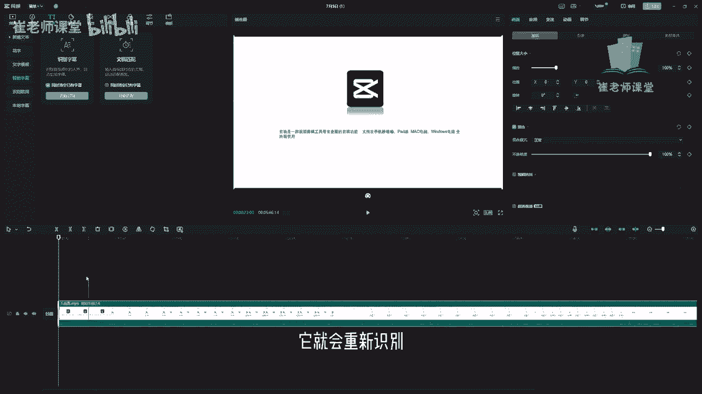
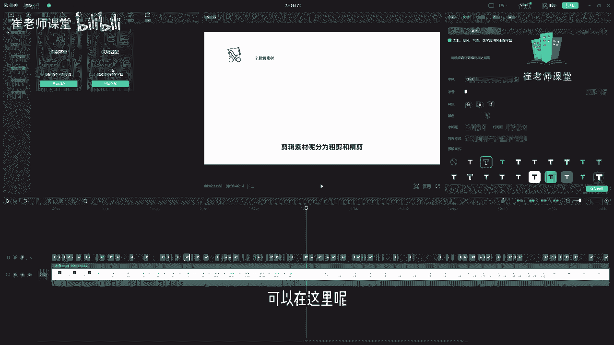

# 【2024版小红书体运营教程】全B站最良心的小红书开店运营教程！小红书体开店 起号真的快，赶快点赞收藏起来 - P30：28.字幕识别和歌词识别 - Sathenay - BV1uqHreLEER

OK紧接着和大家介绍一下啊，文本工具的其他的一些比较实用的功能啊，首先是智能字幕，这个智能字幕呢有两种啊，一个是识别字幕，就是识别当前视频中的人声，然后自动的生成字幕啊，这个功能是比较实用的。

也是比较方便的，另外呢还有一个呢是输入音视频对应的文稿啊，来自动匹配画面啊，比如说你有些文稿啊可以直接输入，然后它会自动的去匹配当前的画面，然后大家看一下啊，首先识别字幕，我们直接将一一个素材啊。

带有人声的这个素材我们拖进时间轴里面，然后选择文本工具，然后找到智能字幕啊，你会发现在这下面有个同时清空已有字幕啊，可以进行打勾，这个同时清空已有字幕是干嘛用的呢，比如说你已经识别了一些字幕。

但是有的是有些错别字啊，或者是有一些漏遗漏的东西啊，你想进行重新识别，你就可以把同时清空已有字幕进行打勾，它就会重新识别。

然后把之前的全部替换掉啊，这个需要大家注意，然后选择开始识别，稍微等待一下啊，然后他进行字幕识别。

其实字幕识别呢也是蛮准确的，但是因为我们的字体默认的是白色，然后默认的是系统文字，所以呢这个背景也是白色，看的不是很清楚，我们更改一下预设，可以看一下当前的这个效果来进行预览一下。

剪映是一款视频剪辑工具，带有全面，这是当前识别的字幕啊，也是比较精准的，pad端Mac电脑，windows电脑全终端使用剪映，既然是一款视频剪辑工具，OK如果发现有错别字呢，可以单击之后呢。

你可以在字幕里面，你可以直接你会发现你看把它切换到字幕啊，你会发现整个的都好像很简洁了，你就在这里挨个的去找错字，把它删掉，然后重新再进行修改，比如说这个字啊，假如这个字已经错了，你直接单击之后呢。

可以进行删掉，然后可以在后面啊直接进行更改，然后呢还有啊在这里进行新增啊，添再重新添加一个文本，你会发现在上面会自动添加一个文本的，这个层啊，就是轨道，然后可以在上面进行添加字幕啊。

嗯这些然后可以单击删除啊，进行删除啊，这个是比较方便的功能，嗯比较的去浏览一下字幕，有没有错字啊，或者是遗漏的字体啊，来进行啊，查找比较方便，同时呢在文本这里啊，可以进行设置当前的文本的基础的属性。

需要注意的是，如果你是自动识别字幕的话啊，你选中一个字幕，你把他的这个参数我进行设置一下，比如说预设样式把它改成黑色啊，这个描边是白色，然后里面是黑色的，然后你会发现所有的字体都会跟着变化。

后面会详细的和大家讲到，当视频素材剪来，因为这个剪辑啊，这个字幕啊它必须是统一的，对不对，比如说你突然啊这个颜色啊，是这个色的，你突然改成了这个颜色啊，就是很奇怪啊，这个剪映也非常体贴的啊。

去考虑到了我们的用户的一些需求啊，整个字幕只要是你自动识别的字幕，它就会啊你更改一个这个当前选定的这个字幕，它就会进行全部的进行啊，把后面的字体啊以及样式啊，还有一些位置啊，一些基础的嗯参数啊。

他都会进行更改啊，这是比较方便的啊，然后包括字号也是啊，只要是基础的啊，还有气泡啊，花字啊，只要你设置一个，只要是通过识别字幕的，他都会进行更改，Ok，还有呢就是文稿匹配啊，可以在这里呢额选择开始匹配。

然后在这里直接输入啊，或者直接粘贴里面对应的文稿。

就可以进行开始匹配了，来更加方便大家的使用，另外需要注意的是，在这里文本呢也可以设置一些动画的效果啊，它不仅仅是默认的，比如说你像这种剪辑素材呢分为粗剪和精简，那么啊直接没有任何的这种效果。

你可以在这里添加一些效果，比如说向上的重叠，当时你会发现视频素材剪辑完成之后呢，我们需要对它只是对当前的这个视频，按住CTRL键加鼠标滚轮键，你会发现有些变化，就是它只是对当前的选中的这个文本啊。

来进行了变化，这个需要大家注意啊，他不是这个和这个和刚刚基础的是不太一样了，它只是对单个的，比如你选中，然后设置当前的动画，我们你会发现一个箭头没有箭，有个箭头，然后它会进行啊直接设置当前的动画效果啊。

这动画效果呢有入场啊，有入场的动画效果，还有出场动画效果，比如说出场的动画效果，你会发现箭头是朝里的，就是类似于咱们之前讲过的淡入淡出啊，不过有不同的是，它是动画效果，有入场出场啊，有动画开始啊。

以及动画结束，还有呢动画的循环来进行，大家可以看一下，我们需要对啊，这样的这样的话就比较乱了啊，比较乱了，大家可以根据自己需求来进行选择啊，入场出场循环啊，因为这个字体呢它是比较短暂的。

它不像其他的这种特殊特效呃，或者是背景为辅啊，文字为主的这种啊，我们需要去多加一些文字的动画效果，来提升整个视频的这个层次感吧，但是这个字幕的话就不需要这么花里胡哨的，紧接着呢和和大家说的啊。

这个是动画，紧接着呢还有跟踪啊，可以进行运动跟踪，我们需要对啊，可以设置它的跟踪的方向，还有双向跟踪，从时间轴向右跟踪以及向左跟踪啊，后面我会重点讲一下这个跟踪啊，紧接着呢呃最常用的是朗读啊。

单击朗读呢，你会发现默认的就是我们视频的原声啊，就是我说话的这个声音，当前视频进行输出和包装，当然了你也可以变成啊比较甜美的声音啊，有的我觉得我声音不太好听的，可以叹气哈。

对诶这样的话就是不是我们视频的原声了，呃，我们可以根据自己的需求来进行选择，当前视频诶，怎么回事，剪映是一款视频剪辑工具，剪映是给大家看一下啊，大概效果啊，比如说我们从头开始啊，当前的开车朗读。

剪映是一款视频剪辑工具，就是我们开始预览一下单机，它是进行预览的，剪映是一款视频剪辑工具，还有新闻女生，比如说选择自己比较喜欢的啊，而且他有很多预设，你像之前老的版本是没有这么多的。

我记得之前在使用剪映的时候，版本是没有那么多的啊，但是随着剪映的更新呢，它会推出来好多种啊，这种朗读的预设我们可以进行选择，真赢了，剪映是一款视频剪辑工具，剪映是一款视频剪辑工具。

说选择自己想要的这种朗读的这种方式，可以选择开始朗读，他会稍等一下，然后呢你会把它进行拖拽呃，但是呢它只是对一个一个的素材来进行解说啊，剪映是一款视频剪辑工具啊，他会进行朗读。

那么你就把当前的这个视频原声没掉啊，需要注意的是啊，你如果不mu的，如果不mu掉的话，它是和这个视频的原声是撞的，它只是对当前的文本来进行朗读，它只是对当前的文本进行朗读，需要注意的是啊。

你也可以干嘛直接进行输入啊，比如说我新建一个文本啊，添一个文本在这里啊，然后比如说啊在这里直接输入，特别不要脸的给他输输入一个数字啊，OK输入之后呢可以啊，选择当前的这个文本的呃，取块之后呢。

可以在这里单击朗读啊，在这里选择自己想要的一键三连啊，预览啊，一键三连啊，然后呢单击开始朗读，你会发现它只是对当前的文本而进行开始朗读，一键三连啊，如果你想对所有的文本进行朗读的话。

比如说你自己数字输入好了之后呢，可以把它进行选中，直接拖拽进行选中，然后呢选择朗读啊，找到甜美啊，或者是其他的自己喜欢的朗读的风格，然后选择开始朗读，稍等一下，你会发现它会生成了好多这种音频。

就是他朗读的音频，我可以听一下，剪映是一款视频剪辑工具，带有全面的剪辑功能，支持在手机移动端，pad端，Mac电脑，windows电脑群，因为它毕竟是一种AI的这种呃语言。

它不是根据你的音频来进行提取的，朗读的模式啊，它是根据你的文字嗯，然后经过AI然后进行读取啊，嗯所以说就不是那么流畅哈，就是有点啊，可能会随着技术的更新，会能够更加就是更加丝滑吧。

更加像人说话更加的丝滑吧，然后呢这个就是文本的朗读功能了，需要注意的是，在这里也可以选择全部以及可商用的，可商用的话就是啊不限制版权能够进行使用，然后还有识别歌词啊，这个就比较好呃，这个就比较理解了啊。

你有些歌啊可以在这里选择开识别，就是你比如说你剪一些关于歌曲类的视频呃，那么你想觉得我在输入歌词我特别麻烦，特别浪费时间精力，那么在这里啊就可以选择开始识别，那么它和智能字幕有什么样的区别呢。

智能字幕呢比如说识别字幕，它是根据你的人生，我们大部分的人人声是没有伴奏的，你你要记住啊，比较人声是比较多的，但是歌呢你想一下嗯，一个歌也就是几分钟的时间，而且呢它是有旋律线的啊，他是有伴奏的啊。

他是有主主歌，副歌这个层次感的，所以呢你要根据需求，比如你歌的话，你就在识别歌词啊，如果是当前的是像这种解说类的视频的话，在这里选择识别字幕啊，在这里不和大家演示了啊，大家自己找个歌可以试一下，很简单。

然后在这里可以添加本地字幕啊，啊需要支持的文件格式有SRT，LRC和ASS这种字幕，这个需要大家注意的是呃，有些视频啊它是自动的可以导出字幕的。

你像我们剪映也可以进行导出字幕，我们选择导出，你会发现啊，在这里呢可以选择字幕导出嗯，可以选择SRT以及TXT嗯，有些它是进行能够导出字幕的，导入字幕的话嗯，然后再进行视用视频播放软件去添加字幕的话。

能够看得更加详细一些嗯。

这个需要大家注意一下，我们可以在这里选择直接添加字幕啊，就不需要直接输入了啊。

