# 【2024版小红书体运营教程】全B站最良心的小红书开店运营教程！小红书体开店 起号真的快，赶快点赞收藏起来 - P30：28.小红书爆款店铺打造步骤（10） - 快乐稳定发挥 - BV1AbtoebEjX

大家好，今天给大家分享的是小红书全方位分享的，第六大课时。

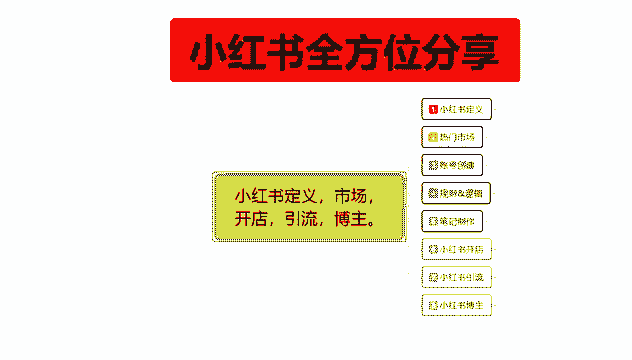

小红书开店的一个内容，这节课的话是给大家分享一下，我们这个小红书中期开店啊。

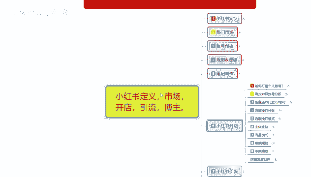

就是整体的一个中期规划，小红书中期规划的话，说实话你就是基本上已经开始碰到瓶颈了，你前期规划已经做完了以后的话，就是开始做笔记，笔记的话，然后开始做数据，数据做完以后的话，你基本上就开始慢慢的进流量。

然后每天发笔记就行，然后在这个里面的话，你除非碰到瓶颈，碰到瓶颈没办法进行提升，或者店铺一直在原地踏步以后的话，你就需要去做自己的中期规划，中期规划，这个里面的话就是开始计算。

我们小红书店铺里面的一个商品排名了，这个里面的话有一个综合排名分类，价格排名，销量排名，关键词排名会有个性化，搜索和动态pk与静态匹配啊，因为这六大点的话，说实话对于中期规划的朋友来说的话，你了解过的。

你基本上就稍微懂一点，如果说你不了解的话，那这部分内容的话，我因为内容太长了，我也没办法啊，完全的给大家进行分享，所以说很多东西我都是打出来的，你们看一下就可以好吧，主要是让想让大家了解一下。

因为你呃小红书开店，如果说你是新手玩家的话，说实话中期规划的话，有时候他不是自己能够解决的啊，因为你不了解的话，你没办法去自己学习，自己了解，除非说是你自己对这个东西很有研究啊，那你我打出来的。

那你就能看懂，如果说你自己没有研究的话，你自己想去研究的话，这不是短时间之内啊，自己能够了解的一个内容板块，因为他的一个属性值特别多啊。

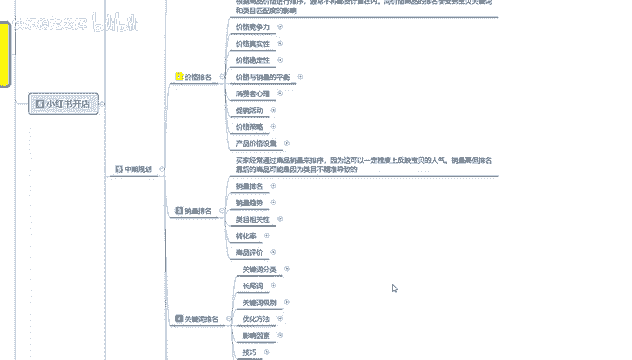

他和前期规划的话不一样，前期规划只要记住数据和笔记做得好，基本上都没什么太大的问题，但是中期规划的话，你就确实需要自己好好研究一下，然后只有指导的话更好，没有指导的话。

那你研究的话最少也要半年到一年的时间，你才能了解这个电商运营的一个系统整体规划，这个里面的一些名词啊，助词啊，怎么做排名啊等等，这些资料有人教的话，可能就会稍微快一点啊，我们先了解一下综合排名分类呃。

综合排名分类的话，这个就是默认的一个跑宝贝排名的一个状态，主要的话就是根据店铺的一个综合因素对跑，对你的账号里面商店产品进行排名，他这个每一个数据量啊，就是账号是一个排名，店铺是一个排名。

产品又是一个排名，他们综合起来才是你的店铺权权重，你比方说有账号排名，没有店铺排名，没有商品排名，那你只有账号选中你的笔记发出去的时候，可能会获得咳一部分的那个展示，展示就是技术曝光值会高一点。

如果说你有那个店铺排名，那就是用户搜索的时候，你的排名可能会靠前一点，如果说你是商品排名，商品排名的话，那就是在啊小红书商品里面有一定的地位权重，在那个里面的话就会有展示机会啊。

他的本质基本上都是差不多，但是它所展示的位置和效果是不一样的，额排综合排名分类类的话，他这个里面的整体排名分类是12项，人气销量信誉价格下架时间，标题优化转化率，收藏率，回头客的一个比率。

然后就是好评率和交易笔数，最后呢是物流和服务体验，这个是综合评分，但是这个里面的话呃，我给大家列出来了，它是整体排名，对小红书，对于你账号店铺和商品直接有影响和观点的，基本上都在这往下面看到。

就是说价格排名，价格里面的话，排名它又分为很多的一个小项类目，就是说每一个选项你做到位了，他就会加分，你做不到位的话，那就是平平平平淡淡，基本上就是不加分，如果说你做不好，那可能还会减分。

这个里面价格排名的话，你包括价格竞争力，价格真实性，价格的一个稳定，价格与销量之间的一个平衡，然后消费者心理促销活动，价格策略和产品设置。

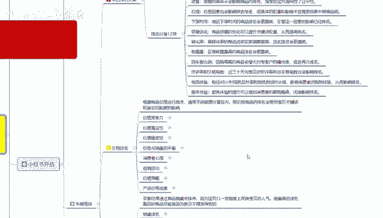

这些都是你中期所需要了解的一个整体，价格排名，册子内容是很多，但是说实在的啊，你了解一下，你就对于网络运营了解的更深入一点啊，过多的内容呢我就不讲解你们，如果说啊正在这个阶段的去了解一下，我这内容的话。

我基本上都给你们打出来了，但是怎么理解的话，就看你们自己好吧，然后价格排名之后呢是销量排名，他们综合的，他们没有那个先先后顺序的，基本上都是一样的，就是说你不管是价格排名也好，销量排名也好。

关键词排名也好，没有先后顺序啊，都是综合性的，然后的话关键词排名可能会靠前一点，然后先关键词，然后是销量，最后是价格，但是他们都是单独计算的，只是说关键词带来的属性增益更大啊，销量排名和价格排名的话。

额带来的属性的话就偏小，但是销量排名偏大是偏大，但是他不好做啊，价格排名的话就稍微好做一点，最难做的话就是销量排名。

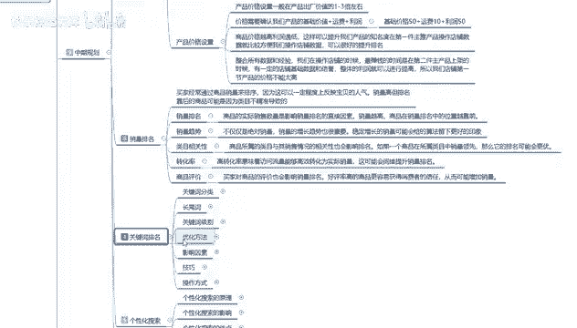

这个里面的关键词排名啊，你关键词排名的话，分关键词你也要分类，然后的话是长尾词，关键词优化方法，影响因素技巧和操作方式，这里呢我都是给大家列出来了啊，你们如果说想了解的话，想深入了解。

我其实有单独的课程专门讲过这个里面的内容，因为它的内容太多，我在这呢，这因为这个是整个大课时，我就不给大家做叙述了，有的小课时的话，我分享里面的话，其实都有这里面的一些技巧，你们想了解的话啊。

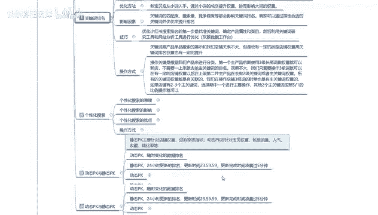

就去自己去搜一下，基本上都能搜到啊。

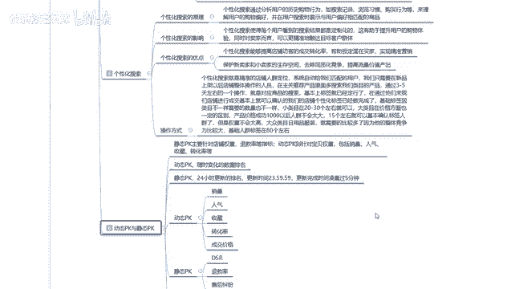

个性化搜索和那个动态pk和静态pk的话。

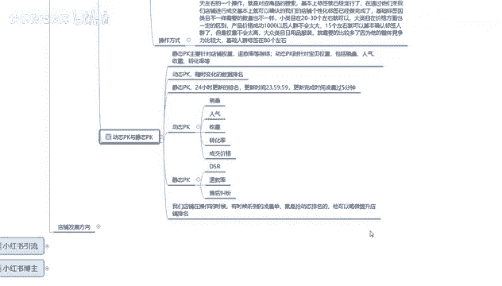

这两个的话你们暂时不需要去了解，因为他的话呃，涉及到对同行店铺的一个竞争增强啊，属于中期里面的境界或产品，你如果说前面几个点你不了解的话，你后面两个点你根本就看都看不懂啊。

你只有了解前面几个点了以后的话。

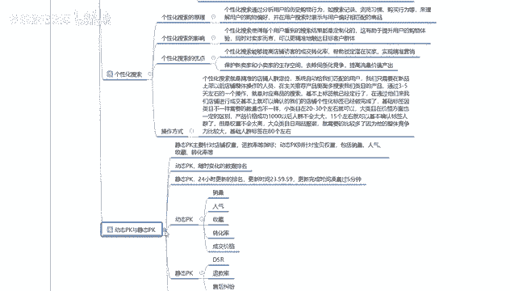

你才知道什么是动态pk和静态pk，还有个性化搜索，那这一节分享呢主要是让大家了解一下，我们在这个操作小红书店铺中期的时候，我们所需要注重的几个重点，第一个呢我们先了解呃。

整个综合排名分类有哪些内容能做的，先做了，然后呢去优化我们的一个价格排名，销量排名和关键词排名优化这三个点以后做完，然后再去做个性化搜索，个性化搜索做完再去做动态pk与静态pk，这一整套做下来的话。

你基本上中期规划啊，就是你产品的上限了，什么意思呢，就是说你把中期规划做完以后的话，你包括后续你再去操作其他的啊，基本上就都有思路了，最后一堂课的话就是小红书开店里面，最后一堂课啊。

店铺的一个发展方向呃，这个内容的话其实你们目前涉及不到它，整体的话就是你店铺改变形式什么意思呢，你中期规划的所有属性基本上做完以后的话，你到最后的一个店铺发展方向只有两步，第一个是开新店，就是多电模式。

做电模式的话，你就可以去准备开第二个店了，就是第一个主产品已经做包以后，你准备去开第二个店了咳，如果说你是单店模式的话，那你就加大推广力度，开始做付费了，因为你把中期规划做完以后的话。

你的店铺基本上都已经到达第五层级，接近第六层级了，或者说是在第四层级往第五层级走，那就是你的中期规划没做完，中期规划做完以后的话，你的店铺数据上升以后的话，你基本上都可以从第五往第六迈步。

第六成绩迈步以后的话，你就只能加大投入力度啊，网10万粉丝10万的一个小眼睛数量往上走，不然的话，你基本上都缩在中期规划这个范围之内，就是说店铺发展方向就是一个加大力度，然后一个开心店加大力度里面的话。

你就是呃做数据分析，数据掌控店铺的一个分析，店铺的一个优化数据维护，然后呢是瓶颈突破，瓶颈突破的话就需要开始做付费了，这个时间段你就要开始做付费了，小红书的付费的话，你就要开始啊抢占市场。

就是说你在这一板块里面的话，整体数据已经是非常优秀了，非常优秀的话，那里面还有很多的一个同行，同行的话，你前期已经开始做静态与动态pk，这个时候的话，你就是要加大的。

加大对动态pk和静态pk的一个影响力，然后的话再通过给自己买保险，什么意思呢，就是开始在小红书上面充值，做额付费推广，通过这种方式的话，来确定自己整个店铺的一个规划和发展，这个呢就是小红书开店啊。

整体的话就是啊自己怎么做账号，怎么找对标，包括技巧也给大家分享了，后续的话就是啊小红书的一个引流和博主，小红书引流和博主的话其实和开店差距不大啊，它的一个内容的话也比较偏少，只有前期和笔记两相结合。

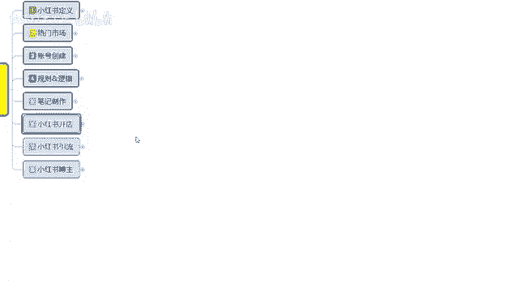

就是小红书引流和博主好吧，那这一节呢就给大家分享到这。

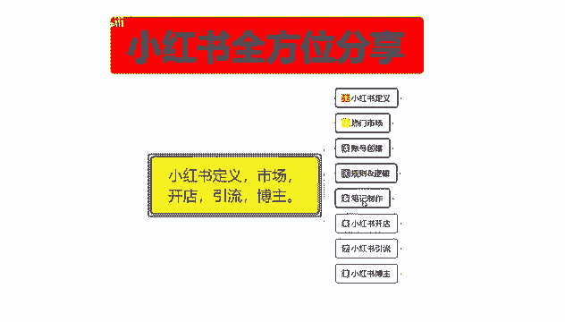

下一节开始呢。

