# 【2024版小红书体运营教程】全B站最良心的小红书开店运营教程！小红书体开店 起号真的快，赶快点赞收藏起来 - P31：29.小红书账号引流方式（1） - 快乐稳定发挥 - BV1AbtoebEjX

大家好，今天给大家分享的是小红书全方位分享的，第七大课程小红书引流的一个内容，就说这一期的话就是呃怎么说呢。

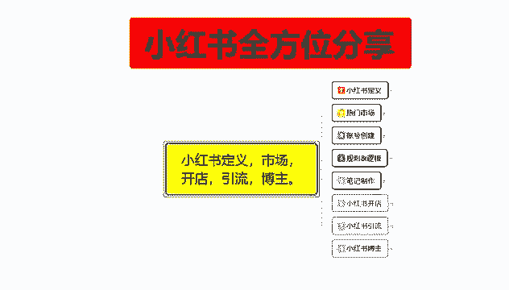

主要是教大家啊，怎么把自己的一个小红书引流账号给操作明白，当然了，这个是主账号，不包含我们的一个小号做评价引流的，因为小号的一个评价引流的话，说实话不在这个小红书引流配套课程里面。

那个的话你要需要去做矩阵，有资源的去做做矩阵，如果说你没有资源的话，你随便找两三个手机多建两三个的小红书号啊，自己艾特以后的话，去评论区做评价，就可以啊，这个的话不在我们的一个小红书引流。

主题课程里面啊，因为主题课的话，我这边只给大家讲，大家需要了解的一个主账号的一个设置，这套课程的话就是分为六个阶，六个小节的一个课时，第一个呢是账号设置，第二个是对标账号分析。

第三个呢是笔不笔记的一个发布时间，第四个是私域引流，第五个呢是在小红书上面，怎么用这种引流模式去变现啊，第六个的话就是通过小红书变现，五和六的话其实是一体的，只是看你自己怎么去利用。

我们先来了解一下这个账号的一个设置。

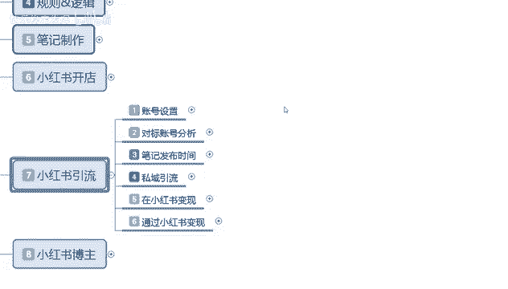

小红书账号设置啊，我这边的话是给大家截了两个图，但是我们可以暂时不看，我们先看一下这个简介，简介的话基本上，小红书开店是差不多的，但是他的一个成泥和测试方式的话，我们要稍微啊变更一下。

因为他有些设置的话是小红书开店，他不涉及到的一个东西，实验室称泥要有特色，能够让粉熟知的话，快速牢记，不要生僻字，第二个呢就是简介，可以概括自己的一个更新方向，和专业的一个背景，也就是背书啊。

图像要有识别度，展现自己的形象和风格，可以用真人照，这个的话基本上和那个小红书开店是一样的，然后封面美观且有设计感，然后突出主题和关键字。

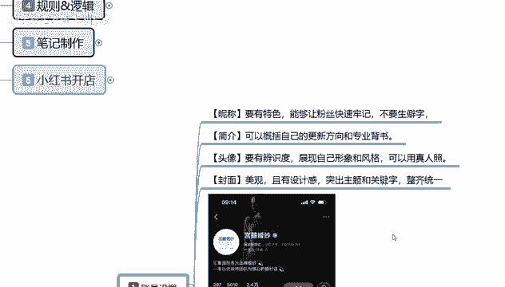

整齐统一就可以了，这个的话基本上都是一样的，但是后面的这个内容。

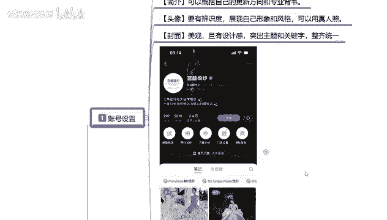

你们大家可能的话不是比较熟悉。

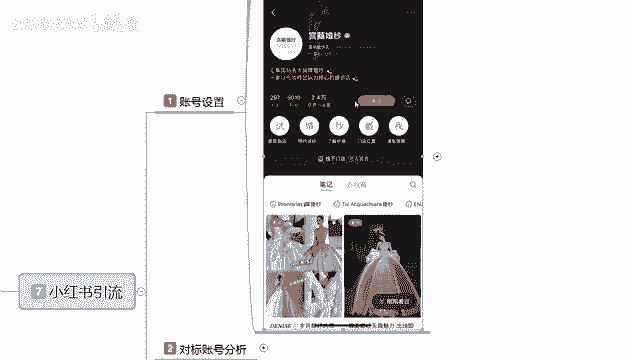

这个呢是我在小红书上面直接做的搜索，因为的话我自己测试过的，但是呢没怎么用啊，如果说你在小红书上面要去做引流，那你的一个封面结构的话。

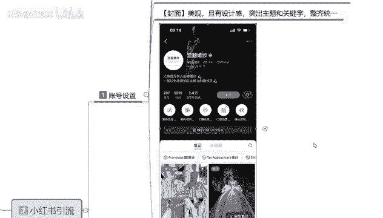

必须要像这样，这个呢你们可以自己去搜啊，基本上都能搜到的，什么意思呢，你不管是做任何方面，任何渠道的一个引流，你包括我们那个小红书开店也能用到，但是他的一个整体效果的话，肯定是没有做引流的一个效果强的。

首先第一个点是名称对吧，名称下厚的话是店铺自己所属产品的一个介绍，这个小红书号我们就不用去管它了，IP所属地的话属于荷兰，当然这个是别人的，不是我的啊，然后的话介绍自己的一个文化流程啊。

汇集国际各大品牌的一个婚纱，然后的话是以宜家化妆师为团队，核心的一个婚纱店，当然这是别人店铺，只是说拿他的店铺做个介绍给你们，大家看一看，这里面的话。

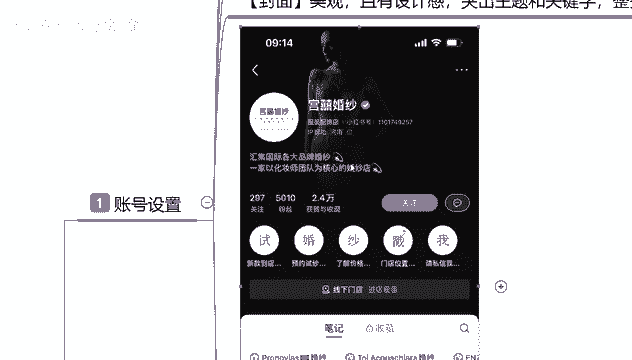

这上面其实就是我们刚刚所说的村里简介，头像和封面。

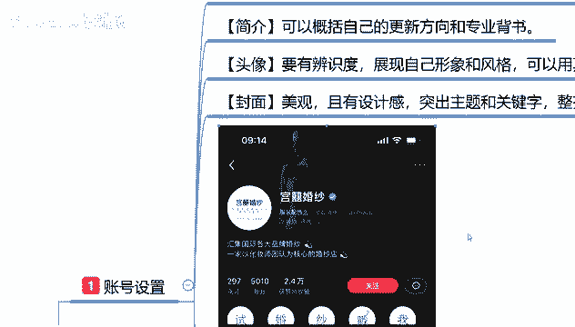

它不是重点，重点的话是在这，重点是这五个字，看见没有，四婚纱戳我这五个字，这里面的话点进去，他这里面下面再看新款到店啊，预约式婚纱，了解价格，门店位置，然后私信我，这就是他自己所涉及的一个引流方式呃。

设计的话说实话不算太隐秘，而且是非常正常的，基本上如果说你想了解这一部分内容的话，你点进去，他都有教你怎么去把流量引流到其他地方去的，一个方式啊，就看你们自己怎么去设计呃。

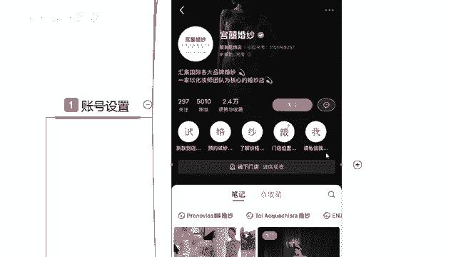

这个的话设置方式的话也是比较简单的，后面我再跟大家进行讲解。

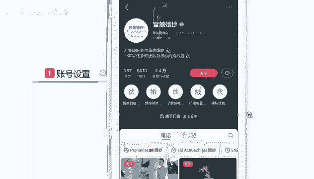

大家只要是看一下他这种方式，你去做引流的话，你的笔记发出去以后，如果说别人点进你的这个笔进行观看，你有这方面兴趣，想了解的基本上都会去看，就说我们本来做小红书，你做引流的，你就在这个方面的话。

就已经领先了别人很大一部分啊，而且这种的话他那个不算违规，算擦边啊，你不要太过分，然后的话直接拿私信啊，微信之类的东西啊，在聊天里面去涉及到的话，基本上没有太大的问题，让别人想方设法的啊来添加你。

那基本上如果说对这种东西，也都是非常感兴趣的，你自己分享的内容啊，我这只是拿了一个示范自己分享的内容，感兴趣基本上都会去找你。

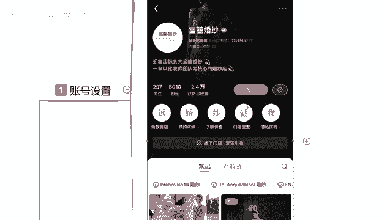

后面这几个呢其实也是一样的啊。

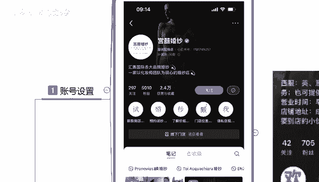

啊西服，就是说因为我是在这个小红书上面，查找资料的时候，看到这一部分的话啊，觉得他的一个设计感官还可以，然后的话下面这些你不管怎么去操作，因为你们大家可以观看一下，它的一个整体粉丝数量，或赞。

或者说是关注的话，其实比较一般，但是他们账号没有被禁封，能搜索得到，那么就代表这个方式是可以操作的，下面这个也是一样的啊，欢迎来打卡啊，时尚先生企业形象，婚礼服饰，这个的话就是变相的对自己的一个账号。

进行了二次宣传，包括下面这张截图也是一样的，咨询请关注私信啊，据说让用户主动私信联系你，你然后再通过其他的方式去添加他的一个私信，去自己聊，让他主动提供联系方式，懂我意思吧，也是一种小红书，怎么说呢。

引流的一个方法，就说按照这种方法去做的话。

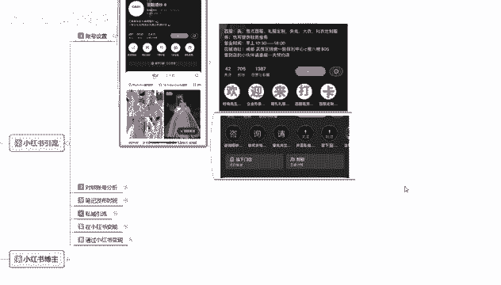

我们的一个账号设置你基本上就已经完成了，包括里面的啊名称简介对吧，然后头像最后的话就是你的封面的一个背景，设计，对比及设计以后的话，你再带上自己的一个企业文化的一个介绍。

最后呢是个人联系方式最重要的一个点，因为你做本来就是小红书做引流的，那你的个人联系方式的话就是最重要的啊，这个设置的话其实也是比较简单的，你们如果有兴趣的话，可以去了解一下，一搜就能搜到。

那这节课呢就给大家分享到这，主要是让大家了解一下你小红书里做引流啊，怎么去做，在什么地方去做私信引流，了解这个是我们个人的一个封面设置。

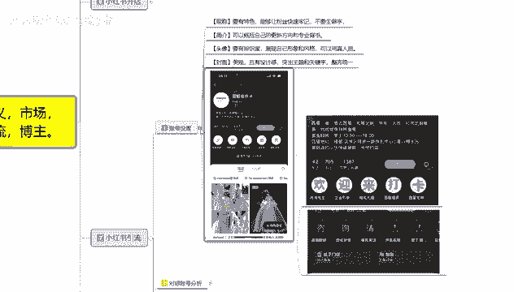

后面的话还有一个对标账号分析，对标账号分析的话，其实和那个小红书开店差不多，但是整体来说的话呃，下节课再给大家详细的讲解一下，因为你的一个对标账号分析的话，和那个淘宝店的一个对标账号分析。

虽然说是差不多。

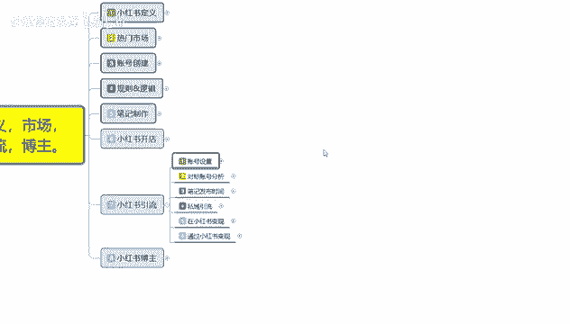