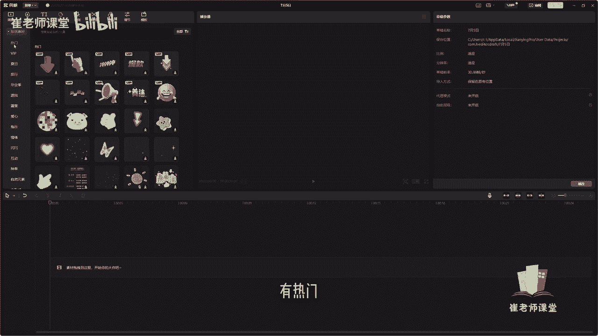
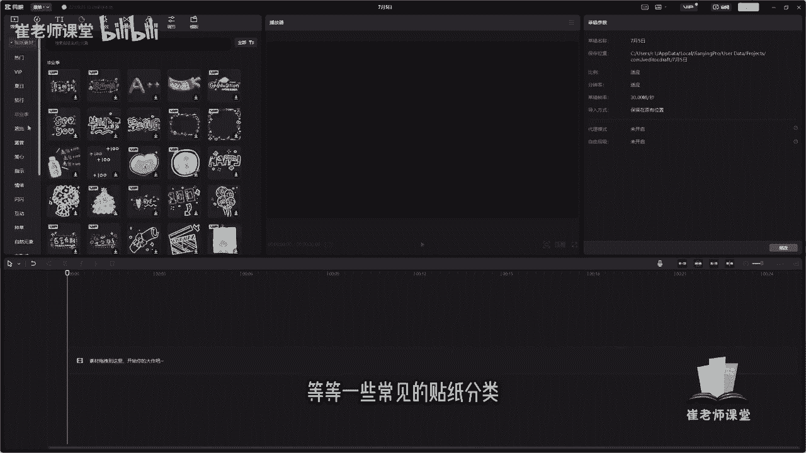
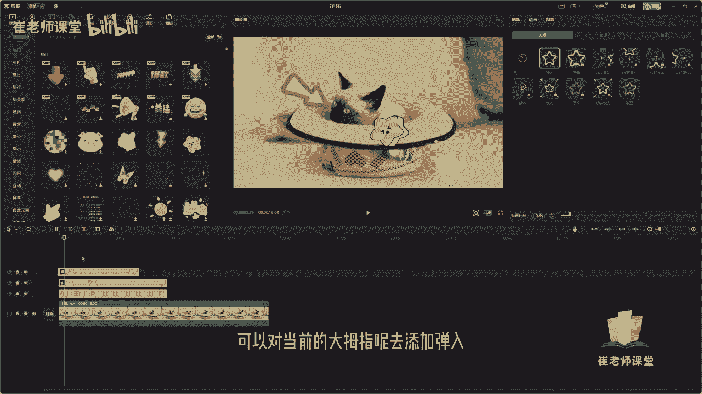
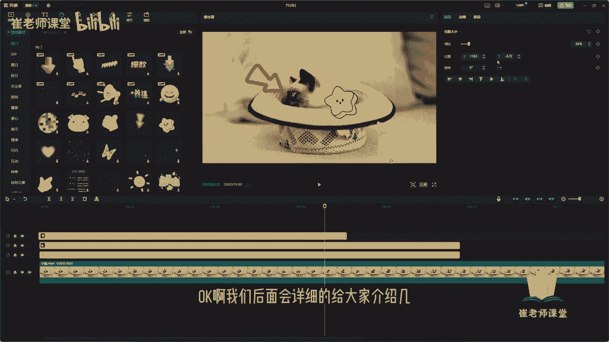

# 【2024版小红书体运营教程】全B站最良心的小红书开店运营教程！小红书体开店 起号真的快，赶快点赞收藏起来 - P31：29.贴纸效果 - Sathenay - BV1uqHreLEER

OK紧接着我们讲一下贴纸啊，在顶部工具栏当中呢选择贴纸工具，可以在这里找到贴纸素材的分类，你会发现在贴纸的分类素材当中呢有很多啊，提供的有热门啊。

这些内容可以单击啊进行下载使用，然后呢还有VIP啊，以及夏日旅行，毕业季等等一些常见的贴纸分类。

我们选择媒体，将当前的视频素材呢导进时间轴当中，选择贴纸，在这里呢对其进行添加，想要的贴纸的一些效果啊，比如说找一个啊这个形状吧，我们可以直接拖拽到时间轴，你会发现它会自动建立一个贴纸的这个轨道。

可以调整当前贴纸的播放时间，可以选中当前的播放面板呢，可以拖拽调整当前贴纸的位置，以及它的大小，以及它的角度可以进行旋转，也可以呢直接在这里啊调整它的缩放比例，可以移动滑块来进行调整。

也可以呢在这里输入它的位置啊，比较准确的位置来进行调整，也可以在这里直接输入它的旋转角度进行调整，同时呢可以对它进行啊对齐方式有所对齐呀，水平居中对齐啊，以及右对齐啊，还有顶对齐啊，垂直居中对齐啊。

底对齐啊等等进行分布，但是我更建议大家，你就根据自己的工作习惯，你可以直接拖拽啊，这样的话使用起来可能会更加方便一些呃，如果你需要去呃做一个类似的模板的情况呢，就可以在这里嗯把所有的位置进行统一啊。

进行多个视频来进行统一的使用，需要注意的是啊，直接单击当前的贴纸轨道呢，也可以在这里进行剪切啊，比如说分割向左拆借，向右拆借以及删除，还有什么镜像啊，你可以单击。

你会发现它的镜像的方式就是类似于这种形状，也可以呢进行贴纸啊，进行叠加，咱们可以把当前的这个贴纸动画直接拖拽进来，把它进行拖拽到这个箭头的上面啊，他又新建了一个这个贴纸的轨道，可以调整它的时间。

你会发现当前的贴纸能选中它，当前的轨道之后呢，可以对它进行调整，调整大小以及角度，你会发现它可以两个贴纸印同时播放，同时呢也可以再去叠加一个贴纸的轨道，这个可以根据自己的需求注意啊，就不要太乱就好。

然后可以进行同时进行播放啊，这就是贴纸的效果啊，大致就这么多功能，当然也可以进行添加关键帧啊，来加一些动画的效果，后面也会给大家讲到，然后整体的效果好像就这么多，需要注意的是呢。

在这里呀可以对当前贴纸增加一些动画的效果，比如说入场动画，出场动画，循环的动画给大家看一下啊，可以对当前的大拇指呢去添加淡入。

你会发现当当前的这个贴纸轨道当中，会有一个箭头的形状啊，就是入场的这个动画，然后呢可以设置它的出场动画，大家可以注意一下这个当前的这个贴纸轨道，它的末端啊，出场的位置可以选择添加一个效果啊。

这个呢可以根据需要来进行选择，然后以及呃循环的动画可以进行添加，然后呢也可以设置跟踪啊，有运动跟踪来进行调整，OK啊。

