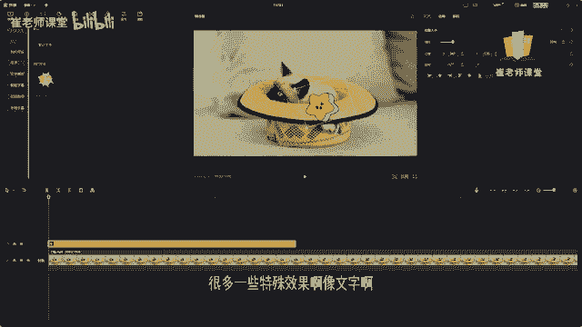
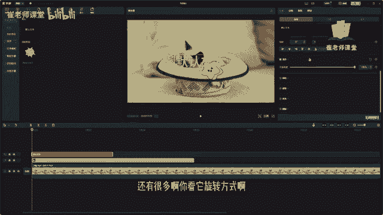

# 【2024版小红书体运营教程】全B站最良心的小红书开店运营教程！小红书体开店 起号真的快，赶快点赞收藏起来 - P32：30.关键帧 - Sathenay - BV1uqHreLEER

给大家讲解一下这个关键帧的使用啊，咱们很多一些特殊效果啊。

像文字啊，像文字的颜色啊，还有很多啊。

你看它的旋转方式啊，以及特效啊，都可以去添加这个关键帧，这个关键帧呢，其实和flash当中的关键帧是很相似的，我们可以增加一些动画的效果，我们先以这个小星星为例啊，如何添加关键帧呢，首先啊你可以发现啊。

在这里添加关键帧有很多方式，有位置的关键帧，有旋转的关键帧，有缩放的关键帧，咱们以缩放的关键帧来举例啊，呃基本上都是相似的，如何进行添加关键帧呢，首先在时间轴当中呢选择一个帧的位置，比如说在这里啊。

第一帧处也就是零秒处，我们选择添加关键帧，需要注意的是，当前的缩放比例呢我们更改为50啊，是这个样子，然后呢在这里添加一个关键帧，默认的啊就是当前的50，然后呢我们选择第两秒处啊。

当前的帧两秒处我们选择在缩放这里啊，添加关键帧，单击之后呢，我们可以将它的大小稍微变大一点，比如说80%，OK紧接着呢在第四秒的位置呢，我们再去添加一个关键帧，你会发现啊添加关键帧之后。

它会变成一个菱形的这个形状，对不对对，如果显示出来这个样子啊，就证明说我们已经添加了关键帧成功，然后呢在这里啊设置比如说50吧，换成原来的样子，来我们看一下当前的关键帧，它的大概的效果，我们进行播放。

你会发现它会一点点变大，然后再会一点点缩小，为什么呢，为什么呢，因为在这里啊我们调整的是80%啊，在这里调整50%啊，它的关键帧的作用呢就是一点点的，随着他的变化来提供它的运动的方式啊。

