# 【2024版小红书体运营教程】全B站最良心的小红书开店运营教程！小红书体开店 起号真的快，赶快点赞收藏起来 - P33：31.小红书账号引流方式（3） - 快乐稳定发挥 - BV1AbtoebEjX

大家好，今天给大家分享的是小红书全方位分享的，第七大课。

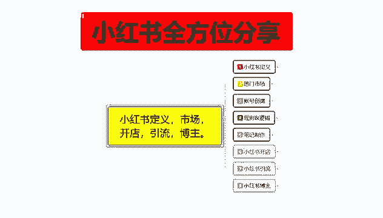

是小红书引流的一个内容，额，这节课的话给大家分享一下，小红书的一个变现方式啊。

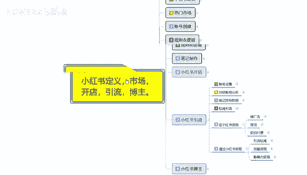

你不管是做引流，做博主，基本上都是靠这个变现方式去操作的，小红书变现方式其实很简单，在小红书变现的话，你就是无非接广告带货，然后呢自私付费，第二个呢就是通过小红书变现，都通过小红书变现的话。

你说实话就是私域引流引流，把用户引流到私域，然后自己去做做沟通，做成交之类的，然后的话就是技能变现和影响力变现。

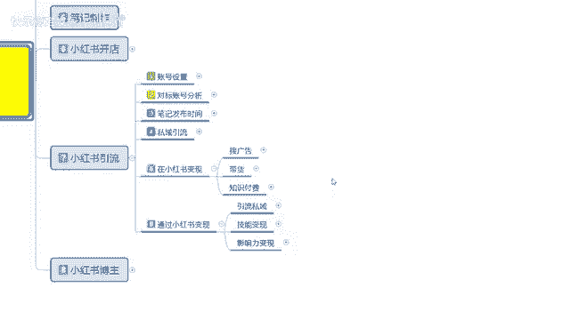

首先是接广告。

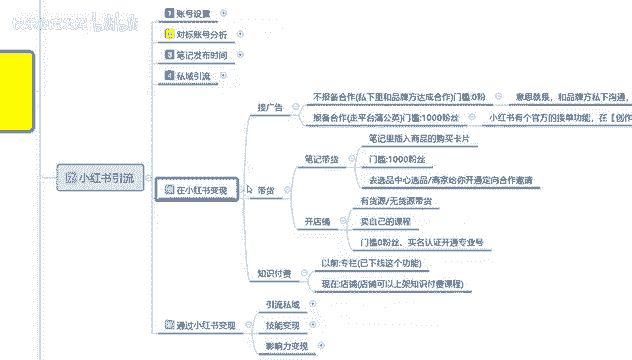

啊接广告，这里面的话有一个不报备合作，就是私下里面你自己去和品牌商去做沟通，然后的话嗯达成合作门槛的话就基本上没有，就是你自己做了以后的话，别人给你多少报酬，你就拿多少报酬就行了。

就相当于是一个打工的嗯，意思就是说你和品牌方私下去沟通，私下达成合作，私下完成转账收钱这种事情，然后的话你只是帮他在那个小红书上面，做一下推广，这种的话说实话效益工资不高啊，这纯纯打工的工资不高。

就是说你自己有办法的话，你去跟别人聊的话，工资可能就会高一点，第二个呢就是报备合作走平台的一个蒲公英，然后的话门槛是1000粉丝，但是嗯这种粉丝的话，你说实话就是拿笔记，然后去做推广别人的一个东西。

他的需求量就是你在小红书上面，你有1000粉丝了，你就能接，但是你能不能接到就是另外一回事了，而且还要看你的人群符不符合别人的一个需求，然后他这个里面的话就是拿提成，按按提成按进入的一个访客去聊的。

你基本上1000粉丝，你去做这个的话很难拿到项目，你粉丝如果说多一点的话，项目就会好一点，1000粉丝你去做的话，一个月弄个几千块钱，可能稍微简单一点，但是你想弄多的基本上就弄不到了啊。

据说小红书有个官方的一个接单功能，在那个创作中心里面啊，内容合作那边接单，粉丝门槛啊，最低粉丝门槛是1000，但是具体的话你还看自己怎么去操作。

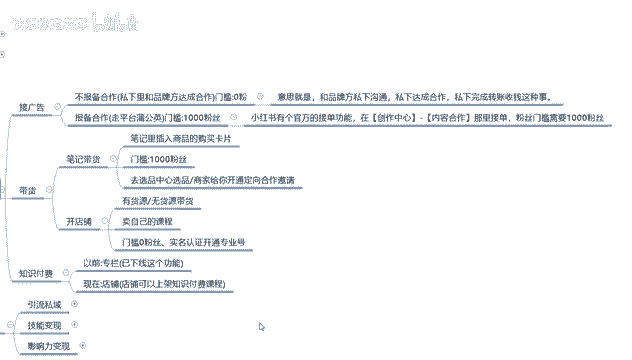

第二个呢是带货，带货的话，这个里面就是笔记带货和开店，开店的话就是无货源的一个自己开店，就是一件代发，然后自己去卖，或者说自己卖课程啊，比方说什么钢琴课，美工课啊，PS呀等等之类的，你不行的话。

你再教别人怎么化妆之类的都能卖，你把它录成视频以后，直接在小红书上面去发虚拟虚拟产品，然后的话虚拟课程别人购买以后的话，你把视频发给别人，然后做成交就行，就是说这种的话是没有粉丝门槛的啊。

你就看你自己的推广做的怎么样，上面的笔记带货的话，就是笔记里面插入商品的一个购买卡片，或者说是在商品里面直接去呃，通过方通过自己的话术啊，文字啊之类的描述你想宣传的一个广告内容，门槛也是1000粉丝啊。

去选品中心选品，然后的话商家给你开通定向合作，这个里面的话商家你能给商家引多少流量，然后看流量的一个点击率和转化率，获得那个额资金，第三个就是付费知识，付费知识以前的话小红书是有个专栏的。

但是现在的话基本上就没有了，现在基本上都是店铺，店铺的话就是说上加了个付费知识的一个课程，就是开店铺里面啊，自己无货源，无货源，开店无货源，开店以后的话自己卖课程啊，就这三个方式，这个就是在小红书啊。

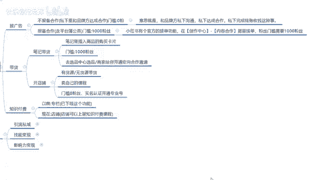

通过小红书这种流量渠道的话去变现，第二个呢就是呃通过小红书变现做私域引流。

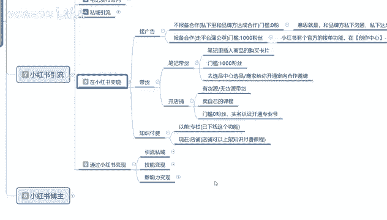

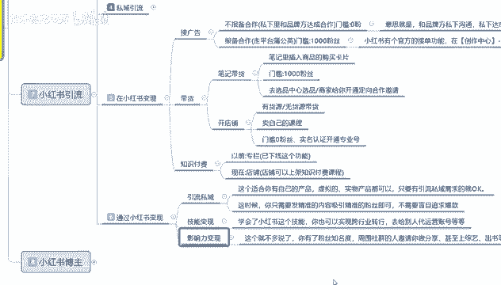

什么意思呢，就是说这个的话适合你自己的产品，然后的话或者说自己这边有公司，想做那个小红书私域引流，然后的话不知道有什么渠道，就按照我教大家的这种课程方式，你先把账号设置，账号设置好以后的话。

直接去发笔记，笔记好了以后的话，然后通过那个呃私域引流的方式，私信呐对吧，短信啊，小号艾特人呐，群聊啊这几个方式，然后的话直接把流量引到自己的一个群里面去，就行了，引到群里面以后的话。

你就按照自己的一个操作思路或者操作模式，然后再去和用户群聊，这个就是引流，把流量的话引到别的地方去做成交转化，通过这种方式你去做转化的话，就是避开了小红书官方的一个交易平台，就是通过小红书方式的变现。

第二个就是技能变现啊，技能变现的话就相当于是你在小红书上面嗯，啧怎么说呢，你自己有一技之长，你比方说你会些什么东西啊，然后的话通过这种私域引流的方式啊，自己收学员，收学徒啊，或者说是啊教别人怎么做呀。

私教老师啊，教英语啊等等，这些都是可以的啊，你也可以实现跨行业的一个转行，就相当于是你在小红书上面给自己打广告，然后把自己推出去，然后有人来找你，想学习你这一部分技能，你教别人怎么做，付学费就行了啊。

当然了，你要学我这个课程学会了，去给别人做代运营也是一样的，但是就看你自己能学多少东西了啊，最后一个是影响力变现，影响力变现的话，这个是博主的啊，这个就不多说了，这个因为他是博主的一个内容嗯。

你网络博主，你自己的一个账号有个几万粉丝以后的话，你都不用自己去宣传，别人都会来找你的，让你帮他推广告，推商品啊之类的对吧，有名气以后什么都好做，没名气以前你只能自己默默无闻的再来爬。

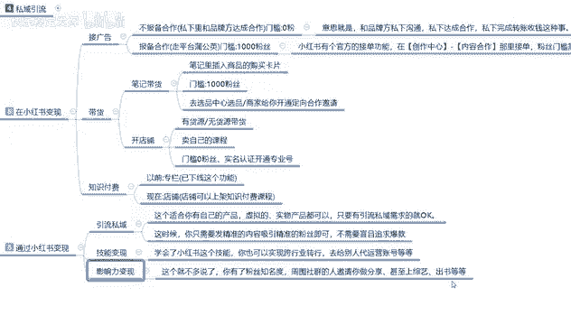

这个的话基本上说你不管是做小红书也好，做抖音也好，基本上都是这样。

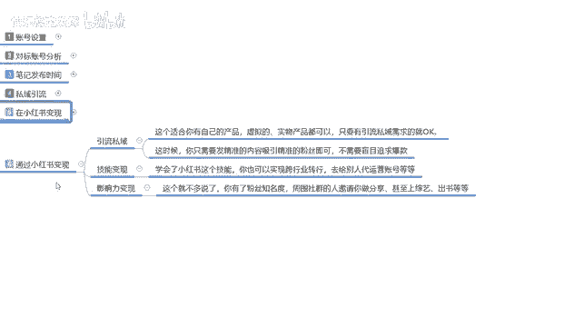

那这节课呢就给大家分享到这额，下一节课开始呢讲解最后一个大点的内容。

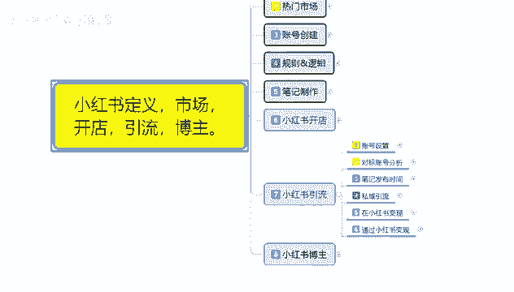