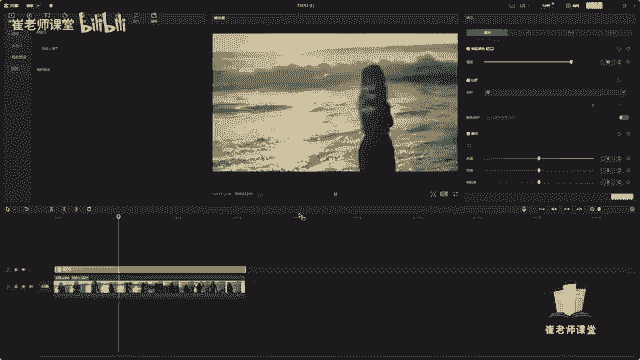
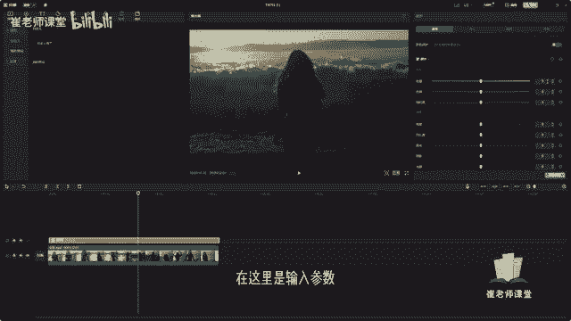
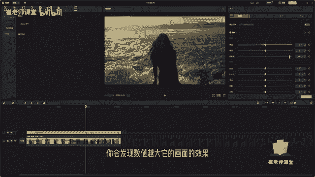
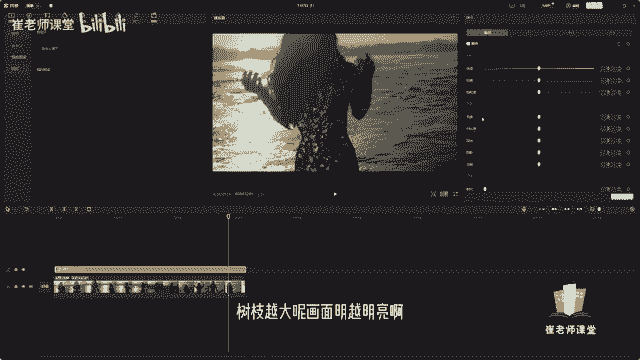
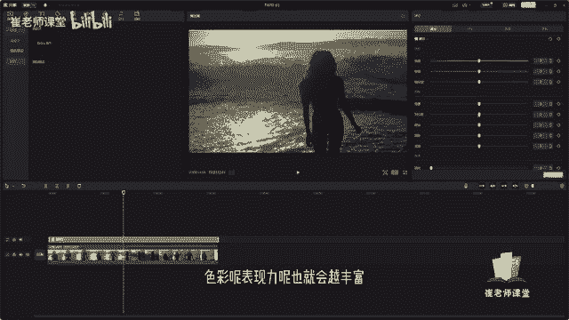
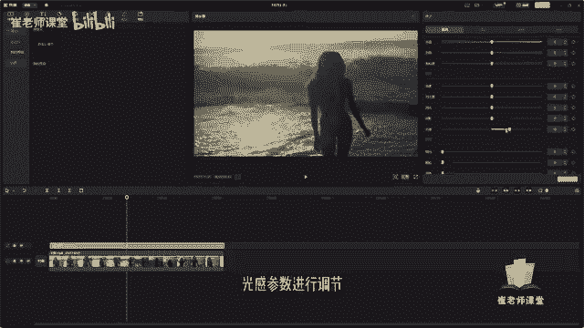

# 【2024版小红书体运营教程】全B站最良心的小红书开店运营教程！小红书体开店 起号真的快，赶快点赞收藏起来 - P33：31.滤镜和调节 - Sathenay - BV1uqHreLEER

紧接着呢和大家讲一下，如何调整素材的画面的颜色，在很多视频剪辑软件当中呢。

有一个比较好用的效果，就是滤镜。

我们将素材拖进时间轴里面，在上方的工具栏当中呢可以找到滤镜工具。

单击之后呢，你会发现它会提供给大家很多种预设，这个滤镜效果呢，可以说是现在很多视频编辑软件，必备的一个亮点，我们可以通过添加滤镜的效果呢，可以很好的掩盖，由于拍摄的画面来造成的一些缺陷。

也是对一些不是很懂得调色的同学们呢，来提供的一种比较好用的一个工具啊，它类似于于这种常用的预设，就不需要大家去自己进行调节画面的像亮度啊，饱和度啊，色温啊，而是将经常用到的来做成一种预设的方式。

来给大家进行选择啊，这个滤镜呢如何进行使用啊，大家找到顶部的滤镜工具栏，找到分类，你会发现好多分类啊，有精选，有VIP的啊，有风景类的，如果你的当前剪辑的视频的素材是风景类的。

我们可以在这里直接找到风景类的滤镜的预设，可以进行使用，如果你拍的是美食呢，可以在这里啊找到关于美食的很多种滤镜啊，这种预设来给大家进行使用，还有夜景啊，风格复古胶片啊。

这种滤镜呢提供了很多种常见的预设，对于不懂调色的小伙伴来说啊，是非常友好的，在这里呢我们找到的当前的视频素材呢，它是什么，它是人物，对不对，我们直接选择人像来调整合适的滤镜，如果没有经验的小伙伴呢。

可以在这里啊，直接比如说我对这个画面也不熟悉啊，风格也不熟悉，我可以直接单击它进行预览一下，可以看一下，比如说我们选择当前的这个裸粉的这个预设，我们直接将当前滤镜呢拖进时间轴里面。

诶你会发现它就会建立一个新的滤镜的轨道，可以拖拽呢来调整它当前的时值，可以调整它与当前的素材的时值是一样的大小，选中当前的滤镜的轨道呢，可以在这里调整它的详细参数啊。

呃但是呢因为呢它是本身就是调节好的画面，所以调整来说只有强度的调整了，移动滑块可以调整它的强度，那么呢如果不太熟悉滤镜的同学呢，可以在这里啊，就是我多尝试几次啊，找到自己合适的，然后可以根据自己的需要。

根据自己的审美来调节自己喜欢的一些滤镜啊，也可以呢将有些滤镜呢经常使用的滤镜，可以把名称记下来，以方便大家进行使用，单击全部呢可以在这里找到啊，有全部的，还有可商用的啊，可商用呢都是有版权的。

可以给大家进行免费使用，OK除了人像啊，还有最基础的一些滤镜，有露营啊，室内黑白等等啊，能够提供给大家很多种的滤镜选择，那么如何调整素材的基本颜色的参数呢，啊就是如果你会调色啊。

或者是想学习调色的小伙伴呢，可以进行自行的调节当前的画面颜色选择调节，可以在这里呢可以选择自定义调节。

当然了，你也可以对当前的调节呢进行保存预设呃，能够更加方便的使用。

我们选择调自动调节之后呢，可以单击加号啊，可以添加到轨道。

也可以呢直接拖拽来进行，添加至轨道都是可以的。

然后呢拖动来调整它当前的时值。

来和大家讲一下，当前调节面板的一些详细参数啊，首先是智能调节啊，他是需要开VIP的，选择，智能调节呢，他会根据当前的画面以及当前剪映的一些算法，它会自动的去调节这个画面的颜色，就类似于美图秀秀的感觉。

来给大家看一下这个当前剪映智能调节的画面。

紧接着呢在下方的区域呢，大家可以在这里选择是否进行肤色保护，我们选择打开啊。

可以使肤色更加自然，我们来重点讲一下这个调节吧。

首先是色温，色温呢是用来调节整个画面中色彩的冷暖倾向，数值越大，画面色彩呢越偏向暖色，数值越小呢，画面色彩偏向冷色，可以移动滑块来进行调整，也可以呢在这里是输入参数。

我们来看一下啊。

数值越大呢，他的画面色彩风格越偏向暖色，画面越小呢越偏向冷色，也可以在这里输入数值，也可以呢去添加关键帧，来进行产生动画的调节效果，紧接着是色调，色调呢是用来调整画面中色彩的颜色倾向。

来给大家看一下当前的颜色倾向。

比如说稍微的偏紫额，你会发现它整个的画面的效果。

有一点稍微的发紫，然后稍微的往右侧会发现偏绿啊，这个色调呢可以根据需求来进行调节啊，它是用来调整画面中的色彩的颜色倾向，然后还有饱和度，饱和度呢是用来调整画面色彩的鲜艳程度，数值越大，画面饱和度越高。

画面也就越鲜艳，我们可以移动滑块来进行调整，你会发现数值越大。

它的画面的效果，会比以前鲜艳了很多。

我们将数值调小，你会发现它的颜色撕掉。

就发生了一些变化。

OK紧接着呢是亮度啊，这个亮度啊，顾名思义就是用来调整画面的明亮程度，数值越大呢。

画面明越明亮啊，数值越小呢，画面就会越暗，给大家看一下啊。

我们移动滑块来调整一下，这个是亮度。

我们将亮度变小。

紧接着是对比度。

对比度呢是用来调整画面中黑与白的比值。

数值越大，从黑到白的渐变层次越多，色彩呢表现力呢也就会越丰富。

就是颜色的对比度嘛，我来调整一下，我们稍微调大一点。

OK变小一点。

对于它黑色与白色的值啊进行了变化。

你会发现越大它的对比度，这个阴影的黑色就会越深。

那么越小呢它的对比度啊，黑与白色的对比度就会越小。

它的层次也就越少，还有高光。

用来调整画面中的高光或阴影的部分。

再调整一下。

阴影紧接着阴影来调来给大家看一下。

我们数值越大。

它的阴影效果就会越亮啊，数值越小呢，它的阴影效果越暗，然后还有光感。

对当前的光感参数进行调节。

当然呢也有一些效果类的，比如说锐化。

颗粒你会发现诶。

我数值越大会增加对画面有一些颗粒的效果，褪色。

暗角看周围边框有一些变化。

其实啊关于调色，我们如果单独去学的话，可能会有好几节课来学习，在这里呢只和大家讲解简单的它的一些功能嗯，如果对于初学者呢，我还是推荐大家直接使用滤之镜，这样的话直接用别人现成的这些预设呢。

能够更加方便我们的工作啊，当然剪影也给大家推出了这种调色的功能啊。

来给大家进行使用啊。

我们在每次调解的时候，都要知道我们为什么要调节它。

我们最终的目的是什么，而不要去盲目的进行调节啊。

你心中的方向不要去乱，当然最好用的调音软件还还是达芬奇。

在这里我们对当前画面的详细参数啊。

