# 【2024版小红书体运营教程】全B站最良心的小红书开店运营教程！小红书体开店 起号真的快，赶快点赞收藏起来 - P34：32.小红书账号引流方式（4） - 快乐稳定发挥 - BV1AbtoebEjX

大家好，今天给大家分享的是小红书，全方位整体分享的最后一节课啊，小红书博主额重复的内容，之前给大家讲过的，我就不过多的一个重复了。

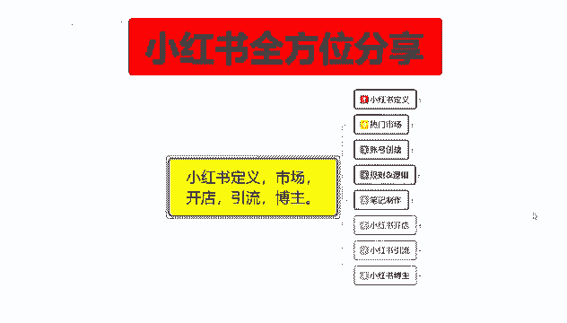

所以说这节课程的内容的话看似很大，其实不怎么大的自我分析，账号规划，你用小红书的引流那个方式的话去做也可以，但是这个里面的话有一个点。

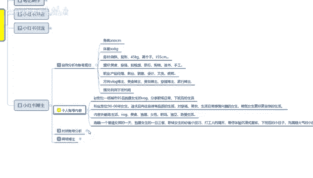

就是个人信息的一个组织搭配啊，身高体重身材爱好，职业方向利用情况，这是个人自己做给自己看的，就是你个人的信息，能不能满足做博主的一个需求，如果说你不满足的话，有些东西你就把它屏蔽掉，如果说你满足的话。

你就把它留下来啊，放在你自己的背景简介里面去介绍自己对吧，你就相当于交朋友，谈朋友，你先给别人说一下自己的一个个人情况，然后的话吸引同类型的一个人群，如果说你是做什么美妆博主啊，或者是嗯化妆博主啊。

或者说是美食博主啊等等这些东西的话，就是完美的介绍一下自己，当然也包括个人的一个情况，因为越真实，你获得的认可也就越高。

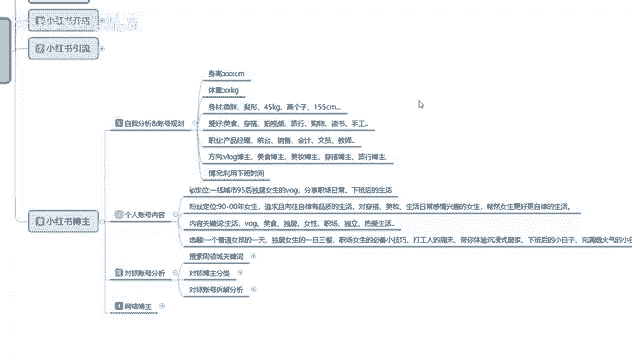

其他的话同时呢也是给自己做一个定位，然后个人账号的内容的话，这个里面就是IP定位，然后的话粉丝定位内容关键词，然后选题就是你自己网准备做网络博主，那你要选择一个题目和宣传片啊，一个社区里面选一个类目。

选一个类目做完以后，你再往其他地方去扩可以，但是你不能选一个社区以后，所有的类目也都想去参加，那样的方式的话是做不起来的，所以说个人账号的一个内容的话，你要首先确定自己给自己设一个人，设。

什么样的人设呢，比方说你是一线城市，九零后或者九五后的一个独居女性女性啊，每日的一个生活分享啊，或者职场日常下班后的生活等等都是可以的，就说你在小红书上面你无所拘禁，想发什么发什么啊。

对你个人呢是没有什么需求的，但是你要根据自己的个人情况，去了解自己的一个IP定位，就是自己去怎么设，设定以后的话，然后每天分享的是什么内容，确定好以后的话，确定你自己的粉丝定位对吧，你自己是什么状态。

那么其他的朋友是什么状态，那你就要设定他们自己的一个粉丝定位，意思就是你要把你自己啊，打造成他们同类型的人群，然后你是领头羊，他们都是跟着你走的，通过这种网络模式的话，你去给他们介绍吃喝玩乐就非常方便。

然后给他们介绍其他的东西也非常方便啊，就看你自己的人设怎么去摆，这个就是小红书的一个博主，内容确定以后的话就是选择内容的一个关键词，因为人群里是选了对吧，粉丝定位，你选了粉丝定位里面他还有什么呀。

美食独居女性职场独立，热爱生活等各个方面的一个小话题，什么意思呢，小话题里面你选择两到三个去做日常分享就行，多了以后你忙不过来啊，然后再进一步的去吸引他们的注意力，吸引过后的话，你就相当于是领头羊。

领头羊的话，那你在下面如果说你有凝聚力的话，你后续你是想去做店也好，去推广产品也好，接广告也好，或者说介绍周边的美食，什么地方好玩，什么地方聚会，然后的话对吧，基本上都可以做了啊，多的我就不说。

你明白的话就明白，不明白的话，有些东西你讲太明白了也不好是吧，选题就是你自己给自己的一个嗯，发表内容进行一个选题啊，当然你去推广什么书籍啊之类的都是可以的。

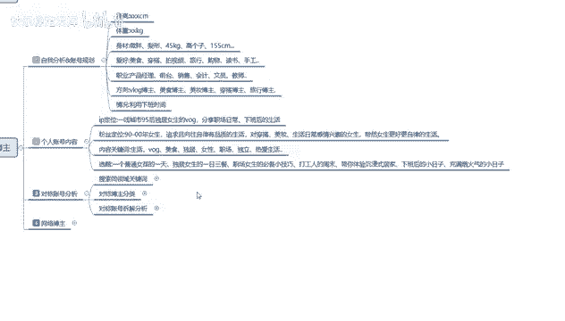

第三个对标账号分析。

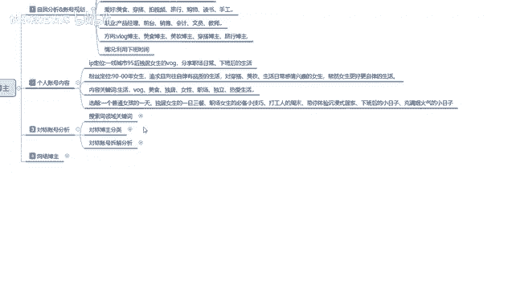

和之前的那个小红书店铺是一样的啊，这个是一样的，因为你的所有对标账号分析的话，在小红书里面它的模式是没有变化的啊。

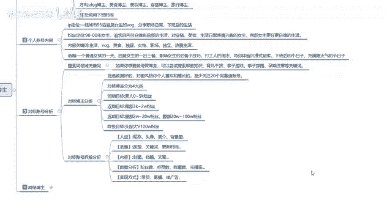

你们不了解的话，可以往前面的课程去看一看，在这个店铺操作里面讲过的。

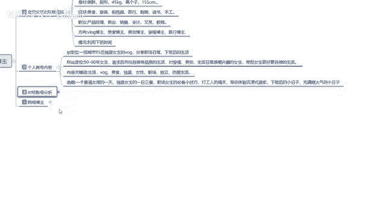

我就不讲了，最后呢就是网络博主，这个里面的话就是网络博主，你本来就已经准备在小红书上面，去做网络博主了，那你得选择自己的一个额博主播放的一个方式，什么意思呢，你要做直播还是做文对吧，你做直播博主。

那直播博主里面的内容就涉及到了这四个点。

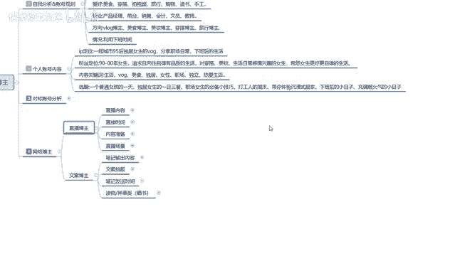

直播内容，直播时间内容准备啊，直播场景，直播内容我就不去给你们一一进行讲解了，这个里面的话涉及了各行各业，什么内容都可以去选，你自己只要设定自己的目标以后的，你基本上都能找到自己的一个啊输出环境。

你比方说教育科普啊，生活类的一个分享啊，时尚穿搭啊，访谈啊，电商啊，心理咨询文化基本上都可以的，你只要做博主，你就不限制，这种的话本来就是放大你自己所擅长的范围，然后去吸引对应的一个人群的啊。

博主就是这么简单和直接对吧，我讲我自己熟悉的一个专业领域，然后吸引你们不懂的人，或者说是你们懂但是不了解的人，我们来一起进行交流，我教你们怎么去做啊，提高你自己的生活品质，通过这种方式啊。

你才叫网络博主，不然的话你那个就叫引流啊，然后的话就是直播时间，啊个人自行安排，就说小红书的话，直播时间是没有固定的，基本上的话就是啊自己想几点就几点，但是你需要有一个固定时间，什么意思呢。

就是说一天24小时，24小时，你随时都可以进行直播，但是你想做一个完美的一个主播的话，那你就把每天直播的时候，当做工作时间去进行直播，而不是说你早上直播了一下，下午做直播了一下，明天不直播，后天不直播。

第三天再来啊，这种肯定是不行的，你需要有一个固定的直播时间啊，多长时间嗯，聊多久，那就是我看个人的一个，就是看我们自己个人想怎么去转化了，然后呢就是内容准备正常的话，就是说你前期直播间你做直播博主的话。

你的内容准备要做好，最少两小时三个内容去做分享，不然的话你直播间前期是没有人的啊，你没有那么大的影响力和吸引力，你只有粉丝数，粉丝数起来了以后，你再去做直播也可以啊，效果会比较好，就没有那么尴尬。

就不需要准备这么多内容，如果说你上来就直接想去做网络博主，然后想通过直播的方式宣传自己的话，那你就需要两到三次三套的一个直播话术，然后的话直播时间大概就是一到两个小时左右，然后才能慢慢火起来。

不然的话你的第一个时间不够，第二个的话重复的内容，或者说是直播间里面没有人，你没有去进行互动啊，沟通之类的，别人进都不会进来啊，看到你都不会进来的，然后就最后呢就是直播场景的一个背景。

前景和环境的一个呃，三位一体环境的一个选择，就是背景放什么，前景放什么，环景放什么，这个直播场景的话就看你们个人的一个条件，自己去进行设置就可以了，这就是你直播博主啊，我们所需要调整的一个方向。

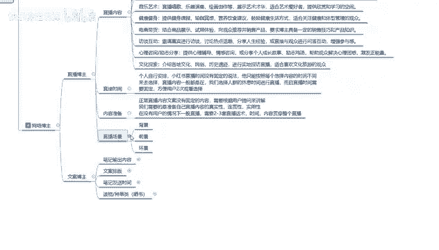

之后呢，就是文案博主啊，文案博主的话，这个里面说实在的啊，比直播博主怎么说呢，比直播博主的话要简单得多，因为直播博主的话，你要个人的一个个人本身，在某一个方面需要有很好的一个素质，但是你文案博主的话。

说实话你对某些东西不熟，你可以直接去查资料，只过资料查完以后的话，你以那个文字的形式，把它做成那个文案笔记进行发放就可以了，这个里面主要注意的就是一个笔记输出内容，然后的一个文文案排版啊，内容输出的话。

就是选择4/5的一个实体输出，留1/5的一个猜测内容，就说你有时候的话，你把那个答案的话，不能全部写在你的那个啊笔记里面，留1/5的一个猜测内容的话，就是用小号进行引导评论啊，把你的账号活跃度做起来。

做活跃以后的话，观看的人才会多，文案，排版的话就是嗯主板图片的话选择3~5张，就是你的笔记选3~5张图片进行排版，嗯猜测内容在第一位吸引用户，然后的话第二位的一个内容就是解说，第一位的内容进行宣传。

因为你第一类的内容的话，就是笔记核心里面的一个笔记，封面和笔记的一个关键词，他们俩是最重要的，通过这样的方式去吸引用户，然后在第二个版页进行解答，第三个板页，第四个版页进行延伸，第五个版页留下下一趟课。

也就是下一个笔记的一个主体内容，通过这种方式无限进行循环啊，吸引更多的用户来关注你，了解你下一步更新的一个动态，有时候的话，用户可能还会去评论区里面催你更新，就是，类似于做长版小说，然后你自己去做推广。

做了解啊，就看你自己怎么去排版，笔记发布时间的话也是一样的啊，这个的话就跟那个商品笔记一样的，看你自己选的内容，自己去发，最后一点呢就是毒物种草类的。

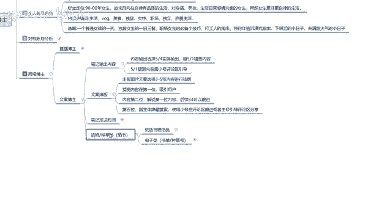

这个的话就是怎么说呢。

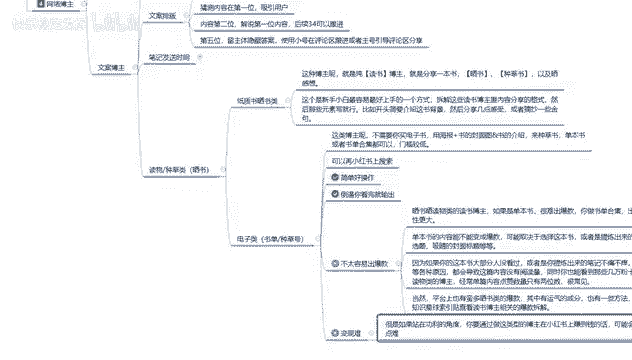

给大家介绍你就是做网络博主啊，你不管是做其他类型的网络博主，或者说呃食品美食啊，基本上都一样，这对话我只是给大家举了一个简单的例子，你比方说做那个毒物种草类的一个赛书博主啊。

子子晒书类这种博主呢就是纯的一个读书博主，就是分享一本书，晒书种草以及晒书的一个感想啊，这个就是佛祖也是最简单，在小红书上面起号最简单的一种方式，但是他的变现难度非常大。

因为你自己本身就没有什么啊过硬的一个技术，这个的话就比较适合新手和小白去操作了啊，你们大家看一下了解一下，如果说你想往这个方面发展的话，可以去深入的研究一下，过多的我就不给大家进行详细的一个讲解。

你们大家了解一下就行好吧。

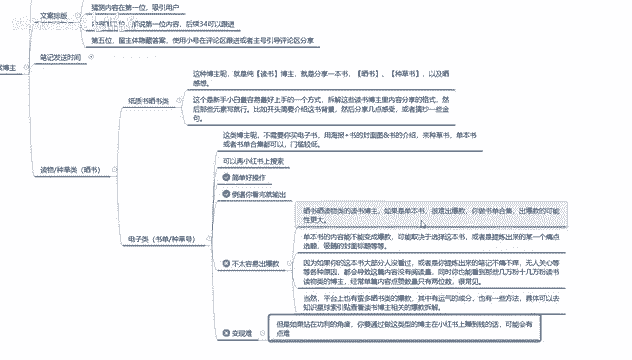

那这一整期的课程呢就给大家分享到这啊，主要的话就是让大家更加的了解小红书啊。

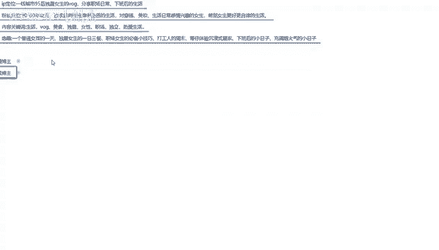

做小红书的时候少走弯路。

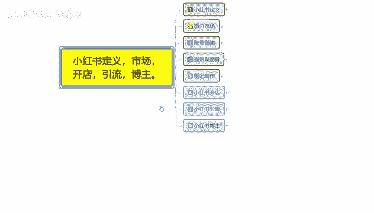

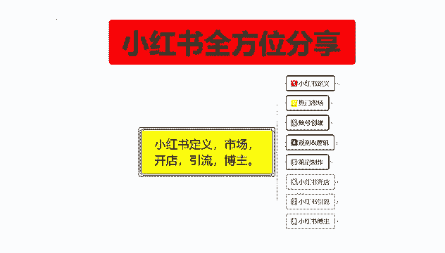