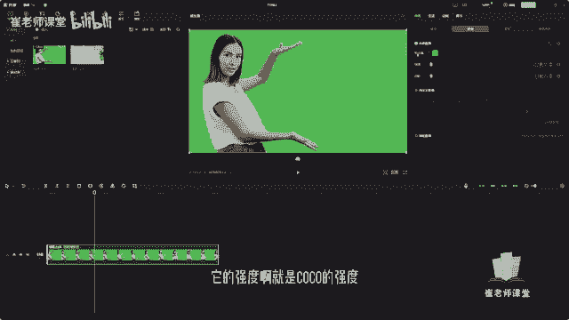
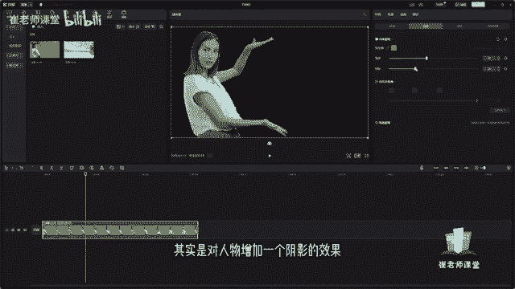
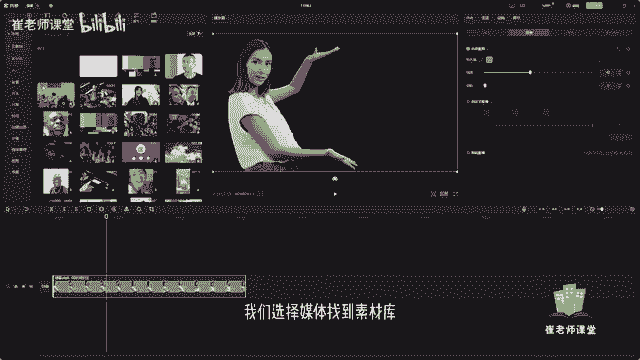
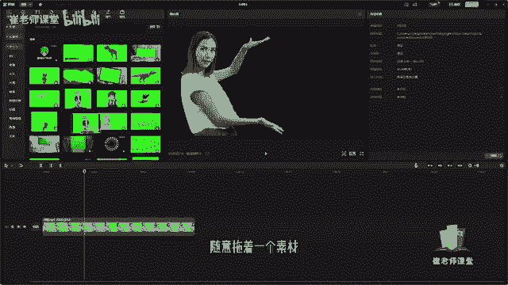
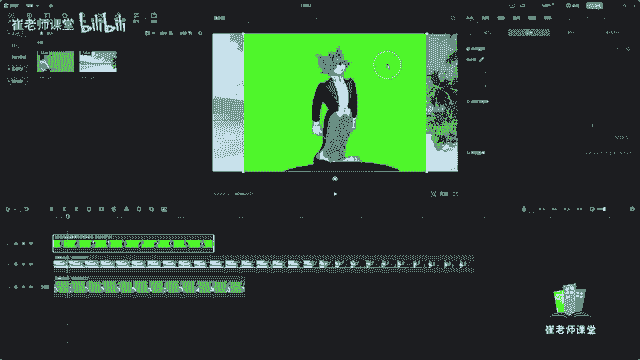
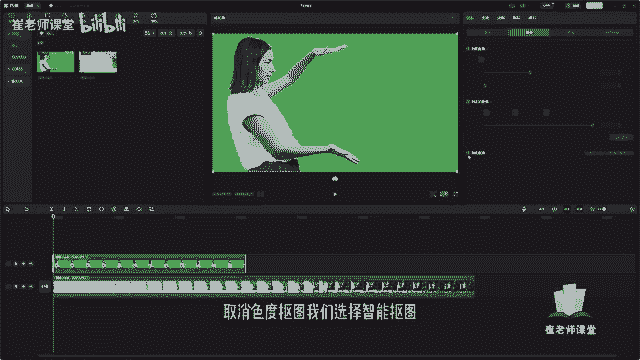
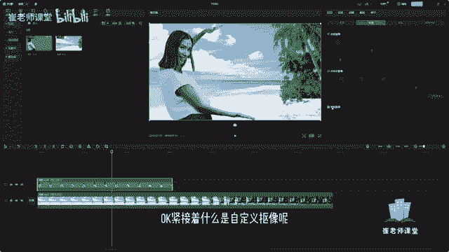
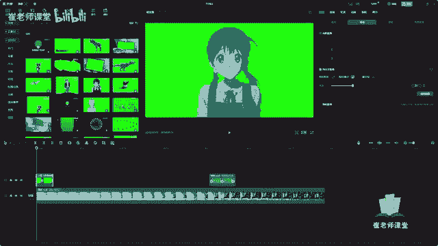

# 【2024版小红书体运营教程】全B站最良心的小红书开店运营教程！小红书体开店 起号真的快，赶快点赞收藏起来 - P34：32.抠像 - Sathenay - BV1uqHreLEER

我们来讲一下如何对视频进行抠图处理，首先要保证当前的视频呢，它是有纯色或者是近似于纯色的背景色的，选中当前素材之后呢，我们在参数调节面板当中呢，选择抠像剪映给我们，扣图处理呢有色度抠图。

自定义抠像以及智能抠像，我们先讲一下色度抠图啊，单机之后呢，我们选择这个取色器啊，也就是吸管工具单击来进行取色，将想要扣掉的背景色我们选取之后呢，比如说当前背景色我们要将它扣掉，它是绿色啊。

选取当前的取色器，然后将它选中当前背景色的绿色，我们可以修改它的强度啊。

就是抠搜的强度，移动滑块来调整一下抠的强度，强度越大呢，他的抠的这个效果也就越大啊，如果特别大的话，它会啊会将整个这个人物啊也会被抠掉，这个呢我们需要去一边看着播放面板，一边去进行去调整它的强度。

紧接着阴影啊，阴影呢其实是对人物增加一个阴影的效果。

OK在这里不是很容易演示，我们选择媒体找到素材库。

在这里呢我们选择绿幕啊，随意拖拽一个素材。

OK选中当前素材之后呢，我们选择色度抠图，选择取色器啊，选择他的背景色，准备抠图的选择。

要准备抠图的背景色，单击之后呢，我们可以更改一下强度，你会发现多多少少的会有一点点像他的轮廓啊，会有一点点他的绿幕没有扣的特别干净，那么我们再去调整的话，可以稍微的进行微调。

然后呢你会发现阴影是增加它的阴影的效果，能够让人物显得更加的立体，OK可以适适当的增加一下阴影啊，强度根据需求来进行调整啊，不要特别大啊，防止人物其他的一些位置呢啊也会被扣掉，这个呢就是色度抠图啊。

还有呢是一个比较常用的就是智能抠像，这个智能抠像呢，它就是根据剪映的这个算法来进行啊，智能识别对当前的素材进行抠像，但是需要注意的是，当前仅支持人物图像的智能识别啊，然后在这里呢我们对当前取消色度抠图。

我们选择智能抠图。

你会发现是抠的，对于人像来说是比较干净的，需要注意的是，智能抠图呢他是需要进行联网的，它和我们文本的智能字幕是一样的，它需要进行连接网络才能够进行实现这个效果，OK紧接着什么是自定义抠像呢。

我们再来拖拽一个当前的一个效果，比如这个小女孩，OK我们先暂时把它移到后面来，我们来看一下如何对它进行自定义抠像，选择单机之后呢，你会发现有智能画笔，智能橡皮，有橡皮擦，我们选择智能画笔呢。

选中了当前需要保留的这个素材，我们只要这个小女孩诶，你单击它之后呢，她会进行智能画笔嘛，她会进行自动的去识别，我们需要保留的当前的这个人物，然后你会发现选中之后呢，它会变成这种墨绿色，表示是显选中的。

但是你直接选择应用效果呢，你会发现木有的呃，显示墨绿色的，它没有抠干净啊，那么这个时候呢我们需要用到一个智能橡皮，来将多余选中的来进行去除掉，在这里呢调整当前橡皮的大小诶。

大家可以看一下这个当前相比大小是呃，是不是不是自己想要的大小，然后根据这个大小呢，我们把剩余的给去除干净，我们可以按住那CTRL加滚轮键来放大一下，来进行处理啊，有一个别的细微的地方不容易很好的清除啊。

这这你会发现脸的部位啊去啊，一不小心给去除了，那么我们选择智能画笔，然后再描描出来嗯，然后再把这个地方去清除干净，你会发现如果涉及到一些毛发，或者是中间留的空隙啊，他是不是很容易自动的进行扣除的。

我们需要细心一点啊，去找到，然后进行扣除，OK然后呢选择应用效果，你会发现还是有个别的地方抠的不是很干净了，那么这个时候呢我们需要使用智能橡皮啊，去很仔细的去把一些毛发的一些边缘的部分。

还有周围的边缘的部分进行扣除。

这个呢就是自定义抠像，相较于色度抠图以及智能抠图呢，它的使用频率是要比自定义抠像要使用高的啊，因为在这里你多多少少的它会有一点点瑕疵，那么这个时候呢，我们还要运用橡皮擦或者智能橡皮来进行。

对当前的瑕疵进行擦除，然后你用色度抠图的话，比如说我们选择取色剂增加强度，然后增加阴影效果，诶。