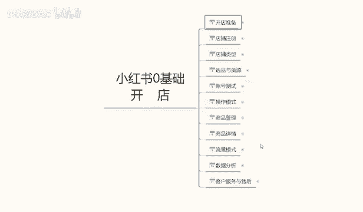
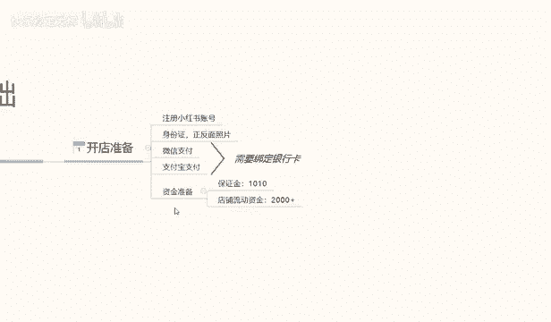
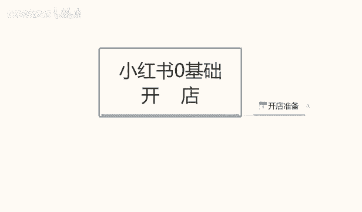

# 【2024版小红书体运营教程】全B站最良心的小红书开店运营教程！小红书体开店 起号真的快，赶快点赞收藏起来 - P35：33.小红书0基础开店-开店前的准备 - 快乐稳定发挥 - BV1AbtoebEjX

大家好，今天给大家分享一个，小红书零基础开店的全套一个课程内容，这个课程内容呢包括11节的内容准备，首先呢我们从开店准备开始，一直呢到我们最后的一个客服服务与售后啊，整个店铺呢他是讲解我们小红书。

零基础开店的一个整体操作啊，当我们学会这个模式以后的话，我们前期小红书开店的话，所有的基础准备就基本上全部都做完了，那么开始我们今天的第一节课啊，小红书的开店准备。

好开店准备的话，小红书这边开店准备其实是比较容易的，首先我们只需要注册一个小红书的一个账号，然后呢准备身份证的一个正反面照片就可以，同时呢我们这里呢需要注意一个点呢。

就是我们需要拥有微信支付和支付宝支付啊，同时这两张呃支付方式的话需要绑定银行卡，这两个支付方式的话，第一个呢是小红书，到时候客户进行付款啊，我们进行收款的一个记录，同时绑定这些东西以后的话。

小红书他店铺的话它也会有一个账号的权重，会提升我们整个店铺的一个权重，如果说不做这几个东西的话，我们的一个系统的话它是不完整的，也就是我们小红书的话，它是没办法正常运行的，我们收到的一个流量和数据的话。

基本上都会比较小啊，就是操作起来的话会很麻烦，最后一个呢就是说小红书的一个准备资金，保证金呢准备1000一次，因为是1000块钱的保证金，加七块多的一个手续费，他这个里面的话和其他的一些平台的话。

可能会有一点区别，其他平台的话我们只需要交保证金就可以啊，他是不需要收取手续费的，但是小红书这一块的话嗯，他和其他的话可能会商业基础比较严重一点，他的另一个保证金的话还需要收取手续费。

包括我们后续的一些那个产品卖出去以后啊，不管是我们怎么操作的，他都是要收手续费的，所以说这个的话我们大家一定要注意啊，所以说小红书的话，它的整体的一个啧流量和大众效果的话，还是不错的。

但是说呃在资金成交这一块，包括我们那个店铺成交也好，或者说是其他的，只要是有资金流动的话，他的这个税税率吧，我们姑且这么认为吧，就是税收比例比较高啊，所以说大家一定要注意一点。

然后呢店铺的一个流动资金准备的话呃，至少要备2000块钱以上，为什么呢，因为我们前期去操作店铺的话，他这个小红书没有任何数据的话，我们是没办法起店的，就说我们店铺起来以后的，我们只交了保证金的话。

我们这个店铺也不好做，所以说这2000块钱的话，是我们的一个产品的一个活动资金，包括我们前期操作数据啊，啊怎么去操作啊，都需要用到的一个店铺的一个流动资金，因为没有这个流动资金，我们去操作整个店铺的话。

他是基本上是操作不起来啊，因为小红书跟其他的话不一样，这个呢就是我们开店所需要准备的一些数据啊，准备这几样东西以后的话，我们这个店铺开店准备，就基本上已经完成完成了，就是说整个店铺我们就可以开始运行了。

后期的一些操作的话，我们再给大家讲解，其实的话小红书整体的话，开店准备的一些东西都是比较简单的，主要就是说我们手机一部啊，身份证的一个正反面照片，当然是必须要是本人的啊。

微信支付宝这个的话基本上现在基本上都有啊，但是呢他需要绑定银行卡，不要拿新注册的微信和支付宝去使用，那样的话他的一个怎么说呢，就说我们收款过多的话，会导致这种账号容易被封，知道吧。

就说到时候再去更换微信或者支付宝的话，不比较麻烦，所以说微信支付宝的话一定要使用，最少使用3年以上吧，大家一定要注意了，同时要绑定银行卡，这个银行卡的话，你不绑定银行卡的话。

后续微信和支付宝的信息它是不完整的啊，那么这节课的内容呢就到这里。

下节课呢给大家讲解一下我们的第二课时，小红书的一个店铺注册啊，我们怎么去注册小红书的一个店铺。

