# 【2024版小红书体运营教程】全B站最良心的小红书开店运营教程！小红书体开店 起号真的快，赶快点赞收藏起来 - P35：33.蒙版 - Sathenay - BV1uqHreLEER

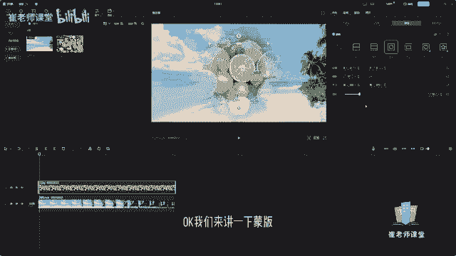

OK我们来讲一下蒙版，其实蒙版呢它是选中当前轨道，然后选择需要添加蒙版的样式来进行，去以蒙版的方式进行呈现啊，大部分蒙版的样式，都是以形状的方式来进行展现的。

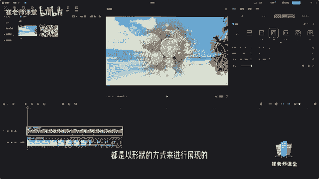

或者是你像其他的一些软件啊，它是可以自定义的啊，去创造出这种蒙版的效果，去自定义的去啊进行绘制或者是选择形状。

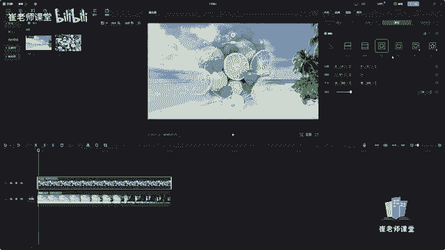

那么剪映当中呢提供了七种啊，默认的蒙版来给大家进行选择。

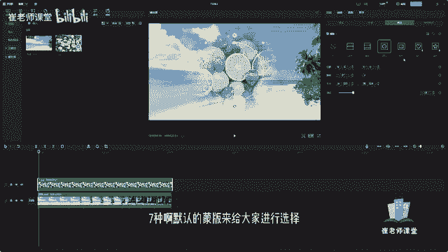

我们选中当前的素材呢，比如说当前的这个素材。

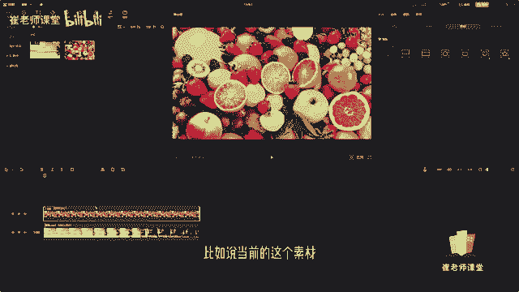

在参数调节面板当中呢选择蒙版。

然后呢可以选择添加蒙版的这个形状。

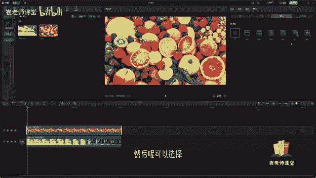

比如说线形啊，单击之后呢，它会类似于这种分屏的模式啊，就是把当前的素材去挑选一个形状。

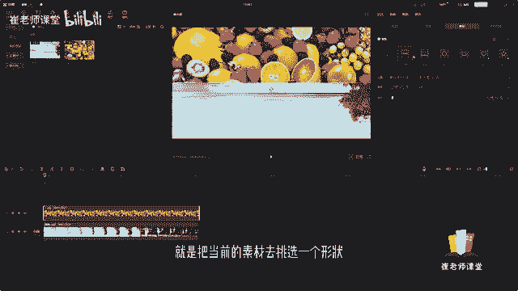

然后进行展示嘛，然后可以选择镜面啊，可以选择圆形。

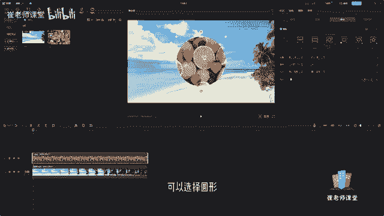

可以选择矩形，也可以选择爱心，也可以选择星星啊，在这里呢可以调整当前的猛犸的位置。

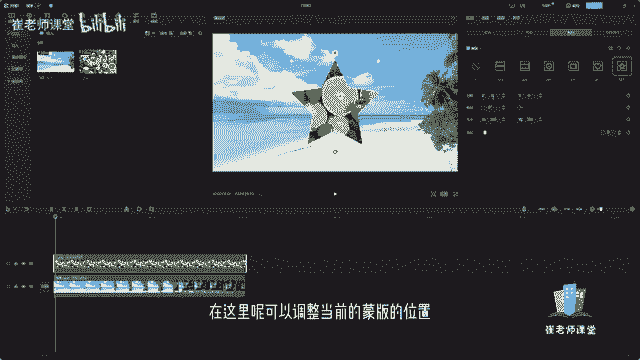

嘿你会发现在这里也可以进行拖拽啊。

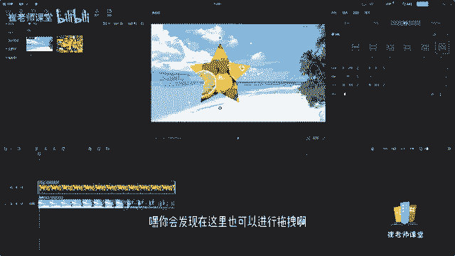

拖拽选择当前的蒙版的位置，因为它本身的图片呢就是当前的图片。

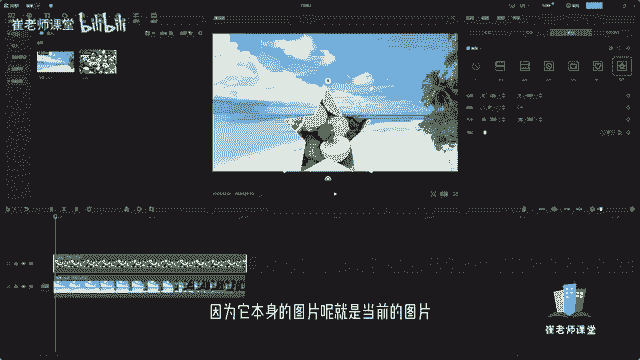

我们是挑选当前图形的样式。

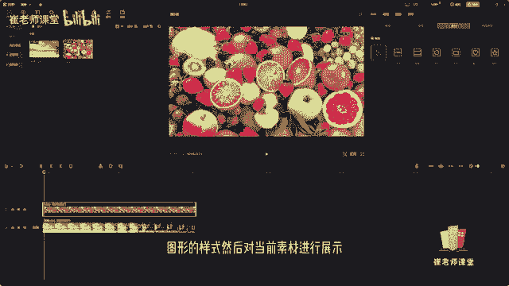

然后对当前素材进行展示，比如说当前的星星可以输入当前的位置，或者是可以在这里旋转。

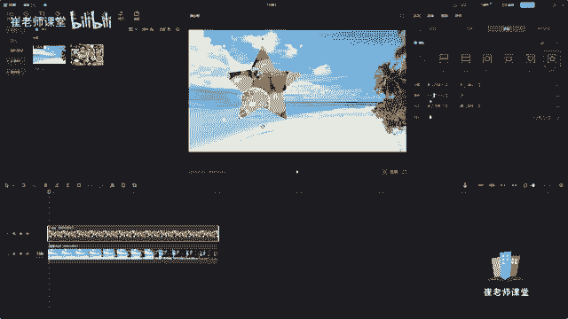

输入数值，也可以呢直接进行拖动来进行查看。

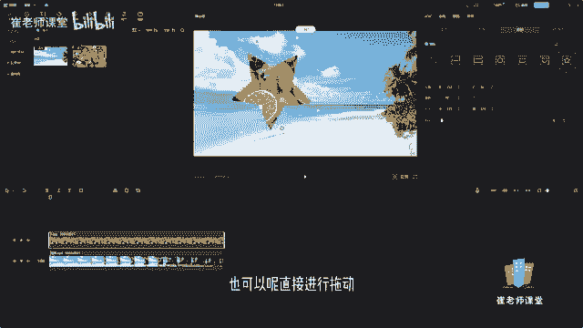

当然它也可以去添加关键帧啊，啊然后呢在这里呢可以调整它的大小啊，就当前蒙版的大小可以直接输入数值，也可以呢选择上下按钮来进行微调，也可以呢直接拖拽当前的这个四个白色的小点。

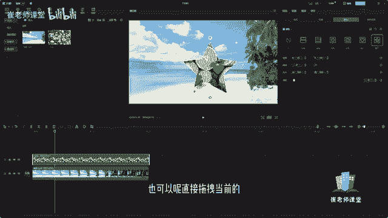

然后进行选择它当前的大小也可以呢设置羽化。

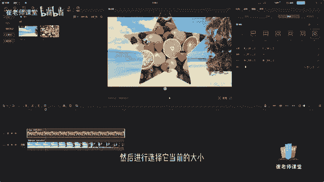

羽化呢其实就是使周围啊。

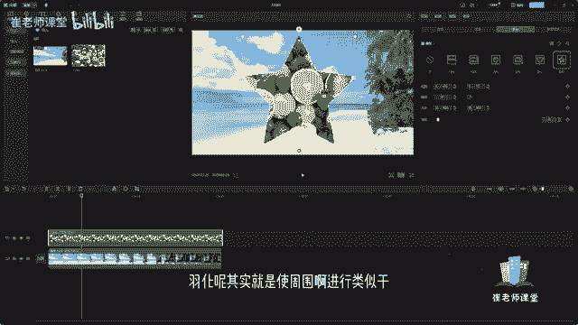

进行类似于透明的效果，我们可以移动滑块来调整它的度数。

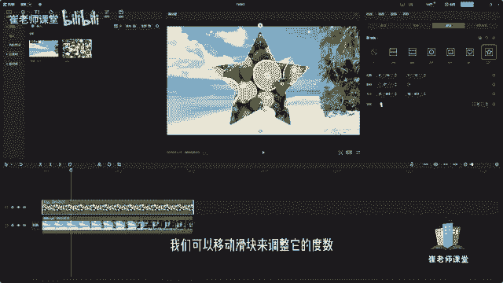

发现诶旁边就会进行了优化，然后你也可以换一个矩形。

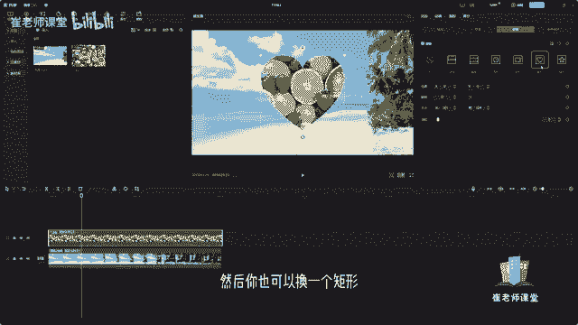

当然了你也可以换一个形状，比如说星星啊，我们女画一下。

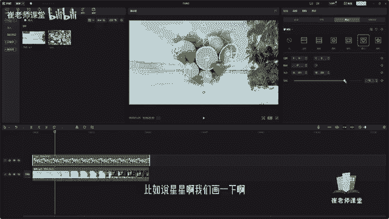

这样呢就是实现了当前蒙版的效果，也可以呢。

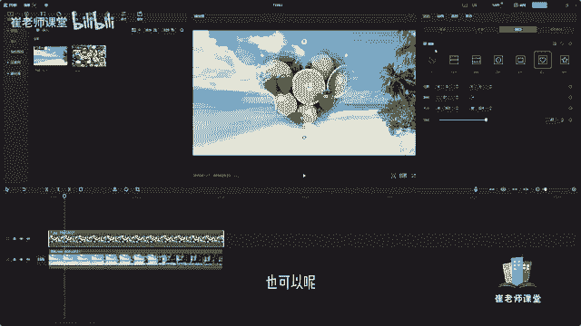

对当前的蒙版呢去添加这个动画的效果，或者是呃进行调色都可以啊，比如说当前的蒙版选择轻微抖动，这个呢就是对当前的素材如何添加蒙版。

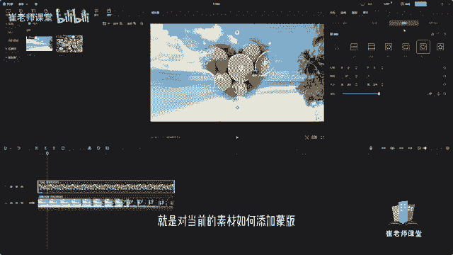