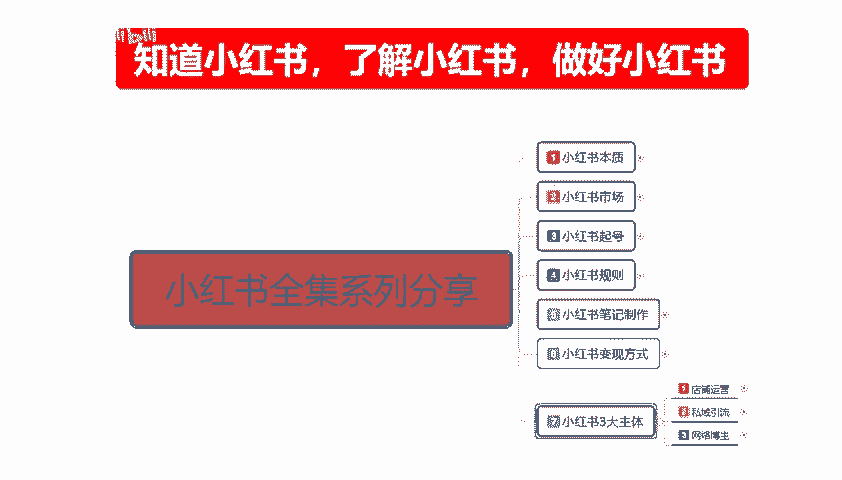
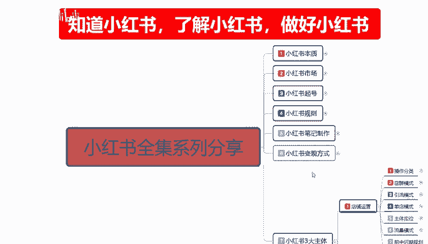
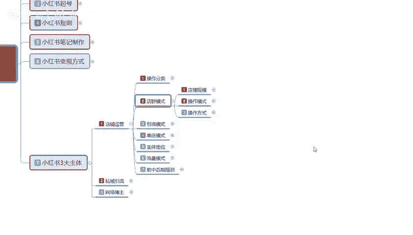
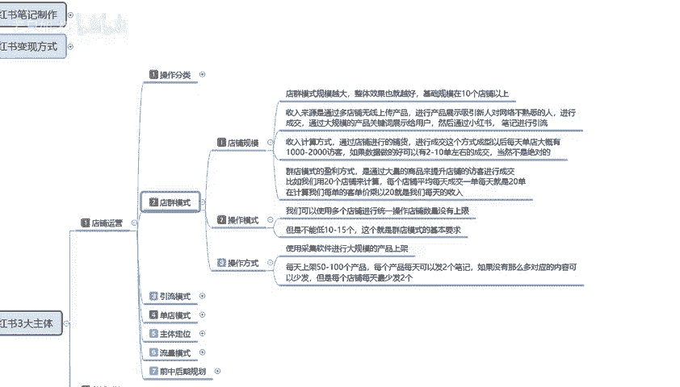

# 【2024版小红书体运营教程】全B站最良心的小红书开店运营教程！小红书体开店 起号真的快，赶快点赞收藏起来 - P36：35、新手小红书运营-小红书店群模式 - 若只如-初 - BV1MM4m1274h

大家好，今天给大家分享的是小红书全集系列的啊第七大课时啊，店铺运营的一个内容。

嗯，废话不多说，直接开始进入我们的一个正题。上节课呢是给大家讲解了一下啊，让大家了解了一下我们整个小红书店铺运营里面的一个操作分类啊。

电群引流和单电的一个模式。这节课的话给大家讲解一下电群模式，它整体的一个操作步。

电驱模式说实话，它的一个整体操作步骤还是相对比较简单的。我们首先来了解一下啊。电池模式我可给大家分为了三个步骤点啊，第一个是店铺规模，第二个是操作模式，第三个是操作方法。

店群模式的话，它的是规模越大，整体效果也越好。技础规模的话，就说你真的是想做店群的话，你最少在要有10个以上的一个店铺啊，它的一个整体收入来源的话，就是说通过多店无线上传产品。

进行产品展示吸新人对网络不熟悉的人，就是吸引那些刚步入社会啊，然后想了解一下，或者是在比较感觉小红书比较新奇啊啊，上面有卖东西的，我进来看看这种啊不熟悉的人来进来成交。

通过大规模的一个产品关键词展示给用户，然后通过小红书笔记进行引流。他是通过这种模式，就是我一个店铺的话，里面可能有5001000件产品。然后这些产品的话，它也不分类其全什么都有，对吧？然后有通过关键词。

因为小红书它每一个过搜索关键词的话，它都会在后台给你展示。后台展示只要是搜索，它就有概率显示你的个产品，就算你的排产品排到1万米。啊，但是你的本身基础规模就在这个地方。就会给你引流引流的话。

你再从这个引来的引来流量的这一部分人群里面去进行成交。当然了，你不能说是所有的东西全网全部按照复字类类的，还是稍微优化那么一两个好一点的，可能会好一点啊。他的整个收入计算方式的话，说实话。怎么说呢？

在这个地方打了以后，我就不想给大家那个。具体的一步一步去讲，因为它其实还是比较简单的，它只是一个换算公式啊，就是说通过店铺进行铺货，进行成交这个方式的话，成型以后每天大概的话就是。一个店铺的话，大概。

1到2000的访客。如果数据好的话，可以两有2到1单左右。如果说数据做的不好的话，当然这不是绝对的啊，就是说数据做的不好的话，他可能就没有单。那一个店铺有2到13左右的话。

那么你10个店、20个店、50个店，那就是通过这种方式来促进成交的啊，这个就是店券模式。店群模式的一个盈利方式，就是通过大量的商品来提升店铺的一个访客进行成交。比如我们用20个店铺来计算，每个店铺的话。

平均每天成交一单就是每天就是20单。当然了他这个数据的话也不准啊，20个店铺可能只有5个或者三个店铺有成交单数。这个就是你当天的一个收入。但是你的话整体投入，你除了前期开店交的一个保证金以外，后续的话。

你是除了一些配置的软件以外，是没有什么投入的。这就是电群模式的一个规模。店铺的一个规模去看要不怎么说，之前给大家说的时候，就是说你操作店群，你就看你自己启动资金有多大。你的资金量越大的话。

你在里面就说效果会越好。但是它整体的一个收入的话确实确实是不高的啊。操作模式啊，我们可以使用多店铺进行统一操作。店铺数量的话是没有刷限的啊，最少保在10个以上就行。但是呢不能低于10到15个。

这个就是电池模式的一个基本要求。操作方式也比较简单啊，使用彩具软件进行大规模的一个产品上架。就说你自己没有产品。啊，像这种你做店群的基本上都是没有产品的。你要么就到1688。

要么就到拼拼多多上面去把别人做一件代发的，或者其他平台到51啊、五婴网啊这种。只要是能上传的产品都给上传上去。就行。每天上架的话就是50到100个产品，每个产品每天可以发两个笔记哦。

我们是没有那么多笔记也可以应对的啊。那你就控制按照每个店来分每个店每天最少发两个，他没有上线，你就是把他每天给你的一个额外流量上线用光就行。每天的话就是最少5一个店，最少5片笔1。😡。

发哪个商品那就随意了，你就是做大规模的广泛撒网，广泛网鱼网云里面的网有多大，你就看你的产品布的细不细。焊你布的细字以后的话，你后面能网到多少鱼啊，那就不好说了。因为它的我它的网大，它的网眼也大。

漏掉的概率也会很大啊，这个就是整个一个电池模式的一个操作方式。电竞模式我在这边的话没给大家多讲呢的原因呢就是说现在的话嗯。怎么说，这都2024了。啊，这都都中旬了，你再去做电型模式的话。

说实话效果他不会太好。但是你现在做的话，你起码不会亏本。如果说你往越往后越往后，你再过个一过个几个月，过个半年，过个一年，你再去做这种模式的话，你就是一毛钱都捞不到了。因为小红书的后台数据快满了啊。

这个说的是实话。这个呢就是整个电池模式的一个。方法你要做店群，可以好好了解一下。那这一节分享呢就给大家讲到这。下一节的话给大家讲解一下引流模式。

