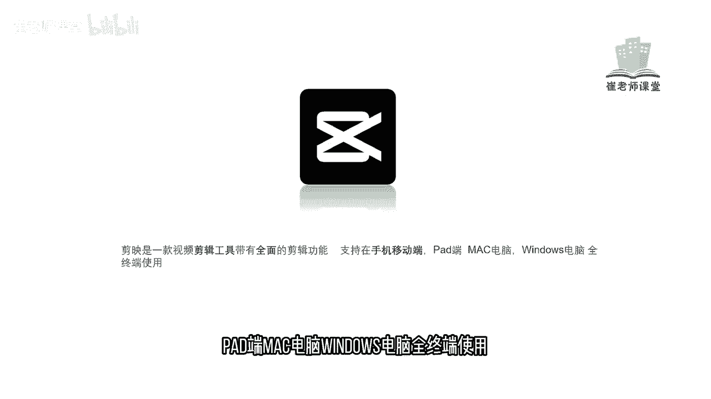
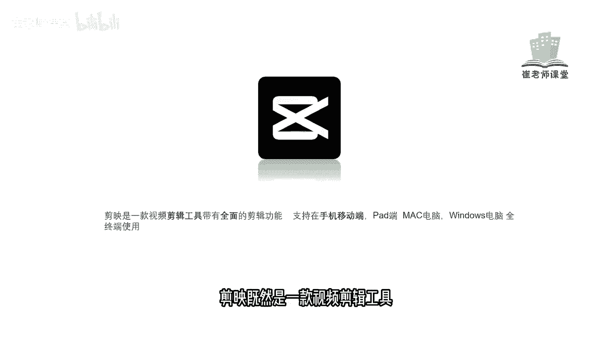
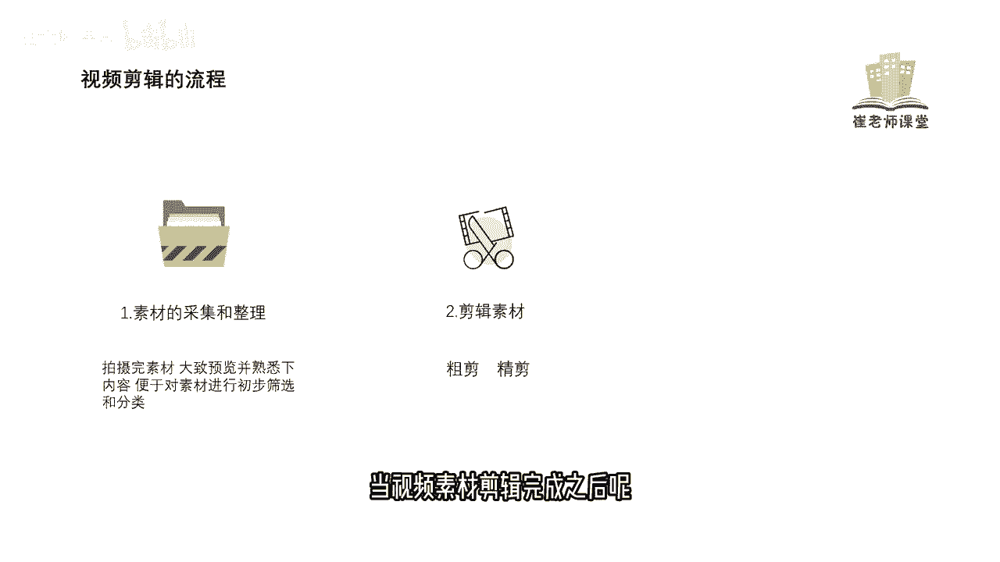
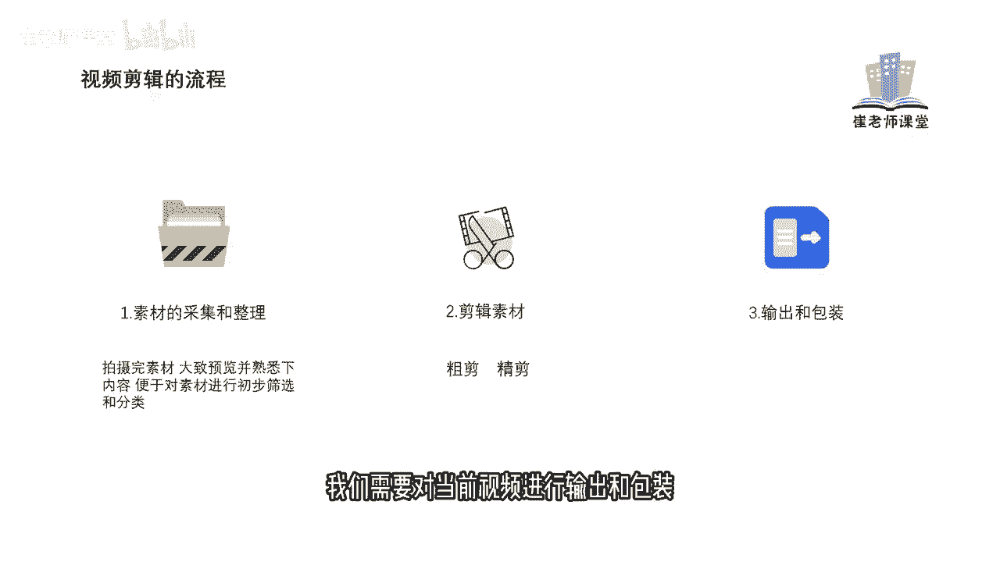
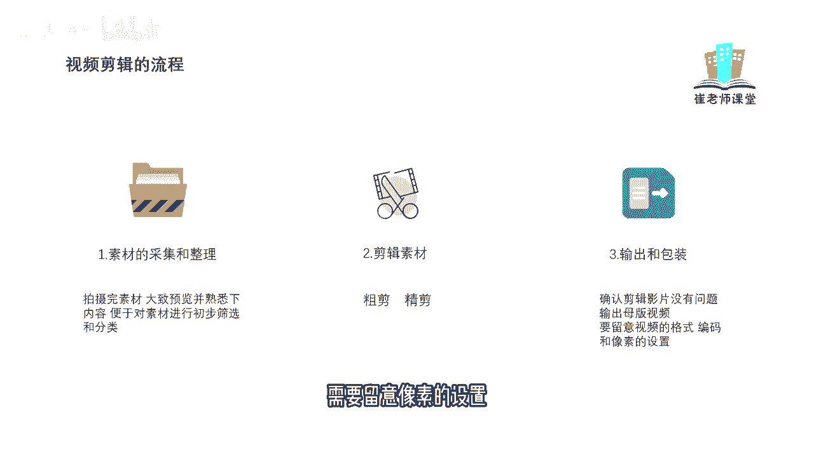
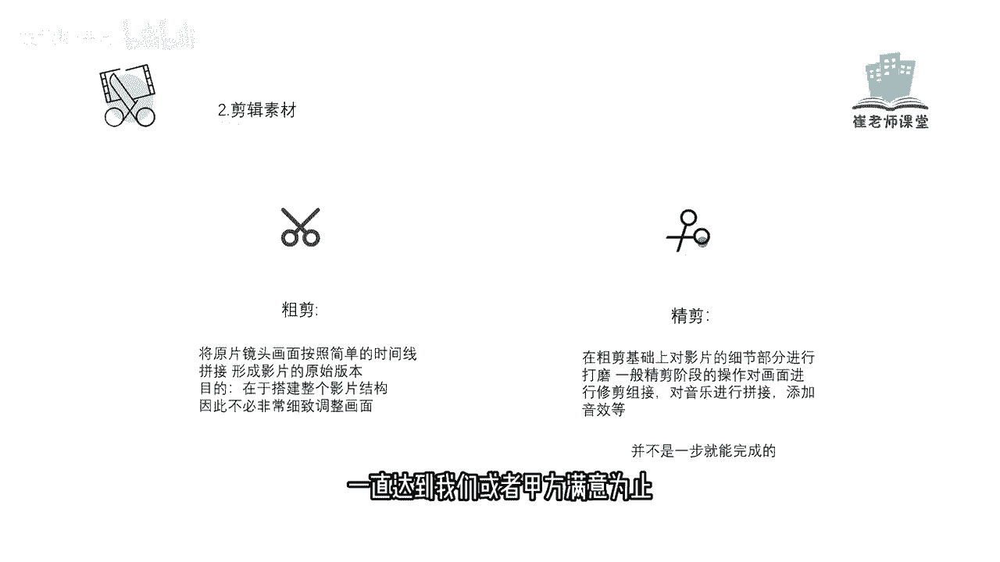

# 【2024版小红书体运营教程】全B站最良心的小红书开店运营教程！小红书体开店 起号真的快，赶快点赞收藏起来 - P3：1.剪映前言 - Sathenay - BV1uqHreLEER

剪映是一款视频剪辑工具，带有全面的剪辑功能，支持在手机，移动端，pad端，Mac电脑。

windows电脑全终端使用剪映，既然是一款视频剪辑工具。

那么我们需要熟悉一下视频剪辑的流程，视频剪辑的第一步呢，是要对素材进行采集和整理，拍摄完素材大致预览，并熟悉一下内容，便于对素材进行初步筛选和分类，对当前素材整理之后，我们需要对当前素材进行剪辑。

剪辑呢大致分为粗剪和精剪，后面会详细的和大家讲到，当视频素材剪辑完成之后呢。

我们需要对当前视频进行输出和包装。

首先要确认剪辑影片是没有问题的，然后进行输出模板，视频需要注意的是，我们在输出视频的时候呢，要留意视频的格式，在后面会详细讲解视频的多种格式以及编码，大家需要注意啊，不同的视频平台是对编码有不同的要求。

如果你的编码过高，在上传平台的时候，它会对你当前视频的编码进行再压缩，会影响到我们视频的画质，这个同学们需要注意一下，紧接着需要留意像素的设置。

后面也会详细的和大家讲到，剪辑素材呢分为粗剪和精剪，那么什么是粗剪呢，粗剪呢是将原片镜头画面，按照简单的时间线拼接形成影片的原始版本，目的呢是在于搭建整个影片的结构，所以呢不需要非常细致的调整画面。

比如说你的有些视频呢，因为时间关系需要快速的发布啊，需要简单的进行粗剪，或者是说有的视频需要粗剪完之后发给甲方，看一下大致的预览结果，哪个地方需要调整，哪个地方需要改善，是否满意等等。

这个需要同学们注意，紧接着是精简，精简呢是在粗剪的基础上，对影片的细节部分进行打磨，一般精简阶段的操作呢是对画面进行修剪组接，对音乐呢进行拼接，添加音效等等，是对当前视频呢更加细腻的操作。

需要同学们注意的是，在精简过程中并不是一步就能完成的，他需要进行反复的修改，一直达到我们或者甲方满意为止。

首先非常感谢同学们能够观看本期视频，稍后呢我会把本期视频当中使用的所有素材，以链接的方式免费的发在评论区。

