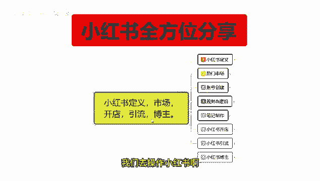
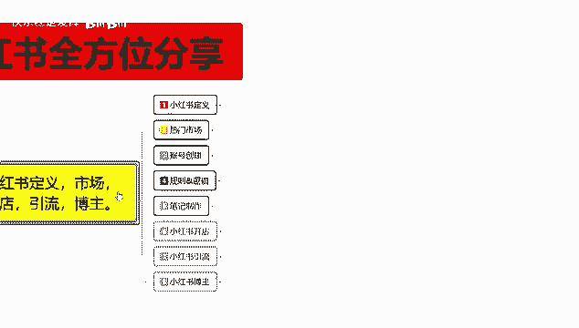
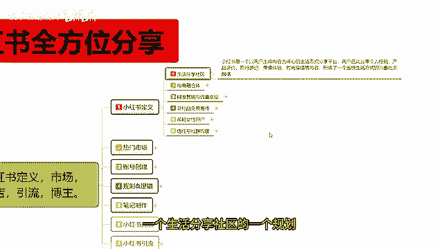
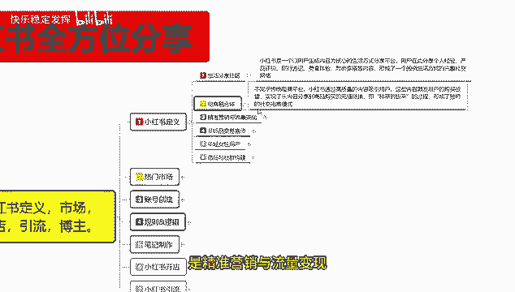
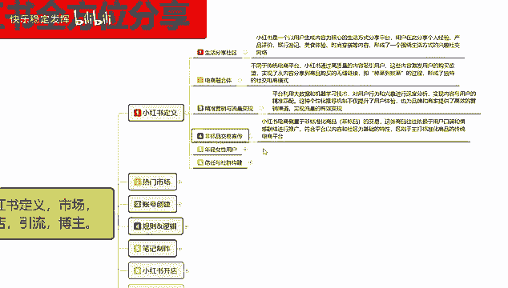
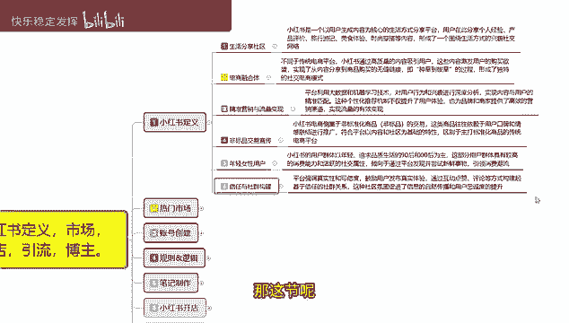

# 【2024版小红书体运营教程】全B站最良心的小红书开店运营教程！小红书体开店 起号真的快，赶快点赞收藏起来 - P3：1.比刷剧还爽！！2024（全新）小红书运营网课，小红书运营大佬专为为学渣研制的小红书开店、小红书起号零基础保姆级教程，全程通俗易懂，纯干货无废话 - 快乐稳定发挥 - BV1AbtoebEjX

大家好，今天给大家分享的是小红书，全方位的一个整体分享，这一整期的课程呢包括小红书的一个定义，市场开店引流博主这五个方面的一个讲解，定义呢就是说了解小红书他具体是做什么的，他有一些什么样的一个呃。

四场和所熟悉我们进行分享的一个整体内容，第二个呢是四层市场的话，就说小红书目前的一个热门市场，比较适合做什么样的一个产品宣传，和一个交流沟通的一个方式，后面呢是开店引流博主，这个呢是小红书。

我们在小红书上面进行变现转换的一种方式，就是说他这个里面的话，包括在小红书上面直接进行开店卖产品，第二个呢是做引流，把小红书的一个用户的话，转到我们自己的一个交流群上面，然后宣传我们自己的一个产品。

第三个呢是网络博主，网络博主的话，小红书的网络博主，和其他的网络博主有一定的区别，因为他的话操作稍微额对比抖音啊之类的，其他推广平台会简单很多，这个呢就是这一期要给大家进行整体分享的，一整套内容。

五个分为八个大课时，第一课呢是给大家讲解小红书的一个整体定义，第二个呢是热门市场，第三个呢是账号创建应用小红书的一个账号，创建账号的一个整体创建的话，如果说我们前期没有规划好，包括中后期的话呃。

你再去调整账号的一个属性的话，会比较麻烦，第四个呢是小红书，它整体的话运营的一个规则和运呃，推荐的一个流量逻辑，第五个呢是教大家怎么去在小红书上面，把笔记制作好啊，这个是最重点的一个核心。

你不管是开店引流，或者说做博主，以笔记制作的一个方式，如果说不了解的话，呃这三个方向你都做不了，你了解市场的一个定义和市场的一个热门商品，你了解完，你如果说不会做笔记的话，你后续的内容你也做不出来。

第六课呢是给大家分享，小红书开店整体的一个运营思路，第七个呢是引流，第八个呢是博主就说，我会按照这一套整个流程去给大家进行一个，完整的分享，这一节呢只是说给大家介绍一下，我后续分享所有内容的一个大纲。

让大家了解一下，如果说你们对里面某一个范围的内容，感兴趣的话，可以自己去往后面观看，因为的话你如果说做开店，做引流，做博主的话，他们都是分开来操作的，但是你前面那几个的话，前面五条啊。

就是五个大课时的话，呃，你是了解整个小红书的一个动态，你只有了解小红书的动态以后呢，你才能去做开店引流，或者说是博主三个额转变流量的一个方式，就是变现，你只有了解这前面五个点了以后。

你才能去做678这三个点，不然的话你光呃怎么说呢，就说你上来直接小红书上面，我说小红书上面我想去开个店，然后的话其他我不了解，我只需要把产品放上去，那肯定也不行，你做引流也是一样，做博主也是一样。

你如果说不了解整个小红书的一个，操作逻辑的话，我们后续也是没有办法去操作的，那从下一节课开始呢，我会从第一节小红书的定义给大家进行分享啊，他整个的话就是一套系统性的一个课程分享，这节课呢给大家讲解一下。

我们小红书的一个定义，小红书的定义啊，这个内容的话其实是非常好了解的，就是说小红书它整体是做什么的，我们首先需要了解你，我们去操作小红书啊。

你首先要了解小红书他是做什么的啊，他有什么样的一个市场环境。

这里面的话其实可以把它分为六个点，来进行一个拆分讲解，但是的话整体内容不多，我就直接从第一个直接给大家讲，往后面进行分享，一个呢就是说小红书的话，它是属于一个分享社区，什么叫分享社区呢。

就是说小红书它是一个以用户生成内容啊，就是为核心的一个生活分享平台啊，这里面分享的包括是什么呢，我们日常的生活穿搭食品美食，户外啊，只要是说你包括生活的各个方面。

只要说有联系的小红书上面你基本上都能找到，当然了，这些板块的话，他也有人气高的和人气低的，旅游啊啊美食啊，化妆啊，美容啊，服装之类的，可能在小红书上面会比较红火一点，其他的你比方说什么大型的家具啊。

电器啊啊使用方式啊等等，这些的话就会偏小一点，因为小红书呢它整体用户的话偏为女性，但是如果说你在小红书上面，你去往那个大型家具方面去靠的话，它的一个属性点的话就会非常少，越冷门的产品在小红书上面的话。

它整体市场含量反而会越高，越大型的那种呃，你除了女装化妆品，就是针对女性经常用到的这些啊，非常多以外，其他的基本上都非常少，你在别的地方去搜索的话，你可能像玩具啊之类的东西会比较多，但是你在小红书上面。

你去搜玩具啊之类的东西就非常少了啊，成人的不包括啊，基本上都是儿童的会比较偏少，所以说在小红书上面的话，他因为整个的话，小红书它都是属于一个分享社区，就说有什么内容。

都是平常我们所实实在在使用到的一个内容，偏女性用户的啊，男性用户的话也比较少，主要是偏女性用户，因为小红书整体的话，他的一个女性用户占比是90%以上，然后呢小红书通过收集这一方面的信息。

然后把这一帮额这一帮女性用户啊，集中到小红书上面去进行分享啊，打造成了一个生活分享社区，这个呢就是小红书的一个生活分享社区，的一个规划。

第二个呢是电商融合体，第三个呢是精准营销与流量变现。

这两个的话是一个整体，然后呢第三个是附带什么意思呢，电商融合体就是说小红书上面我们去做电的话，它不同于传统的一个电商平台，小红书他是通过高质量的一个内容吸引用户，就是说为什么说是高质量。

而不是说我们所熟悉的品牌呢，因为在小红书上面你去做电商，就是小红书卖货开店，你去卖货，他都是实实在在有很多人去运用过，然后的话在小红书上面进行推广推荐，就是说它整体的话额可能没有什么品牌的效应。

但是这个里面的话，基本上都是非标品的一个交易宣传，放在这个里面呢，因为很多的一个线下厂商，他所制造的产品的话都是小作坊，懂我意思吧，也就是说很多产品他都是小作坊做出来，然后拿到小红书上面自己去宣传。

自己去卖，或者说是名气不高的那种小型产品啊，在小红书上面对这帮女性用户进行宣传推广的，所以说电商融合体，它和其他的你比方说抖音拼多多，京东等等，其他的这些完全是不一样的，抖音带货对吧，淘宝拼多多。

然后是京东这些的话，他们的一个主体用户，都是属于品牌效应去做推广的，但是在小红书上面，基本上都是非标品交易的一个宣传，就是自己制作的一些小配件啊，美食啊，搭配啊等等这些进行宣传。

然后呢是精准营销与流量变现，为什么，因为小红书平台，它是利用大数据和机器学习技术的，就说他整体的话很多都是人工智能去进行操作，分配的，他的一个千千面的变化没有那么明显，但是它的针对性非常强。

他把某一个群体，我们通过生活分享社区，他会把你分成某某一个群体，然后这一个群体里面所喜爱的内容，基本上都是一样的，系统的话就是小红书整体系统的话，他会把你归纳为一块，然后进行推广进行分享。

这个呢就是生活分享社区电商精准营销，非标品啊，四个进行用融合，后面呢就是小红书年轻女性用户，然后呢是信任与社会的一个结构，就是小红书整体运营措施的一个本质大纲。

什么意思呢，小红书他整体用户群体的话是以年轻，追求品质生活的九零后或者说是零零后啊，现在的话还不涉及到一零后，基本上就是零零后和九零后的一个女性为主，然后呢这部分用户群体的话。

他整体的一个具有非常高的一个消费水平，但是他的一个消费水平的话，对于大件的物品啊，他可能不会去小红书上面去购买，他对于小件的物品，比方说啊化妆品对吧，面膜车载装饰用品，首饰包包手链啊。

美妆等这些东西的话，在小红书上面去推广，它的市场流量是非常大的，你其他的你比方说服装呃，食品玩具在这个方面的话就比较小，然后你家具电器内存就更小了，基本上就没什么市场。

这个就是小红书年轻女性用户的购物需求市场，然后我们往里面去分析了解的话，你就会发现，小红书在这个里面有引流市场和分享内容的，一个博主市场，他都是往女性方面去靠的，所以说小红书我们了解它定义的时候。

你首先要了解小红书它整体的一个用户群体，然后就是他怎么做到信任与社会的一个构建，整个小红书平台它强调真实性和可信度，所以说他的一个整体状态的话，就是用户使用过的产品进行分享。

分享过后这个产品因为它的产量不是很高，而且也没办法去和大的厂家竞争，它所在的一个属性，所以说它价格的话，产品价格偏低，实用性偏高，小红书通过这种方式的话，就额外创，创建之初就额外的啊。

把所有的属性融合起来以后，就做成了我们现在所了解的小红书，它目前整体市场的话就包括开店引流，博主三个方面，整体市场热门市场的话就是小饰品，化妆品，服装美容食品这几个大板块，其他板块的话有流量。

但是整体的话数据量不是特别高，然后它整体的一个消费用户的话，全部是女性用户，那我们做引流也好，做博主也好，也是往女性用户这边方面去靠，那我们后续你去做开店，做引流，做博主，你就知道自己啊。

在小红书上面可以去操作哪些产品，这个呢就是小红书给大家进行分享的一个定义，你只有了解小红书它整体运营的一个模式，以后啊，你后续的一个呃做引流也好，做博主也好，做开店卖产品也好。

你才了解小红书整体市场它所需要的是什么，这个呢就是小红书整体的一个定义，当然了，这个定义的话，你如果说对网络比较熟悉的，你包括淘宝它也是有定义的，拼多多也是有定义的，京东也是有定义的，淘宝定义是什么呢。

对不对，面向广大消费者，因为他是第一个做网络电商的，所以说他的用户的话是非常多的，基本上全国95%以上的人，都知道淘宝是做什么的，剩下5%，基本上就是属于年龄超超越70以上啊，五岁以下的那种小孩。

不然的话，你基本上所有全国各地，95%以上的人口，不管是男性女性，她基本上都知道淘宝是做什么的，对不对，那拼多多是什么呢，它超过65%以上的人群，都知道拼多多是什么，做什么的，包括京东也一样。

但是京东它所占比的人口比例就非常小了，他只有15%左右，但是他的电器类家用电器，大型生活用品是卖的最好的，拼多多是什么，拼多多是所有的批发厂家直销供货，价格最低，但是他没办法给你保证质量，淘宝是什么呢。

用户群体很大啊，市场流量也非常大，包括他的一个市场成交额里面数，只要你想得到的或者你想不到的东西，在淘宝上面都有卖，但是小红书他从创建之初到现在的话，他所做的就是实用性产品，它和其他的传统电商不一样。

就不一样，在这个地方这个呢就是小红书的一个定义，往后面呢就是引流和博主，为什么呢，因为小红书的话，他的一个引流限制，不像淘宝拼多多，或者说抖音，你去做引流，你没有市场介入啊。

你就是没办法把流量直接引到自己的交流群，因为你没办法进行直接性的一个沟通，如果说你做博主博主的话，那目前最火的就是抖音，抖音的博主有多难做啊，如果说你们想去把自己宣传出去，哎给自己打造一个人设啊。

做一些宣传，你没有一定的技巧，你做不出来呃，露脸文案选题，题材反转，这些你都不会，那你只能去小红书上面去做，因为小红书他整体博主来说的话，一个直播博主，一个笔记博主他多了一个选项。

我们可以直接用笔记文案的输入方式的话去做，这种博主反而比抖音要好做，这个就是小红书目前热门的一个人体范围，我们先了解小红书的一个定义，后续我们再去选市场操，选市场啊，开店引流，做博主就都方便。

这个呢就是小红书整体定义的一个分享课程，那这一节呢就给大家分享到这。

下一节的话给大家介绍一下，小红书目前的一个热门市场啊，包括哪个方面，那今天的课先到这了，大家可以给个三连支持一下哦，另外给大家准备了视频资料大礼包，从零基础入门到高阶运营技巧都有包含。

学完自己独立运营账号是没什么问题的，当然如果有小伙伴想要诊断优化账号，也可以在评论区留言找我，帮你诊断店铺。

