# 【2024版小红书体运营教程】全B站最良心的小红书开店运营教程！小红书体开店 起号真的快，赶快点赞收藏起来 - P3：第2节：小红书运营之账号定位下 - 听风的歌日记 - BV1mmvDeiENW

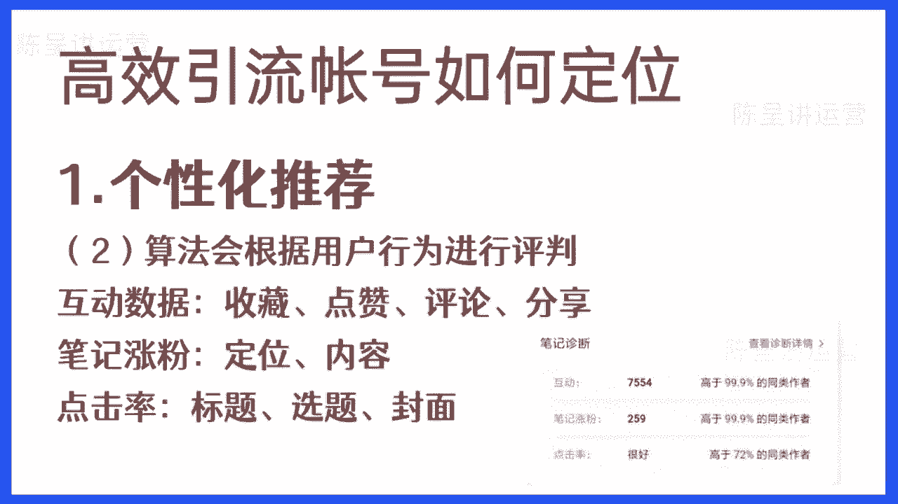

互动数据主要的影响因素包括收藏点赞，评论分享，而笔记涨粉的影响因素包括了定位和内容，笔记点击率的影响因素包括了笔记的标题，选题和封面，当然上述的几个关键的数据，我们会在后面的课程里面逐步的跟大家讲。

一会呢我们会先讲到定位来跟大家去讲一下，如何能够实现高效的笔记涨粉。

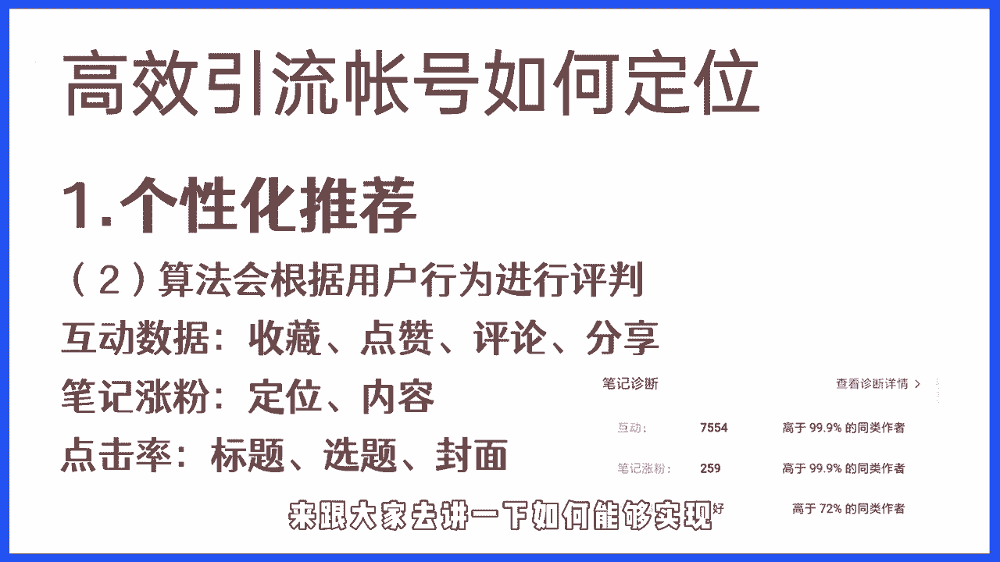

那我们继续先往下讲呃，除了刚才这样一个个性化推荐之外，小红书还有一个推荐机制，叫做关键词搜索推荐机制，除了个性化推荐之外，小红书还有一个搜索关键词推荐的机制，所谓搜索关键词指的是根据用户搜索的关键词。

系统，算法，会把对应的内容和相关的笔记进行一个匹配，然后根据张，然后根据笔记的匹配度，账号的自身的权重等等相关的因素。

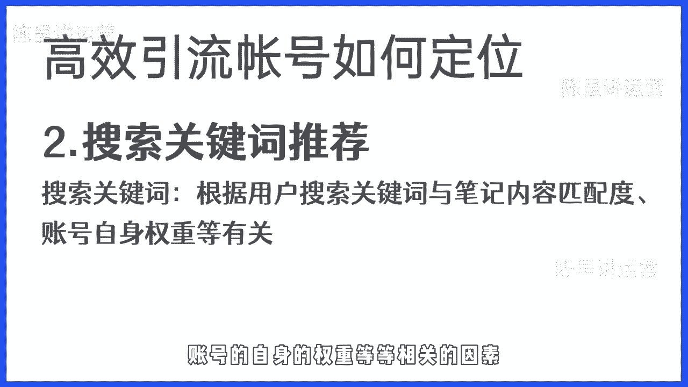

然后来进行对应的笔记排序，而直接影响笔记排序的主要因素，包括了账号的整体权重，还有单个笔记的权重，因为所涉及的内容，不会在短期对我们引流获客产生太大的帮助，所以在后续的加车课里面。

我会针对于如何挖掘和优化关键词排名，优化笔记的关键词排名，逐一的跟大家去讲。

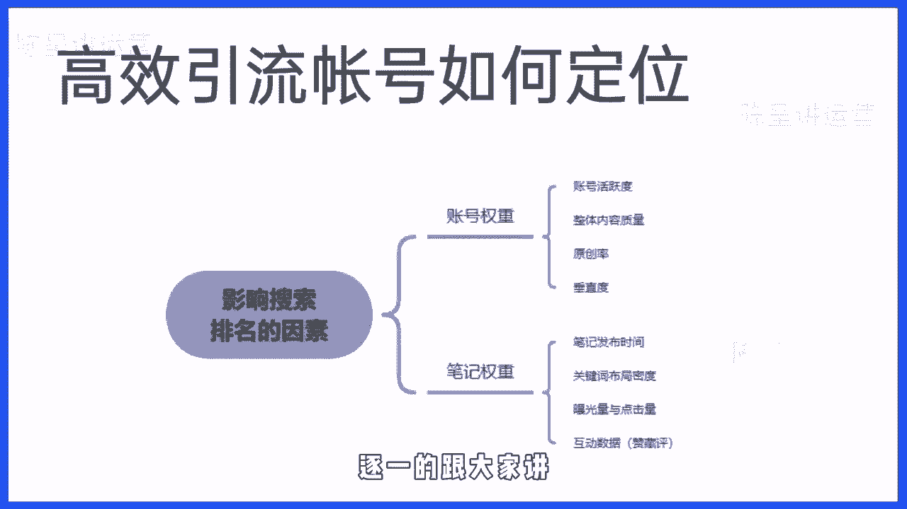

这里的话我们就先简单的讲一下，大家需要了解就可以了，然后另外值得大家注意的是，个性化的推荐，它和搜索排名互相独立，也就意味着可能你的笔记系统推流，给你推了非常多的流量。

但是呢不代表它就一定会有一个好的排名。

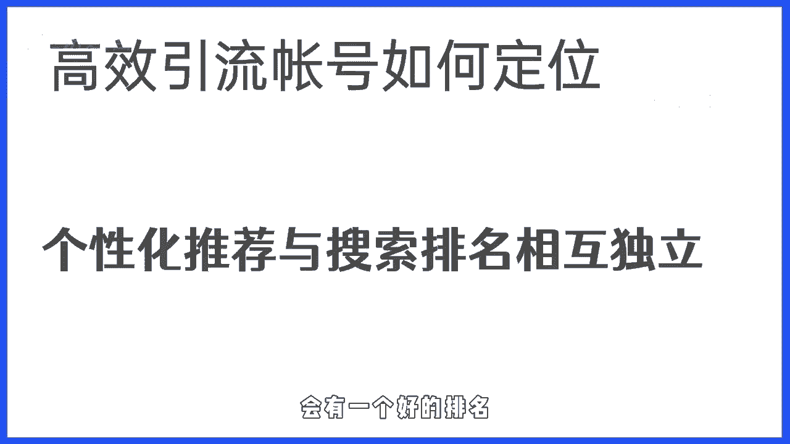

因为彼此之间的算法是独立的，讲完流量入口以及流量的推进机制之后呢，接下来我们就要开始，正式的运营一个小红书账号了，那在正式的运营小红书账号的第一步呢，我们需要去做一件事情，就是对我们的账号进行定位。

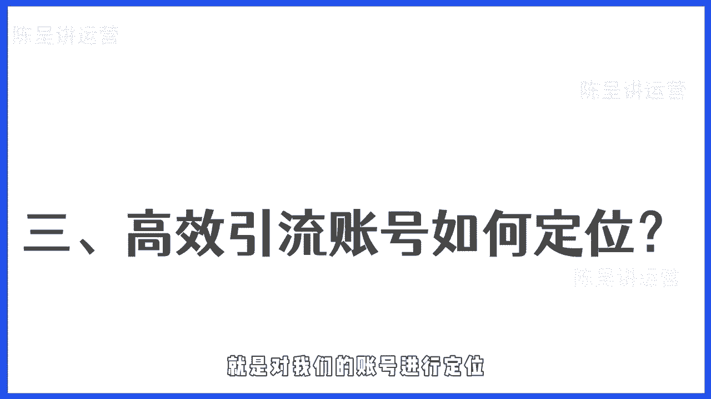

账号的定位是什么，简单来讲就是为我们的账号塑造一个人设，让用户清晰的知道我们是做什么的，那定做定位的好处是什么呢，做定位有如下三个好处，第一树立人设体现价值，第二能够提升用户转粉率。

第三个好的定位是自带广告曝光效果的，而这三者都是为我们。

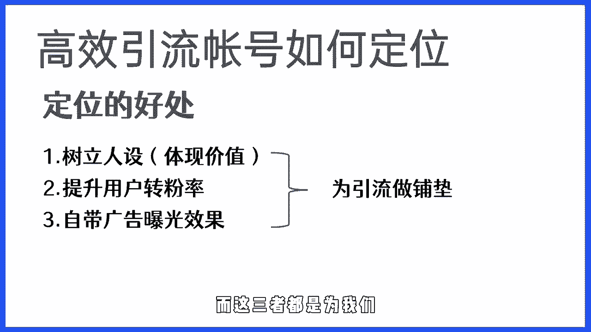

都是为我们接下来的引流做铺垫的，那接下来我们就逐一给大家去看一下，首先好的定位是可以塑造人设的，在这里的话我们准备了三个案例给大家看，通过这三个案例，大家是否能够快速的知道，这三个账号分别是做什么的。

首先我们根据这三个账号的头像，名字和个人简介，是否就能够马上认出，是否马上就能够知道，他们三个账号分别是做什么的，第一个账号是做的是女性情感，第二个账号做的是什么，做的是教别人做个人IP的账号。

第三个是教别人学插画的，你看当我们把人设设置好之后，我们就能够让用户在没有完全的了解我们之前。

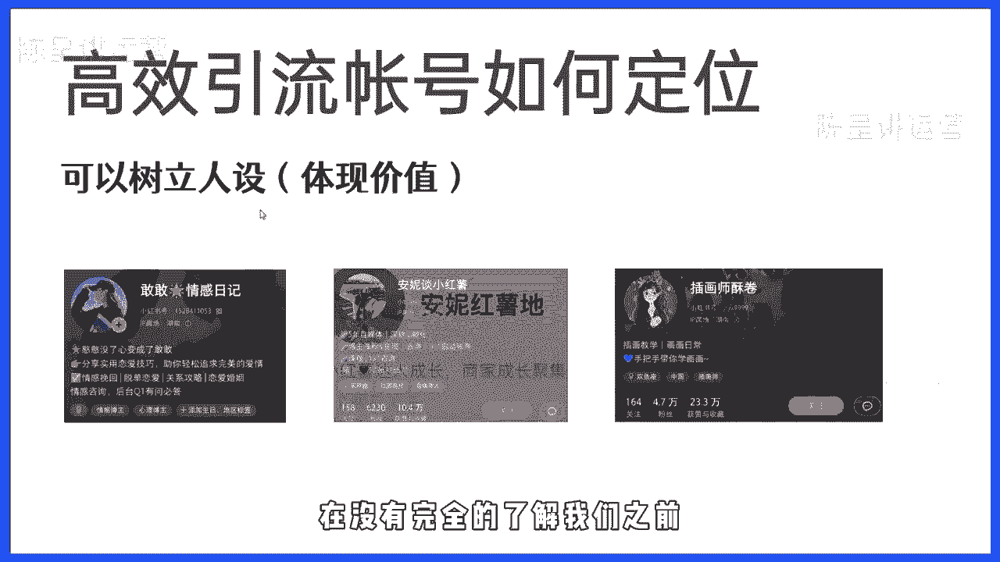

就能够快速的知道我们这一个账号是做什么的，能够快速的建立一定的价值，另外呢就是好的定位，它能够提升我们的涨粉率，以及自带广告曝光效果，那在这里我给大家看到的是，我上个月也就是7月份的时候。

我运营的一个新号，在这里大家会发现我在7日的数据里面，其中主页访客的数据为1031，而我新增粉丝有318，也就意味着我1000的访客，就能够有30%以上的这样一个涨粉率。

而这样一个涨粉率之所以能够有这么宽，而之所以这个涨幅率会这么高，主要也是来自于我的账号内容以及我的定位，另外呢就是当用户点击我们的主页之后，我们账号的定位也会给我们带来，对应的广告曝光效果。

那我接下来我们就围绕着定位的三件套，来跟大家讲一下，如何去进行账号的一如何进行账号的有效定位，那这里的话我们就会从名字头像。

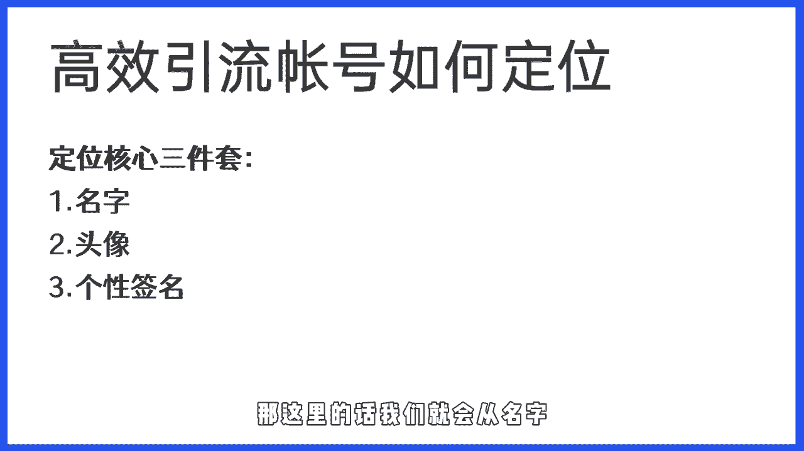

个性签名来针对性的去讲，首先呢我们先讲名字，这里的话给大家推荐一个爆款的取名格式，简单好记的昵称加细分领域，这里给大家举三个例子，小齐说车还有这个英文名字，爱摄影，然后呢还有一个就是杠杠的情感日记。

大家有没有发现我们只是通过这三个名字，我们就能够快速的知道，这三个账号到底是做什么的，对吧，当我们的账号的名字能够取到一页，能够取成，能够取到，让别人一眼就能够知道我们是做什么的时候。

那你的名字取的就是比较有OK的，你这名字取得就比较的不错。

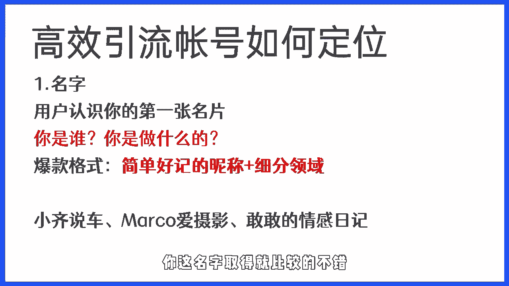

那另外呢除了名字之外，还有一个就是头像，头像的话，就是头像也是用户在第一时间，看到我们的小红书之后，对我们的一个个人印象咳，头像代表了用户眼中的我们的个人形象啊，头像的话给大家一个建议是以真人头像为主。

这样的话可以真实的拉近我们和用户的这样，一个距离，当然如果说你不用证人，只如果说你不想用真人的头像，只要你的头像是真实加好看。

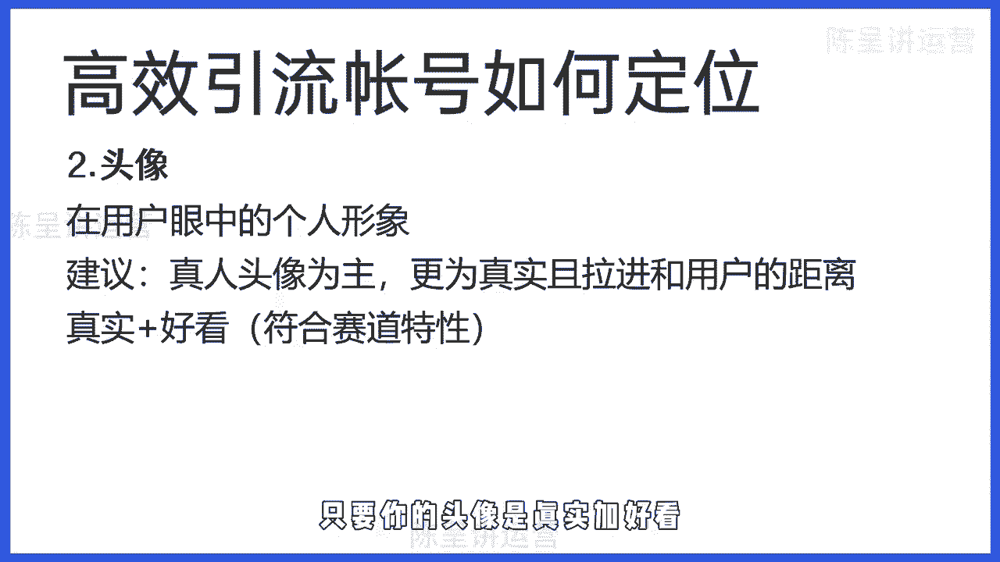

符合赛道特性的也是可以的，第三个呢就是我们的个性签名，个性签名的话会直接影响到你的账号的涨粉，所以这一块的话非常的重要，在这里的话也给大家一个个性签名的公式，这个公式呢也是小红书里面很多的优秀博主。

他们都在用的一套格式，相关于个性签名的几个比较不错的案例，让我们看到第一个光华同学心理咨询，那我是谁，他写的是个人独立执行心理咨询师，我是干什么的，我会分享心理学知识以及自己的一些个案经历。

他能够给我们带来什么呢，首先他这个账号会分享心理学的知识，并且呢可以给你提供心理咨询，另外一个英语丽娜老师，那他是谁呢，他是一个英语老师，然后呢有8年的教龄，相关于个性签名的案例的话。

也给大家准备了三个，通过他的个性签名，我们就能够立刻马上的，知道他们分别是做什么的了，而他们也而他们的整个个性签名的话，采用的也是这样一个爆款公式，所以大家直接去套用就好了，非常的方便。

那讲完这样一个定位的三件套之后呢。

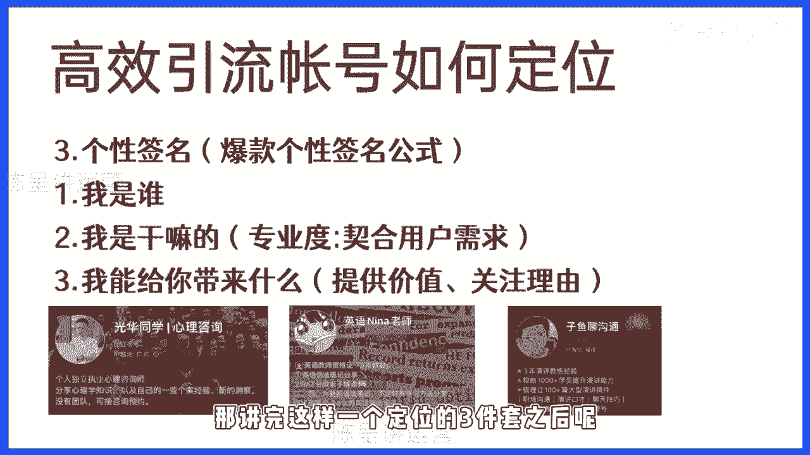

我们接下来就要讲到另外一个知识点，就是高效引流人设的分类。

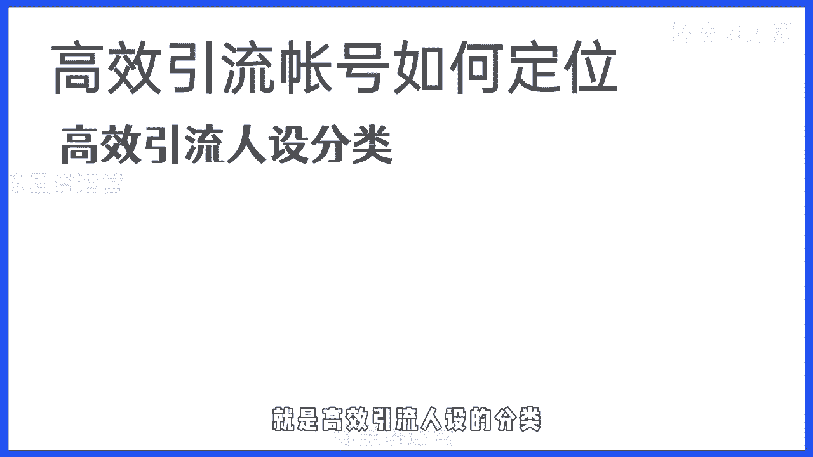

那我们作为一个，那我们想要通过小红书引流，那一般来讲我们有两种人设是比较好用的，首先一种人设是专业型的人设。

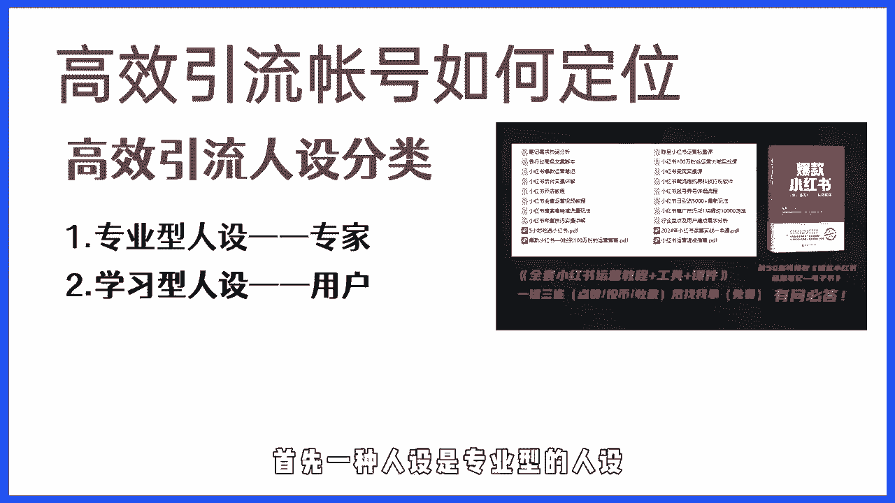

也就是我们所谓的专家型人设，另外一种人设呢就是我们的学习人设，也就是我们站在用户的角度来进行，一个内容的创作啊，这两种人设呢分别有它自己的优势和特点。

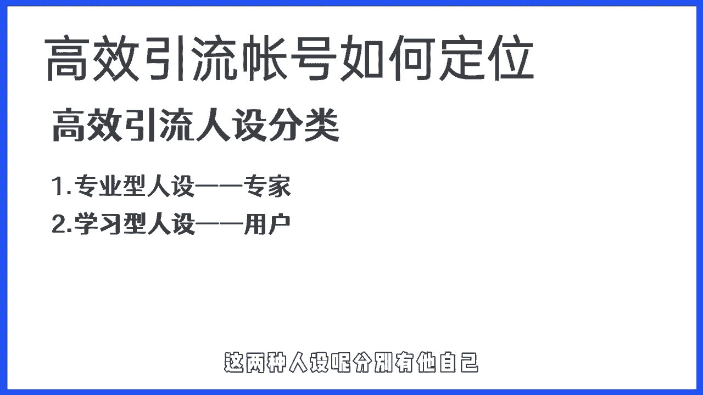

我们逐一的来给大家去进行一个分析，就拿杠杆的情感日记这个账号来分析，这个账号呢是我之前做的一个账号，这个账号就是典型的一个专业型人设的账号，之前这个账号我就只运了一个周，差不多就只发了六篇笔记。

涨了80个粉丝，但是这个号在我没有做任何引流的情况下，当周就有超过30个用户主动来私信我，找我进行情感咨询，那我们来看一下这一个账号是如何设计出来的，首先我这个账号做的是女性情感相关的内幕。

所以我就会很清晰的定义我的产品，目标是有情感需求的女性，另外根据用户的需求，我也对我的账号的更新范围做了一个设定，包括了情感挽回，脱单和婚姻关系，另外就是人物的设定，我这一个号做的是女性。

因为女性人设更容易获得用户的好感，毕竟女人更懂女人嘛，另外呢就是我这个账号除了我更新，除了我这个账号更新的内容之外，我还给他们提供了一个价值，就是可以给他们给予情感咨询的这样一个服务。

那我在我的整个个人签名上面，做了一个简单的调整，就是我也没有直接让他来找我，但是呢我会告诉他，如果你有情感咨询的需求，后台找我，后台扣一，有问必答，这样的话就是能够拔高我们的一个人设。

所以当一个用户他看到了我的内容，觉得我的内容质量OK的情况下，他就会主动的来私信我，所以这就是一个好的专家型人设。

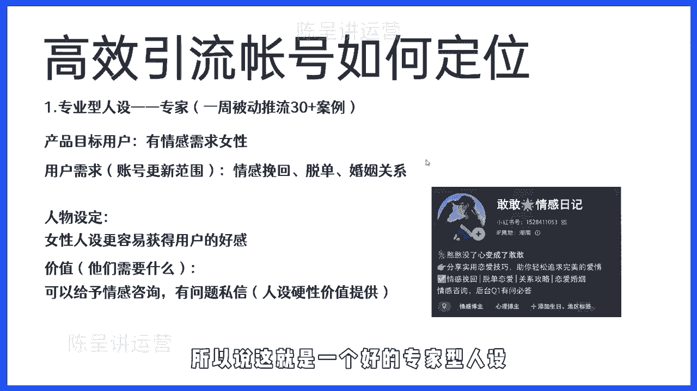

设置好之后，它能够起到的一个作用，另外呢就是我们的学习型人设，学习型人设呢就是站在用户的角度出发，去更新内容，更新的内容方向跟专家型人设就会有一些区别，比如说会有一个个人的学习经验的分享。

个人的学习经历，还有就是一些软广型的内容引，还有就是软广型的引流加资料，分享型的内容，这里的话给大家看一个学习型人设，他发的一个内容，大家会发现，其实这一篇内容，主题讲的就是一个超30多岁的全职妈妈。

30多岁的全职妈妈学摄影四个月接单了，然后在他发的这个笔记的评论上面，大家可以看到有很多的用户在问他，他之前学习摄影的时候是怎么接单的，包括他是怎么学习的，能不能把他学习摄影的那个班介绍给用户。

所以说像这种学习型人设呢，可以引起用户和你之间的这样一个共鸣，那像这样的账号的话，主要是偏向于站在用户的角度去撰写内容，去做这样一个合理的账号定位啊。

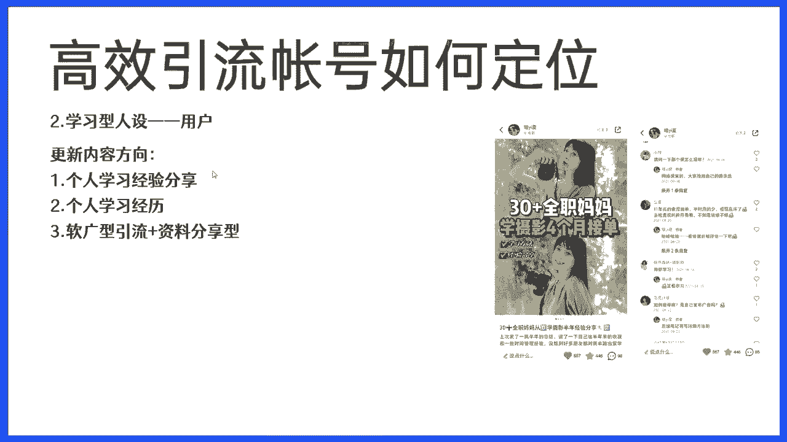

到这里的话，我们整个账号的定位的一个方法，就已经跟大家讲完了，大家可以直接套用我们的定位，三件套的格式，直接立刻在较短的时间，马上就能够设计出一个，能够高效引流的账号定位，当我们了解了小红书的推流机制。

也了解了我们做账号的第一步，我们对账号的定位，那么接下来就会涉及到账号注册了，在这里的话就会有一个注意事项，要跟大家讲一下，首先第一个我们注册的小红书账号，尽可能保尽可能的是一机一网一耗。

什么是一机一网以后呢，就是我们对于我们一个手机，对应一个小红书账号，对应一个独立的手机流量，那这样做的目的是什么呢，就是为了更好的保障我们的账号的安全，当然这也有个前提，比如说你像我们自己团队。

我们的话，因为我们周围所有的人都在做小红书运营，所以说我们每一个账号都是一机一卡一号，如果在一个WIFI下面，我们同时运营多个账号，系统识别到之后，对我们的账号会有，对我们账号的推荐会有很大的影响。

另外呢，如果说我们在一个WIFI下面同时运营多个账号，如果我们有一个账号出现了问题，那么可能就会直接影响到其他的账号啊，还有一个就是当然对大家来说，如果你的WIFI或者说你自己的网络环境。

从来没有做过任何的小红书，那其实你一个WIFI下面同时做两个账号，是没什么问题的，但是为了保证安全，最好还是一机一号一网，这样的话会更安全，另外呢就是关于养号，首先养号它是一个悖论。

我们团队做差不多也有400个账号了，我们基本上没有一个账号会养号，所以养号呢基本上也是属于一个悖论，但是在这里的话有一个点，大家要注意就是有几种类型的账号需要养，首先第一个就是异地登录。

那异地登录的账号的话，我们差不多会有三天的一个养号期，而我们做养号的动作的目的，其实主要是为了让我们的在一个小红书账号，它能够稳，它能够变成固定IP，比如说之前这一个账号可能是在小红。

可能是在成都登录过，那我拿到长沙之后，我就会有三天的这样一个养号期，让它固定的这样一个IP变成长沙，另外呢就是更换硬件设备，更换硬件设备的时候呢，一般来说，我们也会有一天到两天的这样一个氧耗期。

这一个养号主要的就是让系统识别，我们不是恶意的在更换硬件设备，只是做了一个正常的一个更换，所以我们差不多，我们所以我们会养差不多一到两天的时间，还有一个就是，如果说你之前你的手机号注册的账号。

限流过或者被封禁过，那像这样的账号注销了一个星期之后，我们再注册，我们也需要养它，那像这种这种账号呢，我们需要养7~10天，因为这种账号之前违过规，所以这种账号我们需要养一养，这样的话会更好一点。

当然特别是封禁的账号，一般来讲我都不建议大家再用，或者是就算是用，也不能直接注册，后面的加仓课里面，我们也会教大家一个方法，怎么能够把这种账号二次利用，然后这个的话就是关于我们整个账号注册的。

一个注意事项，大家需要注意，下一节课我们就会开始正式的讲到小红书。

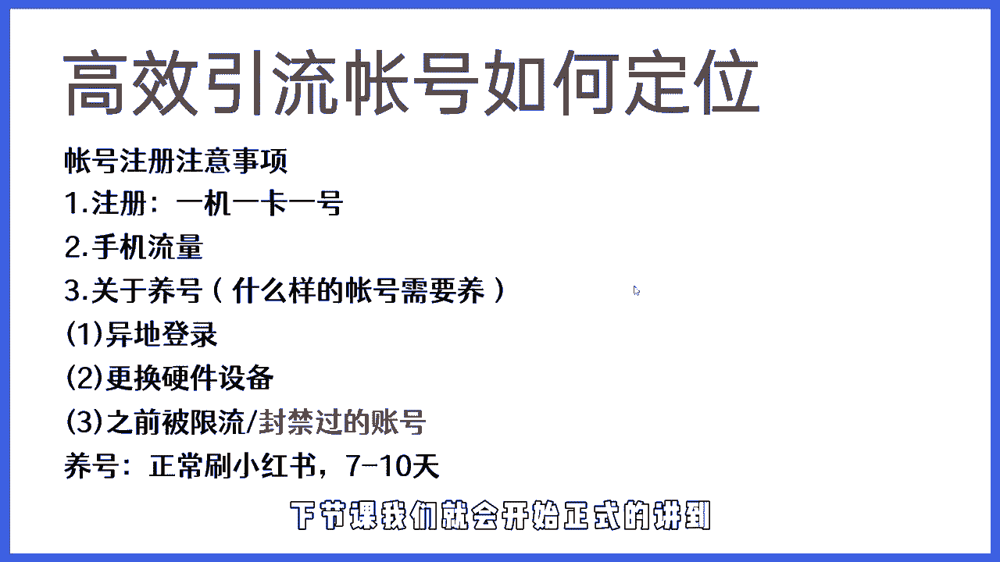

运营篇，会跟大家讲到三个爆款流量的选题结构。

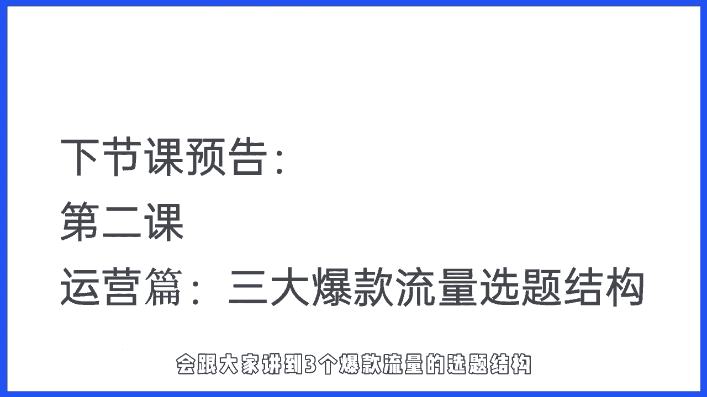