# 【2024版小红书体运营教程】全B站最良心的小红书开店运营教程！小红书体开店 起号真的快，赶快点赞收藏起来 - P46：43、新手小红书运营-小红书店铺规划（2） - 小飞红书运营 - BV1t4VKedErh

大家好，今天给大家分享的是小红书全集系列，分享的第七大课时啊。

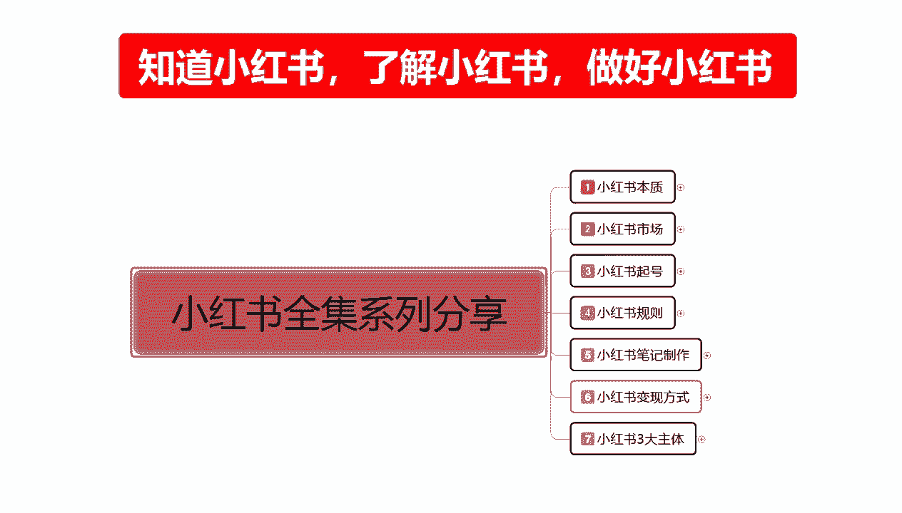

小红书穿搭主体的一个店铺运营的一个内容，这节的话给大家讲解，我们前中后期规划里面的中期规划，就是店铺运营中期我们应该怎么去操作，整体来说中期规划的话，他的一个重点的话还是非常多的。

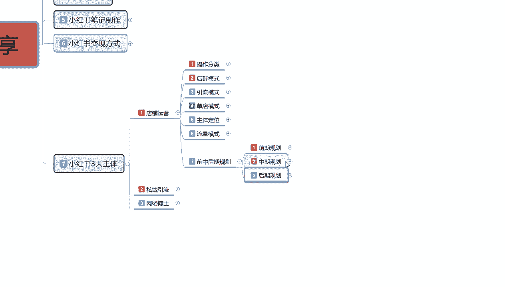

在这里呢，我不知道是给大家进行详细的一个讲解呢。

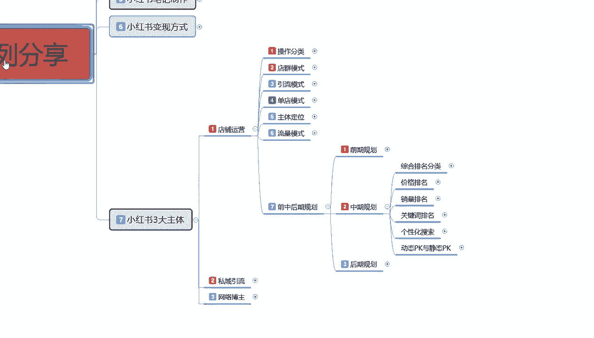

还是说我们大概了解一下内容就行啊，呃因为整个内容的话说说实话你再去多讲的话，很多人他听不下去啊，因为他前期的一个数据属性都没有做好的话，中后中期的一个规划的话，我们再去操作的话，其实很难。

我们先来了解一下啊。

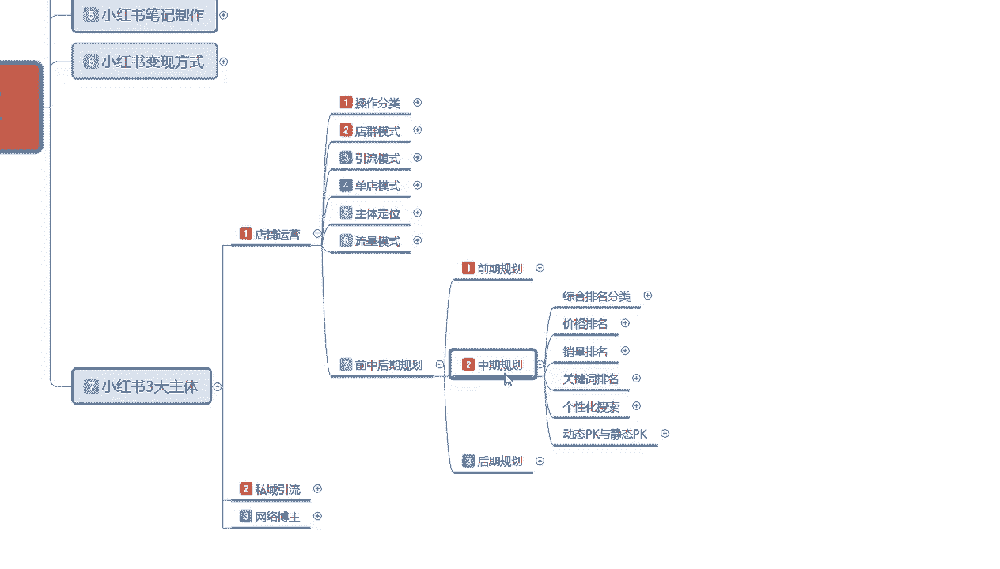

中期规划都有些什么，内容有点大。

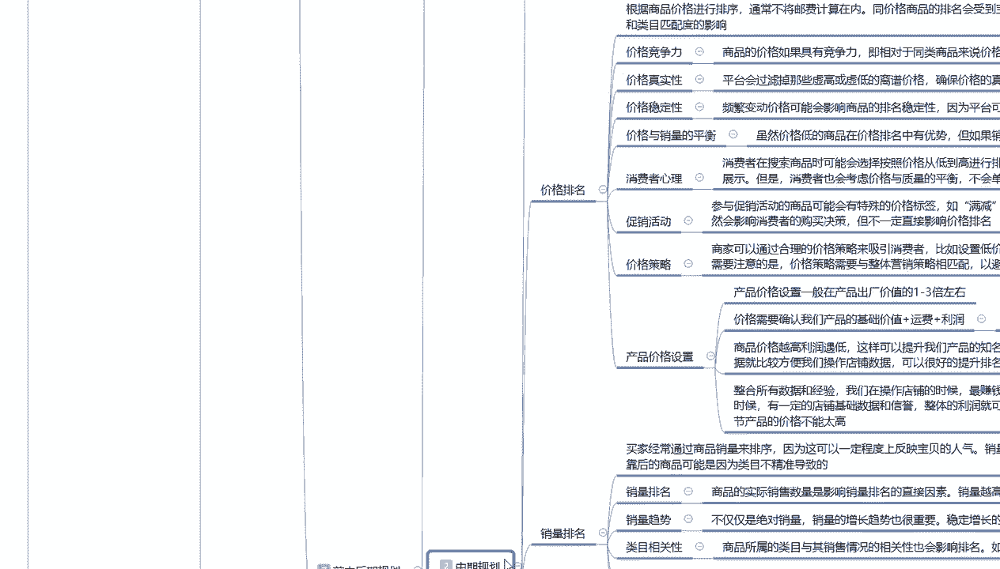

我先给大家把它缩放一下，中期规划的话，这个里面啊，他以首先有一个综合排名的一个分类，一个价格排名，一个销量排名，一个关键词排名，还有一个个性化搜索，然后呢是pk动态pk与静态pk的一个选项。

这里面的所有内容的话，他都跟我们的店铺整体有关啊，我在这里的话，我就给大家讲解一个大概吧，因为我这个内容的话，说实话我是单独给大家讲过一期的，大家有兴趣的话可以去搜索啊，同类的一个内容去观看一下啊。

我在这里呢就给大家讲个大概吧，首先是综合排名分类，综合排名分类的话，他总共分为16项啊，因为中期的话我们前期数据做好以后，我们中期的话我们就需要考虑这些排名，你的排名越高，给你的展示和曝光也就越高。

当然这个是我们做的那20%的一，个数据属性，跟我们那80%的额外流量，是没有什么太大关系的啊，你我们正常你小红书做店，就是抢那20%的流量，看你能抢到多少啊，综合排名分类呢这个是默认的一个排名。

宝贝排名的一个状态，主要的话是根据店铺的一个综合因素，对宝贝进行排名，考核方面的话，他考核的内容是非常多的啊，它包括商品的描述，主图的质量，单品的一个综合数据以及店铺的交易情况。

然后在这个里面的话还有定位和进化，个性化搜索的一个趋势，就是你个性化搜索里面，你能不能满足客户的需求呢，你能框到多少人都在这个里面排名。

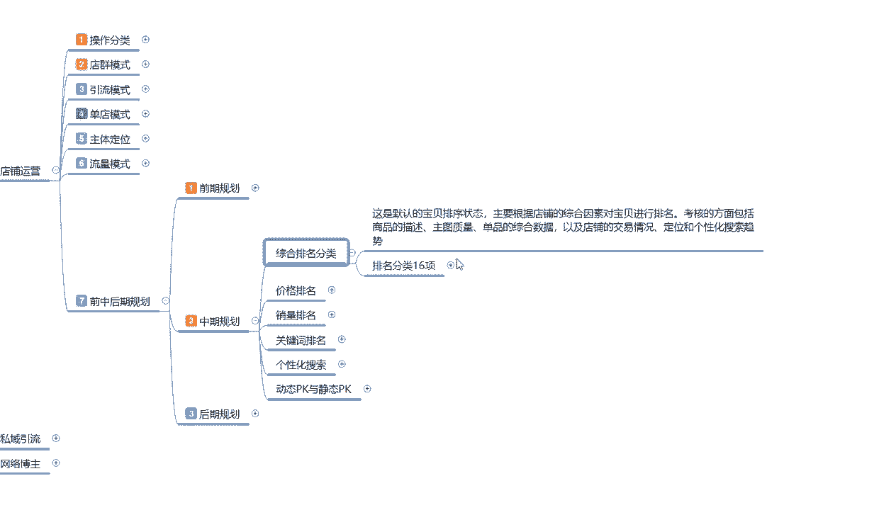

分类16项的话，这里面的一个排名的话，他是非常多的人气销量信誉价格，新店与新品的一个扶持商城优先级下架时间。

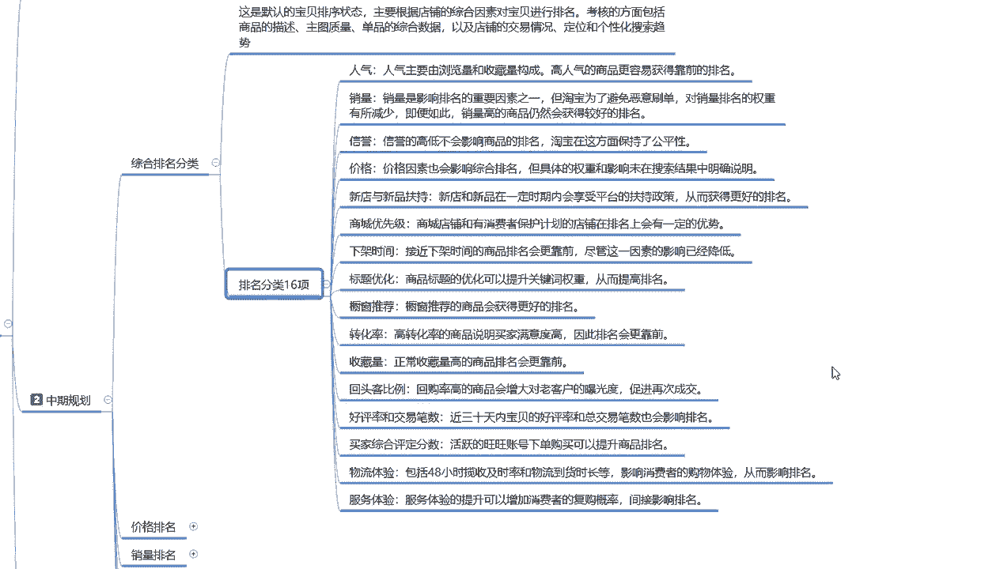

标题优化橱窗推荐，说推进的话，说实话这个不在这个范围以内啊，这个是之前找的一些数据，包括转化率，收藏率，回头客比例，好评率，交易数量，这个就是16排名综合排名的一个怎么说呢。

就是16项选择里面现在的话是15项，刚刚删除，那个是以前有，但是现在没有了啊，大家了解一下就行，这整个十六十六项排名，你在16项里面的排名，决定了你整个店铺中期规划的时候，我你能把它做到多优秀。

你的排名就有多高，排名高了以后，那20%的流量你能抢到的概率就越大，你做不好的话，那你你排名上不去，说实话你的一个整体数据量就不是太好做啊。

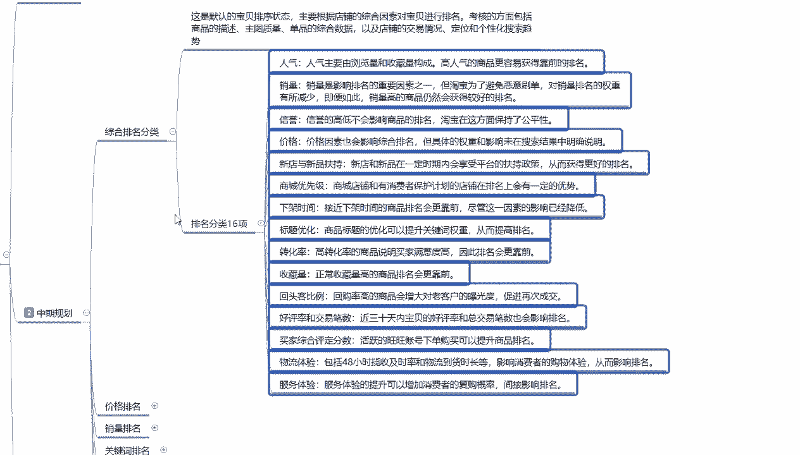

这个就是综合排名分类，往后面的话就主要就然后呢，就是价格排名和销量排名。

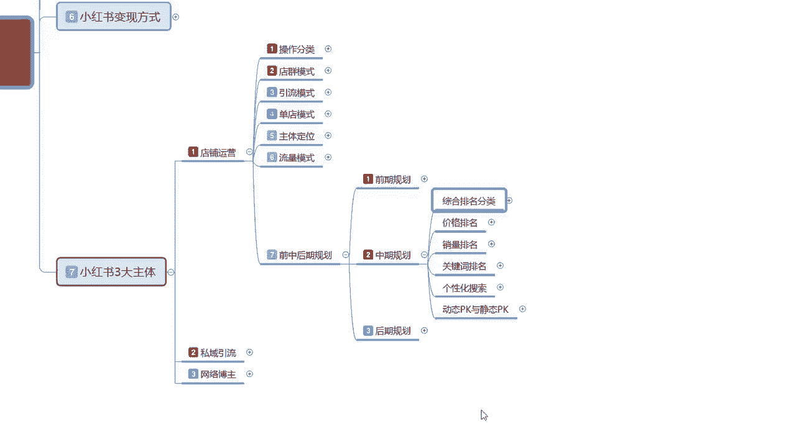

价格排名的话包括他整个内容啊。

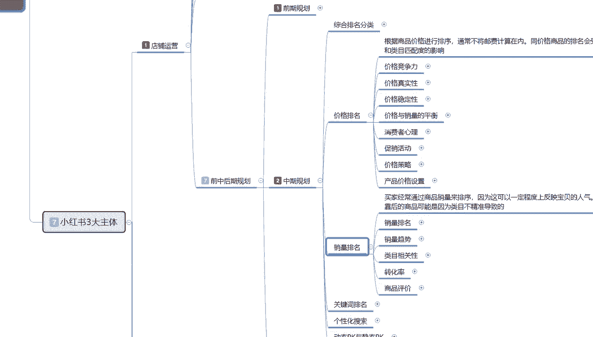

价格排名和销量排名，他整个内容其实是非常多的，他是跟价格排名，首先我们了解价格排名啊，价格排名的话，它是根据商品的价格进行排序的，通常的话会将由非集团在内啊，他嗯怎么说呢。

基本上都是包邮同价格的一个商品排名的话，会收到宝贝关键词排名的一个呃，匹配度和关键词排名的一个匹配度，和类目进行匹配，比如说你的一个同商品价格类目，决定了你排你所在排名的一个位置，所在排名的位置。

然后的话他通过价格的一个竞争力，价格的一个真实性，价格的一个稳定性，价格与销售量的一个平衡，通过这几个点，来确定你整个产品的一个排名系统，你这几个点如果说你把握不好。

那他整个的一个排名系统的话就是崩溃的，我我这整个前中后期规划里面，说实话这整个一个内容我暂时给大家看的话，其实很多人他不理解，但是你只需要怎么说呢，因为我这一期整个一期的课程的话。

是让大家了解整个运营系统，如果说你们单独想了解这一个呃，店铺运营前中后期的规划的话，他其实单独列出来，他可以讲60~80节的一个课程内容，就是给大家分享的话，光讲小节的主体内容，我可能都会讲60~80。

但是呢我这个如果说把数据量做太大，我后续的话有些东西我没办法上传，所以说我在这里呢就给大家介绍一下啊。

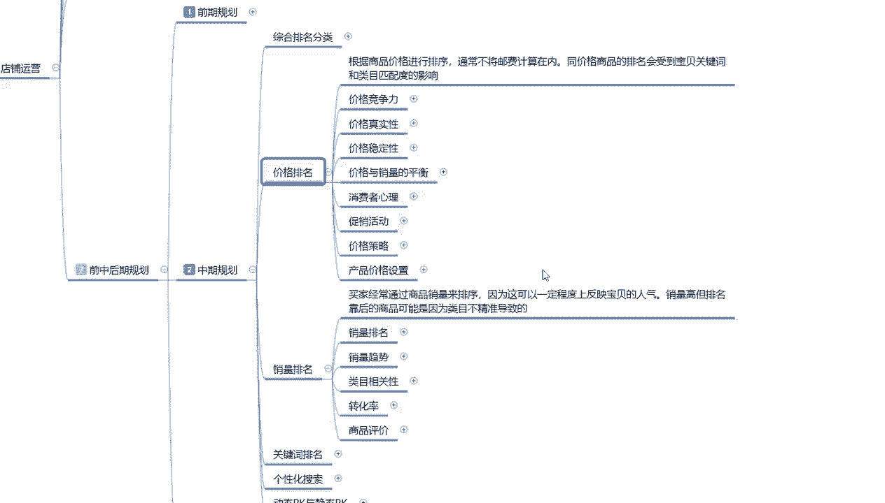

大家了解一下我们中期的一个排名，他都有什么啊。

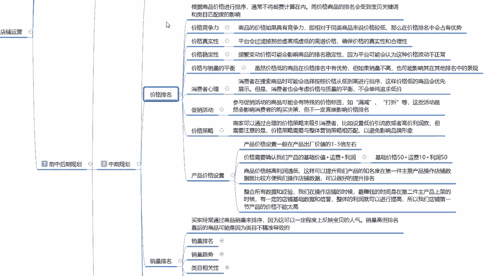

大家如果说对这里面的内容感兴趣，截个图啊，自己去研究研究，其实也可以的好吧，多的呢我就不给大家进行详细的，一步一步的解释，因为他这个里面的话，说实话每一个每一个重点都需要我们去把控，去了解。

去关注的好吧。

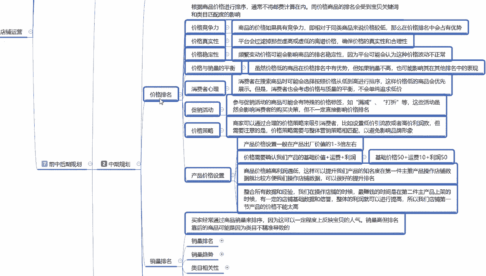

这个呢就是价格排名，我们所需要注重的一个重点，然后在销量排名里面啊，销量排名的话，就是说他通过我们产品进行了一个销售，数量，在小红书店铺运营里面他都是有的啊，买家经常的话就是通过商品的销量来排序。

因为这这个的话可以一定程度上，反映宝贝的一个人气销量高，但是排名靠后的商品，可能的话就是说因为我们内幕不精准导致的啊，这里面有销量排名，销量的一个趋势，类目的一个相关性，转化率和商品的一个评价。

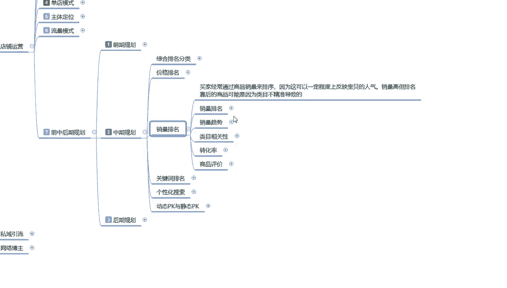

大家进行进一步的了解就行了啊，因为中期规划的内容说实话是非常多的，不好去给大家讲，知道吧。

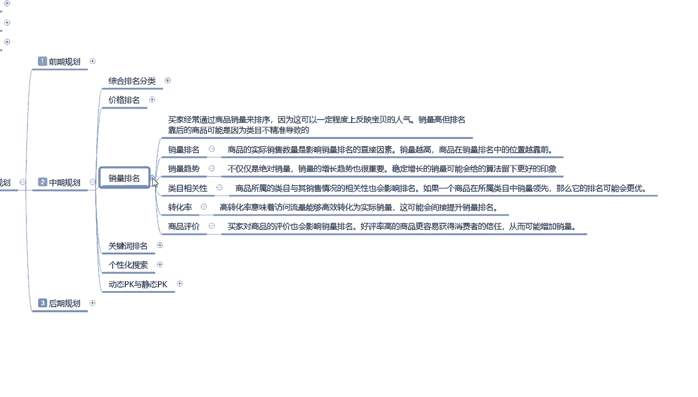

额同样的关键词排名啊，个性化搜索动态与静态的一个pk。

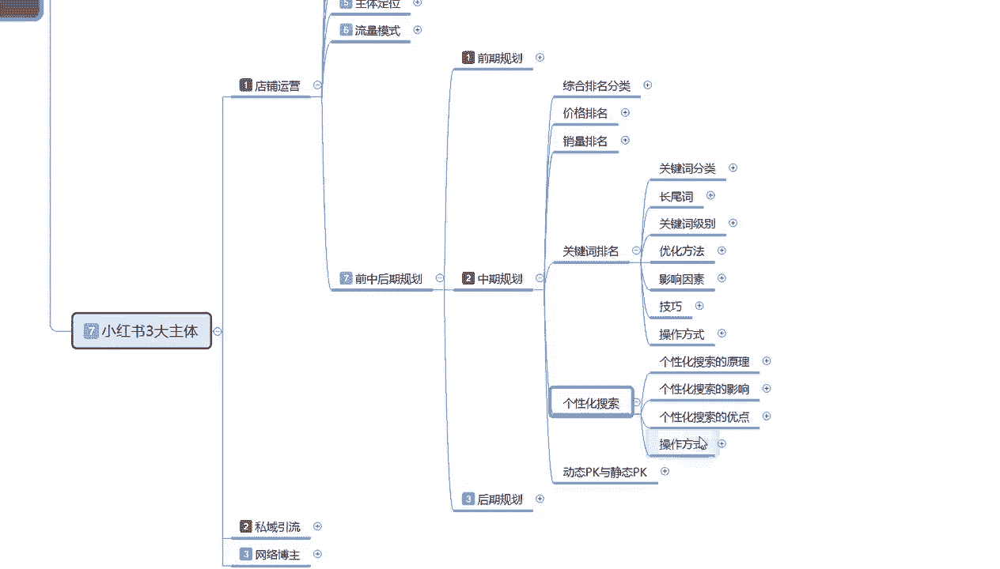

这整个一套内容的话，我会单独给大家重新列一个大的一个呃，小红书系统课给大家进行分享，因为在这里去给大家讲的话，我这个因为课程录制已经是非常多了，就不再过多讲了，大家先了解一下这部分的内容，好吧啊。

关键词排名的话有关键词的分类，长尾词，长尾词和组关键词它都是有区别的，它每一个词汇，每一个组词的方式，它都是有排名的，就是搜索的前后知道吧，你比方说你卖买短袖吧，买T恤，买短袖，男士T恤。

女士T恤他在搜索T恤两个字是一个排名，男士女士男士T恤又是一个排名，女士T恤又是一个排名，他是所有的后台系统啊，小红书的所有后台系统，它的关键词排名他都是单独搜索的，知道吧。

你这个关键词的排名就是同类产品，同类价格，同类内幕，100个排名关键词，然后根据用户分析所搜索到的人群，他都在这个范围价格，然后就看你的排名词汇，你的排名在这个词汇里面在多少名。

你去做这个词汇的一个属性，那么你可以就可以获得这个词汇属性的一个，排名的一个展示，曝光和搜索量，个性化搜索也是一样的，他的一个整体内容的话，说实在就是用户的一个属性，结合我们店铺的属性所对应的啊。

给我们找到就是你个性化搜索做得越好，那么你的用户就越精准，那么到后续的话，你个性化搜索做完以后的话，你整体这个数据量的话也就越好，动态与静态pk，我在这个地方的话，说实话啊就不给大家讲了。

因为这个的话嗯啧怎么说呢，动态pk和静态pk你们暂时涉及不到，你们如果说真要涉及到动态pk和静态pk的话，那么你们就基本上在第四，就是基础流量就已经在第四层级和第五层级了，就小红书。

基础流量都应在第四层级和第五层级了，你在这个阶段的话去做动态和变静态pk可以，但是他的效果量不是太大，你在前期去做的话也可以做，但是有提升，但是你后续的数据你没办法把控，这个做横和不做。

就看我们自己大家怎么去判断了好吧，后期呢我单独把这一个整个前后，中期的一个规划，单独再拿一个大的课时给大家进行分享，因为这个内容实在是太多，我没办法继续给大家进行详细的一个步骤讲解。

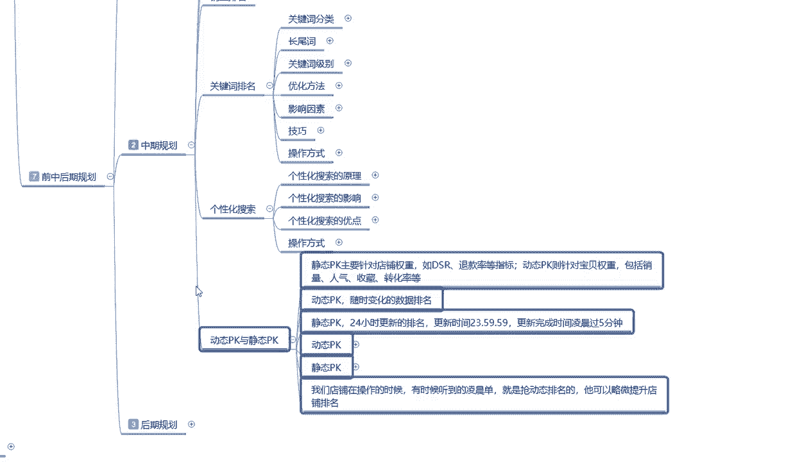

后期规划的话就比较简单了，后期规划的话他是整个的一个运营思路啊，我们把中期做完以后的话，就是后期发展发展啊，两个节点，什么叫两个节点呢，第一个是加大力度投入，第二个是开新店，加大力度投入的话。

就是我在这个阶段，我觉得我店铺还有提升空间，我然后的话在这个里面做数据分析，店铺店铺分析，数据转控，店铺优化，数据维护和平颈突破，从这五个方面开始，就是我们从第五阶段突破到第六阶段，我们要开始付费推广。

懂意思吧，就是我已经从一个小红书中层用户，往大用户方面去发展，提升我整个店铺也好，品牌也好啊，整个一个运营系统的一个内容，它就包含了这些些数据啊，数据的一个分析，店铺的分析，数据掌控包括了这六条属性点。

如果说我们碰到这个瓶颈期了，我觉得我的属性，我的店铺我没办法再加大投入力度，再去操作它了，为什么，因为我已经到达我产品的一个上限力度了，我再加大推推广的话，说实话嗯一半一半，但是我不想冒这个风险。

那我们就可以考虑下一个点开新店嗯，吸取我们这个店铺整体运营的一个计划与思路，然后的话和这个店铺做类似的一个商品，然后按照这个模式去做第二个店铺，肯定效果比第一个店铺要好。

然后我们再考虑是不是要做到这个程度以后，再加大力度去进行投放推广，因为这个时候的话，我们的整体的一个，运营思路，有了店铺属性，有了钱，也可以说是保证自己有一定的资金，可以开始进行第二步的一个规划了。

就可以往这个方面去考虑了啊，做好基础规划以后的话，再做类似的一个商品，进行小范围的一个调整就行，这个就是中期和后期的整体规划，说实话这两个的话是单独啊做大课时讲解的，在这的话我就啊。

不再给大家进行过多的一个分析，分步去讲解啊，因为它内容确实是太多了好吧，主要是让大家了解一下，然后的话这一节呢分享就到这，下节给大家讲解一下我们的一个小红书。

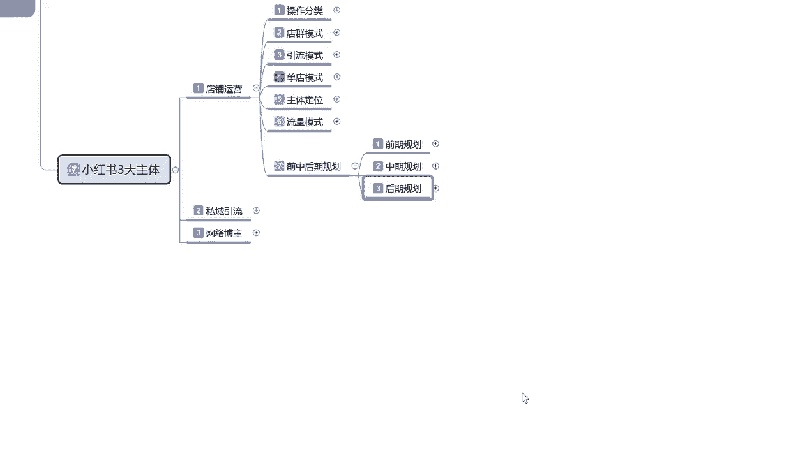