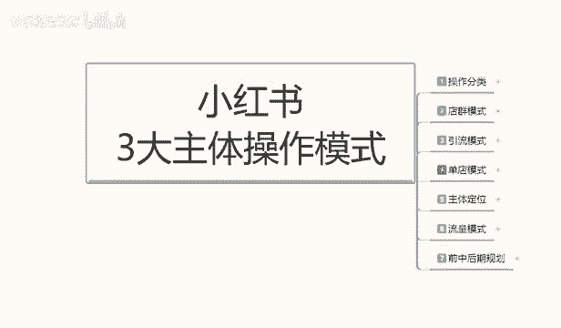
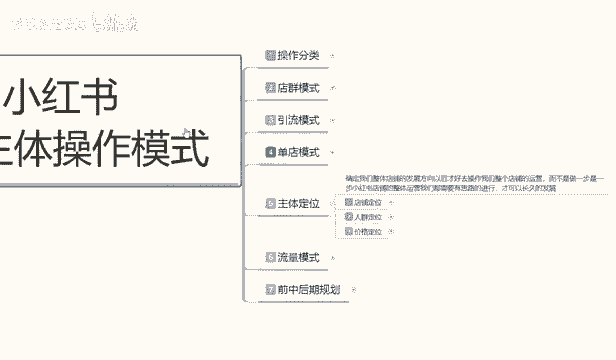
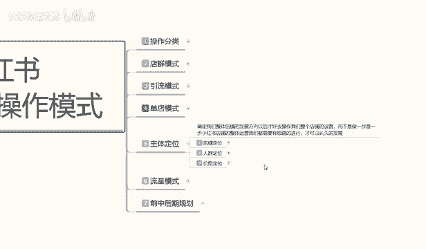
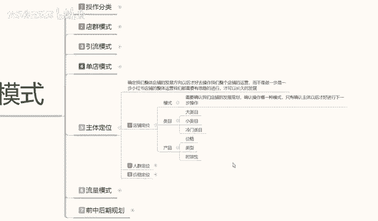

# 【2024版小红书体运营教程】全B站最良心的小红书开店运营教程！小红书体开店 起号真的快，赶快点赞收藏起来 - P46：44.小红书0基础开店-店铺主体定位 - 快乐稳定发挥 - BV1AbtoebEjX

大家好，今天给大家分享的是小红书三大主体操作模式里面的啊第五个小节课程啊，主体定位模式之前给大家也讲过了啊，我之前给大家说的是嗯店铺的一个模式操作。现在呢是讲。啊。

呃应该说是之前给大家讲解的是小红书整体运营模式的一个操作，三大运营模式嘛。电池模式引流模式和单电模式。你不管是在小红书上面，你是做引流也好，做电群也好，做单电也好。

它的三大整体模式的一个效应我都已经给大家说了。这节课是教大家啊，小红书里面。

我们确认整体店铺的一个发展方向。为什么你在三个模式里面，你不管是了解电群也好啊，了解引流模式也好，了解单点模式也好啊，你都是要选择一个模式的一个方向去操作的那你的方向操作的话，说实话电池模式你基本上。

固定形态在这个地方，你没什么好了解的。引流模式的话，你前期本来就做的主要是笔记啊，店铺是可以口无的。说实话正常我们来讲的话，只是说单店模式里面啊选择一个重点突出的去给大家讲解一下。

因为其他两个的话它的一个整体的话和店铺分类啊，就是跟我们主体的话，三大操作模式的一个课程的话，会有一定的冲突。所以说在这里的话，我会单独拿单店模式。或者说是多点模式的一个爆款形式。

给大家去做一个主体定位。大家了解这个模式以后的话，说实话，你再反过来去操作店群也可以操作引流模式也可以啊，它基本上都是互通的，只是看我们大大家对于这个类型的东西怎么去了解？

而且我给大家讲呢主体定位为什么是讲主体定位，讲单店模式里面不讲引流和店群呢。因为你主体定位里面的单店模式，它的数据量是最多的。啊，大家记住一个点啊，单店模式的主体数据量是最多的。

它要优化的数据和我们对整个小红书系统，包括网络运营系统。他整个一个了解，你把它了解透彻了以后，你再去做任何店铺，他都好做。如果说你不了解的话，直接去碰店群或者是引流的话，你不好操作的。

所以说我们先了解整体的一个单天模式，就是整个小红书运营系统，它是靠什么样的一个后台系统来运行的。我们才往后才好往后面去发展啊。所以说今天的话主要是给大家介绍一下啊主体定位。主体定位这个里面的话。

它有店铺人群，店铺定位、人群定位和价格定位三个定位啊。说实话，这是一节课他是讲不完的，我是给大家准备分三节课到四节课来给大家讲解。好吧，那直接开始我们。呃，这一课的主体内容，店铺的一个定位啊。

确定整体店铺的话，就是说店铺定位是什么？它是确定我们整个小红书运营系统整体的一个发展方向啊，我们只有确定了方向以后，我们后续才好去操作我们整个店铺的一个运营，而不是说做一步想一步。

想一步做一步做到什么地方是什么地方，那样的话，你小红书店铺你在整体运营上，你没有规划到你做好的，你怎么可能去和别人有经验的人去做对比的，对不对？你虽然说你也是想去你没抢流量，但是你这一个流量啊。

这一个用户你能抢到多少，去看你操作，你抢一个也是抢抢100个也是抢，那你何必不再多抢一。对不对？蛋糕就这么大啊，你有能力你就多分一点，你没有能力你就少分一点。说实话，你再没有能力了。回家躺着就行了。

对吧？没必要，就是说我们既然是想做小红书开店的，那你一定是为了赚钱来的。所以说我们一定要先把基础了解清楚，技础了解清楚以后再去做运营模式的一些整体调整就行啊。那这里呢主要给大家讲解一下店铺定位。

什么叫店铺定位呢？小红书的店铺定位啊。

首先第一个是模式，第二个是类目，第三个是产品。模式是什么？首先确认我们店铺的发展规划，却能操出哪一操作哪一种模式，只有在确认主体以后才好运行下一步啊。如果说你的主体模式没有操作好的话。

你连你的下一步它的所有内容都是不一样的。一般说我之前给大家讲的单店模式里面，它还分单爆款和多爆款。你单爆款前期好操作一点，你本来就拿第一款做产品利润的，你多爆款的话，你是拿第二款产品做利润的。

第一款的话只是平价去卖啊，保证店铺无亏亏本就行。对吧那你在这个里面的话，它操作的目标和方向都是不一样的。所以说它的模式你一定要确认好。因为模式一旦出错，你后面的操作的话会影响你整个店铺的一个数据的。

你比方说你拿。你拿单电模式的一个操作去完电。嗯，单爆款的模式去做。多爆款的话，你整个店铺说实话，你第一步起不阶段你就做不起来。因为你整体竞争的话，你产品价格偏高，你就和同和同行竞争的话，你就做不动。

知道吧？别人卖50，你卖80，别人卖100，你卖120。你怎么去卖呢？对不对？你没有自己稳定的一个粉丝流量，别人看都不带看你了，你的图片做的再好，都不都不带进来瞅一眼的，知道吧？所以说看看你自己的话。

要看我们自己怎么去调整啊。所以说模式一定要确认好，你模式确认不好，你后期操作都白费了。这个是类目啊，类目的话，这里面可以分为大类目，小类目和冷门冷门类目三个类目的一个分类。说实话啊。

这里面的话其实内容是太多了，我只是说给大家简单的做一个一个介绍而已。内幕里面大类幕是什么？大部分人实用性的一个产品。啊，服装。食品。啊，呃婴儿用品、玩具等等，这些都算大类目，包括你的化妆品也好。

装饰品也好。他都属于大的类目，小类目是什么？小众类目。嗯。手机手表这种只说搜索的多，但是他做的少，他就属于小众那种。你再比方说成永平。啊。说是纯熟用品，然后的话就是保健品。药品药品的话也算小类目里面的。

它不算大类目。大类目的话这是你整个生活日常。虽然说药药品里面也属于生活日常，但是药品的话它属于特殊。特殊的一个类盟啊。因为你需要认证的，你没有认证，你在小红书上面做不了的。然后的话就是冷门内幕。

什么叫冷门内幕啊？就是定制类产。啊，包括你的手写画板啊，对吧？树描之类的，它都属于冷门类蒙，它这种是属于特定的固有产品。呃，网络。包括那个虚拟。训拟产品啊，就是你比方说买游戏啊，充钱卡啊之类的啊。

买装备它都属于这种的话属于冷门内幕。你要做店铺之前，先确定模式，再确定类幕，你要做大类幕，小类目和冷冷目冷门类目里面的哪个产品。那它这三个类目产品的话，它都是不一样的啊，区别非常大。

大类目小类目冷门类幕它的操作方式也是非常大的。你要确认你做哪一个啊，先选模式再选类幕，最后呢是选择产品。产品里面选选产品的话，你要注意里面的一个价格，一个类型和一个时效性。所条性我给大家讲过了啊。

你做单店单爆款的话，实际上是你最好的话是。一个季度三个月以上，最好是3个月以上。你如果说你做一个季度的话，你做你比方说现在的话啊，按4月份5月份来算。4月底5月初，你按照这种时间去做的话。

那你整个的一个产品的话，你要选择在76789。第四个月去做还可以做，也就是说5月份你必须开始操作了。你过了这个时间段的话，你678它发展不起来。因为你的整个店铺主体你操作起来的话。

你前期你最少花半个月去做整体店铺的一个基础属性。你做完基础属性以后，你才有后面的一个时间段啊，同学一定要把这些呃内部的一个实效性给选好，然后是价格和类型。为什么？这个类型和价格的话，价格是你产品的价格。

你做。单店模式的一个价格也好，做多爆款类的一个价格模式也好，你要把价格先确认出来。第二个呢就是说呃内心。选择大类目里面它是有很多小类目的啊，大类里面，你比方说服装服装里面有。男装女装这都属于大类。

女装里面有半身裙，连衣裙嗯。等等一系列短裙啊、短裤啊之类的内衣啊，它都属于服装里面的这一个大类里面分类的一个小类。所以说你要把类型选好你的产品类型的话，是根据你店铺的人群定位来做的啊。

不是整体整体来说的话，你要把这几个先选三个点。不能说先选三个点啊，先选模式类目，这两个是一个点。这边的话产品里面的话，你包括价格类型和时效性，这是5个点啊，你要把这5个点选清楚了，你才好去做。好吧。

这个呢就是我们整体店铺定位的一个基础要求。你选完这5个以后，你才能开始下一步。你这五个都没选完，你下一步就做，你也做不了，好吧。那么下一节课呢给大家就是讲解这一下人群定位啊，这个时间问题我们就不多说了。

