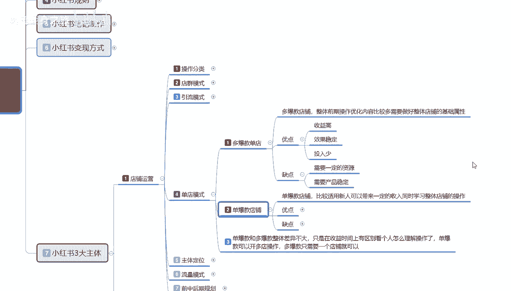

# 【2024版小红书体运营教程】全B站最良心的小红书开店运营教程！小红书体开店 起号真的快，赶快点赞收藏起来 - P48：31.新手小红书运营-小红书单店模式 - 咸鱼翻身之旅 - BV1CQsre1EDo

大家好，今天给大家分享的是小红书全集系列，第七大课时啊。

小红书三大主体的一个内容，这节课的话主要是给大家讲解一下，我们店铺运营里面的一个单店模式嗯。

首先了解一下什么是单电模式啊，单电模式的话其实是和电群模式和引流模式，他们不一样啊，单店模式的话，我们可以把它分为多款多爆款的一个单店模式，或者说是单爆款的一个店铺，他们两个的一个区别的话。

就是说单爆款和多爆款整体差异的话，他是不大的，只是在收益和时间上面有区别，看个人怎么理解和操作了，单爆款的话可以怎么说呢，就是我做单爆款店铺的话，就是我可以开多个店铺，这个店铺报一个，那个店铺包一个啊。

按概率学，我后续的话店铺就算说是流量下滑，流量不好做了以后的话，我第二个店铺还在，第三个店铺还在，我还可以开第四个，第五个啊，你只要把模式了解清楚就可以继续做啊。

多爆款的话就是说我们全心全意去做一个店铺，我想把这个店铺打造成，类似于大品牌的一种模式，那你可以就可以去这么做，你就是你要有很多的自己出厂的一个产品，才可以啊，单爆款的话说实话你可以啧，怎么说呢。

就是你自己没货都能做担保款，多爆款的话肯定不行啊，多爆款你必须要有自己有货源才好做，这就是两个店铺的一个区别。

首先我们了解一下什么是多爆款单店啊，多爆款单店的话，就是说整体它的一个前期操操作，优化内容的话比较多，需要整理好店铺的一个基础属性，他就是单田模式，我们整体去操作的话，它的复杂程度是非常高的。

为什么这么说啊，因为你就这一个店铺，一个店铺你们要做好几个爆款出来，那你首先是不是得先起一个爆款，同时第二个爆款也要商家开始做他的一个数据，第三个爆款也要准备好，正常一个多爆款的店铺的话。

店铺里面最少有4~5款爆款做产品，那么也就是你的后台，你个人所联系的卖家也好，自己做的也好，你整个店铺里面的产品，你最少要提供六款，不同类型的一个产品上去才可以，他们基本上虽然说不是一次性用引擎。

你是爆款报，第一个报，第二个报，第三个报，第四个报，第五个报，第六个他是按顺序报完，第一个连带提升第二个的一个权重，但是他们的一个数据量都是要操作的啊，那他的优点是什么。

收益高，效果稳定，投入少，为什么说投入少，因为单店的一个多爆款的话，它的数据的话就是不需要从头再来，你第一款产品爆出来以后，第二款产品的话，70%的概率可能再去做爆，第二款产品做爆以后。

第三款产品有30%的概率，第四款产品有10%的概率，就是你连续多爆款的话，你不需要再额外的一个，在前期做数据准备的时候，你给他做额销量，做排名，做关键词等等，这些你就会减少很多麻烦啊。

就是说它的一个效果是非常稳定的，收入也比较高，投入少，缺点就是什么，需要一定的资源，为什么这么说，我刚给大家说过了，你做多包五款店的话，你最少自己要有厂家啊，稳定的厂家给你提供六款货。

提供5~6款的一个稳定货源，你才能去做，产品不稳定，你这个多爆款店的话，你都不好做，你卖着卖着没货了，你这个店你基本上就直接嗝屁了，知道吧，这个就是最多爆款的一个单店，就是整个店铺的话。

说实话他这个投入是非常少，但是他对我们的一个需求量要求就就比较高了。

那什么是单爆款店铺啊，单爆款店铺的话就比较适合用新人来了，新人去操作了，可以带来一定的收入。

同时学习整体店铺的一个操作，什么意思呢，就是说嗯，单爆款店铺啊，我们前期在操作的时候，他和多爆款店铺一样，而且他投入的话也是和多方块反电其实差不多，只是多爆款店，他唯一的一个需求量就是产品要稳定。

我们后续的货源要跟得上，单爆款店就不一样了，我前期本来就这个店铺，我自己又没有会员，我去其他地方找个会员，然后来这个地方卖能卖多少，能赚多少是多少，我做完一批我就换第二个店铺，我再去找我。

他就是通过这种方式来保证自己的，就是说保证自己不会亏对吧，赚多少是一回事，但是肯定不会亏，然后他优点就是什么呢，收益高啊，效果稳定，投入少和多爆款电是一样的，只是操作稍微要简单一点。

而且对个人需求就没那么高，他们两个人的优点和缺点是一样的，只是说多爆款店的话，他对于个人的需求会偏高一点啊，但是他持续时间长一点，这个是实话啊，多爆款店的话，一般的话都可以存在3年以上。

你单爆款店铺的话，说实话你就是季节性店铺，你能做个七八个月，这个店铺不倒就已经非常不错了，你基本上就要去做第二个店铺了，正常的话你从第三个月开始，你就开第二个店铺，因为第一个电的话。

基本上就已经开始慢慢的起来了，第二个电你才就要开始步入行动了，基本上三个月到半年左右，第二个点，第三个点，后续你就要陆续陆续一个一个开店，因为你第一个店的持续时间的话，可能就快结束了。

这个呢就是单爆款电和多爆款电，的一个整体区别，额也是单电模式下面所讲的一个内容，就是说结合上面啊。

电群也好，引流也好，单电模式也好，你新人要做的话，说实话你新人如果说不了解，你做网红就去了解引流模式，你做店铺就了解这个单店模式，店群的话，你说实话想了解店群的人，你必须要有网络运营基础才去做这个。

没有的话，建议不要去做，那这这一节呢分享就给大家讲到这，下节的话就是给大家讲解一下我们单电模式，后面这几个的话，基本上都是单电模式的一个整体内容啊，主体的一个定位流量的一个小红书，整体流量的一个模式。

包括前中期，还包括后期的一个整体规划啊，就是小红书店铺你怎么做运营嘛，你要有自己的一个规划思路，后期都往哪个方面去靠好吧。

