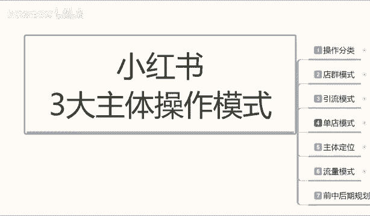
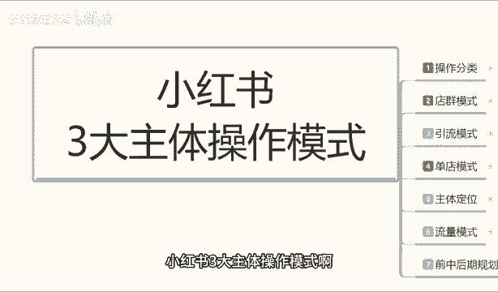
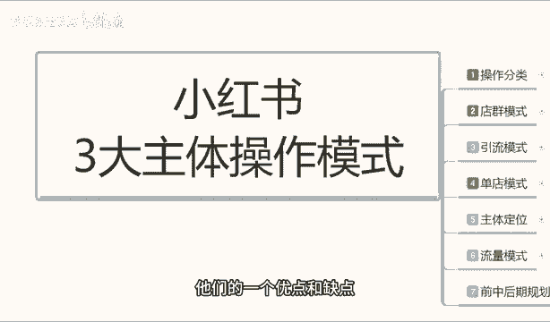
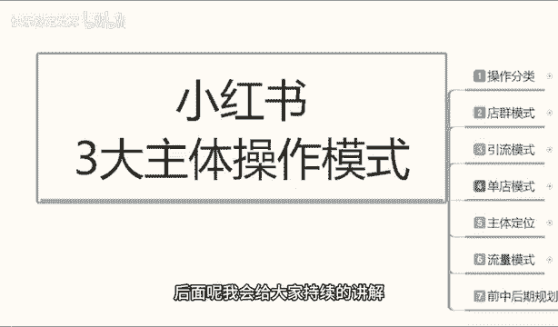
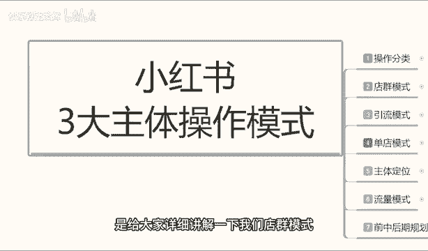

# 【2024版小红书体运营教程】全B站最良心的小红书开店运营教程！小红书体开店 起号真的快，赶快点赞收藏起来 - P48：46.小红书开店-店铺模式详细玩法 - 快乐稳定发挥 - BV1AbtoebEjX

大家好，今天给大家分享的是小红书三大主体操作模式啊。第二课时的一个内容就是我们店群的一个模式。包括上节课给大家主要讲解了，就是说我们一个店群模式，一个引擎模式和一个单点模式。他们的一个优点和缺点。

结合我们自身的情况，我们是比较适合做什么。后面呢我会给大家持续的讲解。那这节课的内容呢是给大家详细讲解一下我们店群模式啊，这小红书应该怎么去操作。

这里呢我就不多说，我就直接开始我们进入我们的一个内容。好吧。整体电池模式的话，其实小红书的电池模式的话，它其实和其他平台的一个电池模式整体效应的话是差不多的啊，没有太大的一个区别。

它唯一多的一个区别的话，就是我们的一个商品笔记和一个流量来源可能会有一定的区分。那这里呢我就先给大家呃讲解一下我们电池模式整体的一个操作。如果说大家想了解的呃整个系统的一个。流量模式和流量来源。

包括我们电区模式做到后期的一个发展规划的话，可以去往后面啊，稍等一等我们的整个系统的话，我都会给大家去详细的进行一个解说。地区模式啊，我在这里呢给大家是分为了三个步骤。第一个呢是店铺的一个规模。

第二个是操作方式。啊。啊，第二个是操作模式。第三个是操作方式啊，这几个点的话是不一样的啊。首先店铺的一个规模，就是说我们去做店群模式的话，店群模式它的规模是越大越好，整体效果也就越好。基础规模的话。

就是说最好我们要有10个店以上才能叫解店群模式。你10个店铺都没有的话，你在小红书里面啊，你包括在其他平台你就不算店群模式。你这叫小打小闹，就是Y玩啊，而且收益还不怎么高的。你要做店群模式的话。

最少有10个以上的一个店铺去操作。它的整体的一个收入来源的话，是通过多店无限上传产品啊，就是无限重复的一个产品发布。这个里面的话就是说电池模式的话，它呃比较简单的原因在什么地方，不需要有自己的产品。

这是第一点，不需要有自己的产品。第二点，它的整体前期的一个固定投入段，我们是可以回收的。你像其他的一个操模式的话，它的一个整体固定收益的话，就是固定投入的话，它回收不了，知道吧？它有可能会亏本。

但是这个电池模式的话，它绝对不会亏本。他只是说赚多赚少，看你能不能做起来的事，而且它整体效益的话，说实话收益也是比较一般的啊。

它收益度来源呢是通过多点无线上态产品进行产品展示吸引吸引人对网络不熟悉的人啊，对网络熟悉的人的话，他很少有人去会取店群里面去购买产品。啊，进行成交。通过大规模的一个产品关键词展示给用户。

这个先是关键词展示，然后是小红书笔记展示。为什么？因为你的关键词比你的小红书的笔记内容要多得多。啊，这里给大家提醒个点，你的店铺的关键词暂示的话会比你的小红书那个笔记的话要多得做。

然后通过小红书的笔记进行引流。关键词只是展示引流的话，你还是要考小红书的小红书的一个笔记的，好吧。收入计算方式呢也是比较简单的，它是通过店铺进行铺货。就是我比方说我有10个点啊进行成交。10个店的话。

每两个店每天成交一单，10个店下来一天就入5单。五单的话，你看你每天每一单里面能赚多少利润，就是你的一个呃纯收益就是。网络白运宫啊。名次的话，你就只你在这个里面的话，在整个小红书系统里面的话。

你就是网络搬运工。为什么叫网络搬运工呢？因为你是没有产品的，你的产品来源无非都是拼多多。淘宝的168或者说是京东，但是京东的话产品太贵，你在小红上小红书上面去做的话，做不起来。

那么无非你就是在网络上面去寻找这类似一件代发的产品来做，让别人把图片给你，或者说是你直接批量去下载别人的一个产品，上传到小红书来做。所是说他操作是非常简单的，但是他每天的内容都是比较重复的啊。

他这种收入的一个计算方式的话，就是店铺进行突货。刚刚被打扰了一下啊，我们继续就说进行成交的话，它是每天每个店大概有多少，然后进行成交的。然后单店的话，如果说我们整个店铺的话，我们拿单店来做比较啊。

它整个店铺呃规模形成以后的话，你就是产品大概到达了500以上的话，每天可以给你带来1000。到2000个访客。啊，如果说数据好的话，做的好的话，你的整体店铺规划做的好的话。

那么他每天可能有2到10单左右的一个成交。当然这个这个数据，它不是绝对的啊，只是一个概率问题而已。就看嗯就看你的一个整体的产品选的好不好。产品选的好的话，这种概念还是非常大的。但是基本上差不多的话。

你两个店铺的话，每天最少都有个1到2年的一个成交。那10个店铺的话，你整体下来的话呃，收益还算是可以。一个月的话赚个一两万块钱。但是它整体的话前期的一个投入比较大，而且操作的话嗯会比较繁琐。

你前期有可能会你自己啊做时间长以后会感觉投入和收入有点不成正比啊，就是这个模式里面的话。缺点就在这个地方，然后电区模式盈利方式呢啊我也给大家讲过了，他的话就是说通过大量的商品来提升访客进行成交的。

它整体一个操作模式的话，我们就说可以使用多店进行统一的一个操作啊。当然这种统一的操作是店铺数量没有上限啊，什么叫统一操作呢？像我刚刚给大家说的，我们有10个店铺，这10个店铺的操作都是一模一样的。

不需要其他的。你比方说你把这10个店铺里面的产品全部弄完以后的话，你然后再用一键转发的一个数据量转到其他410个产10个店铺里面，然后去进行分发就行。啊。但是整体的一个店铺的话。

就说最少不能低于10个到15个之间。这种小红书点进去魔收它它没有下限，它只有不它没有没有上限，只有下行。啊，你上线你开50个店，开100个店，开1000个店都可以，只要你有这个能力。

只要你能投入这么多东西啊，当然你开开1000店，你太夸张了啊。我目前的话就说我接触了呃这么多类似的。嗯，学员也好啊，或者说我们同行也好，做这种数据的，就是说操作变群的也还是在几年前在。淘宝上面。

他做的一个电池模式。店铺单店数量达到了98个。啊，不过他不是一个人操作，一个人操作，他做不过来。他是找了6个人做的98个店，一个人管十几个店，一点问题都没有的。所以说看你们自己怎么去理解这种啊。

就是说你最低店铺不能低于10个。你想把它稍微做大一点的话，就是无限铺跌。铺店铺的一个数据就可以了啊。操作方式呢也是比较简单的，使用采集软件就行。那种采集软件的话，你它系统小红书系统里面的话。

它自动就有啊，包括小红书前两年它的一个电池模式，它铺货数量，包括它的一个系统收入。整体来说的话嗯，它都是有操作规模的。但是如果说再过个一两年。这种电池模式就不适用了，因为它系统成熟了以后。

它就不会录入那么多产品啊，还是要想其他的方式去赚这个钱。所有采集软件进行大规模的一个产品上架。然后呢，每天每个店铺上架50到100件产品啊，最多100最少50。控制在这个范围以内。

如果说你上架的产品太多的话，它小红书里面的话恶意铺货啊，会把你的店铺屏蔽掉的。你在这个范围以内就行。好吧，然后每个产品的话，每个产品啊大家听清楚，每个产品每天可以发两个第接。啊。

但是我们基本上是没有那么多没有那么多笔记去做的。因为笔记的话比上传产品还麻烦。你笔记得自己去编辑内容，或者是去嗯抖音啊，或者说其他地方，你把人家的文字文案拿相对应的一个信息复制下来，然后再进行修改。

然后再去上传。你10个点的话，每天就是20个笔记。你如果说用AAI机器人去做的话，可能会好一点。但是那个投入就变大了，没有必要啊，自己做的话嗯。其实也比较简单，就看自己怎么复制了。然后这个里面的话。

其实我们没有那么多内容啊，因为你相当于一个店5050到100个产品，你一天得发200个笔记了，没有必要啊，每个店铺每天最少发两个笔记就可以了。2到最少两个笔记啊。然后的话你把它产品分开去做。

就是每个产品你不能发三个。你比方说你今天这个单天想想发5个笔记。你因为你笔记越多的话，它对你的引流效果就越好。那是说单品的话啊，这里面为什么跟大家说的什么？每天每个产品可以发两个，不是店铺啊，店铺的话。

你发个5个，10个都没关系，但是每个单品最多发两个。就说你你今天想发5个的话，你在这两选2到3个单品去做啊，不要在一个产品上面去做。因为那样的话。小红书的一个系统，它会把你屏蔽掉的啊。

这个呢就是整个电池模式啊，包括它的一个店铺规模，一个操作模式和一个操作方法啊都分享给大家了。但是它这个里面的话其实还是有很多细节的啊。后续吧，我再找个时间给大家详细的讲解一下我们这里面的一些细节操作。

好吧，但是它整体来说的话，基本上没有太大的一个细节构成。它就是。重复重复再重复，就看我们自己有多少时间啊，能做做到店，自己能不能操作过来，能不能聊回来的什么事情。好吧，那么这一节课分享呢就到这里。

下一节呢给大家讲一下引流模式啊。引流模式的话，它的一个赚钱方式的话会比电池模式。要稳定，但是它的一个操作的话会复杂一点。好吧，那么这节课呢就到这里。那今天的课先到这了，大家可以给个三连支持一下哦。

另外给大家准备了视频资料大礼包，从零基础入门到高阶运营技巧都有包含，学完自己独立运营账号是没什么问题的。当然，如果有小伙伴想要诊断优化账号，也可以在评论区留言找我，帮你诊断店铺给你一些实质性的建议。😊。

