# 【2024版小红书体运营教程】全B站最良心的小红书开店运营教程！小红书体开店 起号真的快，赶快点赞收藏起来 - P49：47.小红书开店-引流模式：大型及中型不同玩法 - 快乐稳定发挥 - BV1AbtoebEjX

大家好，今天给大家分享的是三大主底操作模式里面的引流模式啊。小红书的一个引流模式的话，它和我们的一个店铺操作的一个模式的话，它是不一样的啊。它属于引流。我们有店铺和没店铺的话，其实呃区别不是太大。

有店铺的话，后续的一个引引流。持续时间就会长一点。如果说没有店铺的话，你只能说是靠自己的单独的作品去引流那种模式的话就是说嗯。稳定性不是太高，因为我之前给大家也讲过啊，我之前那个课程我也给大家分享过。

就说它的一个整体流量模式的话，就是说小流小红书的流量模式的话，它的笔记是占比80%。流量搜索的话大概占比20%到30%左右这个范围以内。

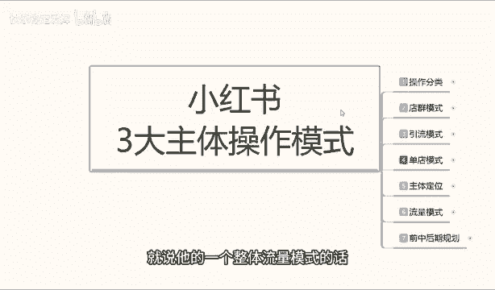

那你。有了你引流模式，你有店铺的话，你还可以去做那个搜索流量啊，就是流量的话，它的一个持续时间效果好一点。而且那个小红书的笔记的话，你最大的一个流量模式的话，就是说再好的笔记你不管怎么发上去。

它最多15天以后就没流量。就不停的更新数据，就看我们自己怎么做啊。所以说小红书的引流模式的话，其实嗯。

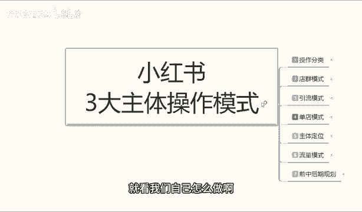

建议的话，大家不管你是做什么啊，你还是开个店铺出来。店铺的话呢，第一个成投入成本也不是很大。第二个的话就是给你自己啊提升的空间扩大一点。而不是说单独的我只是说想引个流引到其他地方。

如果说你没有固定的一个产品或者是内容的话，你想往别处去引，你都不好引。

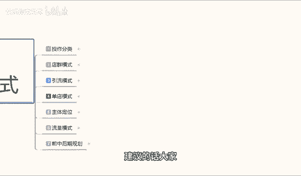

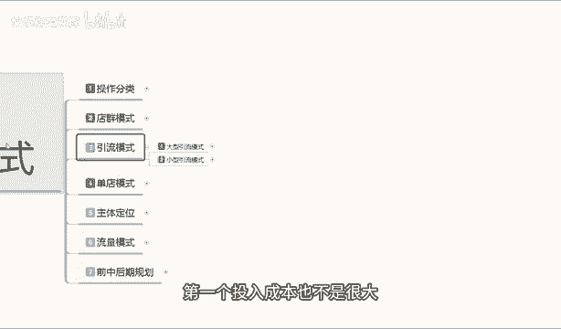

呃，这一课的主要内容呢是给大家讲解一下引流模式它的一个。

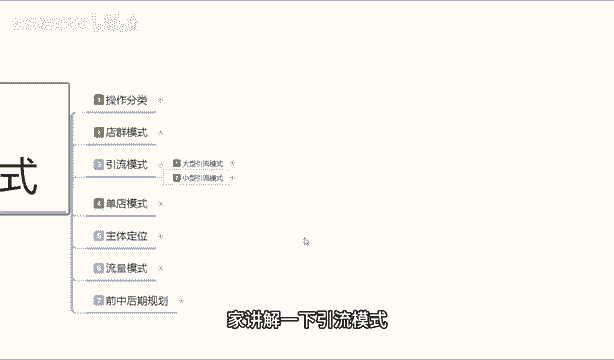

优点和缺点，包括呃。

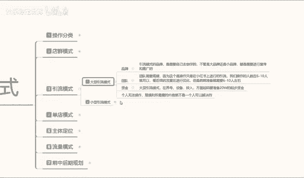

我们个人需要准备的一些。素材吧。大型引流模式啊大型引流模式的话，这个是个人做不了的个人的话我们只能做小型的。说实在话啊，你包括小型引流模式，你个人的话想把它做下来的话，嗯。

你没有一定的经验或者说是嗯没有一定的。货源。或者说对某一个产品特别熟悉的话，你也做不了引流模式的话，它的一个特点性就在这个地方。

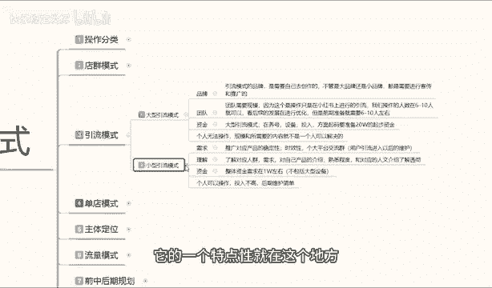

小红书引流模式，为什么说你没有团队或者说是你对所属产品不熟悉的话，做不了呢？首先就是说引流模式你本来就不是准备在小红书上面去卖产品的，你是卖自己单独的产品，你又不好往其他地方放，对吧？

什么保健啊之类的嗯食品啊啊，膳食纤维啊之类的，这种基本上都是做大型引流模式的，包括个人的一个聚会啊之类的。

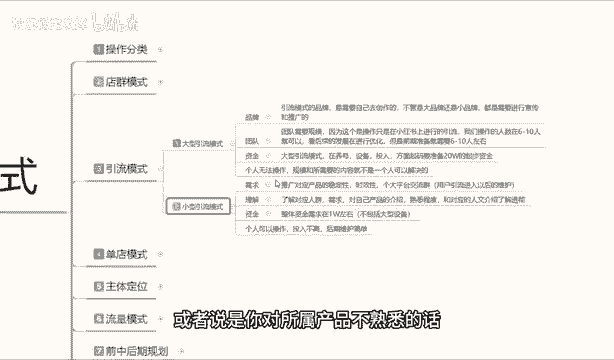

就是说引流模式的话，大型引流模式啊，你首先第一个你要有自己的品牌，第二个你要有自己的团队。第三个你的团队资金还要充。

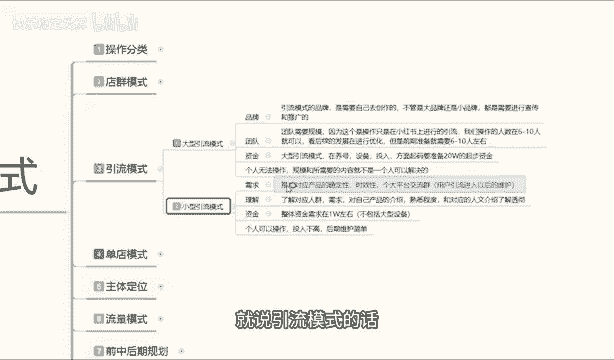

这个里面很明显的一个点，就是说个人无法操作规模和所需要的内容的话，它就不是一个人可以解决的。因为引流模式你操作的话，你可能在小红书上面你做小引流，你然后再找其他人再单独去做小引流。

你们那也是属于一个团体，而不是个人。啊，大家明白我的意思吧，就是说你个人的话真的要去做这种引进摩式的话，我们是没办法操作的啊。大型的引流模式啊，品牌引流引流模式的品牌是需要自己去创作的啊。

这个品牌不管你的是大的或者是小的，你就像嗯你像阿里巴巴品牌大巴，对不对？天猫品牌大巴，他们这种都是属于大品牌，而且是网络营销运营的一个品牌。

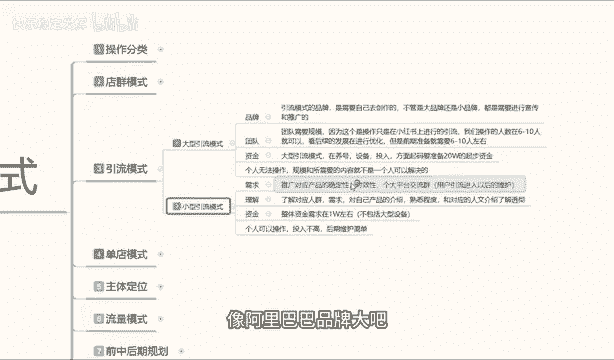

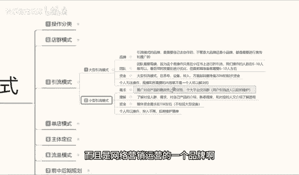

啊，小红书也算，但是我们自己的小小类目的话，就是说呃我们在一个特定的区域里面做一些特定的产品。它的品牌的话可能。

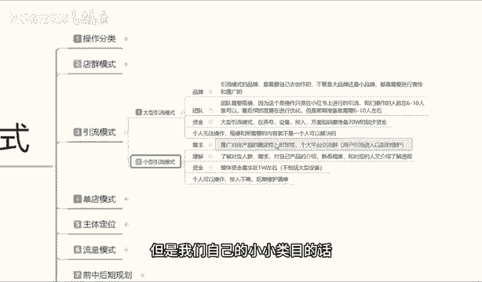

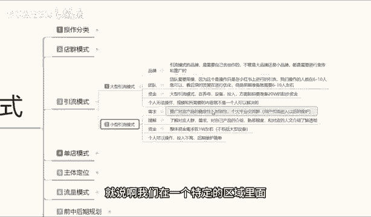

范围很小，或者圈子很小，或者是你自己想去创造一个品牌。你都是要去宣传的。你宣传的话无非也就是两大，目前的话也就是嗯3到4个1个。描述。一个抖音。一个避态。啊，叫其他一些杂七杂八的什么直搜啊，这种网站。

你去发自己的一个帖子，发自己的一个品牌信息，然后让别人了解以后才。

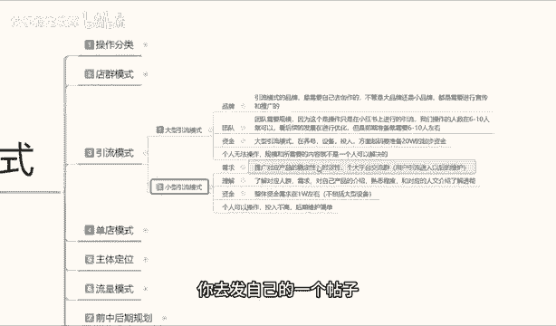

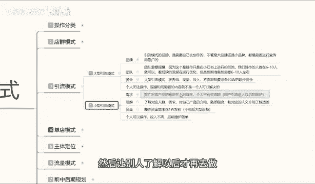

再去做。但是说实话，那种模式的话，嗯，你吸收的特定人群是比较偏范围性的。小红书上面你做引流的话，说实话你做女性引流可以做男性引流的话，我建议大家就不要在小红书上面做了，你做不起来的。

因为小红书的男性用户太少了。

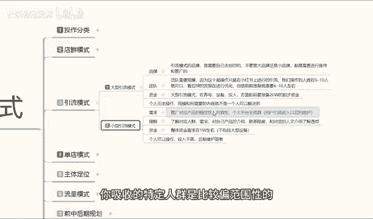

90%的女性用户啊，你要做的话，就只能做女性产品，往女性方面这边去靠。这就是大型引流里面给大家说的这个引流模式的一些小细节啊。

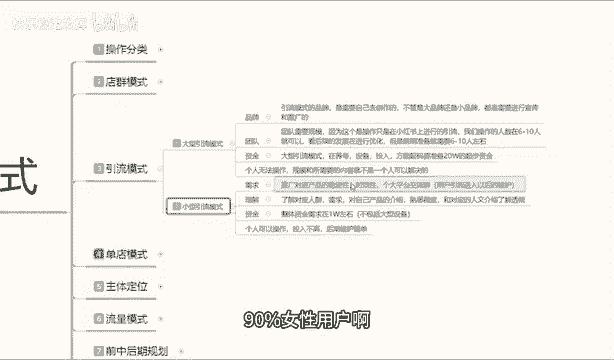

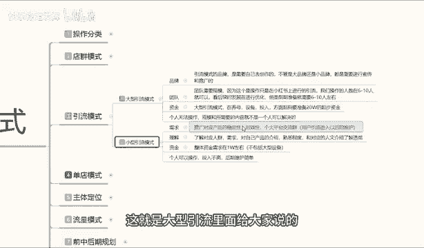

团队的话就是说团队需要规模，因为这个操作的话，它是在小红上面进行引流的。我们光嗯你起号你就得起4到5个。我们操作人数的话，最少都是6到10个人，你才能称之为大型引流模式啊，资金的话在养护设备投入方面。

你起码要准备20个W你没有20个W，大型引流模式你做不出来的啊，包括我这边的话，我呃后台系统啊，包括资料我什么都有就说大型引流模式的话，个人没办法操作。你们了解一下啊，就行了。嗯，就吃瓜群众看个瓜。

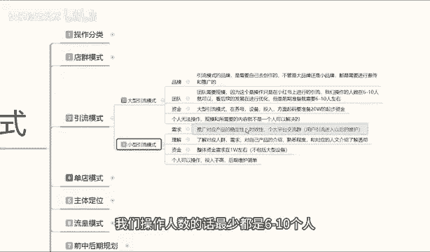

小型一流模式的话，说实话小心一流模式嗯比较适合宝妈之类啊，分享自己的经验啊，或者说是推广自己的一些产品。你要做个宝妈呀，或者是做个护理啊，或者是面部保洁啊。

嗯美妆啊、博主啊这这种一流模式的话还可以啊就是。

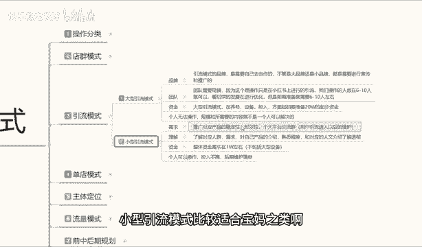

代卖代卖小产品，然后什么产品好一点，偶尔代卖一下。这种的话，在小红书上面，你做文案啊，文案笔记去做的话还是非常好做的啊，吸引自己对应的一个流量。这里面的话你就需要了解啊，推广对应产品的一个稳定性。

如果说你的产品稳定性不好的话，你说实话你不用去做流量模式了，你。随便自己找其他地方弄一弄，你就不用去小红书这么大一个平台，因为操作还是比较复杂的。随便找个小地方卖，随便摆个地摊，你都能卖出去啊，没必要。

你的如果说稳定性不足，就是产品你卖着卖着没货了，卖着买卖着没货了。那你说实话不用做这个啊，不适合你，因为你的产品都不稳定，你做的再好。卖着卖着没货了，你怎么去后期的维护啊？这种像这种后期维护的话。

超过两个月没货就没人搭理你了，知道吧？就说你两个月别人你本来有1000件货。有2000个用户呀，你卖了1000件，下一个月又只有1000件的货。你再下一个月，你的你的固定人群里面可能就只有800了。啊。

所以说稳定性一定是非常重要的。然后一个时效性。谁效因为什么说是引擎模式里面主要是注意时效性呢？引流模式你是把用户引流到其他的一个。交流平台啊，不管你是用什么交流平台，因为这种交流平台的话实在是太多了啊。

微信QQ。包括什么支蛛啊。我么B站，只要是能聊天的，他都有啊，包括企业微信之类的都一样的，知道吧？注意时效性，时效性的话，你最好是做全年的。如果说你做半季产品的话，也可以做赚一笔钱就走。嗯。

对于小型的一个引流模式来说的话，你的一个投入。

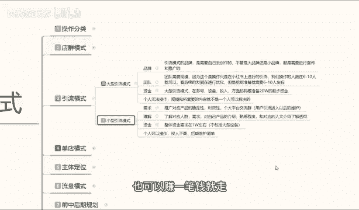

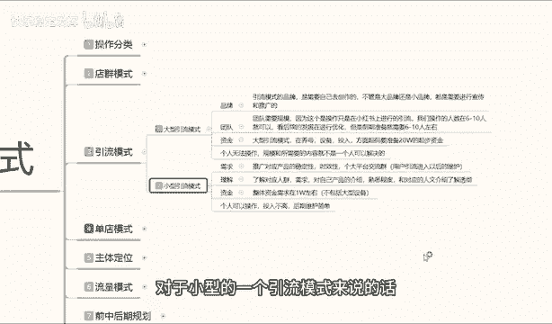

包括数据稳定，就看你自己怎么去维护了，尽量多做一点活动去做，可能会好一点。如果说你的实效性限制太强的话，说实话你直接在自己的这个小圈子去做就可以了。你不用在这上面啊去做什么小型的一个引流模式。浪费钱。

啊，推广效果又不好。那个就是说理解啊，我们首先要理解的是什么呢？理解的是小红书对应用户的一个信息。小红书，你别看他有2亿的一个用户信息量，但是他90%是女性。相当于什么意思呢？2亿人里面有11。

8亿是女。那你作为男性用户，你肯定是做不了的，对不对？你就要对需要对于这两亿女性进行划分，他们的年龄大概的话都是在16到40岁左右。所有这个阶段的年龄再大的没有，再小的也没有啊，他们不会玩。

基本上都是16到40。

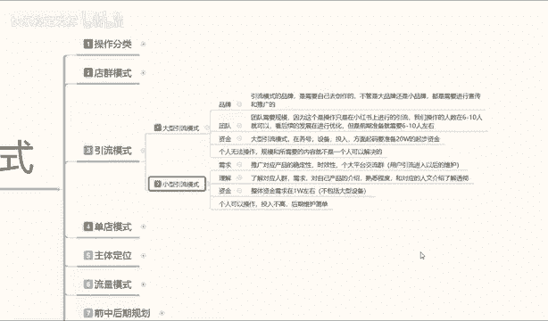

2。16到20之间的用户的话，可能只占3%到5%，剩下的基本上都是20到40之间的。这个年龄阶段的人群用户是最多的。

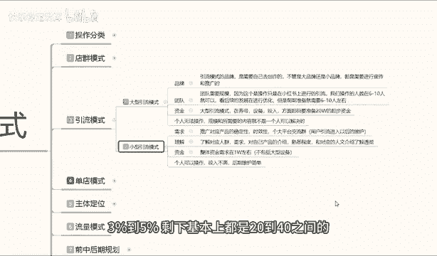

然后你要满足对应人群的一个需求，就是小红书这些人群啊，只剩下96%，大概有1。7亿左右的一个女性用户。他们对产品有什么需求？你的产品能不能满足他们啊？你要把自己的产品介绍介入入入他们的一个痛点。

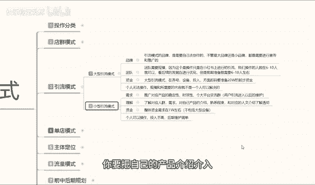

你才能去。

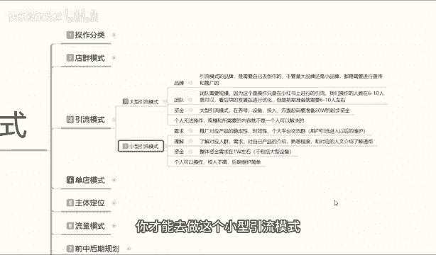

做这个小心引就模索，你的文案图片一定要。精彩仔细详细，而且是第一文案，一定要吸引大部分的人。

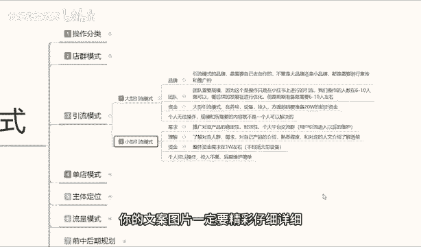

不然后续你都没法办法做的啊。然后这边的话小心引流模式的话，说实话这个就比较简单了。如果说你不包括大型设备的话，就是说你的相机啊、拍摄呀，包括那个灯光啊之类的啊，采光啊之类的。你不去不包含的话。

这个点我就不给大家介绍啊。因为你们如果说真做引流模式这种的话，你们大家自己都应该有一套自己的熟悉的思路的。因为整体资金的话，你在小红书上面投入绝对不会超过1万块钱，可能跟你5000都有可能啊。

绝对不会超过11万块钱就可以把这个小红书的一个引流模式给做出来。但是如果说你要开店铺的话，可能就是1万左右啊，不超过1万也是因为它整体的话，它不是说靠店铺去引流。店铺只是说给你扩展渠道用的而已啊。

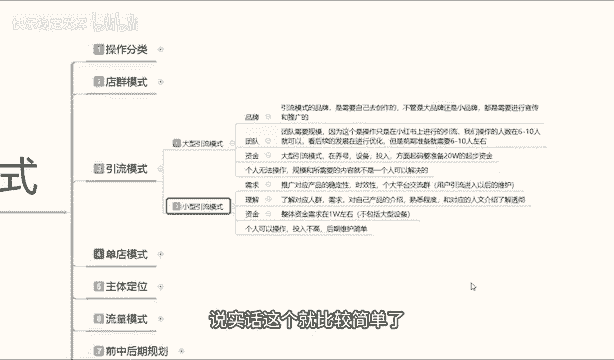

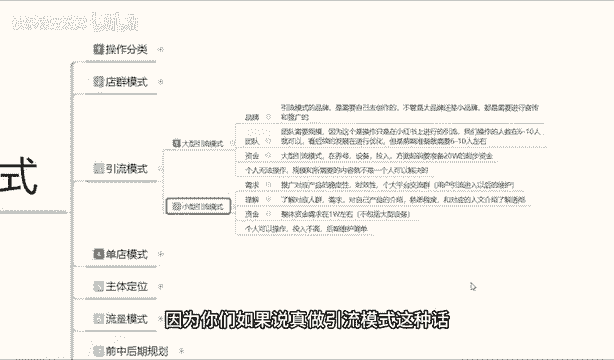

个人呢可以操作，投入不高，整体的话就是说后期维护比较简单，但是它的一个前期操作上呃，整体来说的话稍微复杂一点啊，就是前期准备一定要多。这个呢就是整个引小红书，整个引流模式啊，你不管是大型的也好。

小型的也好，没有什么中型的啊，引流模式，你要不就做大的，要不就做小的啊。你做中间的，说实话，你饭都没得吃，好吧，那么这节课内容呢就给大家分享到这。下节课的话给大家讲解一下什么是单店模式啊。

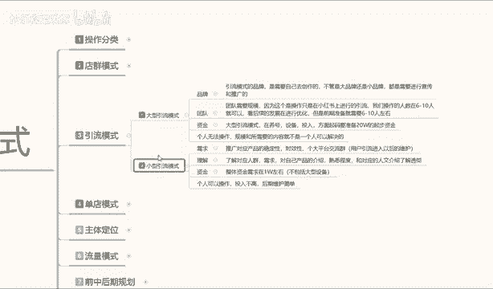

那今天的课先到这了，大家可以给个三连支持一下哦。另外给大家准备了视频资料大礼包，从零基础入门到高阶运营技巧都有包含，学完自己独立运营账号是没什么问题的。当然，如果有小伙伴想要诊断优化账号。

也可以在评论区留言找我，帮你诊断店铺给你一些实质性的建议。😊。