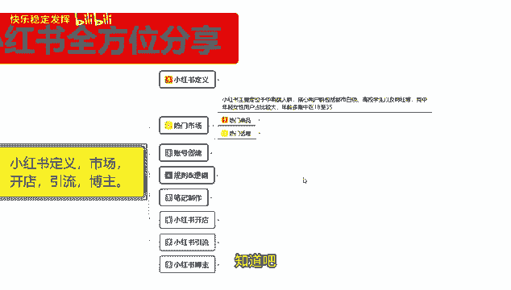

# 【2024版小红书体运营教程】全B站最良心的小红书开店运营教程！小红书体开店 起号真的快，赶快点赞收藏起来 - P4：2.小红书起号钱必做热门市场分析 - 快乐稳定发挥 - BV1AbtoebEjX

大家好，今天给大家分享的是小红书，全方位的一个整体分享，第二大课时热门市场嗯，小红书的热门市场的话其实是非常好定义的啊。

我们可以把它分为两个点来进行分享，第一个呢是热门商品。

第二个呢是热门话题，热门商品的话就是说我们做开店额就比较方便，如果说你要想去了解热门话题的话，就是说做引流，做博主啊，可能会方便一点，小红书主要定位的话，就是说整体人群定位是中高端人群。

核心用户包括呃城市里面的一个都市白领，高校学生以及网红等，其中年轻女性用户占比的话是最大的，年龄的话，基本上基本上都是集中在，18岁到35岁之间，再往下往下扩，你基本上能扩到14岁，15岁啊。

往上扩你能扩到40多岁，但是这两部分的一个用户群体的话，他们一个消费能力和一个对社会，对社会的了解的话不是那么熟悉，对你对我们啊，你在小红书上面想去做店引流博主的话，其实没有太大的一个帮助。

整体我们选定的一个年龄的话，基本上都是18~35，再往前面走的话，你最多只能控制到16，再往后走的话，你最多只能控制到40，这就是热门市场小红书的一个年龄适用范围，再往前的话。

或往后就基本上没有什么额沟通的意义，知道吧。

我们先了解一下小红书目前的一个热门商品啊，热门商品里面的话基本上就是一个美容，一个家居，然后呢是旅游食品饰品，往后走呢就是电子配件和服饰服饰，你在其他地方的话，可能会了解到他是一个最大的市场。

但是像在小红书上面的话，他反而不是最大的市场咳，小红书上面最大的市场是什么呢，美容第二个是什么呢，饰品往后是家居，然后是食品，再是旅行之后的是电子配件，其次才是服装类的啊，因为他在一个市场。

他是偏女性化的，女性化，你买服装之类的话，他反而没那么热门，但是在美容方面，因为她小红书整体去做笔记分享，或者说是做内容分享的时候，很多都是呃化妆的一些技巧啊，哪个美容产品比较好用啊。

哪个美容产品的话实用又便宜，保持的时间又长等等这些系列的分享，然后就是呃什么指甲油啊，假指甲睫毛美容美容，刚刚已经讲过了，然后的话她就是女性普遍使用比较频繁的物品，在小红书上面的话。

它的一个热门商品市场的话还比较高，我这里呢是给大家列了七个大点，但是七个大点往外还有没有产品能有，但是他的热门程度的话就没有这么高了，这七个大点的话可能会占比百，小红书市场80%以上的一个内容。

你其他的一些产品的话，可能只有15%到20左右的一个内容，越偏冷门的次产品，你在小红书上面反而越不好卖，因为你第一没什么名气，第二使用人数不多啊，这个就是目前小红书上面的一个整体热门商品。

第二个呢就是热门话题。

热门话题是什么呢，额你做引流也好，做博主也好，我们要找一个话题进行切入，或者说你有产品啊，那你就是通过你的产品，去小红书上面进行宣传啊，把这帮用户呢集中拉到你自己所创建的小群，或者说是单独交流。

或者说给他营造一种氛围去进行交流，让用户了解你的产品进行分享，这里面的话就包括有用的信息与内容，内容达人分享类产品测评，美食分享，时尚搭配，旅行游记，第七个大点。

这七个点的话其实是比较好进行分类的啊，首先呢是生活技巧，专业指南教程与教学，后续后面的内容，我就不去给你们一一的进行讲解，你们自己了解，做某一定某一特定内容的话，他的一个属性点还是非常高的。

你包括娱乐内容也好，达人分享类也好，产品测评类也好，美食分享时尚搭配，旅行游记，这目前是小红书上面最熟悉的七个大元素啊，有用的信息，有用的信息是什么呢，生活的技巧，专业指南，教程与教学，这三个大点。

这三个大点还可以扩展成无数的小类目，去进行分享，你所了解的内容的话，基本上只要是有用的，没有用的信息肯定是不行的，只要是有用的信息，他都会有人搜索，有市场进行分享，只要说你前期把账号做好以后。

你选择的任何门话题基本上都是有市场的，然后娱乐内容搞笑与轻松的一个刺客啊，美女帅哥的一个时尚秀，就是穿搭之类的，基本上都有。

就说小红书热门话题的话偏向于女性用户一点，但是它整体热门市场的范围是非常大的，小红书上面购物用户群体的话，可能只有20%到三十百，其他80%基本上都是引流博主啊，他们所选择的内容就是这七点。

七点之后还有没有呢，有但是它整体的话就没有那么热门啊，我这个这一课呢给大家分享的是热门，就是小红书上面比较火的啊，有很大的市场前景的，有内容，说说小红书，你如果说真的是想去把小红书做好。

那你了解热门商品以后的话，对自己的产品进行分析，看在属不属于热门范围一类，热门范围以内，你在项目上面做可能会非常简单，如果说你不属于热门范围以内，能不能做呢，能做，但是难度会很大啊。

这个呢就是热门市场，那这一节呢就给大家分享到这。

下一节呢给大家分享一下账号创建，就说小红书上面我们了解它的定义，市场以后的话，你如果说账号创建第一步走不好，那你后续想把额属性改过来的话，难度就有点偏大。

那今天的课先到这了，大家可以给个三连支持一下哦，另外给大家准备了视频资料大礼包，从零基础入门到高阶运营技巧都有包含，学完自己独立运营账号是没什么问题的，当然如果有小伙伴想要诊断优化账号。

也可以在评论区留言找我，帮你诊断店铺。