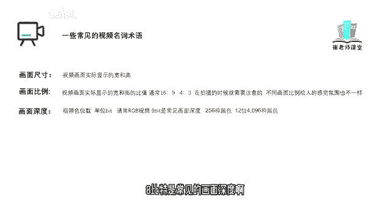

# 【2024版小红书体运营教程】全B站最良心的小红书开店运营教程！小红书体开店 起号真的快，赶快点赞收藏起来 - P4：2.常见视频名词术语 - Sathenay - BV1uqHreLEER

我们来讲解一下常见的视频名词的专业术语，这些专业术语呢。

其实是剪辑师们之间交流的语言，也是同学们迈向专业的第一步。

首先时长，指视频时间长度，基本单位是秒，常见的格式如下，小时分钟，秒数帧数。

紧接着真帧是指视频的基础单位。

记住啊，基本单位是秒。

基础单位呢是帧，帧是比秒还要小的一个单位。

视频呢其实也是由一帧一帧来组成的。

我们可以把帧理解为一张照片。

帧速率指每秒播放帧的数量。

也可以理解为每秒播放照片的数量。

单位是帧每秒，也就是我们常说的FPS帧速率越高。

画面越流畅，关键帧指素材特定帧，通过设置属性控制动画的流回放，还有其他特性来建立关键帧，加入一些效果，帧尺寸指帧视频画面的宽和高。

宽和高呢一般用像素数量表示真实尺寸越大。

视频画面越大。

像素数越多，像素比每个像素的宽度和高度之比，又称为长宽比。

画面尺寸指的是视频画面实际显示的宽和高。

画面比例指的是视频画面实际显示的。

宽和高的比值，常见的呢有16比九。

四比三，在视频拍摄的时候啊。

就需要注意的这些点啊，不同的画面比例呢。

给人的感觉氛围也是不一样的，画面深度指颜色位数。

单位是比特啊，通常呢RGB的视频八比特是常见的画面深度啊。

它支持256种颜色，那么12位的呢它支持4096种颜色。

声道分为单声道，立体声，双声道和多声道，声音深度。

这个呢和画面深度相似，分为16比特，24比特等等缓存。

指的是计算机内存中。

用来存储静止图像和数字影片的区域，他是为影片实时回放做准备的。

当然除了这些专业名词呢，还有片段遮罩，转场还原等等。

我们后面呢一边讲解剪映的同时呢，一边讲解这些常见的视频名词术语。

