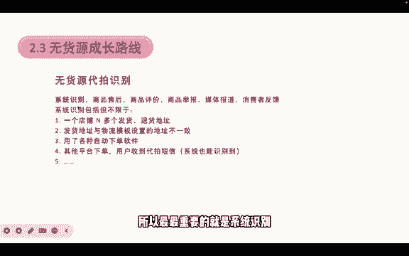
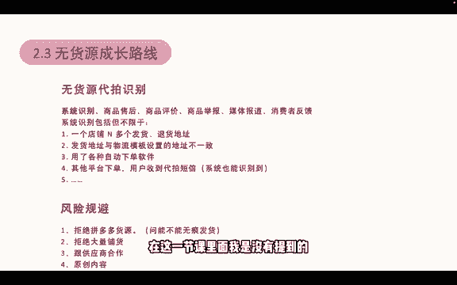

# 【2024版小红书体运营教程】全B站最良心的小红书开店运营教程！小红书体开店 起号真的快，赶快点赞收藏起来 - P4：4.无货源电商和有货源的区别 - 小袁运营 - BV1Px48eQEai

那我们再来介绍一下，无货源电商跟自有自有货源电商的一个区别。

无货源的玩法的一个基本逻辑，就是我们在小红书上开一个店铺，然后从1688各种渠道，找到货源供应商的产品，注意这里注意这里的特点，货源供应商的产品不是像呃淘宝拼多多这种呃，就是他们本身就是电商平台。

而不是货源平台，我们要找的是货源平台，线上的就是1688，线下的可能是各大各大批发市场，类似于像义乌等这种批发市场，然后通过代理和一件代发的方式，把他的产品授权到我们的小红书店铺上，我们在发布笔记。

把产品卖出去，这是基本的一个流程，无货源电商的优点是我们不需要囤货，也没有任何的门槛，我们只要开店实名认证，开店就能卖，也没有风险，风险就是压货风险，压货风险我们几乎没有这个压货风险也不限制。

而几乎不限制产品，这里应该是几乎不限制产品，就是我们什么都能卖，我们几乎什么都能卖，哪怕是电器那一些，我们也能通过代理的方式去卖对吧，所以他是几乎不限制选品，但是它也有一些缺点，就是售后很麻烦。

比如说有很多的货源供应商，他是不支持退货的，就我代理了你的产品，你通过我呃，通过一件代发的方式，你把产品发给了用户，但是用户觉得这个产品不太好，他想退，那么这种退货呢只能退到我们自己家里。

所以这是售后麻烦的一个点，第二个叫质量不可控，如果说我们找的供应商，他不是优质的供应商，他不是大量给别人供货，或者说他自己就是一个很小的供应厂的话，那他可能自己做出来的产品质量参差不齐。

所以有可能这次发给你的是好的产品，然后呢他下次再发给发给用户的时候，量一旦上来，就是比如说我每天发几十个好，那你质量都特别好，那有一天我需要你发1000件的时候，他可能1000件里面有30%都是次品。

就是质量不好的，那么这种发出去会对我们造成很大的影响，第三个叫利润空间不大，因为呃像这种，因为你毕竟不是自己的产品，你没有办法以真正的出厂价去卖，因为我们虽然我们拿的是他的一个货源。

他用的是批发价给我们，但是批发价他也有很大的一个利润，而且如果你的前期量不大的话，他批发价也不会给你特别优惠的价格，所以前期利润空间可能不大，还有一个就是不适合投流放大，就就是担心质量不可控。

如果说前面你每天发几十单好，你的质量是优质的，是OK的，那么我看到有稳定出单，我就去投流，去投放聚光平台，去投放聚光，然后去放大，那一旦放大，我一天出了1000单的时候，你的你供应商没有这个实力。

发不出去，那我就会导致我亏钱亏损，所以无货源的模式是不太适合投流去放大的，那么我们的运营思路可以是这样子，主打人设，买手人设或者说店主人设都可以主打人设，然后我们精细化去运营，做精品，做买手店铺。

这里很关键，我们后面会讲到额怎么去做。

再来看一下自有货源的玩法，自有货源就比无货源要更加简单一点，在小红书上开一个店铺，把你自己的产品上架到小红书店铺，再发产品笔记，把产品卖出去，这种就是正常的一个开店流程，它的优点是自己的货源质量有保障。

发货也有保障，利润空间可控，我们就可以随时的做付费推广去放大，因为你自己的质量，你质量差，你就不发出去嘛对吧，自己的产品能够保证这个事情，而且发货有保障，是发货时间，我一旦有单。

我当天我就可以发出去对吧，只要单量不是特别大忙，只要自己能忙得来，我当天就能发出去，这是我的一个发货时间有保障，利润空间也可控，特别是自己研发的一些产品，你想卖多少钱，只要用户能接受，你都可以卖。

而且你的成本是相对可控的对吧，相对可控，所以这种情况下，我们是可以付费去推广放大的，但是他的也有一个缺点，就是产品单一压货风险大，你只能卖你自己有的产品对吧，你只比如说我我有一个做杯子的厂。

那么我就只能卖杯子啦，只能卖杯子啦，而且压货风险大，就是我每一款杯子我要做多少件呢，不清楚对吧，我做100件，那么万一卖不出去呢对吧，那我只能做50件，做了50件，然后第二天需要突然笔记，笔记突然爆了。

需要1000件的时候，我发不出来对吧，所以为了让自己能发的出来，所以我们可能每一个产品做的量会比较大，那么这就会导致我们会有压货风险，万一没卖出去，这货砸砸手里了，那我们就会亏钱，那有货源的运营思路呢。

就是我们先建立一个小红书账号，然后发布产品笔记，同时呢我们可以找一些买手，让他们做直播，帮我们带货，就是跟抖音做直播带货一样，我们找买手给我们做直播，给我们去带货，然后我们在同步开自己的店铺直播。

来稳定经营自己的小红书号，这一个运营思路呢。

是在小红书买手大会的时候呃，小红书官方提出来的一个运营思路。

所以照这个走是没有任何问题的。

而且小红书平台也是按照这一个流程来，给店铺做扶持的。

那我们再继续回到无货源的成长路线，无货源带拍的识别呢，小红书平台是给到这几个识别的一个方法，第一种叫系统识别，第二个售商品售后还有商品评价，商品举报，媒体报道和消费者反馈等等，其中最重要的就是消费者呃。

最重要的就是系统识别，因为像商品售后，商品评价，商品举报，这些都是基于你自己的产品，别人来举报你，或者说你的你发的货确实是呃无货源，因为你的快递快递上面居然写着拼多多代拍的，然后你的产品包裹里面。

居然还有一个拼多多的包裹卡，那他很可能会申请售后告，然后举报你，然后举报你，然后评价你说你是无货源电商。

然后我居然收到了拼多多的包裹卡，拼多多多的好评返现卡好，那么这时候就会把你识别为货源大白，那这些呢是基于你的货源。

你的产品的情况，这种我们没有办法把控，我们唯一能把控的就是，我们不要去找那些拼多多的商家，也不要去找淘宝的商家是，所以只要我们不找这几个，我们就能避免这三个问题，媒体报道几乎不会产生。

几乎不会产生消费者反馈，也是基于产品，所以最最重要的就是系统识别。

系统识别包括但不限制于一个店铺，有N多个发货地址和退货地址对吧，那我呃我们站在平站在商家的角度。

如果我们是一个正常的商家的话，那你怎么会有多个发货地址呢。

当然可能会有呃，多个全国可能会有多个仓库，比如说我在义乌建立一个仓库，我在广东建立一个仓库，那这种情况下是常见对吧，但所以我在前面加了个N多个，就是我不仅只有这两个，我甚至全国各地，像啊好，连云港。

我有一个发货地址，北京我有个发货地址，武汉我有一个发货地址对吧，那么这种情况下他很难不识别你是无货源对，即使你再有实力的商家，你也不可能说全国各地都去建立发货仓吧，不太实际对吧，退货地址也是一样的。

你不可能说每一件嗯都退到指定的仓库里面去，这是不实际的，所以一个店铺，多个发货地址和多个退货地址的话，就很可能把你识别为无货与人代拍，然后第二个呢叫发货地址，与物流模板设置的地址不一致。

比如说呃我们物流模板上面就产品我写的，我把这个产品写的是从浙江义乌发货，但实际发货是从广东深圳发出的，就匹配不上，那么这种也有一定的概率。

把你识别为无混元大派，还有就是用了各种自动下单的软件，就是比如说用户在小红书上下单，然后那个软件马上跳转到拼多多，跳转到1688去给你自动下载，这种软件的话也很容易被识别为无货源代拍。

还有第四种叫其他平台，用其他平台下单之后，用户收到了代拍短信，这种方式系统也能识别到，所以我们尽量的不要去从其他平台下单，还有很多的一些系统识别的风险，然后我们怎么去规避呢。

第一个就是一定一定要拒绝拼多多货源，如果你一定要用拼多多的话，就要问他能不能无痕发货，这非常重要，如果它不能无痕发货的话，我宁愿不要这个产品，就是如果我们选了一个P，只有拼多多，有的话。

那我们一定要问他能不能无痕发货，他不能的话，我们就不要，即使他能，我们也尽量不要选择拼多多，因为万一哪天他忘记了，你需要无人发货，然后呢他用拼多多的给你打了个面单，那这种情况下小红书就会识别到对吧。

那第二种呢就不要大量铺货。

当然不要大量铺货，是说呃无货源模式。

就是我卖特别多的产品，我既卖手机壳，又卖项链。

又卖什么什么产品，就这种产品，每一个产品可能它的供货商都不一样，那这种情况下就不要大量铺货了，但是如果你是一个供应商，比如说都是饰品对吧，卖饰品，但是饰品有非常多的款式。

我把这些款式全部上架到我的小红书，那这是允许的，因为这些产品全部都是一个供应商的对吧，他有很多款产品，比如说有100款。

100款或者说50款，像穿戴甲也是一样，穿戴甲每一副穿戴甲的样式都不一样。

甚至每一个样式我可能都要单独上一个链接，那么这种情况下我是可以大量铺货的，我是可以大量铺货的。

这种应该能理解，就是我们拒绝大量铺货的，意思是我寄卖穿戴甲又卖项链，他俩是不同供应商的，然后我又在卖手机壳，他又是另一个供应商，那么这种方式我们就不要再去做了，然后第三个就是我们要跟供应商建立合作关系。

比如说手机壳，我们可以去线下，像华强北这种地方找到卖手机壳的供应商，然后跟他们签订一件代发协议，或者说直接跟他们的仓库对接。

用小红书的面单去打单，那么这种情况下的。

肯定不会判定你为无货源代拍的，即使判定你即使误判你是无会员代拍。

你也可以，就是你也可以说我们签了一件代发协议，然后拿着一件代发协议去申诉，也是能够申诉下来的，所以这种只要跟供应商建立合作关系了，他就是一个正常的商业行为。

他就不会对你有任何的限制，然后第四个呢就是要做原创内容，因为前面讲的像店群，还有用黑科技制作内容的那种方式，他们做的全部都是二创或者说直接搬运的内容，所以如果我们还是做二创，还是做搬运的内容的话。

它也有一定概率把你识别为无货源，或者说低质量的商家，然后不给你流量，所以我们为了避免这个问题，我们尽量的去做原创内容，原创内容的制作方式，在这一节课里面我是没有提到的。

我们会在下一节课呃，我找个时间录好之后，我会把它放出来。

教你们怎么去做原创内容，然后咳下一种下一个成长路线叫精细化运营，做什么买手店，我们从无货源的店铺，就是我们升级自己的无货源店铺，我们做成定制类的产品，这是另一种方式，然后我们还可以签署代发协议。

就是前面讲的，那么嗯定制类产品包括什么呢，像定制情侣手机壳，定制情侣保温杯，定制情侣T恤，情侣卫衣等等，这一些这一些我们都是可以做的，因为这种产品的话基本上只有一个链接对吧，只有一个定制链接。

然后我们可以固定供应商对吧，因为我我只跟他合作，那么我就只只帮他卖卖定制的杯子，定制的T恤，特别是定制T恤，定制卫衣，定制卫衣可能就只有一个链接，然后定制T恤有一个链接，所以这种我们链接是做的特别少。

然后他俩我们都可以，在一个供应商里面就去解决。

所以定制类产品也是可以做，也是可以是无货源成长的一个路线。

然后第四个呢叫DIY套装，比如说就是无货源升级为有货源店铺，无货源升级有货源店铺，我们可以做DIY套装，比如说好一个香薰，它是由扩香石杯子，就是容器杯子和香薰精油组合，应该能理解吧。

就是一个容器里面装着有扩香石，然后每次我需要呃把房间就是熏一下，香薰的话，我就滴几滴香薰精油，进到那个扩香石上就可以了对吧，所以这种这种产品呢，我们可以把每一个元素拆开。

我自己去1688买十个杯子可以吧，买十买十个我觉得特别好看的容器，这没问题吧，然后再买十呃，十份我们叫份了，十份我觉得特别好看的扩香石对吧，我可以买回来，然后再买十份我觉得很不错，很香的香薰精油对吧。

我们把它买回来，然后组合成自己的香薰，把这三个东西组合成我们自己的呃套装，我们去1688买盒子是吧，买盒子，买快递盒，然后买打包盒，把他们打包在一起，然后印上自己的店铺，印上自己的logo。

那么这种情况下，就是我们的从无货源升级到了有货源店铺，那这种会不会有压货风险呢，前期我们可以只买十个好，每每一个产品像杯子几块钱你都能买到，十个的话也就几十块钱，像这种扩香石是特别特别便宜的。

扩香石是非常便宜的，就是呃活山石那种那种材质的非常便宜，然后还有香薰精油，香薰精油其实也是很便宜的，全部加起来你买十份的话也就是一两百块钱，一两百块钱就能做到，然后再加上定制盒子。

这些的话可能也就300~400块钱，咳咳不超过500块钱，你就能定制自己的套装，然后这些东西只有十份，那么我们呢定价我们可以定在100左右，或者说80左右，80左右，那十份的话就有800多块钱对吧。

那你也有很大的一个利润空间在里面，那么你的你的那个库存只设置十，那这样子的话就是卖出去能卖出去了，我们再进货，然后把库存扩大，如果是一下子就把这十份卖出去了之后，怎么办呢，之后我们可以设置一个延迟发货。

延迟发货就是预售，你购买之后五天内给你发货，那这样的话我们就足够的空间，就等你下单之后，我再去1688买对应的套装，然后买回来自己组合，然后再发给你，我们有五天的时间足够我们做这个事情了对吧。

所以升级有货源的话，我们做DIY的套装就可以了，就能很完美的去过渡。

然后无货源代拍的整治，其他是一个分水岭，会有很多新玩家听到这个消息之后呃，不敢再去做小红书，无货源对吧，也会有很多老手因为不懂这个调整，就是我不懂无会员代拍他是怎么识别的。

然后我也不知道应该怎么样去调整，所以我就被淘汰掉了，然后同样呢也会有很多新手看到哦，封了这么多店铺，那应该会有其他的一些店铺就能分到这些流量，会有很多的流量涌入自己的店铺里面来，那他看到这个机会讲话讲。

红书电商也会有很多老玩家看到公告之后，就是无货源整治了这么一个公告之后，审查自己的店铺，调整自己的店铺，然后调整会员对吧，所以在这之后呃，从8月9月十月这几个月过后呢，小红书电商肯定是会做的越来越好的。

至少那些批量铺货，发布低质差笔记的人，他们基本上在这里活不下去，他们就会被淘汰掉。

