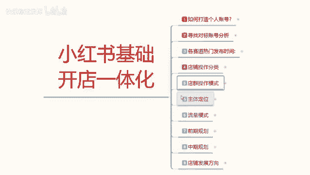
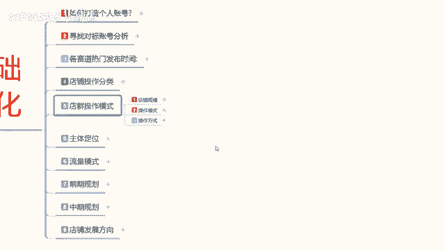
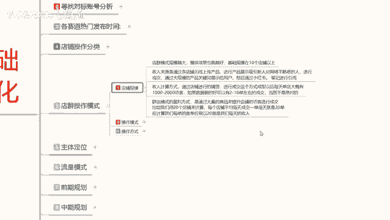
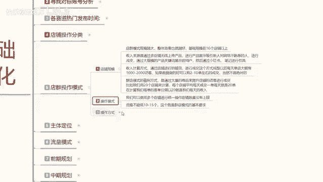
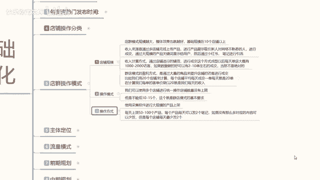

# 【2024版小红书体运营教程】全B站最良心的小红书开店运营教程！小红书体开店 起号真的快，赶快点赞收藏起来 - P51：49.小红书开店-店群模式操作及注意事项 - 快乐稳定发挥 - BV1AbtoebEjX

大家好，今天给大家分享的是小红书基础开店一体化的一个操作流程。这节课的话是给大家分享第五课啊，店群的一个操作模式，让大家了解一下店群它是怎么运作，怎么赚钱的。

电区操作模式的话，这里呢是给大家把它分了三个步骤，第一个是店铺规模，第二个是嗯操作模式，第三个是操作方式。先了解电群的一个规模。

店群规模啊，它整个的话，你在小红上面做店群，你在其他地方做店群都是一样的啊，规模越大越好。整体的话就是说你规模越大，效果也就越好。基础规模的话，你就是说最少在10个点以上啊，越做越好，不限制上限。

但是有下限，最少10个啊。第二个呢就是收入来源，它是通过多店无线上传产品，然后进行产品展示。吸引人吸用吸引吸人对网络不熟悉的人，就是那种呃刚接触网络不久，比较新奇啊，看什么都比较。是吧。

这种人去进行成交，然后呢通过大规模的一个产品关键词展示给用户，然后通过小红素。或者说是通过小红书的一个笔记进行引流引导，然后让他们进行购买转化成交。收入计算方式的话，就是说通过店铺的一个进行铺货。

然后进行成交这个方式成型以后的话，每天。单店的话就是说大概有1000到2000个访客，你成型的话，你最少要有500个网上的商品才叫成型啊。就是一个店铺里面你最少有500个商品。你才算成型。

然后如果书记做好的话，就是说基本上有2到1单左右，运气好，又2到13，运气不好，一单都没有也是正常的啊。当然这个它也不是绝对的。就说你小红书的话，你做店群，你就只能靠运气。运气好，每天开个几单。

运气不好，每天一单都没。就这个样，而且你店铺规模的话，你说实话一个店一单没有10个店的，对吧？总会开那么的几单上十单。它就是靠这种累积合并起来以后的话，就是你小红书店群的一个收入。

为什么说我之前给大家讲的时候，就跟大家说过啊，店群你操作起来以后的话，它的一个整体收益其实不高的，而且投入的话和你收益不是太成正比。然后呢，是小红书的一个操作模式。

操作模式的话其实是也是比较简单的。因为像店瓶操作，它就是一个一个模板套一个模板，你直接去操作就行了。你使用多个店铺进行统一操作，店铺数量的话没有上限。但是不能低于4到出5个。

这个就是电池模式的一个基本要求。然后你后续操作的话，你每天上产品，你用一键代发也好啊，你觉得自己没有那么多数据属性，你把别的产品，你把拼多多。把，淘宝的。把那个阿里的或者京东的那种产品。

你基本上都可以放到你店铺。你去哪？只要是有一件上一件代发，一键上传，你去把这种产品找到以后，就能往你店铺里面发。而且你不分类型，不分属性，什么都不用分。你就是一个搬运工，你把别人的产品拿到这个地方。

然后做一定的差价出来，自己就可以卖。卖了以后有这钱。所以说他操作模式是非常简单的，就是一环套一环啊，复制第一个复字，第二个复制第三个。无限复制就行。

操作方式使用采集软件进行大规模的一个产品上架啊，你自己一个一个上传肯定是不行的。你直接用采集软件啊，小红书上面系统也有有匹配的。然后呢，每天一个店啊，记住了一个店每天只能上传50到100个产品。

再多的话就没用了啊，系统会判定你重复发布产品的。然后每个产品每天可以发两个笔记，每个产品每天可以发两个笔记啊，一个店铺每天最多不超过5篇笔记。它包括商品笔记内容全是负制。全部都不用你去管。

你也不需要操那么多心啊。如果没有那么多，那你每个店铺每天发个2到3天篇笔记，10个店铺每天发三四篇笔记，你就通过这种方式去做引流就行了。就是说暗是呢这个里面每天笔记你最少要发两个。

因为笔记它是有时间上线的。他的像做电群的话，他的笔记效益只有两天到3天左右，短的话可能只有一天。啊，你要把这个了解清楚啊，就是每个笔记它都有时间效应的，就是引流的一个时间效应。

所以说你每个店每天最少要发两天以上的一个笔记量。这个就是整个店群的一个操作模式，它是非常简单的，它没有什么过多的一个技巧，无限搬运，就是把别人的复制过来，拿到自己。这边店铺里面拿自己的账号。

然后去做就行。这个就是小红数的一个电群。那这节课呢就给大家分享到这。下一节课的话给大家讲解一下那个单电模式的和多电模式的一个主体定位。

