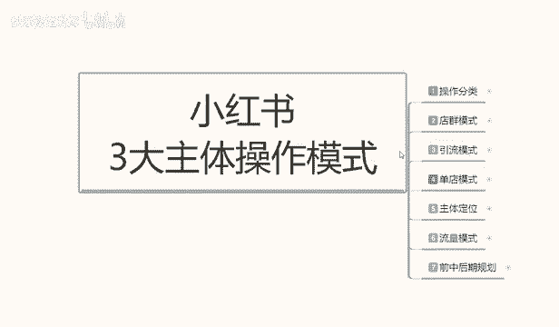
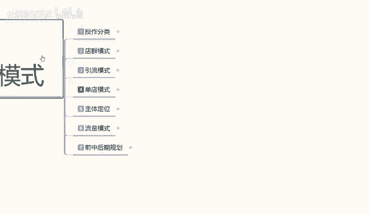
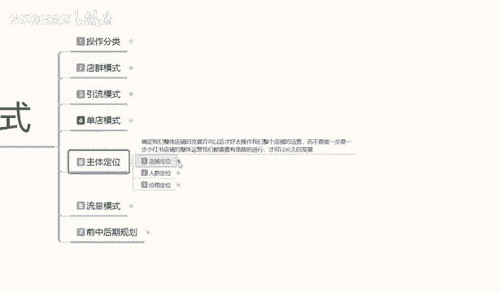
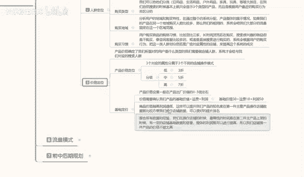

# 【2024版小红书体运营教程】全B站最良心的小红书开店运营教程！小红书体开店 起号真的快，赶快点赞收藏起来 - P52：50.小红书开店-店铺人群定位 - 快乐稳定发挥 - BV1AbtoebEjX

大家好，这一节呢给大家分享的是我们主体定位里面的第二小节课程啊，小红书三大主体操作里面的主体定位第二小节的一个课程。

这节课程的话主要是给大家讲解一下人群定位。上节课呢给大家讲解的呢就是。

店铺的一个定位啊，人群定位它和店铺定位的话其实是有差别的。因为店铺定位的话，它定位的是我们整个店铺的一个发展方向。人群定位的话，它定位的是我们的操作。嗯，怎么说呢？对应用户的一个人群。

就是我们前面的话已经把产品选好了，价格设定好了，包括我们产品的一个发展方向选择好了。那下面的话我们是要选择我们对应的一个用户在什么范围，知道吧？因为它是通过产品来判别用户的。

或者说是你通过用户来去选产品的，他们两个都是相互的，缺不可。如果说你先选择了产品，你有产品，那么你就要选人群。如果说你没有人没有产品，那你先选人群再选产品。

这才是我们要做的一个整体的一个网络运行基本技巧啊，就是说他们俩是相互的，你缺一部分，你有产品，你就要选人啊，你没有产品，你就要通过人选。这些人你需要去做什么？所以说他就是一个人群定位的一个整体方向。

我们在操作店铺的同时啊，不要小瞧了小红书整体的一个搜索系统啊。我们所有所了解的所有这些都是针对我们店铺定位做的基础准备啊。这些数据如果说你做不好的话，你后期店铺你就算做。他也大不了。啊。

一天卖个几单十几单，那你还不如去上班呢。所以说你要把技术做好了，你才能把店铺做起来，好吧。个人定位里面的话，我在这里呢是给大家分了5个类型。第一个是个人属性，第二个是消费能力。第三个是购买类型。

第四个是购买。第一第五个是购买习惯，这是用户的。之前给大家讲的店铺定位，你们把自己的店铺属性定位定完了以后的话，是人群定位人群定位这5个人群的话是。小红书用户的人群不是我们店铺的人群啊。

是小红书用户的人群。你要结合小红书用户的人群，结合自己店铺的情况，再去做店铺人群。比如说你要先了解小红书用户人群的一个行为习惯。这里面首先有个第一个个人属性。用户的个人属性的话，包括性别、年龄范围。

包括喜欢的一个内容。就是小红书当初刚开始创建账号的时候，他喜欢的是什么文旅饰品服装。游戏美妆博主、电影、电视体育运动这几个内容的一个范围啊，它对于我们店铺是很重要的。你比方说你是卖运动类产品的。

卖球啊啊、网球、羽毛球、球拍之类的，或者说是呃运动系列的那他的模式人员模式里面的话，他前期选择喜欢的内容。他需要我自几个偏偏移，对吧？比如说你不你就算是喜欢美妆的也好啊，喜欢画画的也好。

喜欢户外运动的也好，它对应的都是我们商品的一个对应属性的。啊，这就是第一个点。第二个是性别。性别的话是男和女。说实话，小红书上面的话，你不用管男性性别了，你直接去做女性产品就行。然后是年龄范围。

年龄范围的话，它分。年龄范围的话，你拿。5年做一个年龄范围的比较。或者说他四年做一个年龄范围的比较区划分你自己的用户年龄范围，懂我意思吧？一夜产品你只能包括三个年龄范围以内，也就是12年。

最多包含这个范年龄范围啊。超过这个年龄范围的话，你产品一次性。什么叫三年？你般方说从16岁开始。到28岁。懂意思吧？你从17岁开始就是到29岁。一直到40岁，16到40。

你之间最多选择12年的一个年龄范围。说实话，你的年龄范围选择越小，你的用户越近成交率越高。你后期店铺就越好做，所以说你要一定要把人群的年龄范围选好。小红书账号里面的话，它还有一个账户的一个权重。

就是你的收藏也好，关注也好，你喜欢的类型也好。它这个里面还有一个权重的。到后续的话，我会给大家讲解一下它的这种数据越多啊，说关注的店铺类型越多而且购买的消费金额越高，它整体小红书权重也就越高。

对我们店铺整体来说提升也就越大啊，但一旦了解这些东西。而不说你我们前期做的时候，你随便拿一个信号，你去操作数据的话，它也有数据有权重，但是权重没有肯定没有那种呃关注的多，看的多，买的多。

了解的多的人账号权重高啊。你先了解它个人的一个属性量。第二个是消费能力，就是用户的消费能力的话，它是根据用户每年购买的一个消费能力来平均计算值的。12个月。它这个整个系统的话，其实说句实在话不好听的啊。

小红书的整体大部分运营系统，它是仿障的淘宝。啊。说实话，它整体的一个大部分运营系统是导不到淘宝。只是说它整体的模式的话和淘宝有很大区别。淘宝的话是百分之百的是搜索流量。但是小红书的话。

它是70%到80%，是我们的笔记流量。啊，他只有20%是收索流量。但是搜20%的搜索能量呃流量的话，它的一个成交率可能在5%到7%。但是它的一个笔记流量80%里面的话，可能成交率可能只有0。

05到1%啊，这也是差距。就是说它虽然说是分为两大主体，但是它在小红书里面你要坐店的话，你首先了解啊两大主体是两大主体啊。你要感兴趣的内容啊啊，包括搜索内容在这个范围的话，你都要要去做的。

你缺一不可为什么我没有直接给大家说我们小红书啊，坐店里面我们其实主要着重的应该是80%或者是20%或者30%这个搜索流量。因为后续的话我会来给大家讲啊，包括的小红书整体这个聊览模式。

我们现在只是说先了解店铺，你怎么去做店铺的一个产品啊，讲偏题了啊，所以说。小红书整体的一个消费能力的话，其实是仿照的其他平台的一个呃数据量。它是通过12个月份来计算的。你每个月消费了多少单？

在小红书上面买了多少产品，花了多少钱，它都是有等级划分的，只是说是隐藏属性啊，包括你的收藏加购关注啊。等等，它都属于隐藏属性。但是这种隐藏属性越高的话，他到你店铺买了产品以后。

你的小红书里面的整体商品排名也就越高，所以说一定要了解解消用户的一个消费能力，看自己怎么去选啊。然后是购买类型，系统分析用户的购买行为的话，是基本上因为个人原因呃。

在小红书上面搜索过或者是观察过的一个产品。同时呢它整个给我们推荐产品的话，就会推荐三个类型的一个产品。我们可以通把它分为日用品、生活用品、户外用品、家具玩具等等大型类。你也过或者说是冷门。

如果说你曾经搜索过冷门的产品，比方说绘画图表之类的。花框啊、花香啊这种的门产品它都是有的。只要你搜索我淘嗯这种。包括淘宝的一个系统，它都是模仿过来的啊。

虽然说小红书整体系统现在运营的是非常模模式是非常成熟的，但是它其实是模仿的淘宝的，像这种的一个生活用品，而且它很多类目它还是不能做的啊，它做不到那么多的一个推广。所以说你我们在做小红书的时候啊。

把这几个类型啊，购买类型它也是有划分的。划分出来以后的话，它的一个整体展示，你输入产品的时候也是三大类目。三个类型的产品展示给你，然后就再再去做搜索，做展示之类的啊。比如说我们购买类型的话。

确认了用户的一个喜爱，这就是我们店铺需要做的人群定位。小红书他把这1亿8000万的一个女性的话，她是划分了很多个区域，就是通过这几个点个人消费购买购买地域和购买习惯来划分这个啊。

包括购买地域和购买习惯的话，说实话这两个点的话其实呃不是太重要了，购买地域的话对我们影响不大。因为你的产品是卖全国各地的啊，用分析用户的一个地域性购买。但是小红书说实话它整体系统还没有这么强大。

购买地域的话，它只是说有一个记录而已啊，哪个地方喜喜欢什么样的产品，这个产品的话，稍微往那个地方的话，多展示几遍。啊，是通过这种方式的，它提升的是小小姑书整体的一个。人群精准性而已啊，然后是购买习惯。

购买习惯的话是用户购买的啊。搜索习惯，你比方说他搜索的产品又是在第一家看了一下，第二家看了一下，第三家购买类似这种的一个购物习惯，或者说是他比较喜欢母婴类的一个产品。啊。

化妆品一类的产品、口红、包包、服装、食品等等，他只会选三个类目啊，三个类型去观看。观看以后的话，系统就会根据他所喜欢的一些产品的话推广给他，这个就是人群。我们只有了解对应的人群以后，我们才好去做店铺。

也就是说，通过我们之前的店铺定位里面的模式类目产品啊，分析人群。人群确定好以后，我们在后续操作店铺的话就方便很多了啊。这个就是主体定位里面的人群位。最后一个呢是价格定位啊，价格定位的话，它和。

上面两个的话也是有区别的，但是这个是定我们店铺产品的一个价格，它的一个模式和我们的一个利润属性啊，下节课呢我会给大家详细讲解一下。现在呢只是说给大家啊看一下我们的一个模式体系，好吧。

那么这节课的内容呢就到这里。

