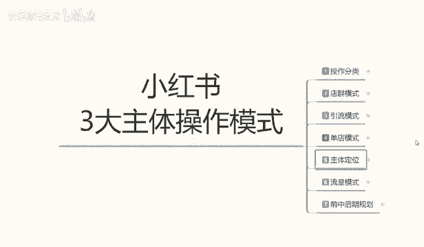
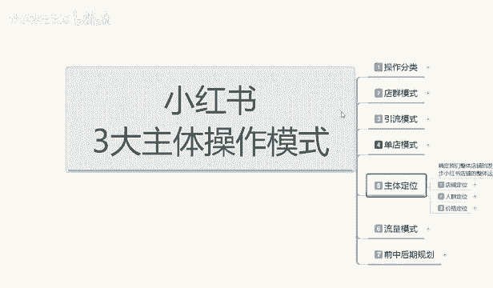
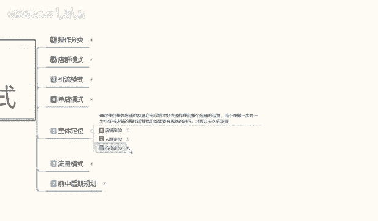
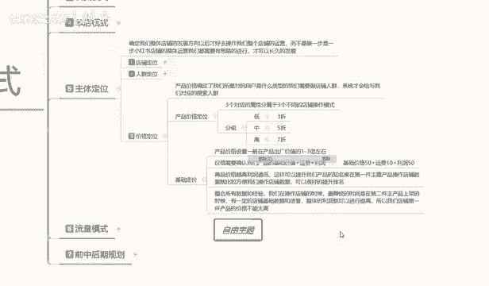
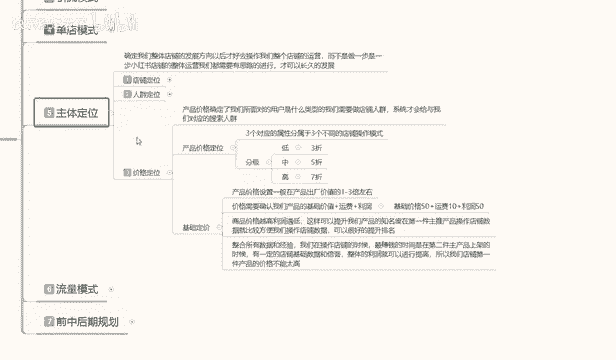
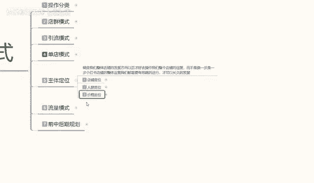
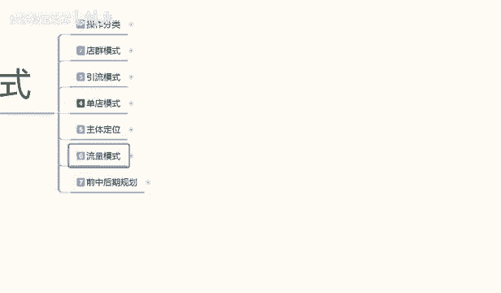

# 【2024版小红书体运营教程】全B站最良心的小红书开店运营教程！小红书体开店 起号真的快，赶快点赞收藏起来 - P53：51.小红书开店-商品价格定位 - 快乐稳定发挥 - BV1AbtoebEjX

大家好，今天给大家分享是小红书三大主体操作模式里面的。主体定位啊，第三小节的一个课程。

呃，小红书产品的一个价格定位。这个的话是根据。

怎么说呢？就是说你要想赚钱，赚多赚少或店铺定位里面最后一点啊，价格定位它是非常重要的。因为如果说你价格定位定定位不好的话，你包括后期的一些操作的话，你去做呃，说实话它的一个流量模式的话。

你整体不好起来的。所以说我们首先要把价格定位给确认好啊，包括前面的一个店铺定位，人群定位。这两个东西选好以后的话，然后确定产品的一个价格和对应的一个人群，它都是整个一体的。

好吧，废话不多说，直接进入我们的一个课程内容。产品价格定位啊价格定位的话，它是确定了我们所面对用户的话是什么类型的。我们店铺需要做的一个人群系统才会给我们对应的一个展示啊，就是给我们对应的一个搜索人群。

它不管是通过呃笔记搜索也好，就是笔记搜索也好，产品搜索也好，产品关键词搜索也好，它都是通过这种方式啊，系统判定它可能会购买你的产品才会推荐给你，而不是说呃什么人都往里面走，什么的人都往店铺里面走的话。

说实话对店铺来说不是一个好事啊，它会整体影响我们店铺的一个权重，而且它没有成交。如果说你像。小红书里面他给了你1000个访客，1000个访客里面一单都没有。你觉得你店铺还有权中吗？系统还会给你访客吗？

对不对？那就是按照这种模式来确认的啊，那这个价格定位的话，在价格定位里面的话，我们给大家嗯分享的话是两个内容。第一个是产品价格的一个定位，第二个是基础定价啊。产品价格定位的话是折扣价定位。

基础定价的话是产品本身的一个价值定位啊，这是两种不同的一个区别啊。正常来讲的话是先讲技术定价，或者说是然后再讲产品的一个价格定位。但是这里呢我先给大家先讲产品价格定位里面的一个折扣价。为什么？

因为它整体的话影响我们店铺，你到底是做什么类型的一个店铺啊，整体的一个影响是非常严重的。然后的话再给大家讲基础的一个定价啊，因为基础定价讲起来的话会稍微简单一点。嗯，但是产品价格定位的话。

它会稍微复杂一点。产品价格定位的话，其实它整体的话对应三个对应的分属性。啊，它三个分属性不同的话，就是说店铺。的一个操作模式也是不一样的啊，它分级的话可以分低中高三个三个阶层，就是一件产品。

相同的产品它也是分。嗯。好产品坏产品和差产品，对吧？你就是买服装也一样，同样的。同样的衣服啊，一样的颜色，它的产品质量是不一样的呀啊，所用的材质是不一样的，它也是分低终端三个三个分分层的。

你包括你就是说。你抽个什么啊，对吧？他还有好的，还有便宜的，还有贵的呢，对吧？你烟头烟尾烟屁股它都是不一样的啊，包括你的烟叶烟杆啊、烟叶、烟芯它都是不一样的。所以说我们做店铺也是一样的啊。

他在这个里面的话，所有的数据量，他都是给你分了阶层的，你阶层不一样。你说对应的人群不一样，不然他那么大的一个用户群体的话，他没办法细分，他不可能说是把所有用户群里，嗯。

像你倒垃圾一样全部倒进一个桶里面去做啊，那样的话，它它整个小红书系统它都起不来。所以说它都是有细分划分的啊。那在这个里面的话，我们把它可以分为啊低中高三个阶层。

三个阶层的话就是我们对应店铺里面嗯所选的一个三个属性。低层阶段就是三责产品，两个产品，一则产品。包括的话呃四责产品不算低层了啊，三折以下排算啊，就是123三折的一个物品。它属于呃低层低端产品。

什么叫低端产品呢？就是说这种产品的话，你我们产品标价的时候。本来产品的话价值可能是几10块钱，你标价的话，标个一两百，你然后打个。一折两折三折这种范围的话。系统就会判定你的话属于低端产品。

虽然说你也是卖几10块钱，但是说你的店铺流量形式进来的话，就是低端产品的一个流量。就是人群的话就是低端人群。啊，同样的道理，终端也好，高端也好，它都是对应的。你比方说你打5折，5折的话就是对半啊。

四折也是相当于是对半，6折也是一样。它就是终端人群。中端人群里面的话，它的一个对应的人群流量也就是系统分配配给你的，也就是终端消费的一个水平流量。高端消费人群的话，就是七八九十啊。

就是全折全折的话就是不打折啊。但是我们做系统的话，基本上就是说这这种店铺的话。他怎么都有一点折扣性，因为折扣的话，它是一个是吸引目的啊，第二个是嗯给店铺一个信任感，让他赚点便宜。

也就是分析用户的一个心理啊。当然了，包括三折5折汽车也是一样的，它也是分析用户的一个心理。分析用户的心理以后的话，对应的做的一个人人群之后，他爱占便宜的啊，低端的的就要买三折产品，我这么便宜。

平时买都要好贵好贵，然后去这么购买。所以说他每个阶段的话，分低中酸。地中高三个阶层的话，它对应的人群是不一样的啊，有人喜欢精品，有人喜欢便宜，有人喜欢终端的啊，不唱不下啊，试用就行。啊。

用的时间稍微长一点。所以说我们在产品定价的时候，一定要把店铺的一个折扣价的目标明确好。你把这个东西如果说你不明确好的话，你所对应的人群不一样的啊，你。你拿高端的价格。做低端的人群，你怎么去卖呢？对不对？

你那低端的人群做高端的价格，你怎么去卖呢？

他不会买的呀，对吧？就说我们在这个里面的话，一定要。确认好我们产品基础定价的一个价格分段啊，你到底是要做几折的一个产品，它的产品产品折扣分类的话是也是根据小红书整体的一个系统去运营去操作的啊。

然后下面呢是给大家讲我们的一个技术定价啊，刚刚给大家讲了折扣的一个分价的一个类目，你们了解一下就可以。然后我们后续怎么做，包括你店铺的对应人群怎么去做，都了解透彻以后的话。

你就知道自己给自己的产品定价怎么去定，然后打几何。再去用就好做了。好吧，低端价格的话，它吸引的用户流量是大，但是它的一个售后的话不是很好做啊。嗯，比方说退款啊换货之类的会多一点高端人群的话。

就很少出现这种情况啊，就是售后好做一点，就看你自己怎么选。然后技术定价在这这个方面的话，就是说产品价格测足的话，一般都是产品出厂价的1到3倍左右啊。呃，你玩具的话可能会达到5倍10倍。

但是但是这种的话比较少。正常价格的话，我们在网络运营里面就是说。你做电商店铺的，你的产品出厂价也就1到3倍左右的一个利润范围啊，你价格高一点的话，利润就低一点，价格低一点的话，利润率就高一点。

它都是对应的啊。不是说你的。你的产品价格低，我也利润也要高啊，很少有这种这种的话属于冷门产品呃，卖特定人群不熟悉的人可能会有这么高的一个差价。但正常的话，我们都是产品出养价值的1到3倍是最好的啊。

比方说这个衣服出厂价。30块钱。1倍60。啊，最多也就3倍120。你在这个范围去卖的话，还是可以卖得动，而且也比较好卖啊。最高的120这表的话，我建议大家的话就是做99之类的这种9998之类的嗯。

有一个。性价比性啊，然后对你要做产品差异化才可以。你产品不做差异化的，说实话你把价格拉到2到3倍的话也没那么好做啊。这个就是产品的价格设置，一般的话就是说1到3倍左右范围是做网络运营营销最好的一个价格。

你再多的话肯定就过分了啊。系统的话自动都会把你屏蔽掉的。第二个就是说价格需要确认我们产品的基础价值啊，算价值的话，这个出厂价啊是出厂价，不是基础价值啊，就是我们设定产品价值的时候。

产品价格需要我们产品的基础价值加运费加利润，你要赚多少钱？那运运费花费多少，然后加你的产品技术价值。再去算啊，基础价格如果说是50块钱加运费10块钱加利润50，那就是一倍的价格，就是110。

按这种方式去定产品的一个定价啊，我只是我给大家打个比例，正常定价的话还看我们自己啊。然后是商品的价格越高，利润越低啊。你比方说大型商品，你卖家居啊，或者说卖这种大型的有名的化妆品的话，它的卖价是非常高。

但是你的产单品利润的话非常低。因为第一个它的销量不成。销量不会太高啊，卖家具的一天能卖个555件到6件，那就已经很厉害了。因为有的家具的话可能会便宜点。有的那种私木家具的话，几千上万的都有，对吧？

所是说它的利润。啊。是和你的价格成正比的，你的价格越低，利润越高，你的价格越高，利润越低啊，只是说选项不一样，但是它的一个基础比例在这个地方。就看我们自己怎么。怎么去调整？然后呢。

后面呢我就不给大家说了啊，因为的话你们自己了解这部分内容的话，对这些产品也是比较比较了解的啊。最后一个点就是说整合我们所有平台的一个数据经验。我不光是小红书，包括其他平台的一些经验啊。

我们在操作店铺的时候，最赚钱的时候，永远都是在第二件主餐产品上面。你第一件做爆款的时候，如果说你做单单店单爆款。你把价格拉高一点没关系。但是你做单店多爆款的话，第一件产品的话最好是拿平价去卖啊。

整体的整体的利润的话，在第二件产品里面去做。那样的话整体效果是非常好的。因为你有一定的有一定的用户累积，有一定的信任基础。你在第二件产品去卖的时候，别人对你店铺的一个信任和产品的一个。

了解都有一定的清晰清晰度。那你产品第二件的话，说实话，第一件做一倍利润就差不多了，或者是0。5。如果说你做多报款的话，做0。5的利润或者做一倍的利润就行。第二件的话可以做到2到3倍。啊。

这就是单店和多单爆款和多爆款运营的一个区分啊，这也是我们产品价格定位的一个趋势和走向。如果说你不了解这些的话，你的产品你觉得别人卖多少，你去卖多少，正常的去做的话，你不定位店铺。不定位人群，不定位价格。

你是做不出来的啊，你就让你再多的资源你怼进去。说实话，你的投入和收入是不成正比的啊，所以说我们在操作店铺的时候，首先要把自己整体的一个主体定位定位好，好吧。

那么这节课的内容呢就给大家讲解到这。下一节课呢给大家讲解一下啊，我们小红书整体的一个流量模式啊。

