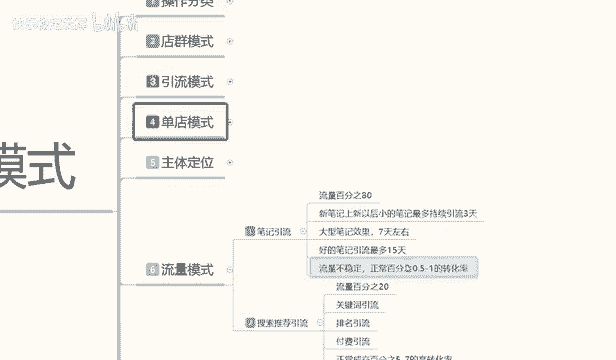

# 【2024版小红书体运营教程】全B站最良心的小红书开店运营教程！小红书体开店 起号真的快，赶快点赞收藏起来 - P54：52.小红书开店-流量模式：笔记引流+搜索引流 - 快乐稳定发挥 - BV1AbtoebEjX

大家好，今天给大家分享小红书三大主体操作模式里面的。第六节课时啊第六节的一个小课时，它不是之前的一个分类课时啊。这节课时的话主要是给大家讲解一下我们小红书整体的一个流量运行方式啊和流量运行的一个方法。

让我们整体呢了解我们店铺，包括小红书运营，它的一个模式分流。好了，废话不多说，直接开始我们今天的这个课程主题。

呃，小红书的一个流量模式啊，之前呢我给在分享的时候，给大家已经说过了啊，小红书小红书三大主体的一个店铺运营的一个模式方法。因为他们的话是有区别的啊。店区模式的话，你只是说你铺货呃做商品而已。

引流模式的话，其实只要是流量进来都可以用。但是看你怎么去引流到其他地方。然后单店模式呢主要是卖产品，他们三个模式的话，他们基本上都是不一样的。那在小红书笔记里面的话。

我们首先要了解小红书它整个系统体系的一个流量体系，它是怎么分配的。这里呢我已经给大家给打出来了啊，大家可以看一下，然后呢，我给大家详细讲解一下啊。

小红书笔记。它的一个笔记引流和搜索引流啊。笔记引流的话就是我们小红书日常发的一个呃推荐你的一个笔记，就相当于是抖音也好，或者是你的微信也好啊，它都有一个日常发送。日常发送的话，小红书的日常发送的话。

也就是说分享我们所见的一些呃新奇的奇奇闻趣事，或者说对大家感兴趣的一些内容，大家可以去搜索，或者说是进行分享。啊，包括你在里面聊天啊之类的都可以，只是说它是以一种网络形式去交流的那小红书的笔记分流的话。

它其实是可以分为两个部分的。它有80%的流量啊，是通过笔记去引流的，还有20%的是搜索流量。但是整体来说的话，它的整体引流的话，其实是笔记按百分之百计算啊，就是进入的人群它都是观看笔记去的。

观看笔记里面的话，它有的人对里面的产品感兴趣，它就会去搜索。所以说它这一部分主流量的话不会太多。它的一般的所有的浏览浏览的一个信息的话都是冲着小红书，它系统匹配的一个笔记日常去的。啊。

所以说它整体流量的话，其实百分之百都是在笔记流量里面。只是说还有20%左右的一个部分人的话，他对笔记里面的兴趣感感兴趣了以后转移到搜索产品内容里面去了。所以说他占比的话可能接近20%左右。

人体流量分配比的话应该是。笔记就占80%。啊，搜索引流占20%。当然了，这个的话是商品购买的浏览啊。正常小红书搜索的话全都是笔记。但是比记流我们把它分分均了以后的话。

就是说它有80%的流量是通过笔记进入店铺进行购买商品。20%是通过搜索关键词进入商品。这就是小红书整体流量的一个划分划分比例啊。但是这个里面的话啊给大家说一下啊，笔记。

你不管再好的一个笔记，我在这里呢给大家列了一个小的一个笔记规划路。为什么说小的笔记规划路呢？因为我们我做这个的东西的话，时间也有一段时间了啊，我做整个网络营销平台，就是对康运营平台也有很多年了。

但是小红书的话，我说实话啊，我没有做多久啊，我觉得也就做了一年多接近两年。新笔记上新以后的话，就是说我们小红书它整个的一个新笔记上新以后的话，最多持续留3天。你不管是新账号也好，老账号也好。

老账号只说权重高一点，你做的笔记的话，可能是大型笔记，或者说是好的笔记。它不是小的笔记。新的小的笔记的话，就是我们普通用户去观察，或者说自己分享自己的一些内容。它。维持时间也就在3天，除非你点赞量。

你新比一上新以后，点赞量破200以后可能会维持5天左右，但是绝对不会超过这个范围以内。就除非你做的是精品的一个P，你正常随意发的话，毕竟也就3天时间。小红书就给你三天这一个在线。3天以后的话。

你这个产品不是被下架，就是被隐藏了，就是别人搜索不到，除非是他主动去搜索，不然的话搜索不到，就是不主动给你推流了啊，这就是小红书笔记引流做笔记。我们要记住的几个点。第二个就是大型笔记。大型笔记的话。

像我刚刚给大家说的什么叫？大型笔记呢？内容稍微多一点。啊。内容的文案吸引力啊稍微大一点，就是对一部分人员。进行了一个强制执性，它整个笔业游戏效果也就只有7天。啊，只有7天，超过这个时间的话。

也就是被隐藏。被屏蔽掉啊，你除非是拿关键词搜索，你才能把它的数据档案给搜索出来。就是小红书整个系统的话，它对你的笔记进行一个评价。评价的话，它分为三个阶段啊，大型笔记好的笔记和小的一个新型笔记。

它就是3天7天四五天，最多也就四5天，就说我的笔记做的非常的精细，而且很多人观看，可能观看人数达到了几千上万，甚至少几万。但是它系统给你推荐引流啊，但是一定要记住，系统给你推荐引流最多就15天。

除非你花钱再去做推推广。啊，不然的话就只有四五天。但是花园做推广栏目，我们就没有变了。所以说我们在做小红书笔记的时候，这种笔记引流里面80%的流量啊，一定要记住了。你不管发多少笔记。

新的笔记它就3天好的笔记就7天左右，最好的笔记0上万的上10万的它的一个笔引流数据也就15天左右。他不会给你太多的时间。这个的话说实话其实是和抖音差不多的。啊，其实是和抖音差不多的。

你抖音你新赏新的一个数据的话，它也是只是给你三天的一个自然展示期，能有人多少看见多少人感兴趣，多少人停留，就看你前面接触的这些用户给你的一个数据反馈了啊。系统如果说接触到足够的信息和足够的系统反馈以后。

会给你延长几天的一个效果啊，但是最多不会超过四五天整体效果，这个就是笔记引流80%的流量的一个来源。那我们在发布商品，或者说是我们做引流模式的时候。那你我们观察一下啊，你基本上是每天1到2个笔记最少的。

去操作。那这个笔记里的数据的话，就是按照这个去计算。你如果说想要流量保持稳定，那么你就要按照有一定的规划。你比方说三天退一篇，两天退一片或一天退一篇或者一天退两篇这种固定的模式去做。

你们才能保证你对你的账号进行访问。我现在都不说店铺啊，他只是对你账号店铺进行访问，还还没有进入到你的店铺，进入到你店铺的话，它那个流量的话是另外的一个来源啊。

是下面给大家说的一个搜索流量来源和笔记引流80%的来源。鼻翼牛啊。这里面有一个点就是。流量它是不稳定的。你可能第一个笔记。呃。内容多一点，丰富一点，观看的人数多一点，可能引留7天左右。

但是你下一个笔记的话，可能或者是下两个下三个笔记的话，可能都是有3天内引流，而且流量数据非常少。这个就是说毕竟流流量不稳定。啊，同时这些流量进入你店铺，或者说是你推广的商品进行宣传以后。

它的正常百分比转化率的话只有0。5到1%。就是说通过笔记进来观看你店铺进行购产品购买的。如果说你没有维护好里面的一些评论啊啊互动啊之类的，它转化率只有0。1%到百0。5%到1%，这已经算是高的了。啊。

可能还会更低。所以说大家不要把那个比引流的话呃当做主体的运营思维去操作。因为它的转化率实在是太低了，它对你店铺整体影响的话呃有一定的影响。但是我们只是说把毕业。嗯，做精细化，做原创笔记去发布。

或者按照自己的思路推广给别人，按照这种模式去做。因为小红书的话和其他不一样。它第一个你要有自己的一个整体创造思路。如果说你没有创作思路的话，你整个运营模式，你就算做的话，你是真的不好做的啊。

小红书它对这些精细化的要求还是比较高的。你不要看它流量那么那么杂，但是它的人群的素质要求是特别高的。你对于这里面一点，我们是做不了的啊。第二个就是搜索的一个推荐引流。虽然说这个流量的话是占百20%啊。

就说成交的流量比例占比20%啊，大家不要误会，不是小红书整体访客有20%全部去做搜索了啊，它是百分之百的笔记观察。然后在百分之百里面有可能20%的人去会去搜索产品，或者是无意中点进来去观看产品。

有20%左右的一个流量啊。然后在20%左右的流量的话，他会在里面搜索关键词。然后去搜索你的产品，看见你的商铺进去。但是这个里面的话，它的一个正常情成交比例是在5%到7%。就是说他对这个产品感兴趣了以后。

他搜索成交的概率是非常大。啊，他基本上不不感兴趣了，他不会进来。那么他收索了以后，你店铺成交转化率可能就在5%到7%。如果说我们在上面结合三上面三个主体模式来操作的话，就是电池模式也好，引流模式也好。

单点模式也好。那你就已经知道自己要去做什么，对不对？你比方说电池模式的话，其实不用在乎这两个点，因为你完全就是笔记引流的。你是商品和关键词引流的。它不管是搜不搜索商品，你基本上这两个点它都包含了。

但是引流模式的话，主体是做笔记引流。

啊，单店模式的话主体是做搜索引用。所以说这两个这几个点的话，我们一定要分清楚，我们在做任何的一个属性词汇，或者说是做店铺也好，做运营也好，你都要了解整个小红书它运行的体系。

你才能去把店铺做的更好，你运行体系都不了解的话，我们是没办法做电脑。所以说我们一定要注意了啊，小红书整体的一个流量模式，它是笔记引流和搜索引流两大类目。啊。当然了，如果说我们说做单店的话。

你笔基引流做不做，你肯定是要做的。因为你不做笔记引流系统的话，默认你是个死店，他都不会给你流量的啊，所以说你不要小瞧小红说笔记引流。虽然说它转化率不高，但是你也必须得做啊。

只是说我们投入的方式和力度不一样。我们再把店铺基础属性全部做好以后的话，基本上所有的属性全部都是靠笔记引流去做的。

啊，毕竟牛的话，前期还是占大头。啊，中后期占大头，前期的话我们是要先维护好店铺的基础数据，你把数据做出来了，你才能去做维护，你数据都没做出来，你做维护。维护什么数据呢？对吧？所以说顺序一定要弄清楚。

那这个呢就是我们这一节课的内容整体的一个流量模式。然后在搜索里面的话，它这个里面还有一个搜索流量的一个关键词引流排名引流和付费引流。三大引流的一个主体的话，说实话这几这几个点的话都是可以拿单独来讲课的。

为嗯给大家进行分享的。因为关键词引流排名引流和付费引流的话，他们都是有排名的啊后期呢我会给大家详细的说一下。然后下一节课呢给大家分享的啊我们前中后三个周期的一个规划。

