# 【2024版小红书体运营教程】全B站最良心的小红书开店运营教程！小红书体开店 起号真的快，赶快点赞收藏起来 - P55：35.小新手小红书运营-红书私域引流 - 小林讲运营c - BV1wxxMeJEAe

大家好，今天给大家分享的是小红书全集系列，的三大主体啊。

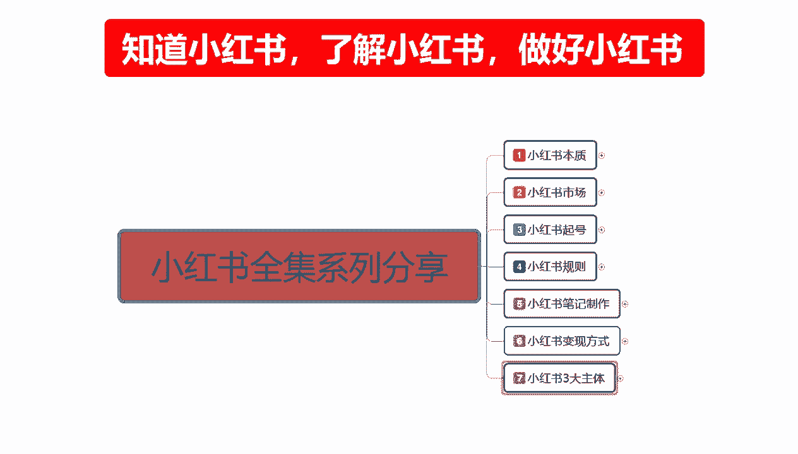

第二大课时思域引流，我上一节给大家讲的是店铺运营的一个，整体思路啊，当然后续的一些太具体的东西，我没给大家进行分享，后续的话我会单独做一些这个店铺运营的课，给大家呃，思域引流的话，它相对于店铺运营的话。

说实话它的模式是比较简单的啊。

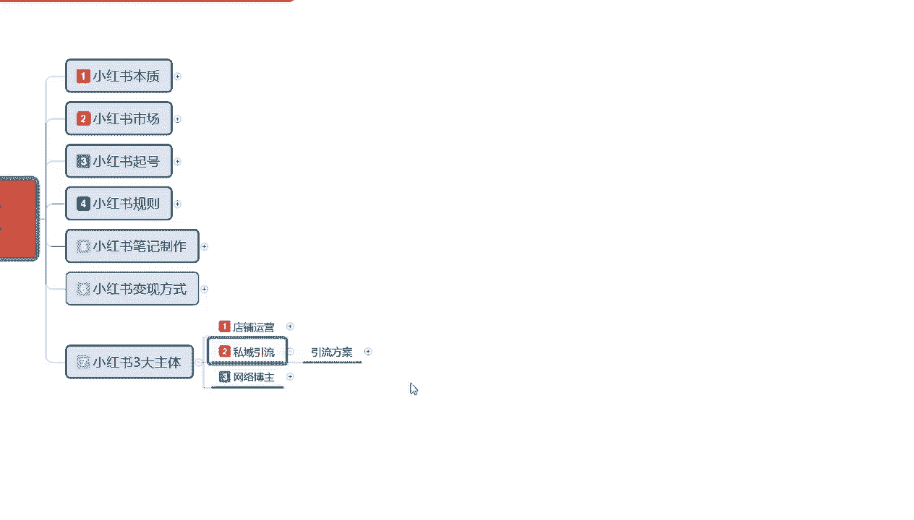

模式是比较简单的，但是他所操作的重点的话嗯。

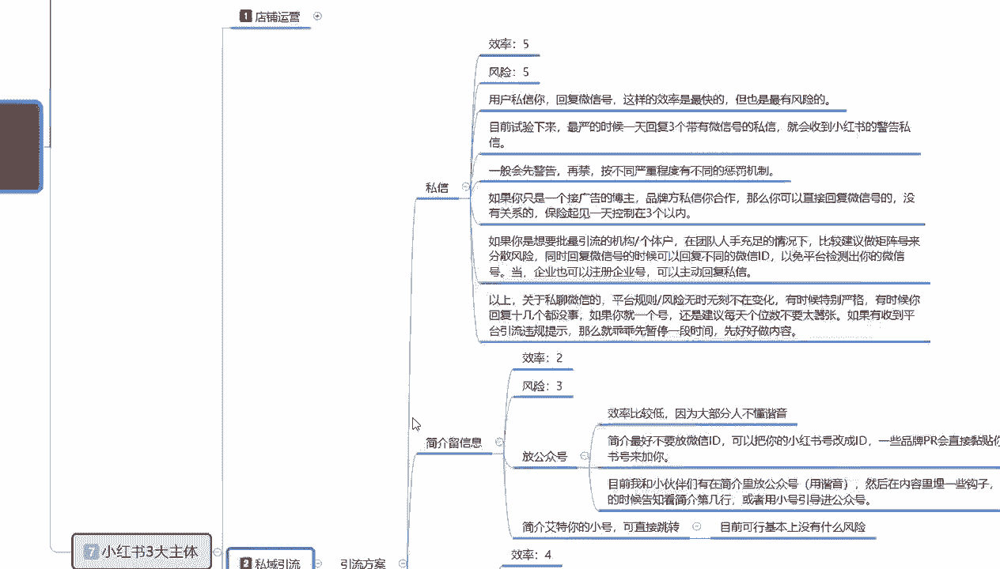

怎么说呢，其实和店铺差不多，只是说他的一个整体方式。

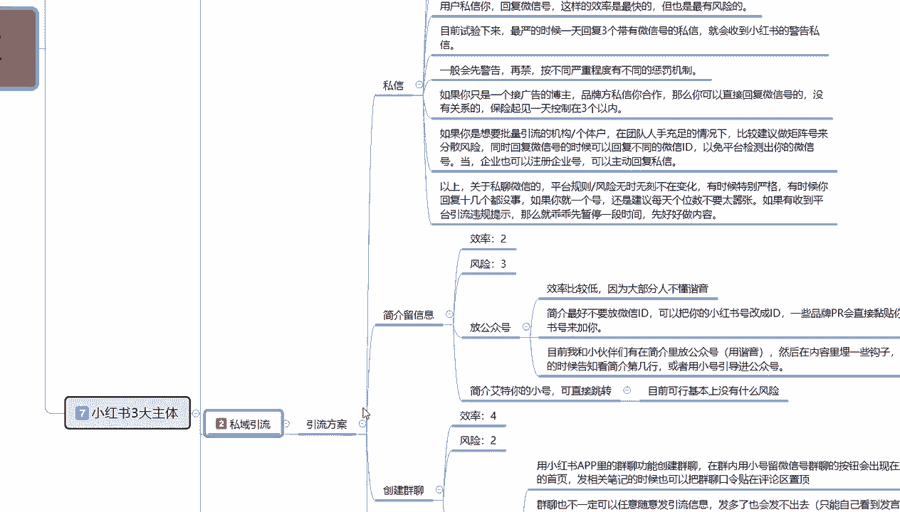

我们需要详细的了解一下啊，这里我的话我把它分为了呃四个点，这四个点的话就如我们再把账号做起来以后，店铺权重做起来以后的话，我们引流到私域的一个方案和方式，大家可以了解一下，首先第一个私信。

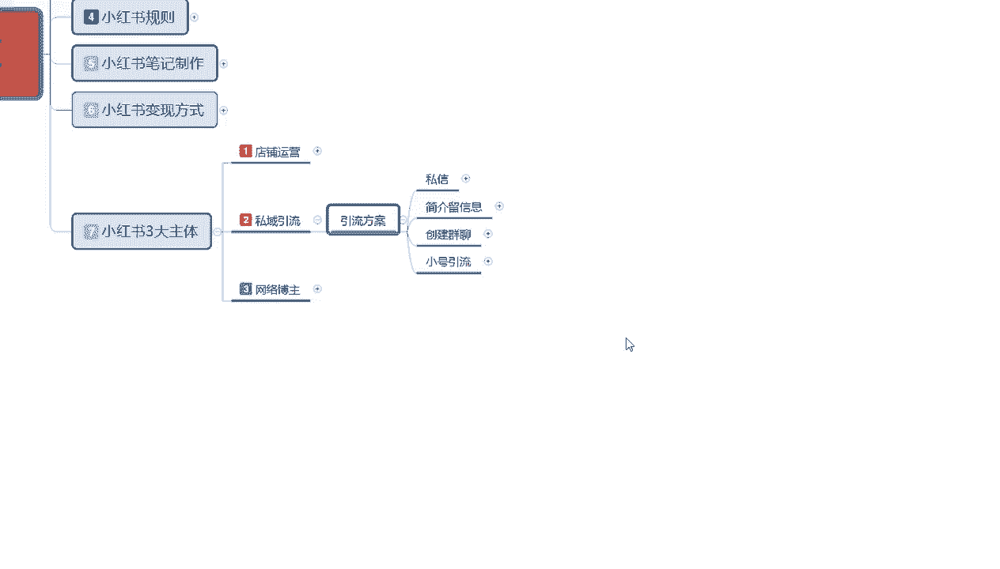

这个呢是思域引流的一个方案啊，大家可以了解一下它的一个效率的话，就是说风险也是五，我们拿些123455个等级来划分的话，效率五，风险五，为什么效率高，风险也大，你做完以后的话，基本上账号就废了啊。

但是建议的话就是说你做短期的那种嗯，只做账号权重的，你把账号权重做起来以后，按照这种私域引流的方式去复制十来个店，做这个方式也可以，但是还是要大家自己考虑一下啊，什么意思呢，用户私信你啊。

回复微信号这样的一个效率虽然说是最快的啊，但是也是最有风险的，目前的话就是说我们试验下来的话，最严的时候，一天回复三个带有微信号的私信，就会收到小红书的一个私信警告，意思就是你在小红书跟别人私聊的时候。

发三条微信的话，基本上就会被警告了，你再发的话就要封号了啊，所以说效率快，但是风险也大啊，你做短期的可以做，长期的话这种方式肯定不行的，一般呢先会警告，然后再进，按不同的严重程度的话。

有不同的一个惩罚机制，这个的话你做了，你就知道了啊，就在这就不给大家做了个过多的一个解释了，然后如果你只有你只是一个接广告的，一个博主的话，就说品牌方私信和你合作，那么你可以直接回复微信号的。

这个没有什么关系啊，保险起见的话，一天的话还是说就说我们一个引流账号的话，一天还是控制在三个私信引流好比较好啊，超过三个的话被警告了的不划算，没必要啊，如果说你是想批量引流的一个机构。

或者说是个体户的话，在团队人手充足的情况下，因为你做私域的话，你有团队才好做，你没团队的话，个人做的话，说实话你只能慢慢做，做引导私信这种方式的话就不适合你了啊，团队的话因为账号比较多啊。

他可以做这种方式，建议的话就是说做矩阵号，来操作的话会好一点，矩阵号的话，因为你本来有团队，你就是嗯做私信号，这个号做完浪费，然后把他那个注销换号再重新来，你通过这种方式，你需要人员去操作。

所以说做举证号的话会比较好一点，你在评论区里面艾特某个私信，然后就用这个号直接去给人家说发私信，发微信号之类的，他对主账号的话是没有太大的一个权重影响啊，你也可以把账号的一个数据量给导过去。

这个就是私信的一个，你后面的我就不给大家说了，大家看一下就行。

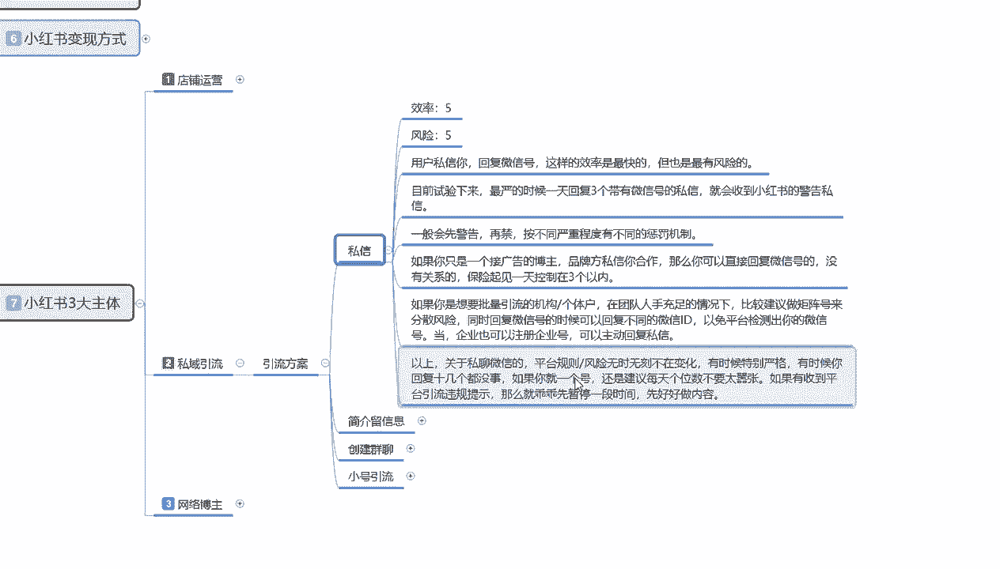

然后是简介，有简介留言啊，效率的话比较低啊，风险一般。

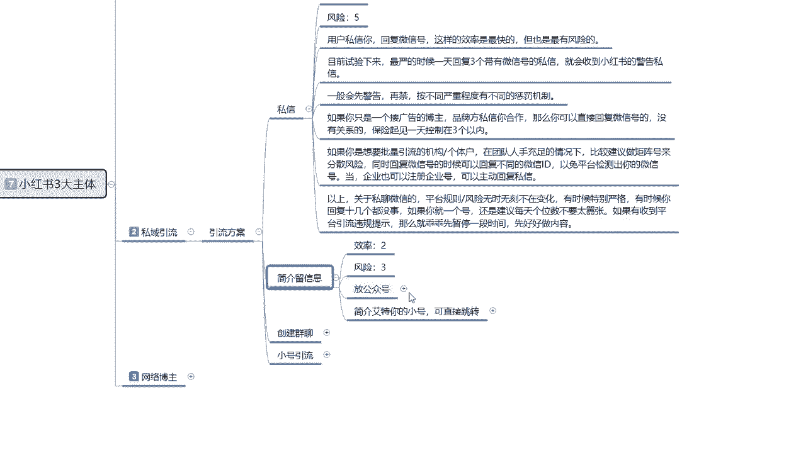

什么意思呢，简介留言他的整体效率的话比较低，因为大部分人的话他不懂得谐音，就是我们在我们自己账号的留言面板上面，利用符号用笔用其他的一些东西，然后的话简介留言流传我们自己的一个微信号，QQ号。

或者其他的一个微博啊之类的等等一些信息，用特殊符号代表的话，系统它也会分辨，但是它分辨的话就没那么清晰咳，简介的话就是说最好不要放微信id，可以把小红书的号改成id，一些品牌的P2。

会直接粘贴复制你的一个小红书号来加你啊，就是别人要找你联系，要你要帮我推广广告，他会想方设法的来联系你，而且这种放公众号的一个形式的话，说实话它也只有大的一个项目啊，他才或者说对小红书非常了解。

对整个网络非常了解的人，他才会去想方设法的找到你的账号去进行联络，所以说它的效率是一般的啊，对特定的人群和对于为主账号的话，说实话不是太好用啊，就是说目前我们的话就是嗯，小伙伴在简介里面放公众号。

用谐音，然后在内容里面放一些钩子啊，在私信的时候呃，看简介第几行，或者用小号引导进行公众号，这种方式的话还是比较安全的啊，简介艾特你的小号的话，可以直接跳转，目前的话基本上是风险比较小。

但是效率的话不是不高。

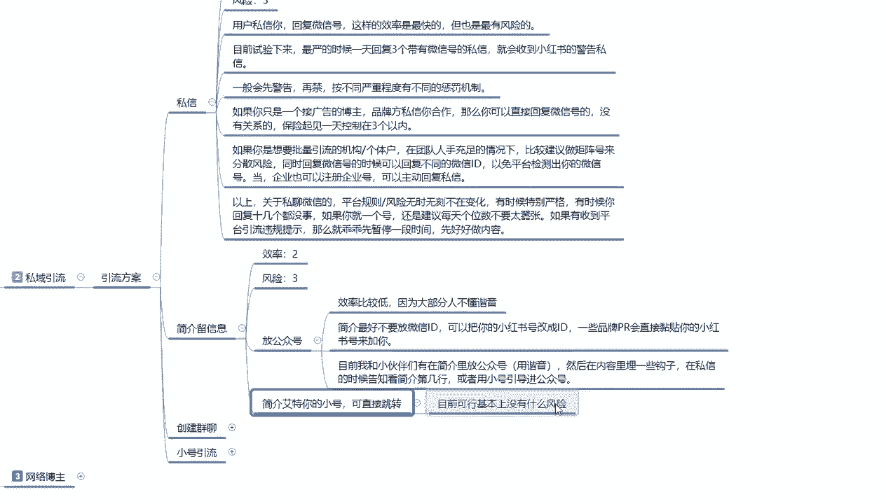

然后就是创建群聊和小号引流。

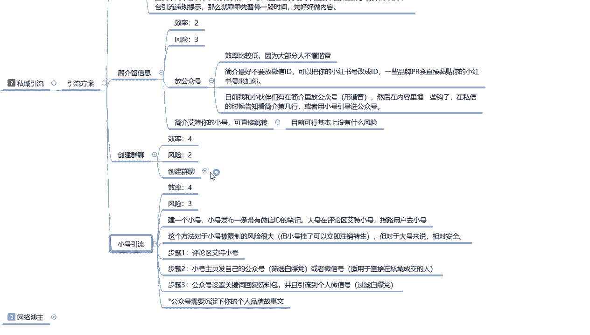

创建情调啊，效率四风险二用小红书，小红书里面他有一个群聊系统啊，app里面的群聊功能的话，创建群聊，在群内用小号啊，留微信号，小号被封了无所谓，知道吧，小号的话被封了以后的话，我们再删除。

再重新注册就行啊，注销一下，然后再重新注册就行，那小号用小号留微信号，群聊的按钮会出现在主页的一个首面，首页发布相关的一个笔记的时候，也会把群聊的一个口令评论在评论区，然后我们用主号把他置顶就可以了。

懂我意思吧，这个就是我们整个的一个私域引流的一个方案，咳，当然了，群聊也不一定可以任意发布引流信息啊，发多了也会发不出去的，只能看自己，只能自己看到发言，就是说他会被系统屏蔽掉啊。

你微信这种东西发多了以后的话，一个账号你发个发个几次就会被屏蔽掉啊，但具体的一个边界的话没有，就是说我们也没没有测出来，他的一个明确的具体数量是多少啊，还是要看我们自己根据账号不同的一个测试。

我们自己测试一下去操作比较好，比如说如果不是每次有人进来后，你一遍遍的发微信的话，你可以在群管理设置里面啊，开启对新城新城区域用户的一个展示历史消息，你把这个打开以后的话，新人进来以后的话。

你让他往上面看就行啊，可以看我们之前发送的一些消息，比如说你避免啊账号频频繁的频繁的更换新号，这个方式啊，就是让新进来的用户也能看到，我们上面发送的一个消息就可以了，怎么维护就看我们自己了啊。

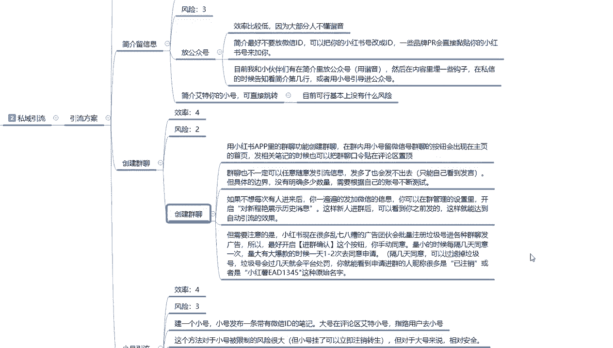

注意要注意的啊，就是小红书现在很多乱七八糟的一个广告团伙，会批量注册垃圾号，进行各种的一个群聊发广告，所以最好开启确进行确认这个按钮啊，你要手动同意最小的时候没，就是说你不是长时间在小红书上面的话。

最好的话就是说每隔几天同意一次，量大的时候，大爆款的话有个一到两天统一一次，或者是一天统一两次，这种和解人同意，可以过滤掉很多的一个垃圾账号，跑到你的群里面给你发广告，懂我意思吧，就是我们在操作的时候。

你也要避免同行的一个竞争啊，这里面的话就是说垃圾号的话，他过几天的平台就会处罚了，因为他的不光在你这推广，但在其他地方也是做推广的，你就能看到有申请进群的人，你就是把这部分人把它避免掉的话啊。

避免竞争的话，进群的人称里会有很多是已注销，或者说是小红书呃，EAD12345这种名字就是原始名字，他没有改名字的那种啊，你把他直接删掉，屏蔽掉就行了，不让他进来就行，这个就是小红书创建群聊。

群聊以后的话，我们再去引流到其他方地方的一个方式。

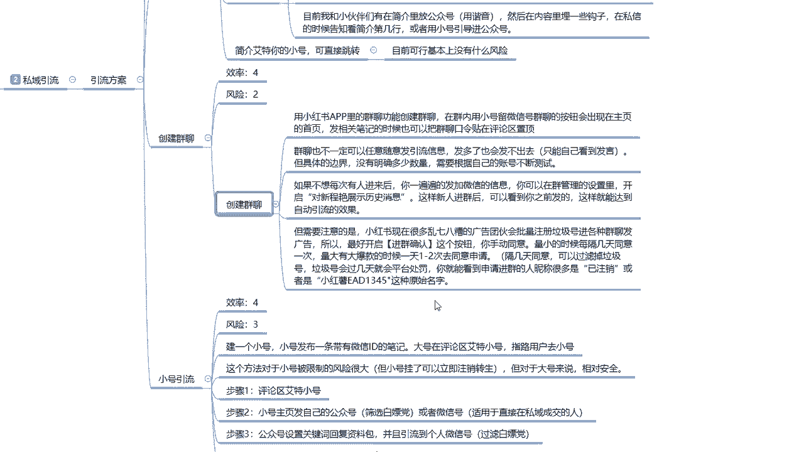

然后是小号引流，小号引流的话效率是比较高的，风险也还行，建议一个小号，小号发布一条带有微信的id的一个笔记，大号在评论区艾特小号啊，子路运用子路就是你去找他啊，加我微信私聊，通过这种方式去做。

这个方法的话，对于小号被限制的风险很大，就说小号挂了，我们可以立即注册再换，然后再发笔记就行，对于大号来说的话相对安全一点，就是步骤就是评论区艾特小号，步骤二，小号发主页发自己的公众号。

筛选标白嫖党或者说是微信号啊，用于直接在微信私域成交的步骤，三就是公众号设置关键词回复资料包，并且呢引流到个人微信公众号的话，需要沉淀一下我们个人品牌和故事啊，就是公众号里面你要把它做好了。

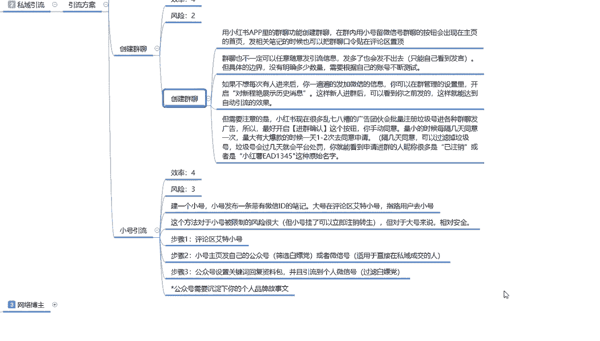

你才能去做引流，你公众号做不好的话，你做引流，你上面这几个方式都不行，懂我意思吧。

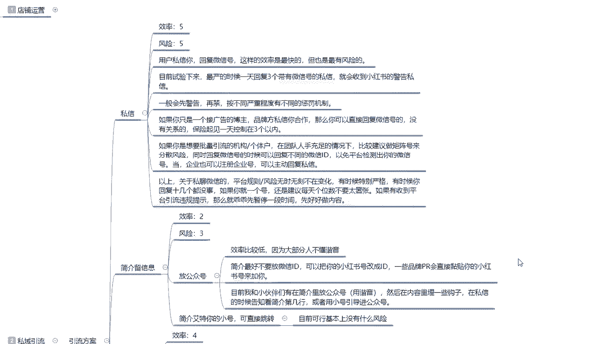

你没做好的前提下都不行啊，后面也包括小号引流啊，小号引导之类的，就看我们自己怎么去配置了啊，你做这种嗯私域引流的。

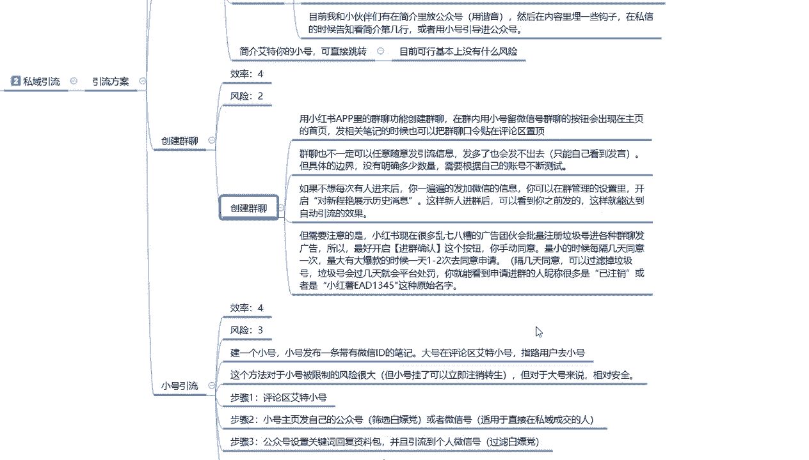

说实话你按照这个方式这几个步骤去做的话，你只要账号没有什么太大的毛病，都比较好做，这个呢就是整个的一个私域引流的一个方案，好吧啊，下一节呢就是我们本系列最后一节课，网络博主我们应该怎么去操作。

本来呢是有好几个方案的，在这里的话，我就只给大家列了一个重点的一个方案。

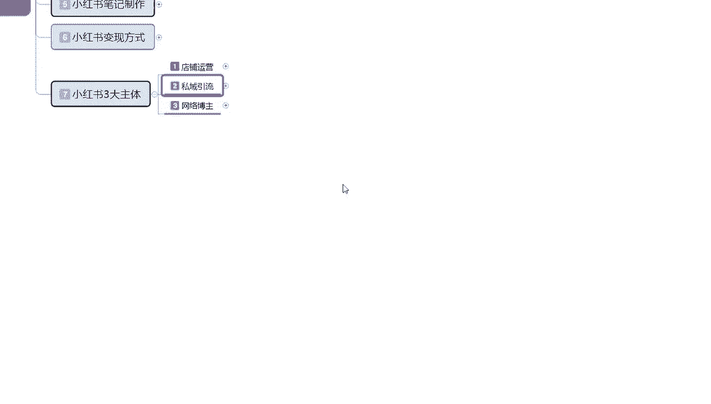

让大家了解一下整体的大致规划和思路的话，基本上都是一样的，只是说我们选择的一个方向的话，他不同好吧，我们主要是进行一下了解。

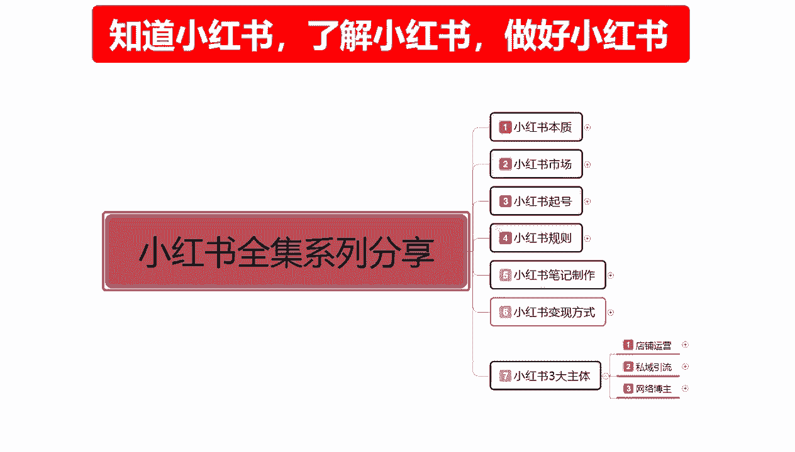