# 【2024版小红书体运营教程】全B站最良心的小红书开店运营教程！小红书体开店 起号真的快，赶快点赞收藏起来 - P55：53.小红书开店-店铺前后中期规划（1） - 快乐稳定发挥 - BV1AbtoebEjX

大家好，今天给大家分享的是小红书三大主体操作模式里面的啊第七小节的一个内容啊。前中后期三个时间步走对于店铺进行的一个规划啊，当然了，包括引流模式和电梯模式，我在这边呢这期的内容里面的话。

前中后期三期规划我就不讲引流模式和店群模式。因为电池模式的话，说实话是没有中后期的一个规划了。它只是说它整体模式基本上都是一样的。我们持续操作就可以了。引流模式的话。

这三期规划对于你它是因为它是做小红书店的，引做引流模式的话，其实小红书电子。啊，你的主要效应的话还是做笔记的。所以说在这个里面的话，对他们两个影响不大。我主要的话就是说按围绕安电模式。

我们讲解一下前中后期三个规划的一个思路和了解。

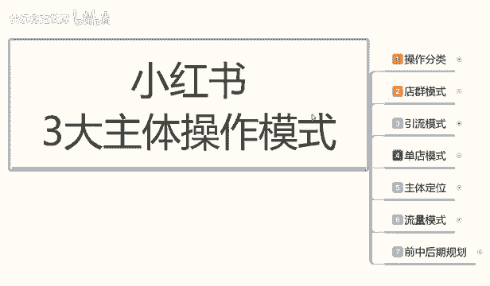

那我们首先来了解一下啊，我们在做单点模式，前期中期和后期三个规划啊。这里面的话我着重给大家讲解一下啊，前期规划和后期规划。中期规划的话我没有完全给大家列出来啊，是有原因的。因为中期规划的话。

它的一个属性分类，你要了解我们是要把店铺的数据去给做出来。

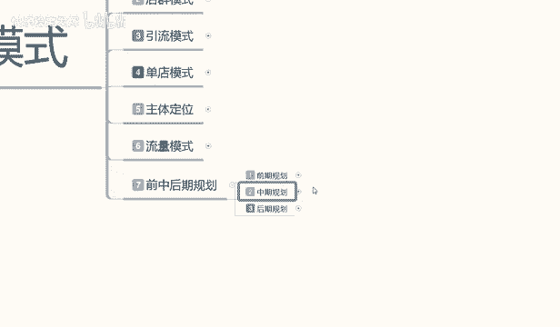

啊，它整个一套系统的话是非常多的一个内容。我呢后续呢会专门拿一期啊，整个一期十几套课程。给大家进行分享我们中期规划店铺的数据怎么去维护，怎么去操作。这期的话我主要是给大家讲解一下。

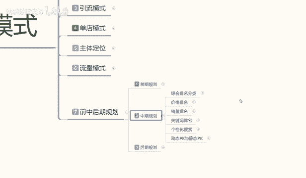

啊，前期规划和后期规划。前期规划的就是我们店铺基础的一些属性。后期规划的话就是说我们在中期属性做完以后，店铺面临两种选项啊，我们怎么去操作店铺的一个发展方向啊。

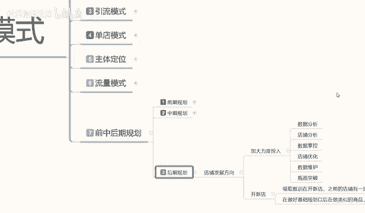

那先给大家讲解一下前期规划。

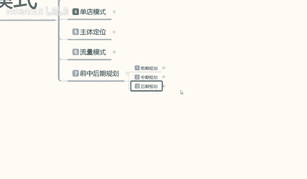

前期规划这个里面的话，我说实话啊，我呢是准备拿两节来给大家做分享的，为什么呢？因为它的内容的话说实话比较大。呃，下面的一个操作人员和对标操作的话，我先暂时不说。

我先给大家说一下我们这个前期规划的一个商品准备和一个基础数据啊。

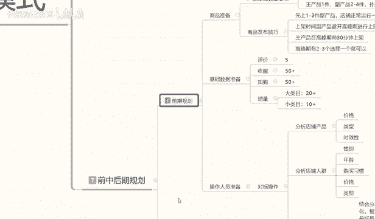

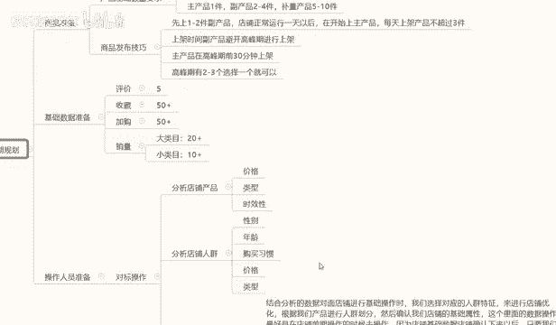

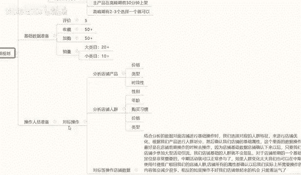

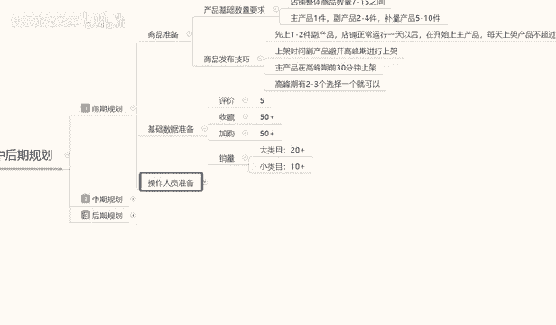

什么叫商品准备呢？就是我们在小红书里面做店的时候，你的产品可能我选主产品的时候可能是单一的。但说实话，你选产品的时候不是单一的，你的店铺最少要保证7到15个之间的一个商品数量。

因为说如果你的产品太少的话，别人进入你店铺观看你一个产品直接跳走你店铺的跳丝率太高。没有第二个产品选项，它对你的产品感兴趣的比例可能不到60%。如果说你有多个产品。

它会在反复之间就是减小减少你的店工的一个产品跳丝率，它会在反复产品之间观摩横量以后，如果说感兴趣的话，他可能会买啊，它的一个成交率可能会达到70%到90%。如果说你的产品太少，就一件两件产品的话。

别人看完就走了。说实话他都不在他继续到其他店铺里面去看完，都不会在你店铺里面进行停留和成交的。所以说店铺整体的一个商品数量的话，它是在7到45之间。然后这7到15之间的一个产品的话。

其实我们还是有划分的啊，这个划分是什么呢？第一个是主产品一件，副产品2到4件。啊，不亮就是。存储填充店铺数量的产品5到10件。啊，他的比例是什么呢？1比2比5。为什么叫1比2比5？就是一件主产品。

两件副产品。见。不亮的一个产品。这是最基本的一个数字配种。你在后面每多一件副产品就要多加两件左右的一个副产品。但是整体的话7到15是最合适的一个产品范围以内，再多的话影响你的店铺整体的一个多销率。

再少的话，对于你店铺的一个整体规划和呃顾客浏览，包括跳丝和浏览市场，它都是有影响的。所以说7到15件的产品是正好的。我刚刚所说的这些呢内容就是我们产品基础数量的最低需求量啊。

下面呢是给大家说一下我们的这个商品的一个发布技巧。商品发布技巧的话。他是。有一个上新时间的啊，它这个的话会提升我们产品的一个基术排名属性。我们把这个操作好的话，对我们店铺那个展展现和展示的话呃。

它是有优先排序的。产品发布技巧的话，这个里面的话是先送1到2件副产品。店铺正常运营一天以后呢，我们再开始上传主产品啊，每天上架的产品不超过3件。就是说你在第一天的话，到1到2件副产品。

或者是再加一个不亮产品也可以不加也形，1到2件就行。然后上完产品以后的话，不要再做其他任何操作了，为什么？这么做啊，这里面的话它是有一个时间保底的。什么时要时先保底呢？就是你的店铺注册成功以后。

它有一个系统更新时间。同时包括你商品上新以后，它有一个系统更新时间。这个系统更新的话是让你的店铺有排名，商品有排名。当然这些排名的话是。根据我们店铺属性来做的啊，这个里面店铺整体的一个属性。

你的属性越好，你的排名也就越高。正常的话，这种这个内容的话是在中期。就是我们中期规划里面的话，我会来给大家讲到，但是中期规划的话，你们可能需要看另外一些的一分享视频了。因为我会单独把它列出来的话。

给大家做一个那个分享模式。因为它的内容实在是太多了，我们要了解的内容也是比较多的。小红书坐垫的话，你做商品单品店确实是要稍微复杂一点。你要了解的东西非常多啊。然后。呃，刚给大家说的是副产品啊。

第一天上架以后就不要做其他任何操作了。在第二次去进行上传就行了啊。因为让整个系统它有一个反馈的一个时间。系统反馈的话，你后面后续的产品虽然说也有更新时间，但是它不会像第一次那么明显。

第一次的话是淘宝重新录入进行排名。第二次的话是直接已经录入有排名的情况下进行排名的一个比较啊，你在上新主产品的话，它的权重模式会比第一件，第二件产品要高。比以说我们在前面两件的话是副产品。

后面第一件的话才是主产品啊，放架时间，副产品的话，避开避开高峰期。就是说你不要在你产品的一个高峰期时间去上架我们的主产品，避开高峰期就可以了啊。主产品在高峰期前30分钟进行上架啊。

高峰期的话一般都有2到3个高峰期。你除非是特别冷门的话，也最少最少的话就是两个高峰期，基本上多的话，正常比例的高峰期的话都有3个。啊，我们在高峰期前30分钟上架去抢排名就行。

这个呢就是产品的一个发布技巧。后续呢就是我们产品就是新品不管上架也好，或者是老品上架也好，它都有一个产品的基础数据的。这个产品的基础数据的话，我们基础准备数据里面有。评价至少加购和销量。啊。

数学我已经给你大案列出来了。评价的话就是说我们单品评价，你要正常的把这个产品想把它卖出去的话，你最少有5个评价以上。收藏加购量最少在50以上啊，这个的话其实没有什么影响的。它的数据越多的话，越大。

你对你店铺的权重也就越高。同时这里面还有一个主产品的一个销量。这个主产品的销量为什么说是呃主产品销量呢？销量里面的话它分为大类目和小类目。还有一个冷门内幕，说实话冷门内幕的销量的话，我没有给大家列出来。

因为是我觉得。你做冷门内幕的话，你对网络运营不是太了解的话，基本上不好做。因为冷门内部我们去操作的时候，你的竞争压力太大啊，比是说我在这里只呢只给大家列了两个，一个是大类目，一个是小类目。哪里功属什么？

热笑餐。你的最低销量必须保证在20个以上。就是产品销量不是评价啊，销量保证在20个以上，你的产品展示给用户以后，用户才会考虑去去购买。如果说你的销量基础是定，嘿嗯小红书里面有一个特点。

特点就是你产品销量没碰零的时候，它是不会给你任何自然流量的。你只有产品破零了以后再去做推广，它才会有自然的一个店铺展示数据啊。大家记住这一点啊，你销量不会零的话，你都没有展示的啊。

包括它的小红书系统的一些任务，你要跟着它任务去循环做的。就说我们在操作店铺的时候，大类目你保证店铺最少20个销量就可以了。你的产品就可以正常售卖了，就看你能引进来多少流量，你流量越多。

你的成交概率也就越高。当然了，你的销量越高，也同时保证你成交转化率的一个概率。你比方说你有100销量，500销量1000销量1万销量啊，这种销量的话，它都是有排名的。小类目的话保证10个到15个。

最少10个到15个之间。啊，再往上面走小类目虽然说精准性特别高。但他也有一定的竞争压力。你的小类目的话，它这种搜索比例的话，呃，销量就没有大类目那么高。因为你不需要怎么去抢的排名。

就看自己大大家自己怎么去理解。如果说你是小产品的话，肯定要排名，销量就要高一点。如果说你是大型的家具类目的那种，或者说是电器啊之类的。呃这边好像卖不了电器啊。你就记住了，小类目。

你最少10个以上到15个的一个销量，大类目就是20个以上的一个销量啊，这个就是前期规划，我们的一个商品准备和技术数据的一个准备。把这两个数据准备好以后的话，我们就啊。

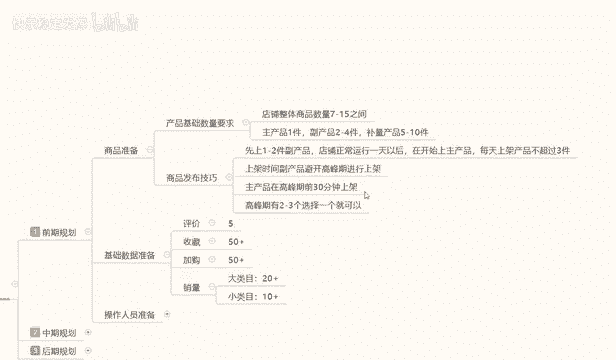

准备操作人员的一些配置了。因为课程原因的话，嗯，我会把它分到下一。下一分享内容给大家的话进行分享啊。主要的话就是给大家讲解一下我们操作人员的一些准备。

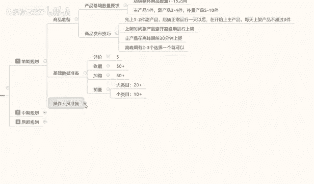

包括对店铺的一些分析，然后呃进行店铺的一个整体规划的一个操作。

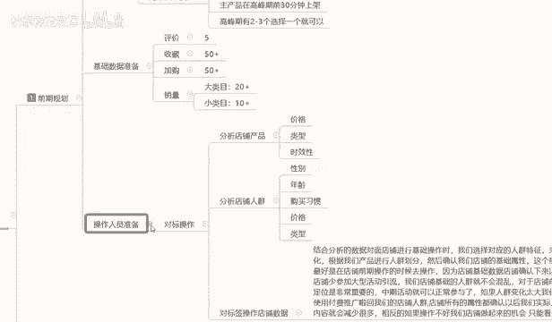

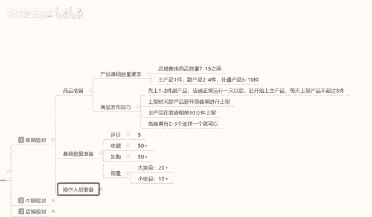

那这节课呢就到这里。