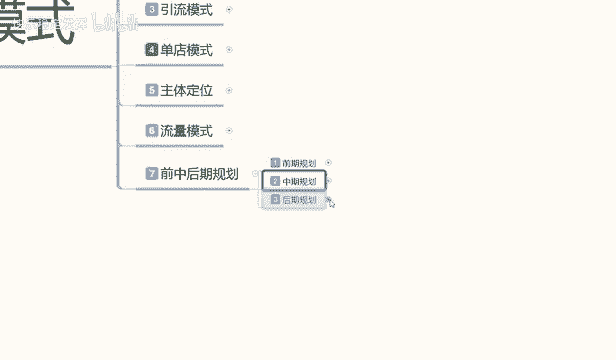

# 【2024版小红书体运营教程】全B站最良心的小红书开店运营教程！小红书体开店 起号真的快，赶快点赞收藏起来 - P56：54.小红书开店-店铺前后中期规划（2） - 快乐稳定发挥 - BV1AbtoebEjX

大家好，这一节给大家分享的是小红书三大主题操作模式的第七节内容啊，也是我们最后一节的一个内容。

前中后期的一个规划。上期呢给大家讲解了我们的一个商品准备和一个基础数据准备啊。这期的话是给大家讲解一下我们操作人员的一个准备。

操作人员准备的话，包括我们后期的一些规划。这里面哈其实操作人员准备的话，它有一个操作前提。操作前提的话就是说对标操作啊，这里呢对标操作它的一个是准备操作人员。

我们需要在小红书里面对店铺的一个人群进行划分，还有对店铺人群商品用户的一个划分。这里面的话对店铺用户产品的话就是价格类型和时效性啊，这是商我们小红书店铺的产品的一个分析啊，价格类型时效性。

之前的课程内容我也给大家讲过了，我们把这个结合一下，然后呢再加上店铺分析店铺的一个对应人群，就是用户啊，我们这些产品要卖给谁，卖给什么样的一个价格，卖给什么样的一个类型的人群。然后呢。

他是在什么季节卖的。然后我们分析店铺的人群里面的性别年龄购买习惯和价格类型。然后做对应的一个人群调整。啊，这个呢就是对标签操作店铺的一个数据啊，就是对标人群的一个操作。我们在操作前面的基础数据的时候啊。

就是超出这些基础数据啊，我们要用这个去做。

啊，技术数据准备的一个数据量。

啊，结合分析数据对店铺进行技术操作的同时啊，我们选择对应的人群特征来进行店铺的一个优化数数据处理啊。根据我们产品进行人群划分以后啊，确认我们店铺的技术属性。这个里面的话。

数据操作最好是在店铺前期操作操作。所以说我把它这个对标操作的话是放在这个地方啊，上面的话就是说基础数据准备，下面就直接用对标操作去操作了。因为直接用对标操作的话，会省出我们中后期的一大部分的一个麻烦。

如果说我们在前期对标操作没做好的话，我们整体的一个店铺人群是偏离的。因为它系统随机给我们的一个访客的话，它数据是不准确的啊。就说我们的呃进店访客，你就算进店再做，他没有成交没有转化的话。

你包括呃中后期的数据你提升不起来，你只能在前期的时候小打小闹几天卖单，十几天卖单这一种啊，那样的话，我们开这个店铺的也也失去了意义，对吧？所我们在操作的时候，一定要把它的前期基础数据。准备好了以后。

然后再去操作啊。这点呢其实我那是已经把我要说的内容大部分呢给大家打打出来，只是说我怕大家不理解，然后给大家详细的更加解释一遍。对一个店铺前期的一个技术来说，定位的话，它是非常重要的。

如果说我们定位不准确的话，中后期你活动都不能参与了。你把人群做准了以后，你中后期活动的话，还是可以尽量参与一下。因为它的个流量提升空间还是非常大的啊。如果人群变化太大的话。

我们在中期嗯也可以用付费推广去调整。但是我觉得没有必要啊，我们前期能避免的事情没有必要再花钱去做了。

所以说这个呢就是我们操作人员，他有一个对标操作，我们只要把这几个步骤把它做好啊，就是分析店铺的一个产品，分析店铺的一个人群，然后再找这些人去做这个基础数据。

你的前期基本上就可以平困度过了。这个里面的话有一个时效性大概7到15天就需要完成啊这部分的一个内容。这个呢就是我们前期整体的一个规划的一个思路和规划的一个。日情标准。我不是说别的，我只是说执行标准。

我只给大家分享的这些内容的话，是需要大家自己去操作的。我不可能去说是把所有的细节全部在这地方给大家展示啊。因为有些东西的话还是要靠我们自己去理解。所以说我在这里呢给大家说的就是你的前期技术数据准备。

你必须要用对标人员去操作。啊，必须要有对标人员去操作。因为其他人员操作也可以，只是后期后续的中期，我们对店铺的一个调整的话，它有很大的一个变化。就是说我们前面如果说我们有些朋友啊。

你们做店铺已经把前期已经度过了，现在是中期，我想改变店铺的一些情况，人员转化率啊啊，包括我们店铺的一个提升或者瓶颈，其实都有办法啊，只是非常麻烦。对我们新手玩家来说的话啊，你刚接触小红书店铺不久的话。

说实话你按照这个模式去做。你可以避免你后期最少2到3个月的一个苦工。

因为你后期你要把这些数据改回来的话，你最少要2到3个月啊，所以说一定要把基础数据做好，我们再去做后期的一个数据规划整理。

好吧，这个呢就是前期规划。呃，中期规划的话，说实话啊，我在这里呢就不给大家讲了。因为中期规划里面就是我刚刚给大家说的这些。

综合性的一个。调整它这个里面包括排名的一个分类啊，一个整体的一个数据分析，包括你的嗯竞争对手店铺的一个分析。竞争店手店铺对手的一个对比，包括销量排名啊，关键是排名啊、价格排名啊，它都都是可以做的。

都是在中期的时候已进操作，前期只需要把这几个做完，就基本上前期就已经度过了，就平稳度过了。我们后续的话，你包括综合排名。

这个里面的内容因为实在是太多了，我到时候呢会单独安排一个课啊，去给大家讲，我们光排名分类，它就有16项，就是我们整体的综合排名分类，它就有16项。你。你还不看下面的价格排名嗯，销量排名关键词排名。

个性化搜索啊，动态动态与静态PK。还有数据分析关键词调整，关键词的一个数据把控，店铺的数据把控。这里面内容确实是太多了。因为中期中期属性的话，它是非常多的一个整体的大致规划。

在这里我就不给大家做过多的讲解，我现在呢给大家规化一下我们后期的一个整体思路。为什么说直接跳过中期做后期呢？因为你要了解你店铺做到中期以后的话，你后期数据要提前准备，我们后期应该怎么去操作。

你的店铺到底是往单店发展。

单店。多爆款发展还是说单店单爆款发展，你把这个模式确认下来以后，你的中期规划才好去做，懂意思吧？就是你把中你把后期数据了解，你后期店铺的一个整体转型变化，了解以后。

你中期里面它它这个整整个数据链里面的话，它还有呃。单品。单报单店单爆款的一个整体调整方式，单店多爆款的一种一种整体调整方式，它的两种方式和超作方法模式都不一样的。所以说你我们在做店的时候，以前中期规划。

你先不要着急去优化，我们先了解一下，你到底是要把这个店做成什么样。你才好去做整体的一个规划调整啊，所以说我为什么说先给大家讲前期再讲后期，不讲中期呢？对吧因为前期和后期说实话是比较简单的。

它只是一个形式方面的一个转变。但是中期规划的话，它就是整体小红书运营系统里面的一些细节步骤和店铺的一些调整。啊，如果说这些东西不了解的话，你中期规划的话，思路就已经错了。说是在这里呢给大家强调一下啊。

后期规划的一个整体思路，后期规划里面的话，是说实话就是我们的店铺的一个发展方向。什么？为什么说是店铺的发展方向。店铺方向方向的话，我在这个地方的话是给大家分为了两步。第一个是加大。

投入力度就是我在这个店铺里面的一个数据分析，店铺分析、数据掌控、店铺优化、数据维护拼颈突破。这几个点里面去进行数据的整体更改和优化啊，包括数据突破。为什么呢？因为我们在中期做完以后，面向后期的时候。

什么叫面向后期？你的店铺已经发展不动了啊。你每天不管笔记做的多好，你的产品宣传的有多好，你的折扣做的的有多好，你的活动报名有多好。所有数据做完以后，你的店铺就是在原位，每天该卖多少单卖多少单。

该成交多少单怎交多少单，一点突破的痕迹都没有，这就已经到达了店铺的后期属性了。我们在店铺后期属性里面的话，我就说它有两个选择方向，一个是开心店，第二个就是加大投入力度。这就是我刚刚跟大家说的。啊。

前期和后期规划里面中间它的一个数据量。然后我们新店开新店就比较简单一点了。我说句实在话，开新店就比较简单一点。就是这个店铺我不管了他爱怎么样怎么样去，他能每天卖多少单就卖多少单。我这些人员的话。

我就不动他了，我再重新找人员，重新去开一个新店。比方说我这个店每天还有个。几千块钱的成交。对吧我就请个客服，请个代理，保证我店铺数据不掉，这就已经非常不错了。但是。你如果是想把这个店铺做的更好。

那你就加大投推广的一个力度。这里面的话就一个数据分析，一个店铺分析，一个数据掌控，店铺优化，把这几个包括平颈突破，它都是有技巧的，就看我们大家怎么去理解。啊，当然了这节课我只是我给大家说一下思路。

大家了解一下啊，包括后续的话我会慢慢的给大家呃进行详细的划分和分解啊，让大家知道店铺怎么去做。虽以说我分解这些东西吧。说实话啊，嗯理解的人去理解了，不理解的人，你慢慢的到后面你如果说你接触多了。

没有坚持下去了，没有放弃的话，你也会慢慢理解。啊懂意思吧？然后开新店开新店的话就是吸取之前的这种规划的一个教训。我们在前面的话可以少走很多弯路啊。第二个销第二个店铺，说实话，你操作起来的话。

你肯定比第一个店铺有经验。你第一个店铺本来就是拿来做实验的，然后的话也保证自己的一个收支平衡吧。第二个店铺开始才去赚钱，就相当于你。做单单店多爆款也是一样的，都是从第二个产品开始赚钱。

因为你前面的话本来就是开阔新的思路，开阔新的渠道去了解这几个产品怎么去运营去操作的啊，在做好基术规划以后，再按照做类似商品进行小范围的一个调整就可以。基本上就是没太大的变动。

这个呢就是后期的整体规划的一个方向。你只有选对路了，你才能去做。你没选对路的话，你在中期规划的时候。你瞎胡闹做，你都没有后期了，你在中期就已经被卡死了。好吧。

这个呢就是说我们后期规划的一个店铺发展方向啊，看大家怎么理解。包括我们前期的整个一个系统规划。呃，下一期的话我会给大家出一个中期就是说我们小红书店铺在中期的话，呃，我们需要注意什么呀？

数据属性啊数据优化、店铺人群属性等等一系列的东西我会慢慢的给大家进行分享列出来。那这期的一个课程就是说我主要是给大家介绍了一下小红书，我们三项主体操作模式，它的一个运行方式和运行思维。

包括我们整体的一个规划。我们把这些东西做好以后的话，你我们再去做小红书的店铺。

啊，思路有了啊，节奏有了，你都就多好操作了，对吧？那这期的分享呢就到这里。

