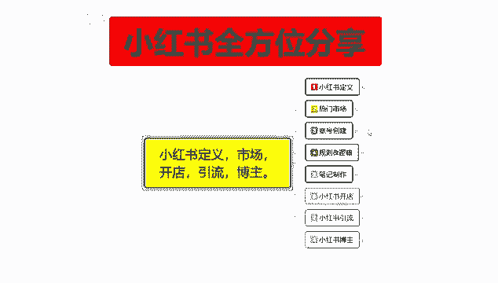
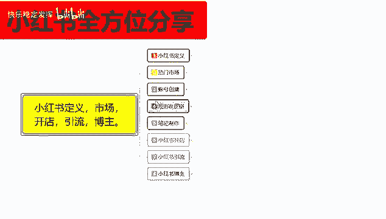
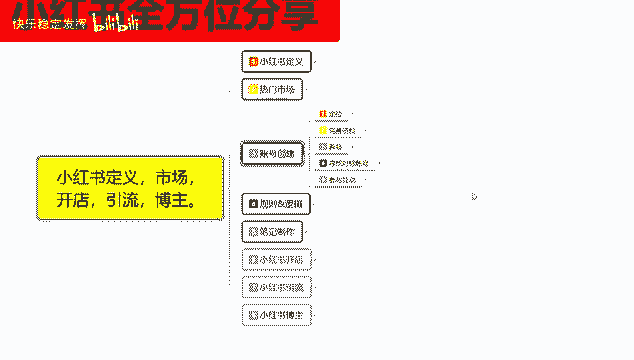
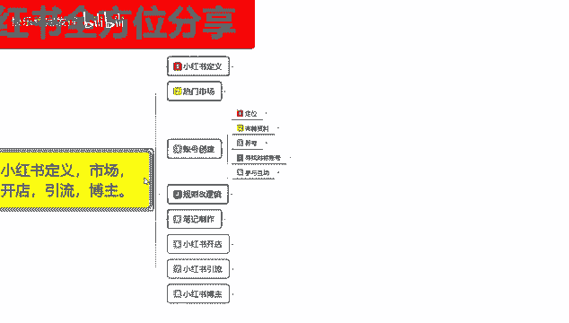
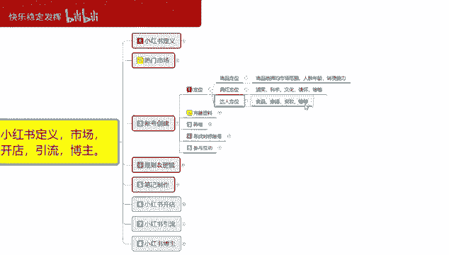
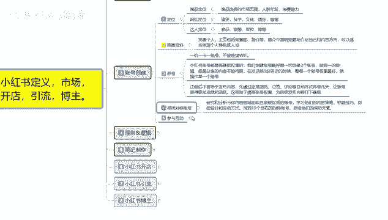
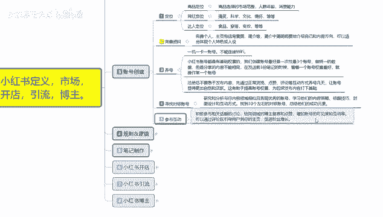

# 【2024版小红书体运营教程】全B站最良心的小红书开店运营教程！小红书体开店 起号真的快，赶快点赞收藏起来 - P5：3.小红书账号创建及注意事项 - 快乐稳定发挥 - BV1AbtoebEjX

大家好，今天给大家分享的是小红书，全方位分享第三大课时账号创建的一个内容呃，账号创建呢，所以说账号创建在前期的话是非常重要的，如果说你到中后期想去调整，账号的一个属性的话。

你那个时候调整的话就已经有点来不及了，会导致你整体权重的话比较偏低，你后续账号你去做开店，做引流，做博主的话，你的账号权重就上不去，就是起来的非常慢，对于之后的话基本上没什么影响。

你起来之后就没什么影响了。

但是对于你前期来说的话，影响是非常大的，我们了解一下桩号创建院都有什么内容呃。

账号创建这边的话是给大家分了五个点，但是这五个点说实话了解一下啊不大，但是如果说你想往细致的了解内容是非常多的。

首先呢第一个是定位。

定位是什么意思呢，商品定位，网红定位达万人定位，第三个点，你在小红书上面，明确了你后续所要操作的范围啊，商品定位，网红定位和达人定位，他们所属性，操作模式和你账号创建方式都是不一样的，大部方向是一样。

但是他所选择的内容不一样，如果说你选错了，你比方说你要去做商品，但是你整体的账号创建方式，是往网红达人方面去靠的话，你后去小红书前期的时候给你的人群，他其实是网红的，他购买商品的人数就非常少啊。

导致你的整体转化率和展示曝光量，点击量上不来，那你后续的一个提升就非常缓慢，商品定位，商品选择的话就是说选择你的一个市场范围，人群年龄，消费能力，网红定位里面的话就是搞笑，科学，文化情怀等等。

你选择一个方向，你自己去做就行，达人定位就是食品穿搭变装等等，嗯这三个是什么意思呢，你做网红达人无非就是做引流，你做网红定位也无非是做引流，这两个的话引流和博主他们两个是可以分开，也可以集合。

他们两个的区别不大，但是商品定位的区别选择的话就比较大，因为商品的话这个里面有市场范围，人群年龄，你所选择所卖的一个产品啊，前期的一个兴趣爱好选择不好的话，那你后续的话就没办法去操作了。

所以说你要先明白你自己在小红上面，你到底是要做商品，做网红还是做达人，三个点，你如果说想选择多个也可以，但是你操作起来就比较慢，我们一般如果说你去小红书上面你做定位，前期去做操作的话，基本上只选一个。

把目标明确以后，把账号拉起来以后，你再扩展第二个，第三个都可以，你比方说你先做商品定位，商品定位，你把你的账号权重拉起来以后的话，你然后再发笔，继续做网红进行分享也可以对吧，你再发内容做达人分享也可以。

然后你做发笔记，做引流宣传也可以，你也可以先做网红，先把账号权重拉起来，然后通过网红带来的效应去做商品也行啊，做打点也行，就说通过这个方式，你只能先选一个，选完定位以后，把账号全都做起来了。

你再去做第二个，第三个才可以，你不能一上来你就说我又要当网红，又要做达人，我也要做商品，不现实啊，你也做不到系统，他也不会去那么给你分配，因为你第一个你没有资金来源，第二个你没有名气，第三个你没有权重。

小红书它是通过系统来进行匹配的，系统不认可你啊，人认可你也没有什么太大的一个作用好吧。

第二个呢是完善资料，完善资料的话，这个里面的话就包括呃主页里面，就是包括背景简介，简介中简明扼要的介绍自己的一个整体，就是介绍自己是做什么的，然后的话介绍自己所推广宣传的内容和方向。

可以适当的体现个人的一个特色，或者说是你把你的一个背景啊，图片啊，心情啊，基本上都可以靠背景图片文字都给展示出来，资料完善的话，你如果说小红书上面说实话你去看那些大主播，大网红的资料完善。

它是非常全面的啊，可以去参考别人的账号了解一下，基本上就都知道了，第三个呢是养号，什么叫养号呢，小红书上面啊，这里提醒大家一点，首先第一个点最重要的啊，想读书，你去做账号。

首先是一机一卡一账号不能连接WIFI，你如果说我们做小红书，你基本上的话都有举证，什么意思呢，就是说你小红书上面你想做党，你基本上都有3~4个小红书账号，才可以一个两个，你做网红，做电商，做达人。

你需要非常浓厚的一个累积才能做起来，如果说你没有小号，有小号的话，你就可以跳过这一环节做很多事情，因为你的评论区里面的一个活跃度，都是靠小号去引导互动的，你没有小号的话，你做不到。

所以说这里面的话强制规定大家是一机一卡，一张号不能连WIFI，因为你连完WIFI以后，你在同一WIFI下使用3~4个小红书，然后小护士在同一笔记里面进行分享，同一视频下面进行分享。

或同一商品下面进行分享，都属于违规啊，都属于自产自销，小红书系统它检测出来以后就会给你降权，所以说一机一卡一账号不能连WIFI，是最重要的一个点，第二个呢就是小红书账号都是有技术权重的啊。

我们创建账号最好就是一次性创建三个账号，做统一的数据，但是分享内容不能相同，在发送前三份笔记的时候，看哪个账号权重最好，就可以操作某一个账号，什么意思呢，小红书你什么都不做，你把小红书账号拿出来以后。

做一个日常的分享，你就能测试这三个账号能不能使用，日常分享的话，他的那个内容分享出去以后，大概有50个小眼睛，这个账号就没问题，低于50个那个这个账号的话，你就直接把它注销，然后重新换一个。

再重新创建账号，再重新去测试就可以了，三个账号里面选一个去用就行啊，还是前面的一机一卡一账号不能连WIFI，这是最主要的一个点，就是你发的一个图片，封面图片等等内容，只要是发出去。

他基本上都有50个左右的一个小眼睛，就可以操作，没有这个数量的话，你就不用去操作这个账号了，这账号有问题啊，然后呢注册后不要急急于发布内容啊，先通过正常的一个浏览点赞评论互动等方式，先养号几天。

让账号显得更加自然活跃，以后的话再去操作，这个的话就是有助于提高账号的一个权重哦，为后续发布内容打下基础，你小红书账号创建完成以后，你先去做测试，测试完这个账号没问题，然后的话就不要去发内容了。

内容全部停下来，然后先通过正常的浏览，点赞评论这个方式去养号，养个几天，基本上就没什么太大问题了，养号里面往后面走呢，就是寻找对标账号进行养号啊，你不能说是盲目的，什么都看，那肯定是不行的。

研究和分析与内容领域相关且表现优秀的账号，去浏览他们的一个内容，学习他们的内容策略，标题技巧，封面图片设计和互动方式，找十个左右，基本上的话你前期对小红书不了解，找十个左右就够够了。

你如果说你比较了解小红书有一定的基础的话，你基本上要找20个左右啊，对标账号总结他们的一个成功元素，就是了解别人去怎么编辑账号内容的，编辑它的一个完善资料对吧，编辑它的一个商品。

它所占的热门市场有多少流量，当然这个里面还有一个点，就是你选账号的时候，他所面对的人群不一样啊，就是说每一个阶段你前期刚建的创，创建的账号的话，基本上就是零到2000，2000到5000左右的一个范围。

再往上走的话就是5000到2万，再往后走的话就是2万到5万到10万之类的，你前期我们做的话，基本上就是控制在1万以内去看这种账号，再高的话，你去看那种账号是没有作用的，反而会影响你的一个权重。

第五个呢是参与互动，参与互动是什么意思呢，我们观看这些账号的时候，你要去评论区进行评论，你要先把自己的账号信息设置好，去评论区进行评论，越新的笔记就是他刚发布的内容，你进去里面进行评论，进行回复。

对这个产品了解，让同类型的人对你有一个第一步印象啊，先打一个标签上去做一些引导，你后续发布笔记的话，别人看见你的笔记也就会同样的进来浏览啊，看看你分享的是什么内容。

这个的话也相当于是截取了你之前所观看的，其他人账号的一部分流量，但是截取量的话可能会比较少，可能不到5‰，量很少，但是你观看20个账号，每个账号5‰，你合计起来这些账号属性的话。

你也能截取个1%到2%整体流量，这1%到2%的整体流量截取，你只要截取的好，你自己发布的信息没，那没错的话，就是内容实质性比较好的话，基本上不会有什么太大问题，想把这个笔记推起来的话也比较容易。

然后用几个小号去做一下跟进评论啊，你这个笔记就非常容易爆起来，也算是一个小技巧教给大家啊，这个呢就是创号创建账号创建。

那这一节呢就给大家分享到这，下一节呢给大家讲解一下。