# 【2024版小红书体运营教程】全B站最良心的小红书开店运营教程！小红书体开店 起号真的快，赶快点赞收藏起来 - P5：3.常见视频格式 - Sathenay - BV1uqHreLEER

我们了解一下常见的视频格式，AVI是微软公司推出的多媒体容器格式。

允许声音视频同步回放。

非常类似DVD的视频格式，它的画质呢也是非常的清晰。

FLVFLV呢是flash vol的简称。

文件极小，加载速度极快。

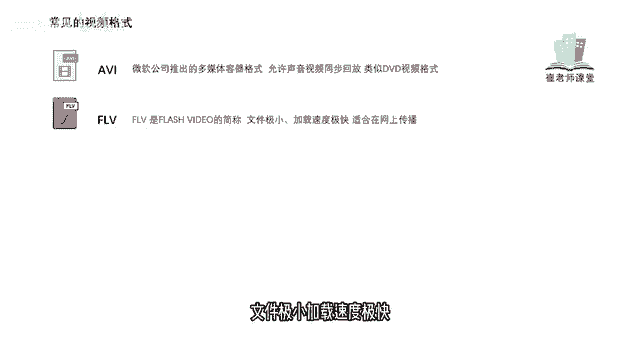

非常适合在网上进行传播，学习过flash动画制作的同学们呢应该熟悉。

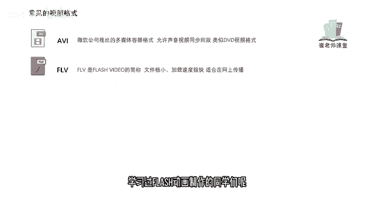

在flash工程文件当中导出的文件格式呢是SWF。

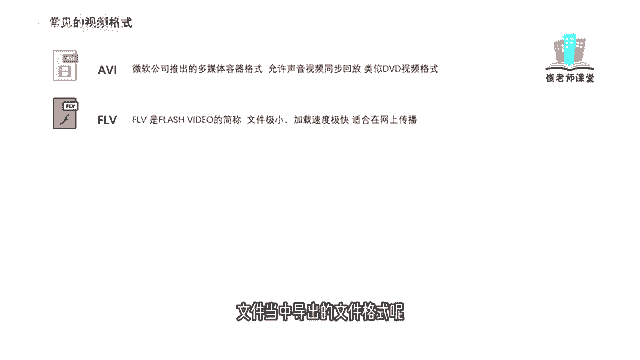

但是那个文件格式呢它的文件偏大，不太适合于网上进行传播。

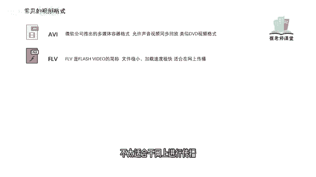

MOV是苹果公司开发的一种视频格式。

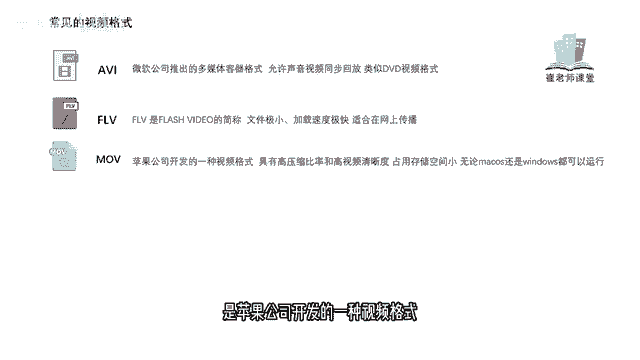

具有高压缩比率和高视频清晰度。

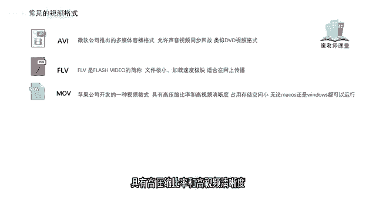

占用存储空间小，无论你使用的是Mac还是windows都可以流畅的运行。

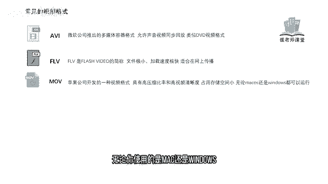

MPEG是1988年成立动态图像专家组。

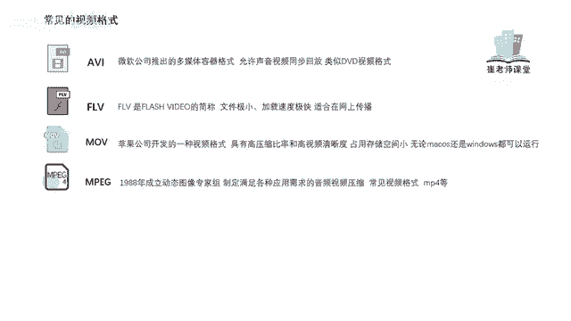

他制定了很多满族我们生活当中。

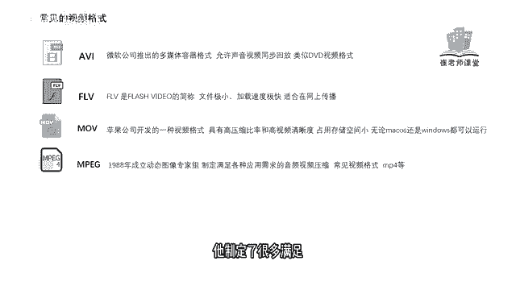

各种应用需求的音频。

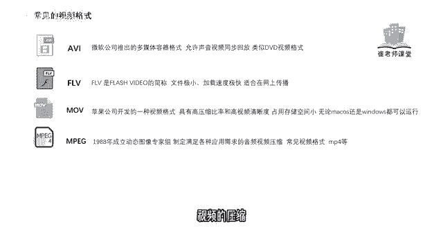

视频的压缩，最常见的视频格式啊，就是我们所说的mp4等等。

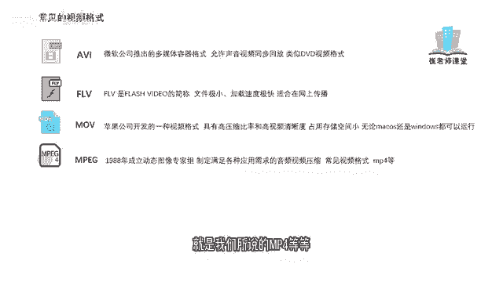

W mv，WMV格式呢是微软推出的一种采用独立码方式。

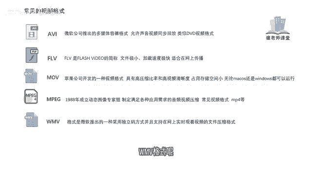

并且支持在网上实时观看视频的文件压缩格式。

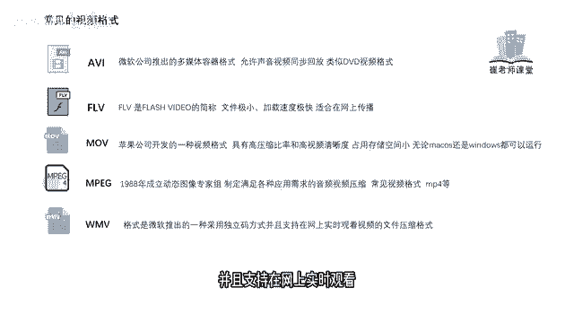

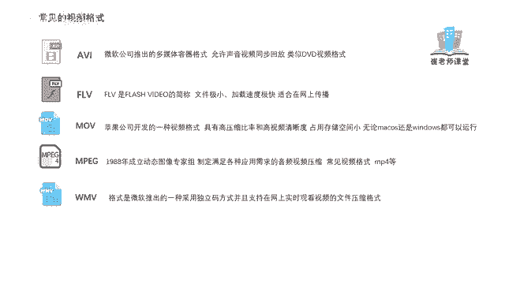

R m v b。

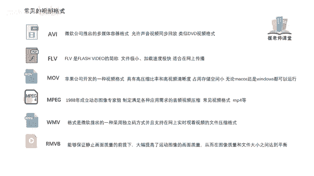

RMVB呢能够保证静态画面质量的前提下，大幅提高了运动图像的画面质量。

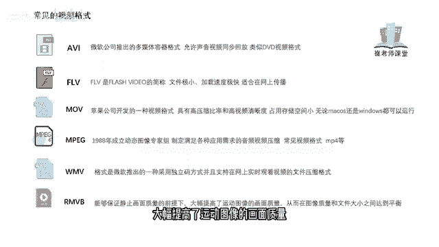

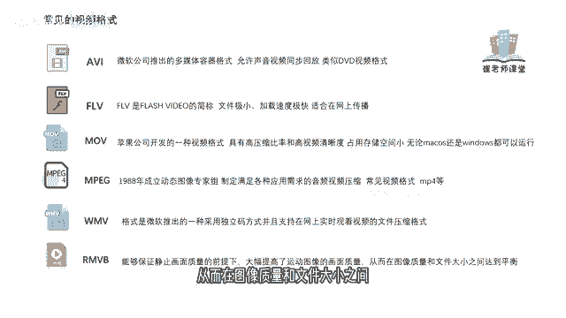