# 【2024版小红书体运营教程】全B站最良心的小红书开店运营教程！小红书体开店 起号真的快，赶快点赞收藏起来 - P5：5.小红书的3种店铺类型 - 小袁运营 - BV1Px48eQEai

那我们再来看一下店铺的分类，店铺分类有三种，就呃总的来看是有三种，个人店，个体店和企业店。

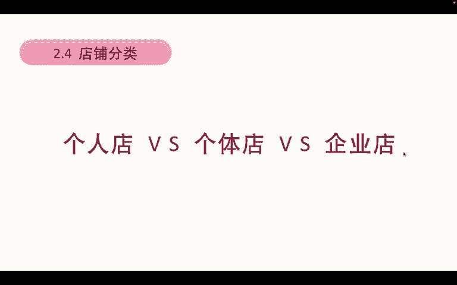

当然企业店有分旗舰店和专卖店，这个我们不去扩展，我们只谈企业店。

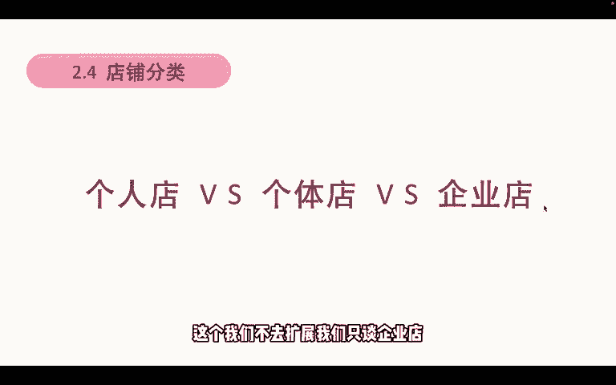

个人店呢保证金1000块钱，但是可以先卖产品再交保证金，就是我们个人注册了，我们可以先卖产品，卖出去产品之后，我们再交保证金，是可以这么做的，但是我不太建议大家就是先卖产品再交保证金。

因为你不交保证金的情况下，你很多额活动你是没有办法参加的，也用户也不能够用微信支付，所以建议呢还是先把保证金给交上，毕竟这个保证金他是能退的啊，能退能退的，然后第二个可售类目，个人店铺只能上架部分类目。

详情的话，就大家可以去看一下小红书经营大类一览表，就只要你不是像电器之类的东西。

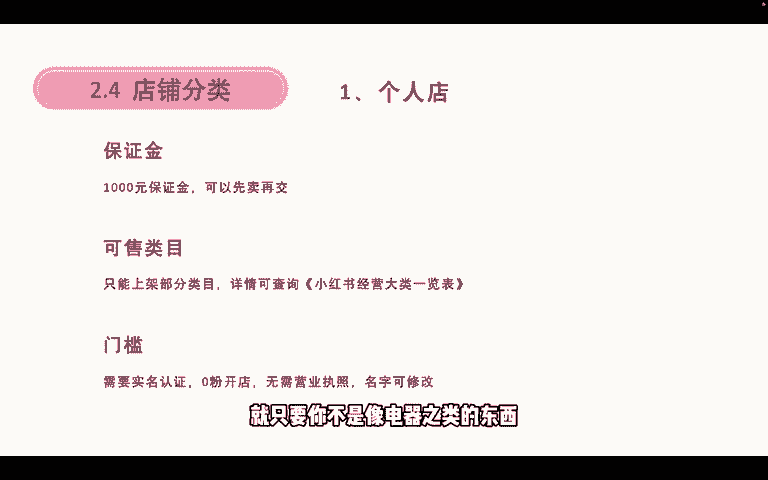

你都能上都能上，然后门槛呢需只需要你实名认证，没有粉丝也能开店，零粉开店也不需要营业执照。

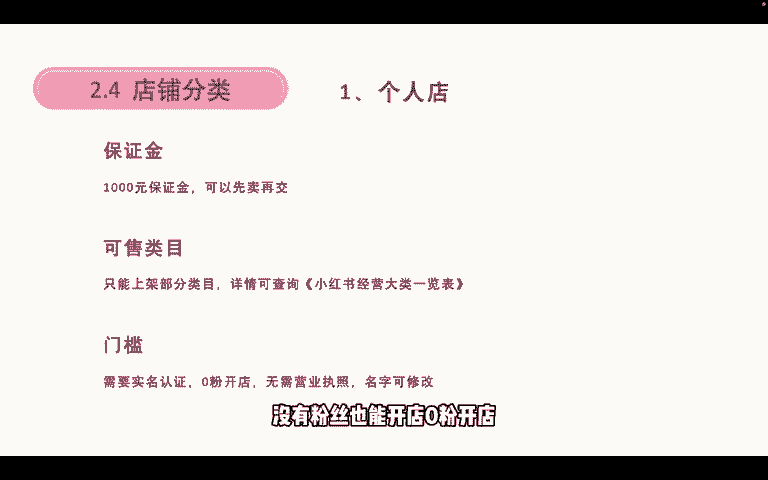

名字和头像，你可以随意的更改。

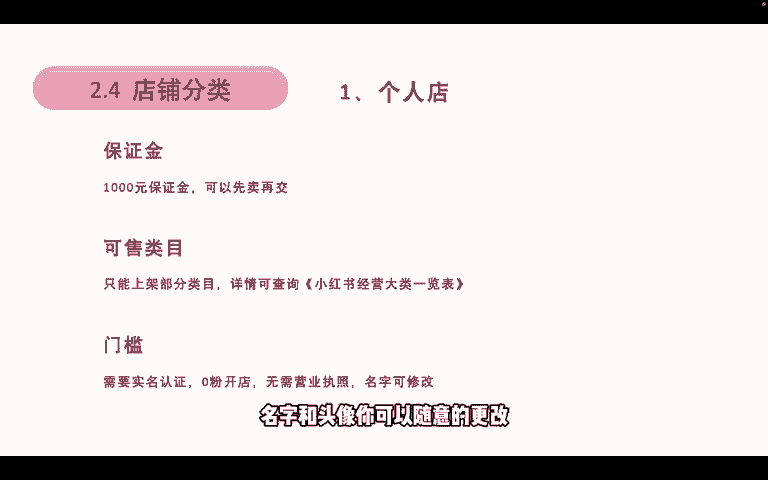

随意的更改，那么个体店呢个体店需要有1000块钱的保证金，跟个人店一样，但是呢是必须要先交保证金才能够卖产品的，先交保证金才能卖产品，然后他能上架的类目比个人店铺更多，像店铺那些还有带品牌的产品。

比如我代理的某一个品牌那些产品，我都能够在个体店里面去卖，像电器之类的，我只要授权了这个品牌，我就能够在额个体店里面去卖，然后他的一个门槛呢是需要个体营业执照，个体工商户的营业执照。

然后需要认证个体企业号，600块钱的认证费，零粉丝也能开店，名字和认证类目不可随意更改，主要是名字额，个体店的名字是不能随意更改的，如果你要更改名字的话。

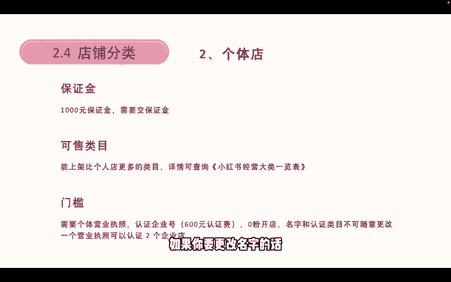

需要另外再交600块钱认证费，就是把你的认证期限延迟一年，因为这个600元认证费的话是年交的，每年都需要交一次，然后一个营业执照只能认证两个企业店，以前是三个，但是新规上线之后，只能认证两个企业店。

然后第三个讲企业号，就企业店企业店的保证金是2000元以上，也是需要先交保证金，然后部分类目就是如果我是作为，我是升级为专卖店和旗舰店的话，那么我就需要交2万元的保证金，可以卖的类目会更多。

几乎所有产品都能卖，除了仅限邀约的类目，其他全部都能卖，然后我们也可以开设嗯，品牌旗舰店和品牌专卖店，他也有个门槛，就是需要企业的营业执照，而且每年需要交600元的企业号认证费，同样的他也是零粉开店。

名字和认证类目不可随意更改，但呃这里需要重点提示一下了，就是内幕它实际上是可以更改的，就是可以新增类目，是可以新增，但是它需要审核资质，就是如果说我们开企业店或者开个体店。

然后我们一开始呢想要卖杯子对吧，杯子属于家居这一块的类目，那第二这个杯子我觉得卖的不好，我想要再卖项链，那么我就可以在卖项链之前，先去申请一个项链的类目，先去申请一个项链类目，只要这个申请通过了。

那么我们就可以去卖这个产品，对这个这个时候是不需要额外交钱的，但是如果我需要改名字的话。

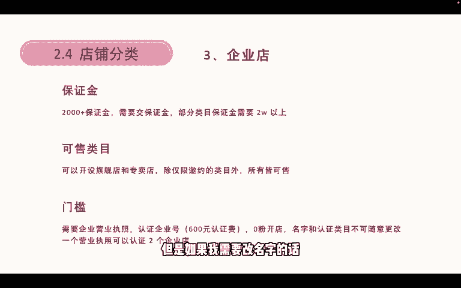

就需要额外的交钱，然后我们总结一下呃。

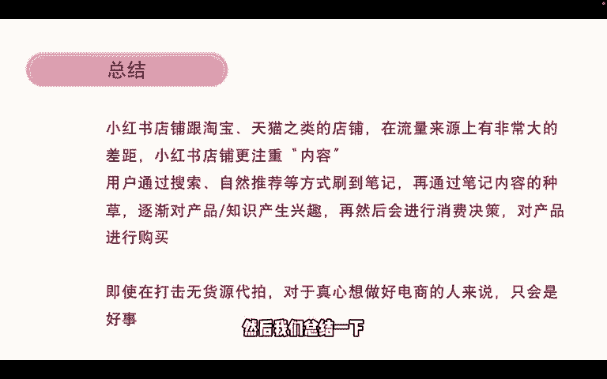

这个对比就小红书店铺跟淘宝，天猫这些店铺是有本质的区别。

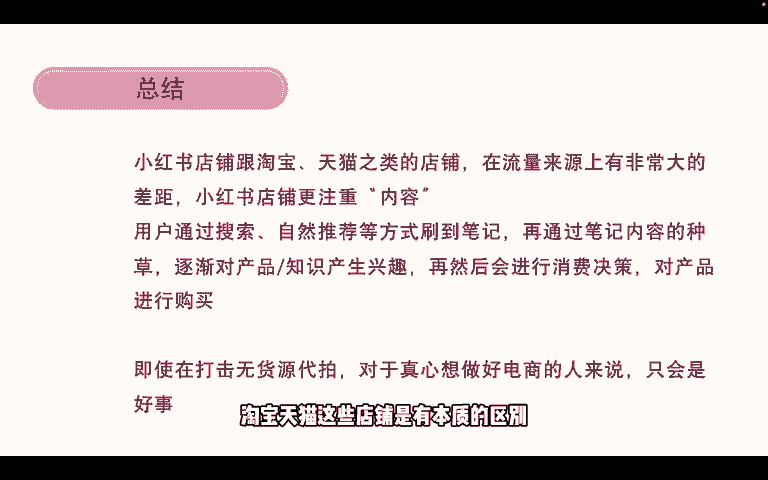

就在流量来源上有非常大的差距，小红书店铺更注重内容。

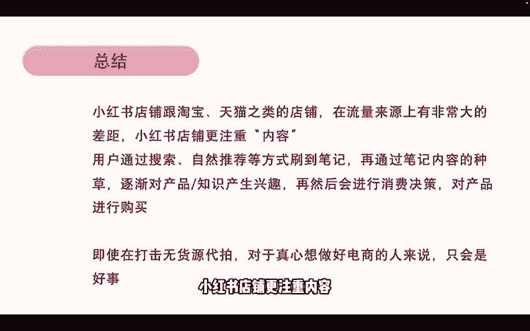

就是用户通过搜索或者自然推荐的方式方式，刷到我的笔记，然后再通过我的笔记内容种草。

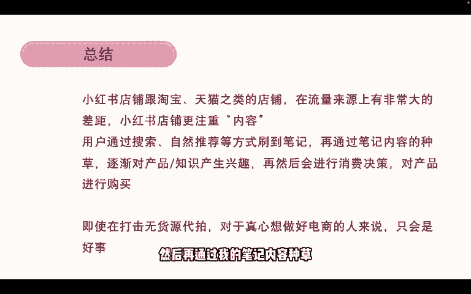

逐渐对产品或者说我的知识付费感兴趣，然后会进行消费决策。

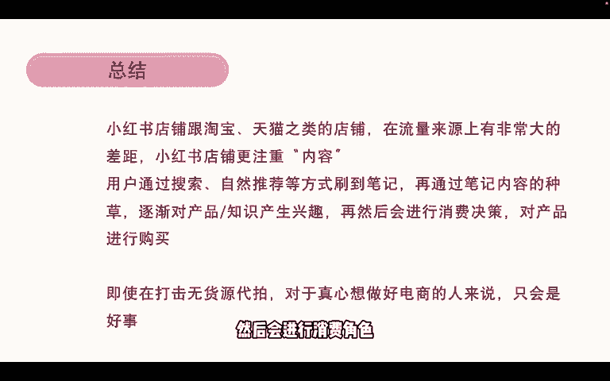

然后对产品进行购买，这是它的一个消费链路。

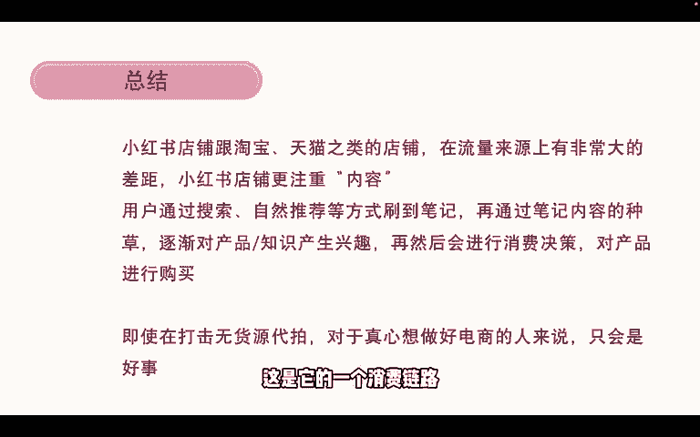

所以即使在打击无会员代拍，对于真心想要做好电商的人来说，只会是好事，因为呃流量不变的情况下。

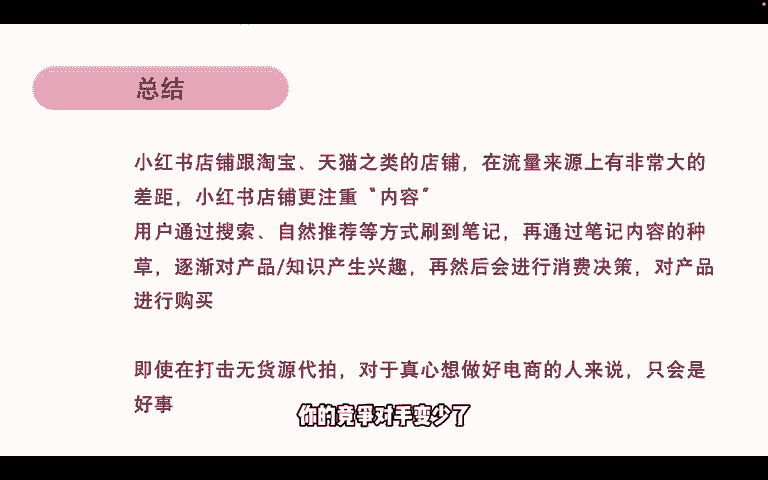