# 【2024版小红书体运营教程】全B站最良心的小红书开店运营教程！小红书体开店 起号真的快，赶快点赞收藏起来 - P6：4.小红书平台规则逻辑（1） - 快乐稳定发挥 - BV1AbtoebEjX

大家好，今天给大家分享的是小红书，全方位的一个整体分享，这节课的话是第四大节课，给大家分享的是一个规则和逻辑。

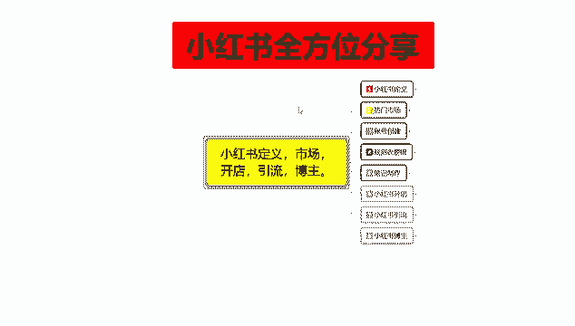

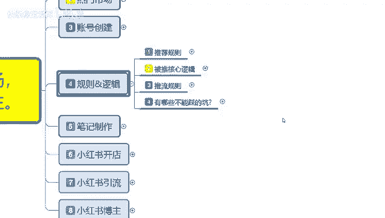

小红书的规则和逻辑啊，啊这里面的话我是给大家把它分了四个点额，第一个是推荐的一个规则，就是小红书给我们额外增加更多的一个，曝光属性的，第二个呢是被推的一个核心逻辑，它其实是差不多的。

就是说你要做到什么样的一个程度，然后呢小红书才会给你更多的一个呃流量窗口，第三个呢是推流规则。

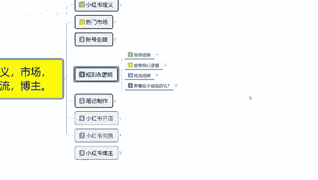

第四个呢是小红书上面有哪些坑不能去碰啊，我们先了解一下推荐的一个规则。

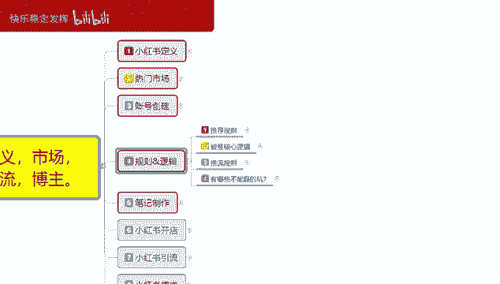

推荐规则这里面的话其实是比较简单的，它分为用户行为，自自序商品，然后呢是一个同音图文的一个影响。

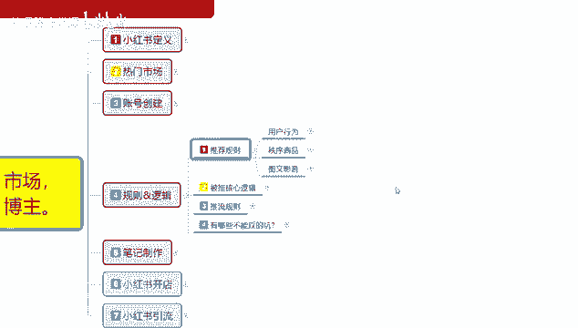

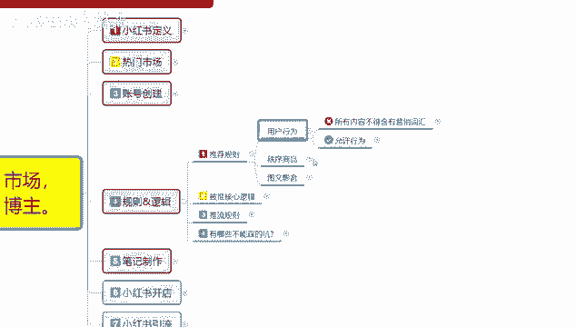

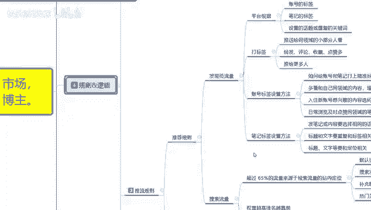

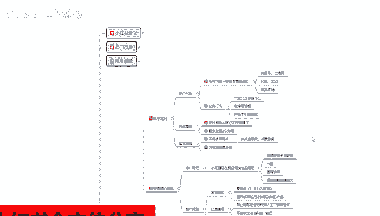

推荐规则啊，用户行为不允许的所有内容不得含有营销词汇，这里面的话就是包括微信二维码代购水印，某某店铺，如果说你有这些词汇的话，小红书小红书系统是不会给你进行推荐行为的。

也就是说你的呃作品发出去以后是被屏蔽的，没有任何作用，如果说你发的多了以后的话，还涉嫌违规，第二个呢是允许寻，为什么是允许的呢，个人允许邮箱存在，也就是说我们在涉及账号创建的时候。

你呃虽然说现在邮箱邮箱用的比较少，但是的话他也不思维是一个引流的方式，就是说你用邮箱的话，其实还是可以收到短信啊，信件的，但是他的一个节奏的话就会比较慢，他一般的话都是适用于引流。

可以在你的那个账号下面啊，留下你自己的邮箱，它是可以的，然后呢微博用谐音啊，千万不要直接把你的微博账号输上去，然后后面的话就是用话术引导微信，这种的话就是说用用户行为他是可以的，但是说你不能直接的去呃。

怎么说呢，微信号二维码这种的话，你直接去在你的账号上面留下沟通方式，联系方式的话肯定是不允许的啊，用话术引导微信是什么意思呢，你自己想办法去编，然后把自己的微信号的话，把他用那个额数字啊，图标啊。

表情啊之类的把它隔开，然后去使用，而且也不能发多，基本上的话你一天最多15个，但是建建议的话就是说三个以内啊，推微信，推自己的可以承受，账号的话不会出现什么风险，再多的话就不行了。

每天的话基本上就也就三个名额左右，第二个呢是商品的一个秩序，就说不能轻易给人称医疗和建议的一个投资，你比方说保健品之类的医疗用品啊，啊我教你怎么去弄啊，这个病怎么治啊等等啊。

这个美美容用哪个护护肤品好啊，啊用了以后什么效果啊，这种都不行，然后呢就是最多登录三个账号，这三个账号的话，其实用电脑登最多的话，其实只能登三个账号，手机的话一个一个坑，一个萝卜一个坑啊。

如果说你那个手机连WIFI的话，尽量也不要去连啊，然后是图文仪，这里面的话就是说不得诱导用户，然后的话比如关注领奖，就是你不能在小红上面去做虚假宣传啊，有些东西的话他是不允许的。

你如果说呃你想获得官方的一个流量副词，就是你的笔记发出去的话，这些东西你有的能碰，有的你是碰都不碰不得的，然后内容原创度为最佳，是什么意思呢，你去可以去复制别人的，复制过来以后也有展示曝光。

但是他的一个展示曝光量的话，你可能只有原创的1%的到10%，好一点的可能会达到20%，但基本上的话不会在超过20%的一，个数据上，比方说别人有2万的小金到你这的话，最多也就是4000最多啊。

就说你把它完全复制下来，然后的话你本来是简单点说，就是你主账号自己的作品，主账号发了有2万的一个向已经点击数量，然后你拿自己的子账号，或者应该说是拿自己的小号，然后去发同样的内容。

最多的话也就是获取4000的一个曝光流量啊，最多就是第二次发布推文的时候，他的一个流量曝光的话肯定是没有那么强的。

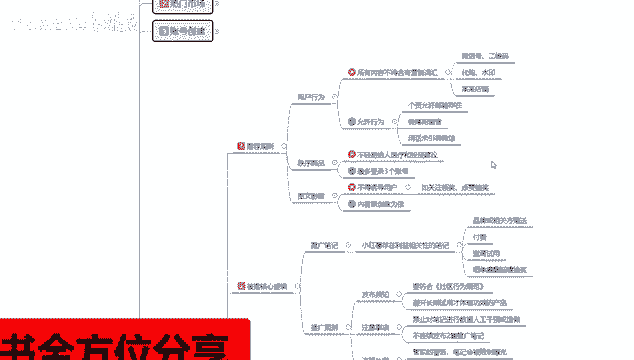

第二个呢是被推的一个核心逻辑，被推的核心逻辑是什么意思呢，就是说这里面的话可以分为两个点，第一个呢是推广笔记，第二个呢是推广规则，推广笔记的话，就说小红书存在利益相关的一个相关性笔记。

比方说品牌或相关方赠送的，然后呢是付费即请私用啊，晒单抽奖这种，这四个点啊，就是小红书额外给你的一个推荐流量，但是这四个点我们前期去做的话，基本上怎么说呢，你不是品牌方的话，你就做不到第一点。

品牌或相关方赠送的一个流量负责，第二个呢是付费，付费的话，你前期小红书你直接上来就做付费，付费的话，你说实话没用啊，浪费钱机，请私用和晒单，抽奖的话，这个是小红书的，间接性活动。

他有时候的话你完成任务以后，他会给你一个流量副词，你能做的话就做，不能做的话也无所谓啊，他只是说给你额外的一个展示曝光量，你比方说你一篇笔记发出去的话，可能前期的话给你1000到2000的一个。

技术曝光量，就是有接近2000个用户看到你的一个相关作品，但是点击量的话，他大概是150到200个左右的一个点击量，如果说你做了这些东西的话，就是激进私要塞单抽奖之类的话。

可能会给你增到2500到3000啊，有一部分的提升，前期比较好用，后期的话基本上有用，但是作用就没那么大了，第二个呢就是推广须资退货须知，这里面的话只发布注意，然后违规处罚。

这个的话就是说要符合社区的一个行为规范，就是你不能跨跨行业的去发布那种笔记行为，你比方说你本来是做女装的啊，你没事了，然后想去发个化妆品的，这种的话就是不不被允许的啊，简单来说就是说你已经跨区域了啊。

你不在女装女装这个社区范围以内，小红书他你发的这种笔记，你发出去以后的话，它的一个呃读取啊和辨识，会导致你的笔记发出去后，获取不了相应的一个技术曝光量，你比方说2000的一个基础曝光量。

你本来是做女装的对吧，你发了一个化妆品，那你到后续的话，你的化化妆品获得的基础曝光量的话，可能只有200到300啊，减少了80%到90，好一点的话就500左右，但是你这么操作了以后的话。

你的这个账号后续呃，你发第二篇美妆的，第三篇美妆的，他的流量也是在这个基础数据量里面，就说你相当于把自己砍了一刀，等等于2000的技术曝光，现在最多有1000，然后呢。

避开长期试用体验才能体现功效的一个产品，什么意思呢，就是说小红书上面你要去做，你不能去卖那种类似于保健品呃，十个疗程一个效果啊，五个疗程一个效果啊，两周一个效果啊之类的这种东西，你不要去做宣传。

做宣传也没用，你直接跟你拿到线下，你去做引流，可以做这种宣传没关系，但是在小红书上面的话，是很反感这种宣传内容的，你做了以后也没什么效果，然后注意事项和违规处罚的话，这里面的话就是说。

禁止对笔记进行人工数据的一个干预，这个就是你自己刷数据，刷那个呃，刷评论，刷点击，刷收藏，这肯定是不允许的啊，但是小红书这方面的话，说实话查的话呃也不是太严，目前第二个就是不连续发布两篇推广笔记。

就说你笔记发的话，第一篇发了以后，第二篇你隔着个23分钟，35分钟去发的话，第二篇没有数据的，你的笔记最少要隔三个小时以上，就两篇笔记，早上发一篇，中午发一篇，或者中午发一篇，晚上发一篇都可以。

最少要隔个两三个小时再去发，不然的话它的一个笔记数据量的话，会占用你第一篇笔记的一个流量，技术曝光量，两篇笔记你连续发的话，你技术曝光是2000，第一篇的话可能是1500，第二篇的话可能就只有500。

如果说你隔个了三个小时以后的话，你的技术曝光量可能就又是2000或者是1500，但是它不会到达500的一个基础属性量，第一篇比最高，第二篇的话会降低接近30%左右，后面的是违规处罚，违规处罚的话。

这里面的话就是一个管家警告，笔记会被限制流量曝光，然后呢就是每月占比超过20%的一个呃，触发内惩罚，就是你同样的事情做多了以后，已经被管家警告了以后，你再接着做，如果说超过比例20%。

你的账号基本上就没用了啊，那这几个违规处罚就可以，这个呢就是被推的一个核心逻辑。

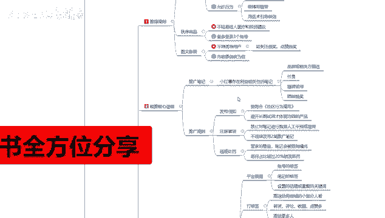

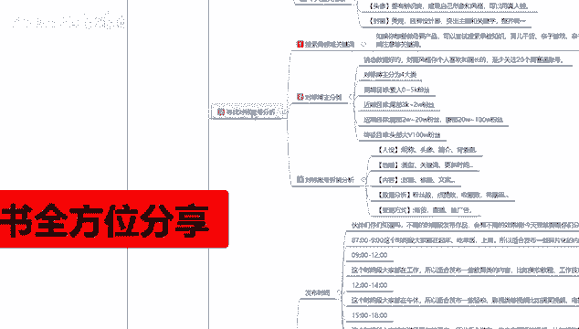

时间的原因啊，后面还有两个点，第一个推荐规则和有些哪些坑不能踩啊，我放在下一节呢给大家进行继续分享。

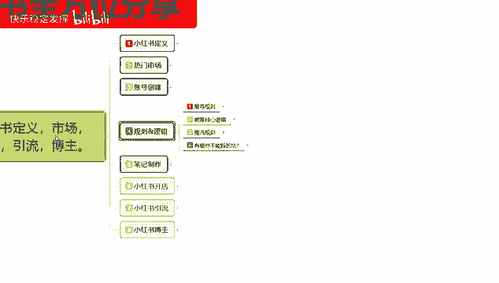

那这一节分享呢就给大家分享到这里，整体来说的话，你了解规则和逻辑的话。

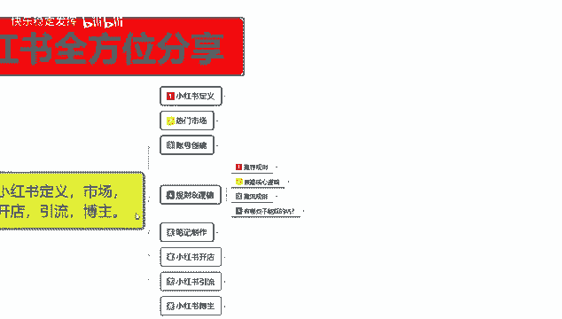

其实有些东西你不去碰它的话，是没什么问题的啊，你后续了解清楚了以后的话。

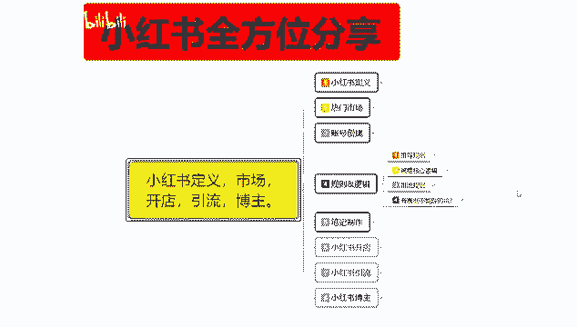

你再去碰它，自己懂得怎么规避的话。

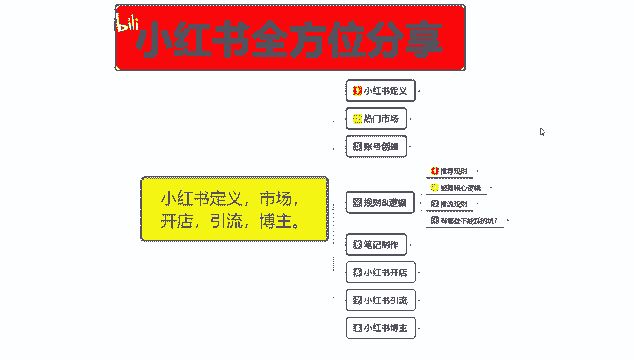