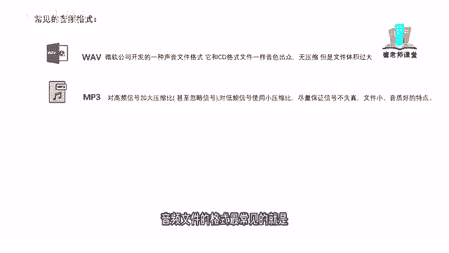
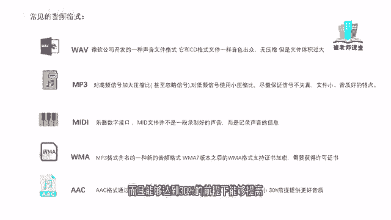

# 【2024版小红书体运营教程】全B站最良心的小红书开店运营教程！小红书体开店 起号真的快，赶快点赞收藏起来 - P6：4.常见的音频图片格式 - Sathenay - BV1uqHreLEER

我们在视频剪辑的过程当中呢，肯定会需要使用大量的音频。

那么常见的音频文件的格式有哪些呢，W a v，WAV呢是微软公司开发的一种声音文件格式，它的音质呢和CD格式的文件一样出众，属于无压缩格式，但是因为是无压缩格式，所以它的文件体积偏大。

mp3mp3呢是对高频信号加大压缩比，对低频信号使用小的压缩比，尽量保持信号不失真的情况下呢，达到文件小音质好的特点，在视频剪辑当中呢，音频文件的格式最常见的就是WAV和mp3。

他们两个是进行互补的。

你像WAV呢，它是无损的音质，但是因为没有经过压缩呢，它的文件体积是偏大的，而mp3呢它是相对于WAV格式呢，它的音质上有一定的压缩，但是它的文件是偏小的。

mini呢属于乐器数字接口，mini文件呢并不是一段录制好的声音，而是记录声音的信息，在这里学过音乐的同学应该比较熟悉啊，你导出的mini音频的格式，可以使用其他的速度软件进行替换音源。

在这里咱们作为视频剪辑来说，作为简单的科普一下，了解一下就好。

w ma呢是mp3格式齐名的一种新的音频格式，但是呢在WMA7版本之后呢，这个格式它需要支持证书加密，需要获取许可证书才能够正常使用，Ac，AC格式呢通过结合其他的功能来提高编码效率。

可以比mp3格式文件小，而且能够达到30%的前提下，能够提高更好的音质。

紧接着我们了解一下常见的图片格式，常见图片格式呢有b mp，BMP是指windows操作系统中的标准图像文件格式，这种格式呢不采用压缩技术，所以呢占用磁盘空间较大。

TFFTFF格式呢采用无损压缩算法的标签，图像文件格式，图像质量比较高，建议呢在打印的时候，印刷输出的图像的时候，将文件存储为该格式，还有JPEG，JPEG呢采用的是JPEG的压缩标准。

来进行压缩的图像文件格式属于有损压缩，这个需要注意它是属于有损压缩，但是由于压缩比较大，所以它的文件比较小，经常用于网络传播，我们在网络上下载的照片，以及一些摄影师导出的一些照片。

很大一部分都是JPEG的图片格式，gr f可以同时存储若干幅静止图像，进而形成连续的动画，可指定透明区域，文件较小，适合网络传输，你像平时咱们使用的表情包啊，大部分都是GIF的图片格式。

PSDPSD格式呢是PHOTOSHOP的专用格式，可以保留图像的图层信息通道，蒙版信息等等，便于后续修改和特效制作，这个PSD呢，大家应该知道PS是什么图形图像处理的软件。

那这个PSD呢它是PHOTOSHOP，就是PS的工程文件，它里面能够包含他的各种信息啊，有时间的话会给大家讲一下这个PHOTOSHOP的一些支持。

如果你们想了解的话，Pdf，PDF呢又称为可移植性或者是可携带的文件格式，具有可跨平台特性，能够有效的控制专业的制版和印刷生产信息，比如说我们对于一些书籍的印刷，或者我们平时保存的。

或者是看过的一些电子书的文件格式啊，大部分都是PDF的，这些呢都是常用的视频，音频图片的文件格式，虽然了解起来比较枯燥呢，但是学习了这些东西能够更加方便，我们对于视频剪辑以及学习剪映来说。

